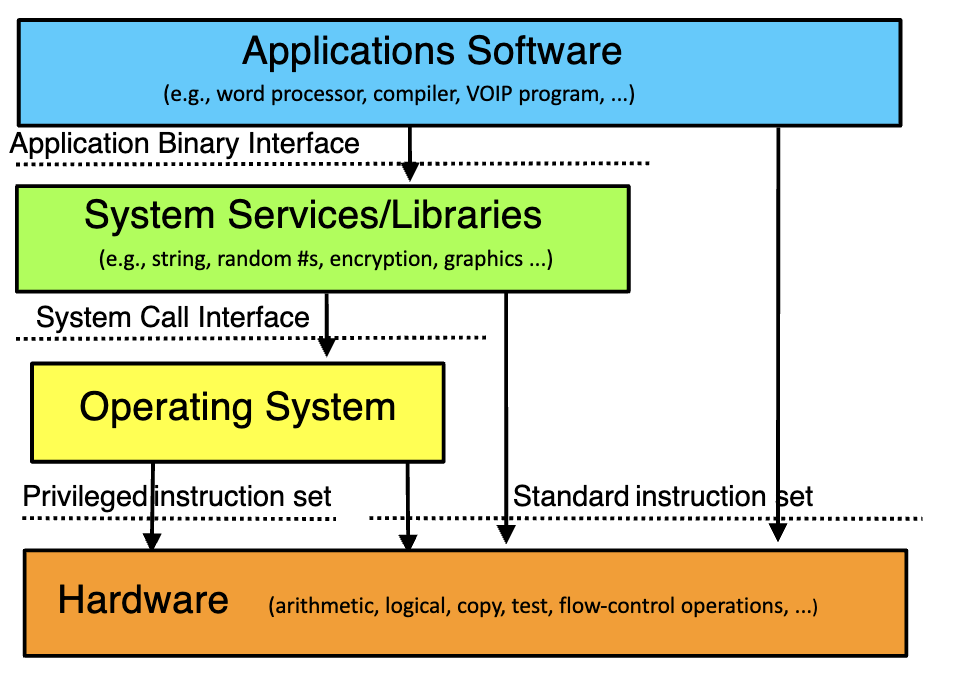
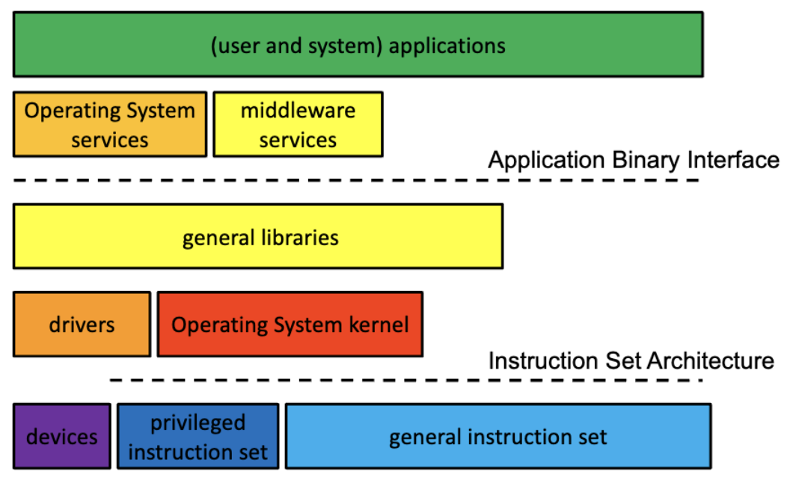

## Lecture 1: Introduction

- What we've got
  - **RAM**: Read or write binary words
  - **CPU**: Contains instructions like MOV, ADD, JMP, SQRTPD
  - **BUS**: READ, REQUEST SENSE
  - **Flash/hard drive**: Read or write a block of data
  - **Mouse**: Report X and Y movements
  - **Screen**: Write to groups of pixels
- You're going to need some help
  - Operating system is about helping you perform complex operations that interact and use various bits of hardware and software while hiding the complexity and making sure nothing gets in the way of anything else
- What is an operating system, anyway?
  - System software intended to provide support for higher level applications
    - Including higher level system software applications
    - But primarily for user processes
  - The software that sits between the hardware and everything else
    - OS is in charge of hardware
  - The software that hides nasty details
    - Of hardware, software, and common tasks
  - On a good day, the OS is your best computing friend
- But why are you studying them?
  - High probability none of you will ever write an operating system or even fix an operating system bug
  - Not very many different operating systems are in use
    - So the number of developers for them is small
  - So why should you care about them?
- Everybody has one
  - Practically every computing device you will ever use has an operating system
    - Servers, laptops, desktop machines, tablets, smart phones, game consoles, set-top boxes
  - Many things you don't think of as computers have CPUs inside
    - Usually with an operating system
    - Internet of Things devices
  - So you will work with operating systems
- How do you work with OSes?
  - You configure them
  - You use their features when you write programs
  - You rely on services that they offer
    - Memory management
    - Persistent storage
    - Scheduling and synchronization
    - Interprocess communications
    - Security
- Another good reason
  - Many hard problems have been tackled in the context of operating systems
    - How to coordinate separate computations
    - How to manage shared resources
    - How to virtualize hardware and software
    - How to organize communications
    - How to protect your computing resources
  - The operating system solutions are often applicable to programs and systems you write
- OS wisdom
  - View services as objects and operations
    - Behind every object there is a data structure
  - Interface vs. implementation
    - An implementation is not a specification
    - Many compliant implementations are possible
    - Inappropriate dependencies cause problems
  - An interface specification is a contract
    - Specifies responsibilities of producers and consumers
    - Basis for product/release interoperability
  - Modularity and functional encapsulation
    - Complexity hiding and appropriate abstraction
    - If you want to do anything relating to memory, you have to go to the module and do it
    - Modules communicate with each other through interfaces
    - Use modules to hide the complexity of what's going on
  - Separate policy from mechanism
    - Policy determines what can/should be done
    - Policy is what you want to have happen
    - Mechanism implements basic operations to do it
    - Mechanisms shouldn't dictate or limit policies
    - Policies must be changeable without changing mechanisms
  - Parallelism and asynchrony are powerful and vital
    - But dangerous when used carelessly
  - Performance and correctness are often at odds
    - Correctness doesn't always win...
    - If you want good performance, it can't always be 100% right
    - Speed is very important, fast computations > slow computations
- What is an operating system?
  - Low level software that provides better, more usable abstractions of the hardware below it to allow easy, safe, fair use and sharing of those resources
- What does an OS do?
  - Manages hardware for programs
    - Allocates hardware and manages its use
    - Enforces controlled sharing (and privacy)
    - Oversees execution and handles problems
  - Abstracts the hardware
    - Makes it easier to use and improves SW portability
    - Optimizes performance
  - Provides new abstractions for applications
    - Powerful features beyond the bare hardware
- What does an OS look like?
  - A set of management and abstraction services
    - Invisible, they happen behind the scenes
  - Applications see objects and their services
    - CPU supports data-types and operations
      - bytes, shorts, longs, floats, pointers
      - add, subtract, copy, compare, indirection
    - So does an operating system, but at a higher level
      - files, processes, threads, devices, ports
      - create, destroy, read, write, signal
  - An OS extends a computer
    - Creating a much richer virtual computing platform
      - Supporting richer objects, more powerful operations
- Where does the OS fit in?
  
- What's special about the OS?
  - It is always in control of the hardware
    - Automatically loaded when the machine boots
    - First software to have access to hardware
    - Continues running while apps come and go
  - It alone has complete access to hardware
    - Privileged instruction set, all of memory and I/O
  - It mediates applications' access to hardware
    - Block, permit, or modify application requests
  - It is trusted
    - To store and manage critical data
    - To always act in good faith
  - If the OS crashes, it takes everything else with it
    - So it better not crash...
- Instruction Set Architectures (ISAs)
  - The set of instructions supported by a computer
    - Which bit patterns correspond to what operations
  - There are many different ISAs (all incompatible)
    - Different word/bus widths (8, 16, 32, 64 bit)
    - Different features (low power, DSPs, floating point)
    - Different design philosophies (RISC vs. CISC)
    - Competitive reasons (x86, PowerPC, Apple Silicon)
  - They usually come in families
    - Newer models add features (e.g., Pentium vs. 386)
    - But remain upwards-compatible with older models
      - A program written for an ISA will run on any compliant CPU
- Privileged vs. general instructions
  - Most modern ISAs divide the instruction set into privileged vs. general
  - Any code running on the machine can execute general instructions
  - Processor must be put into a special mode to execute privileged instructions
    - Usually only in that mode when the OS is running
    - Privileged instructions do things that are "dangerous"
  - OS runs in privileged mode, basically everyone else runs in non-privileged mode
  - OS runs both privileged and non-privileged instructions
- Platforms
  - ISA doesn't completely define a computer
    - Functionality beyond user mode instructions
      - Interrupt controllers, DMA controllers
      - Memory management unit, I/O busses
      - BIOS, configuration, diagnostic features
      - Multi-processor and interconnect support
    - I/O devices
      - Display, disk, network, serial device controllers
  - These variations are called "platforms"
    - The platform on which the OS must run
    - There are lots of them
- Portability to multiple ISAs
  - A successful OS will run on many ISAs
    - Some customers cannot choose their ISA
    - If you don't support it, you can't sell to them
  - Which implies that the OS will abstract the ISA
  - Minimal assumptions about specific HW
    - General frameworks are HW independent
      - File systems, protocols, processes, etc
    - HW assumptions isolated to specific modules
      - Context switching, I/O, memory management
    - Careful use of types
      - Word length, sign extension, byte order, alignment
  - How can an OS manufacturer distribute to all these different ISAs and platforms
  - Write some things for the OS in assembly language for efficiency
- Binary distribution model
  - Binary is the derivative of source
    - The OS is written in source
    - But a source distribution must be compiled
    - A binary distribution is ready to run
  - OSes usually distributed in binary
  - One (or more) binary distributions per ISA
  - Binary model for platform support
    - Device drivers can be added, after-market
      - Can be written and distributed by 3rd parties
      - Same driver works with many versions of OS
  - The very first thing the OS does when it's first run is check what's currently on the computer
    - Check keyboard, mouse, screen, speakers, mic, etc
    - Reconfigure the binary installed here so it'll work with everything it has
    - Install specific things (device drivers)
- Binary configuration model
  - Good to eliminate manual/static configuration
    - Enable one distribution to serve all users
    - Improve both ease of use and performance
  - Automatic hardware discovery
    - Self-identifying busses
      - PCI, USB, PCMCIA, EISA, etc
    - Automatically find and load required drivers
  - Automatic resource allocation
    - Eliminate fixed sized resource pools
    - Dynamically (re)allocate resources on demand
  - All peripheral devices are attached to a bus
    - **Bus**: Piece of hardware that connects hardware to each other
    - Asks busses what they're attached to
    - Need a device driver for things they're attached to
  - Dynamic adjustment based on how well the program is performing based on the amount of RAM given
- What functionality is in the OS?
  - As much as necessary, as little as possible
    - OS code is very expensive to develop and maintain
    - High degree of correctness comes from careful programming, testing (fix bugs)
    - Carefully written, carefully tested
  - Functionality must be in the OS if it...
    - Requires the use of privileged instructions
    - Requires the manipulation of OS data structures
    - Must maintain security, trust, or resource integrity
  - Functions should be in libraries if they...
    - Are a service commonly needed by applications
    - Do not actually have to be implemented inside OS
  - But there is also the performance excuse
    - Some things may be faster if done in the OS
    - Ex: Network protocols, networking code got sucked into the OS to be faster, then got pulled to hardware to be even faster
  - **Micro-kernel**: Shrink the OS to the most minimal size
- Conclusion
  - Understanding operating systems is critical to understanding how computers work
  - Operating systems interact directly with the hardware
  - Operating systems rely on stable interfaces

## [Operating System Principles](https://lasr.cs.ucla.edu/reiher/cs111/principles.html)

- Introduction
  - Increasingly larger and more complex software create numerous problems:
    - More code
    - More complex than linear
    - Difficult to learn and fully understand our software, leading to more errors in its construction
    - Small changes in one component often result in failures of other components
    - We begin to see complex emergent behaviors that could not have been predicted from our experience with smaller systems
    - Complete testing combinatorically impossible
    - Increasing dependency on the software means that failures will cause more severe problems for more people more often
  - Operating systems have long been among the largest and complex pieces of software:
    - Complex interactions among many sub-systems
    - Numerous asynchronous interactions and externally originated events
    - Sharing of stateful resources among cooperating parallel processes
    - Coordinated actions among heterogenous components in large distributed systems
    - Must evolve to meet ever-changing requirements
    - Must be able to run without error for years despite the regular failures of all components
    - Must be portable to virtually all computer architectures and able to function in heterogenous environments (with many different versions of many different implementations, on many different platforms)
- Complexity management principles
  - Layered structure and hierarchical decomposition
    - **Hierarchical decomposition**: The process of decomposing a system in a top-down fashion
  - Modularity and functional encapsulation
    - Requirements
      - Each group/component (at each level) have a coherent purpose
      - Most functions (for which a particular group is responsible) can be performed entirely within that group/component
      - The union of the groups/component (within each super-group/system) is able to achieve the system's purpose
    - This enables us to look at a group in two very different ways:
      - We can examine its responsibilities and its role in the system of which it is a part
      - We can examine the internal structure and operating rules by which it fulfills its responsibilities
    - When it is possible to understand and use the functions of a component without understanding its internal structure, we call that component a module and say that its implementation details are encapsulated within that module
    - When a system is designed so that all of its components have this characteristic, we say that the system design is modular
    - **Good modularity**:
      - There are numerous ways to break up the responsibilities of a system
      - Many functions are closely related, typically because they perform related operations on the same resources
        - It is a good idea to combine closely related functionality into a single module
        - **Cohesion**: We want the smallest possible modules consistent with the co-location of closely related functionality
        - A module that exhibits this characteristic is said to be cohesive
      - There are numerous ways to apportion the functionality of a system among its components
        - If many operations involve exchanges of services between components:
          - The overhead of communication between components may reduce system efficiency
          - The increased number of interfaces to service those inter-component requests increases the complexity of the system and the opportunity for misunderstandings
          - Increased dependencies between components increase the likelihood of errors or misunderstandings
  - Appropriately abstracted interfaces and information hiding
    - An interface that enables a client to specify parameters that are most meaningful to them and easily get the desired results is said to embody appropriate abstraction
    - An interface that does not provide a client with what they want is said to be poorly abstracted
    - An appropriately abstracted interface that does not reveal the underlying implementation is said to be opaque and to exhibit good information hiding (not exposing implementation details that clients did not want to be forced to understand)
  - Powerful abstractions
    - A powerful abstraction is one that can be profitably applied to many situations:
      - Common paradigms (e.g. lock granularity, cache coherency, bottlenecks) that enable us to more easily understand a wide range of phenomena
      - Common architectures (e.g. federations of plug-in modules treating all data sources as files) that can be used as fundamental models for new solutions
      - Common mechanisms (e.g. registries, remote procedure calls) in terms of which we can visualize and construct solutions
  - Interface contracts
    - Interface contracts are our first line of defense against incompatible changes
    - As long as component evolution continues to honor long-established interface contracts, the system should continue to function despite the continuous independent evolution of its constituent components
  - Progressive refinement
    - In a large project:
      - It's difficult to:
        - Estimate the work
        - Anticipate the problems
        - Get the requirements right
      - They often:
        - Take so long that they are obsolete before they are finished
        - Lose support before they are finished
    - Most modern methodologies now seem to embrace some form of iterative or incremental development:
      - Add new functionality in smaller, one feature at a time, projects
      - Rather than pursue large speculative projects, identify specific users with specific needs, and build something that addresses those needs
      - Deliver new functionality as quickly as possible to get feedback before moving on to the next step
      - It is much easier to plan the next step after we have data from the previous step
- Architectural paradigms
  - Mechanism/policy separation
    - The mechanisms for managing resources should not dictate or greatly constrain the policies according to which those resources are used
    - Resource managers should be designed in two logical parts:
      - The mechanisms that keep track of resources and give/revoke client access to them
      - A configurable or plug-in policy engine that controls which clients get which resources when
  - Indirection, federation, and deferred binding
    - The most common way to accommodate multiple implementations of similar functionality is with plug-in modules that can be added to the system as needed
    - Such implementations typically share a few features:
      - A common abstraction (class interface) to which all plug-in modules adhere
      - The implementations are not built-in to the operating system, but accessed indirectly (e.g. through a pointer to a specific object instance)
      - The indirection is often achieved through some sort of federation framework that registers available implementations and enables clients to select the desired implementation, and automatically routes all future requests to the selected object/implementation
      - The binding of a client to a particular implementation does not happen when the software is built but rather is deferred until the client actually needs to access a particular resource
      - The deferred binding may go beyond the client's ability to select an implementation at run-time
        - The implementing module may be dynamically discovered and dynamically loaded
        - It need not be known to or loaded into the operating system until a client requests it
  - Dynamic equilibrium
    - A good set of tunable parameters is not enough to ensure that systems are well tuned:
      - Tuning parameters tend to be highly tied to a particular implementation and proper configuration often requires deep understanding of complex processes
      - Loads in large systems are subject to continuous change and parameters that were right five seconds ago may be wrong five seconds from now
      - It is possible to build automated management agents that continuously monitor system behavior and promptly adjust configuration accordingly, but such automations can misinterpret symptoms or drive the system into uncontrolled oscillation
    - Stability of a complex natural system is often the result of a dynamic equilibrium, where the state of the system is the net result of multiple opposing forces, and any external event that perturbs the equilibrium automatically triggers a reaction in the opposite direction
  - The criticality of data structures
    - Our data structure designs (and their correctness/coherency requirements) determine:
      - Which operations are fast/slow, simple/complex
      - The locking requirements for each operation (and hence the achievable parallelism)
      - The speed (and success probability) of error recovery (because of the number of possible errors and their detectability/repairability)
- Life principles
  - No such thing as a free lunch: Any solution we formulate is likely to involve costs, trade-offs, and compromises
  - The devil is usually in the details
  - Keep it simple: Complexity is the enemy
  - If it ain't broke, don't fix it
  - Be clear about your goals
  - Responsibility and sustainability

## 1. [A Dialogue on the Book](https://pages.cs.wisc.edu/~remzi/OSTEP/dialogue-threeeasy.pdf)

- Three key ideas: Virtualization, concurrency, and persistence

## 2. [Introduction to Operating Systems](https://pages.cs.wisc.edu/~remzi/OSTEP/intro.pdf)

- Introduction
  - A running program executes instructions
  - Many millions of times every second, the processor fetches an instruction from memory, decodes it, and executes it (Von Neumann model of computing)
  - **Operating system**: Body of software that is responsible for making it easy to run programs, allowing programs to share memory, enabling programs to interact with devices, sometimes referred to as a virtual machine, resource manager
  - **Virtualization**: The OS takes a physical resource and transforms it into a more general, powerful, and easy-to-use virtual form of itself
  - A typical OS exports a few hundred system calls that are available to applications
  - Because the OS provides these calls to run programs, access memory and devices, etc, the OS provides a standard library to applications
- Virtualizing the CPU
  - The operating system, with some help from the hardware, is in charge of the illusion that the system has a very large number of virtual CPUs
  - **Virtualizing the CPU**: Turning a single CPU (or a small set of them) into a seemingly infinite number of CPUs and thus allowing many programs to seemingly run at once
- Virtualizing memory
  - Memory is just an array of bytes
  - To read memory, one must specify an address to be able to access the data stored there
  - To write/update memory, one must also specify the data to be written to the given address
  - **Virtualizing memory**: Each process accesses its own private virtual address space which the OS somehow maps onto the physical memory of the machine
  - A memory reference within on running program does not affect the address space of other processes (or the OS itself)
  - As far as the running program is concerned, it has physical memory all to itself
- Concurrency
  - **Concurrency**: A host of problems that arise and must be addressed when working on many things at once in the same program
- Persistence
  - In system memory, data can be easily lost, as devices such as DRAM store values in a volatile manner
  - Hardware comes in the form of some kind of input/output or I/O device
  - In modern systems, a hard drive is a common repository for long-lived information, although solid-state drives (SSDs) are making headway too
  - The software in the operating system that usually manages the disk is called the file system
    - It is responsible for storing any files the user creates in a reliable and efficient manner on the disks of the system
  - The OS is sometimes seen as a standard library as it provides a standard and simple way to access devices through its system calls
  - To handle the problems of system crashes during writes, most file systems incorporate some kind of intricate write protocol, such as journaling or copy-on-write
- Design goals
  - Build up some abstractions to make the system convenient and easy to use
  - Abstraction makes it possible to write a large program by dividing it into small and understandable pieces
  - Provide high performance / minimize the overheads of the OS
    - Overheads:
      - Extra time (more instructions)
      - Extra space (in memory or on disk)
  - Provide protection between applications, as well as between the OS and applications
    - Isolating processes from one another is the key to protection and thus underlies much of what an OS must do
  - The operating system must also run non-stop; when it fails, all applications running on the system fail as well
    - Because of this dependence, operating systems often strive to provide a high degree of reliability
  - Energy-efficiency
  - Security against malicious applications
  - Mobility (OSes are run on smaller and smaller devices)
- Some history
  - Not sure if this is important, no notes taken

## Lecture 2: Operating System Services

- The OS and abstraction
  - One major function of an OS is to offer abstract versions of resources
    - As opposed to actual physical resources
  - Essentially, the OS implements the abstract resources using the physical resources
    - E.g., processes (an abstraction) are implemented using the CPU and RAM (physical resources)
    - And files (an abstraction) are implemented using flash drives (a physical resource)
- Why abstract resources?
  - The abstractions are typically simpler and better suited for programmers and users
    - Easier to use than the original resources
      - E.g., don't need to worry about keeping track of disk interrupts
    - Compartmentalize/encapsulate complexity
      - E.g., need not be concerned about what other executing code is doing and how to stay out of its way
    - Eliminate behavior that is irrelevant to user
      - E.g., hide the slow erase cycle of flash memory
    - Create more convenient behavior
      - E.g., make it look like you have the network interface entirely for your own use
- Generalizing abstractions
  - Lots of variations in machines' HW and SW
  - Make many different types appear the same
    - So applications can deal with single common cases
  - Usually involves a common unifying model
    - E.g., portable document format (pdf) for printers
    - Or SCSI standard for disks, CDs, and tapes
  - For example:
    - Printer drivers make different printers look the same
    - Browser plug-ins to handle multi-media data
- Common types of OS resources
  - Serially reusable resources
    - Used by multiple clients, but only one at a time
      - Time multiplexing
    - Require access control to ensure exclusive use
    - Require graceful transitions from one user to the next
    - Examples: Printer, speaker, bathroom
    - What is a graceful transition?
      - A switch that totally hides the fact that the resource used to belong to someone else
        - Don't allow the second user to access the resource until the first user is finished with it
          - No incomplete operations that finish after the transition
        - Ensure that each subsequent user finds the resource in "like new" condition
          - No traces of data or state left over from the first user
  - Partitionable resources
    - Divided into disjoint pieces for multiple clients
      - Spatial multiplexing
    - Needs access control to ensure:
      - Containment: You cannot access resources outside of your partition
      - Privacy: Nobody else can access resources in your partition
    - Examples: RAM, storage on hard disk drive, hotel room
    - Do we still need graceful transitions?
      - Yes
      - Most partitionable resources aren't permanently allocated
        - The piece of RAM you're using now will belong to another process later
      - As long as it's "yours," no transition required
      - But sooner or later it's likely to become someone else's
  - Shareable resources
    - Usable by multiple concurrent clients
      - Clients don't "wait" for access to resource
      - Clients don't "own" a particular subset of the resource
    - May involve (effectively) limitless resources
      - Air in a room, shared by occupants
      - Copy of the operating system, shared by processes
    - Do we still need graceful transitions?
      - Typically not
      - Read only, typically cannot write to the resource (resource won't change)
      - The shareable resource usually doesn't change state
      - Or isn't "reused"
      - We never have to clean up what doesn't get dirty
        - Like an execute-only copy of the OS
      - Shareable resources are great!
        - When you can have them...
      - Tip: Design your system to maximize shareable resources
- General OS trends
  - They have grown larger and more sophisticated
  - Their role has fundamentally changed
    - From shepherding the use of the hardware
    - To shielding the applications from the hardware
    - To providing powerful application computing platform
    - To becoming a sophisticated "traffic cop"
  - They still sit between applications and hardware
  - Best understood through services they provide
    - Capabilities they add
    - Applications they enable
    - Problems they eliminate
- Why?
  - Ultimately because it's what users want
  - The OS must provide core services to applications
  - Applications have become more complex
    - More complex internal behavior
    - More complex interfaces
    - More interactions with other software
  - The OS needs to help with all that complexity
- OS convergence
  - There are a handful of widely used OSes
    - 1985: Windows
    - 1984: MacOS
    - 1991: Linux
    - And a few special purpose ones (e.g., real time and embedded system OSes such as FreeBSD, QNX, TinyOS)
  - OSes in the same family are used for vastly different purposes
    - Challenging for the OS designer
  - Most OSes are based on pretty old models
- Why have OSes converged?
  - They're expensive to build and maintain
    - So it's a hard business to get into and stay in
  - They only succeed if users choose them over other OS options
    - Which can't happen unless you support all the apps the users want
    - Which requires other parties to do a lot of work
  - You need to have some clear advantage over present acceptable alternatives
- Where are the popular OSes used?
  - Windows
    - The most popular choice for personal computers
    - Laptops, desktops, etc
    - Some use in servers and small devices
  - MacOS
    - Exclusively in Apple products
    - But in all Apple products (Macbooks, iPhones, Apple Watches, etc)
  - Linux
    - The choice in industrial servers (e.g., cloud computing)
    - And the choice of CS nerds and embedded systems
- OS services
  - The operating system offers important services to other programs
  - Generally offered as abstractions
  - Important basic categories:
    - CPU/Memory abstractions
      - Processes, threads, virtual machines
      - Virtual address spaces, shared segments
    - Persistent storage abstractions
      - Files and file systems
    - Other I/O abstractions
      - Virtual terminal sessions, windows
      - Sockets, pipes, VPNs, signals (as interrupts)
- Services: Higher level abstractions
  - Cooperating parallel processes
    - Locks, condition variables
    - Distributed transactions, leases
  - Security
    - User authentication
    - Secure sessions, at-rest encryption
  - User interface
    - GUI widgets, desktop and window management
    - Multi-media
- Services: Under the covers
  - Not directly visible to users
  - Enclosure management
    - Hot-plug, power, fans, fault handling
  - Software updates and configuration registry
  - Dynamic resource allocation and scheduling
    - CPU, memory, bus resources, disk, network
  - Networks, protocols and domain services
    - USB, Bluetooth
    - TCP/IP, DHCP, LDAP, SNMP
    - iSCSI, CIFS, NFS
- How can the OS deliver these services?
  - Several possible ways
    - Applications could just call subroutines
    - Applications could make system calls
    - Applications could send messages to software that performs the services
  - Each option works at a different layer of the stack of software
- OS layering
  - Modern OSes offer services via layers of software and hardware
  - High level abstract services offered at high software layers
    - Today, often "OS on another OS"
  - Lower level abstract services offered deeper in the OS
  - But ultimately, everything is mapped down to relatively simple hardware
- Software layering
  
- Service delivery via subroutines
  - Access services via direct subroutine calls
    - Push parameters, jump to subroutine, return values in registers on the stack
  - Typically at high layers
  - Advantages
    - Extremely fast (nano-seconds)
    - Run-time implementation binding possible
  - Disadvantages
    - ALl services implemented in same address space
    - Limited ability to combine different languages
    - Can't usually use privileged instructions
- Service delivery via libraries
  - One subroutine service delivery approach
  - Programmers need not write all code for programs
    - Standard utility functions can be found in libraries
  - A library is a collection of object modules
    - A single file that contains many files (like a zip or jar)
    - These modules can be used directly, w/o recompilation
  - Most systems come with many standard libraries
    - System services, encryption, statistics, etc
    - Additional libraries may come with add-on products
  - Programmers can build their own libraries
    - Functions commonly needed by parts of a product
- Characteristics of libraries
  - Many advantages
    - Reusable code makes programming easier
    - A single well written/maintained copy
    - Encapsulates complexity - better building blocks
  - Multiple bind-time options
    - **Static**: Include in load module at link time
    - **Shared**: Map into addresses space at exec time
    - **Dynamic**: Choose and load at run-time
  - It is only code, it has no special privileges
- Sharing libraries
  - Static library modules are added to a program's load module
    - Each load module has its own copy of each library
      - This dramatically increases the size of each process
    - Program must be re-linked to incorporate new library
      - Existing load modules don't benefit from bug fixes
  - Instead, make each library a shareable code segment
    - One in-memory copy, shared by all processes
    - Keep the library separate from the load modules
    - Operating system loads library along with program
- Advantages of shared libraries
  - Reduced memory consumption
    - One copy can be shared by multiple processes/programs
  - Faster program start-ups
    - If it's already in memory, it need not be loaded again
  - Simplified updates
    - Library modules are not included in program load modules
    - Library can be updated easily (e.g., a new version with bug fixes)
    - Programs automatically get the newest version when they are restarted
- Limitations of shared libraries
  - Not all modules will work in a shared library
    - They cannot define/include global data storage
  - They are added into program memory
    - Whether they are actually needed or not
  - Called routines must be known at compile-time
    - Only the fetching of the code is delayed 'til run-time
    - Symbols known at compile time, bound at link time
  - Dynamically loadable libraries are more general
    - They eliminate all of those limitations, at a price
- Animations
  - Static library
    - Make a copy of the library in each App
    - When you run the App, bring to RAM
  - Shared library
    - Make a marker in the App that it's using a shared library
    - When you run the App, checks that it's using a shared library
    - Makes a copy of the library in the RAM
    - Points to the library
    - Other Apps using the shared library will also point to the library
  - Dynamic library
    - Make a marker in the App that it's using a dynamic library
    - When you run the App, checks that it's using a dynamic library
    - Load the dynamic library only that is called when it's called
- Service delivery via system calls
  - Force an entry into the operating system
    - Parameters/returns similar to subroutine
    - Implementation is in shared/trusted kernel
  - Advantages
    - Able to allocate/use new/privileged resources
    - Able to share/communicate with other processes
  - Disadvantages
    - 100x-1000x slower than subroutine calls
- Providing services via the kernel
  - Primarily functions that require privilege
    - Privileged instructions (e.g., interrupts, I/O)
    - Allocation of physical resources (e.g., memory)
    - Ensuring process privacy and containment
    - Ensuring the integrity of critical resources
  - Some operations may be out-sourced
    - System daemons, server processes
  - Some plug-ins may be less trusted
    - Device drivers, file systems, network protocols
- System services outside the kernel
  - Not all trusted code must be in the kernel
    - It may not need to access kernel data structures
    - It may not need to execute privileged instructions
  - Some are actually somewhat privileged processes
    - Login can create/set user credentials
    - Some can directly execute I/O operations
  - Some are merely trusted
    - sendmail is trusted to properly label messages
    - NFS server is trusted to honor access control data
- Service delivery via messages
  - Makes more sense in a distributed environment where we're interacting with other computers
  - Exchange messages with a server (via syscalls)
    - Parameters in request, returns in response
  - Advantages:
    - Server can be anywhere on earth (or local)
    - Service can be highly scalable and available
    - Service can be implemented in user-mode code
  - Disadvantages:
    - 1,000x - 100,000x slower than subroutine
    - Limited ability to operate on process resources
- System services via middleware
  - Software that is a key part of the application or service platform, but not part of the OS
    - Database, pub/sub messaging system
    - Apache, Nginx
    - Hadoop, Zookeeper, Beowulf, OpenStack
    - Cassandra, RAMCloud, Ceph, Gluster
  - Kernel code is very expensive and dangerous
    - User-mode code is easier to build, test, and debug
    - User-mode code is much more portable
    - User-mode code can crash and be restarted
- Conclusion
  - Operating systems have converged on a few popular systems
  - Operating systems provide services via abstractions
  - Operating systems offer services at several layers in the software stack

## [Software Interfaces](https://htmlpreview.github.io/?https://github.com/markkampe/Operating-Systems-Reading/blob/master/interfaces.html)

- Introduction
  - The standardization of component interfaces makes it possible to successfully combine or recombine components made at different times by different people
  - In the early days, compatibility was an anti-goal; if a customer's applications could only run on their platform, it would be very expensive/difficult for that customer to move to a competing platform
  - Later, with the rise of Independent Software Vendors (ISVs) and killer applications, the situation was reversed
    - The cost of building different versions of an application for different hardware platforms was very high, so the ISVs wanted to do as few ports as possible
    - Computer sales were driven by the applications they could support; if the ISVs did not port their applications to your platform, you would quickly lose all of your customers
    - Software portability became a matter of life and death for both hardware manufacturers and software vendors
  - Changes in customers for computers and software imply that:
    - New applications have to work on both old and new devices
    - Software upgrades cannot break existing applications
  - To ensure that whatever combination of software components will work together, detailed specifications and comprehensive compliance testing
- Challenges of software interface standardization
  - Standards are a good thing
    - Standards will be relatively platform-neutral, not greatly favoring or disadvantaging any particular providers
    - They tend to have very clear and complete specifications and well developed conformance testing procedures
    - They give technology suppliers considerable freedom to explore alternative implementations
  - But is also the opposite of diversity and evolution, and so is a two-edged sword
    - They constrain the range of possible implementations
    - Interface standards also impose constraints on their consumers (refusing to update Windows because devices/applications would stop working)
    - It becomes difficult to evolve those standards to meet changing requirements
- Confusing interfaces with implementations
  - Interface standards shouldn't specify design but behavior, in as implementation-neutral a way as possible
  - For interface specifications, "if it isn't in writing, it doesn't exist"
- The rate of evolution, for both technology and applications
  - Maintaining stable interfaces in the face of fast and dramatic evolution is extremely difficult
  - When faced with such change we find ourselves forced to choose between:
    - Maintaining strict compatibility with old interfaces and not supporting new applications and/or platforms -> obsolescence
    - Developing new interfaces that embrace new technologies and uses but are incompatible with older interfaces and applications -> sacrifices existing customers for the chance to win new ones
    - A compromise -> uncompetitive and incompatible
- Proprietary vs open standards
  - **Proprietary interface**: One that is developed and controlled by a single organization
  - **Open standard**: One that is developed and controlled by a consortium of providers and/or consumers
  - When developing new technology, you must make a choice:
    - Open interface definitions to achieve a better standard and more likely to be widely adopted?
      - Costs are reduced freedom to adjust interfaces to respond to conflicting requirements
      - Giving up the competitive advantage that might come from being the first/only provider
      - Being forced to re-engineer existing implementations to bring them into compliance with committee-adopted interfaces
    - Keep interfaces proprietary, perhaps under patent protection, to maximize competitive advantage?
      - Costs are if a competing, open standard evolves, and ours is not clearly superior, it will eventually lose and our market position will suffer as a result
      - Competing standards fragment the market and reduce adoption
      - With no partners, we will have to shoulder the full costs of development and evangelization
- Application Programming Interfaces (APIs)
  - A typical API specification is open(2), which includes:
    - A list of included routines/methods, and their signatures (parameters, return types)
    - A list of associated macros, data types, and data structures
    - A discussion of the semantics of each operation, and how it should be used
    - A discussion of all of the options, what each does, and how it should be used
    - A discussion of return values and possible errors
  - API specifications are a basis for software portability, but applications must be recompiled for each platform:
    - The benefit for applications developers is that an application written to a particular API should easily recompile and correctly execute on any platform that supports that API
    - The benefit for platform suppliers is that any application written to supported APIs should easily port to their platform
  - But this promise can only be delivered if the API has been defined in a platform-independent way:
    - An API that defined some type as int (implicitly assuming that to be at least 64 bits wide) might not work on a 32 bit machine
    - An API that accessed individual bytes within an int might not work on a big-endian machine
    - An API that assumed a particular feature implementation (e.g. fork(2)) might not be implementable on some platforms (e.g. Windows)
- Application binary interfaces
  - **Application Binary Interface**: The binding of an API to an ISA
  - **API**: Defines subroutines, what they do, and how to use them
  - **ABI**: Describes the machine language instructions and conventions that are used (on a particular platform) to call routines
  - A typical ABI contains things like:
    - The binary representation of key data types
    - The instructions to call to and return from a subroutine
    - Stack-frame structure and respective responsibilities of the caller and callee
    - How parameters are passed and return values are exchanged
    - Register conventions (which are used for what, which must be saved and restored)
    - The analogous conventions for system calls, and signal deliveries
    - The formats of load modules, shared objects, and dynamically loaded libraries
  - The portability benefits of an ABI are much greater than those for an API
  - If an application is written to a supported API, and compiled and linkage edited by ABI-compliant tools, the resulting binary load module should correctly run, unmodified, on any platform that supports that ABI
  - As long as the CPU and OS support that ABI, there should be no need to recompile a program to be able to run it on a different CPU, OS, distribution, or release
- Who actually uses the ABI
  - The compiler, to generate code for procedure entry, exit, and calls
  - The linkage editor, to create load modules
  - The program loader, to read load modules into memory
  - The operating system (and low level libraries) to process system calls

## [Interface Stability](https://htmlpreview.github.io/?https://github.com/markkampe/Operating-Systems-Reading/blob/master/stability.html)

- The criticality of interfaces in architecture
  - A system architecture defines the major components of the system, the functionality of each, and the interfaces between them
  - In principle, any implementations that satisfy those functional and interface specifications should combine to yield a working system
- The importance of interface stability
  - A software interface specification is a form of contract:
    - The contract describes an interface and the associated functionality
    - Implementation providers agree that their systems will conform to the specification
    - Developers agree to limit their use of the functionality to what is described in the interface specification
- Interfaces vs. implementations
  - Using a feature not included in the documentation -> success
  - New version is released and product breaks
  - Undocumented code was changed
  - My product was not designed to work with their interfaces, but only worked with a particular implementation, and implementations change
  - An interface should exist and be defined independently from any particular implementation
- Program vs. user interfaces
  - If components exchange services and I make an incompatible change to the interfaces of one component, this has the potential to break other components in the same system
  - I can fix the other components in our system to work with the new changes but:
    - This complicates the making of the change
    - We have to ensure that mismatched component sets are impossible
- Is every interface carved in stone?
  - Absolutely not
  - There are a few ways to add incompatible changes to old interfaces without breaking backwards compatibility:
    - **Interface polymorphism**: If different versions of a method are readily distinguishable, it may be possible to provide new interfaces to meet new requirements, while continuing to support the older interfaces for backwards compatibility with older applications
    - **Versioned interfaces**: In many cases, it may be possible for an application to call out which version of an interface it requires
  - Interface stability guidelines
    - Micro-release (e.g. 3.4.1) includes only bug fixes
    - Minor-release (e.g. 3.5) includes new functions, but is upwards compatible with the underlying major release version
    - Major release (e.g. 4.0) is allowed to make incompatible changes to previously committed interfaces
- Interface stability and design
  - When we design a system and the interfaces between the independent components we need to consider all of the different types of change that are likely to happen over the life of this system
  - We might rearrange the distribution of functionality between components to create a simpler (and hence more preservable) interface between them
  - We might design features that we may never implement, just to make sure that the specified interfaces will accommodate them if we ever do decide to build them
  - We might introduce (seemingly) unnatural degrees of abstraction in our services to ensure that they will leave us enough slack for future changes

## Discussion 1

- Two modes of Linux system:
  - Privilege/kernel mode
    - High security
    - Hardware and drivers
  - General/user mode
    - Software development
    - Frontend
    - Gaming: Will call lots of APIs (ex: audio, graphics)
      - Cannot use audio and graphics directly, must call the APIs
  - **System call**: When general mode apps call something from privilege mode
