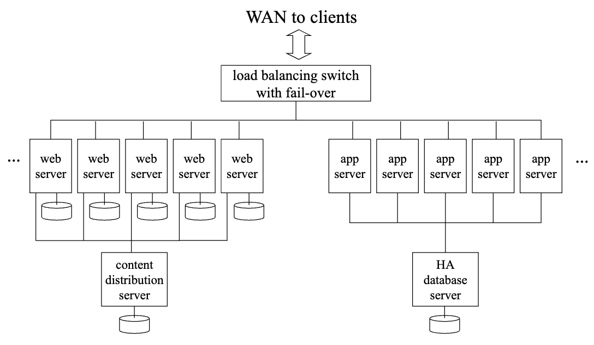
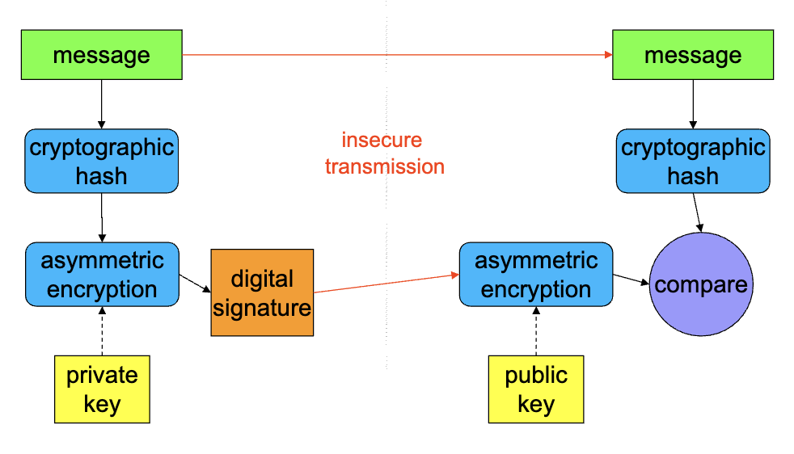
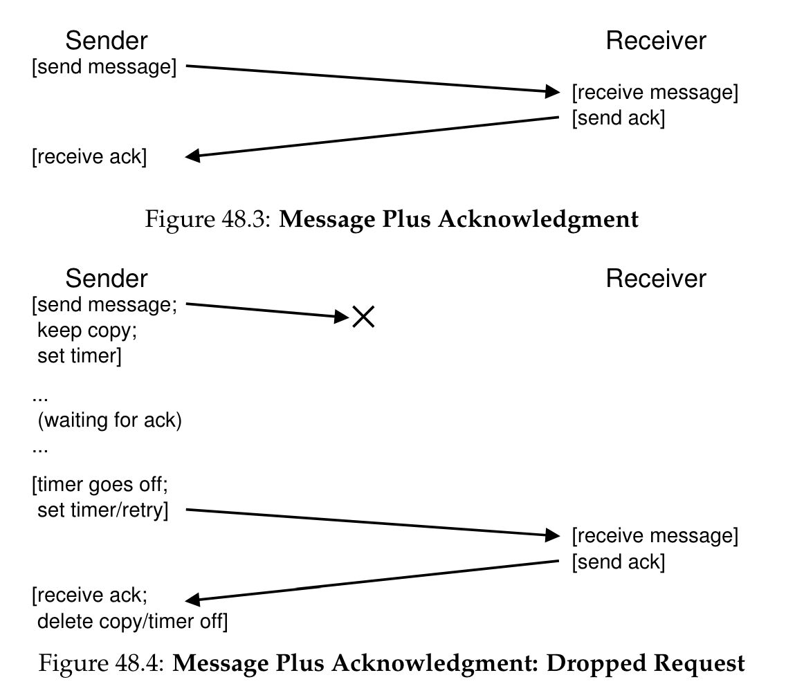
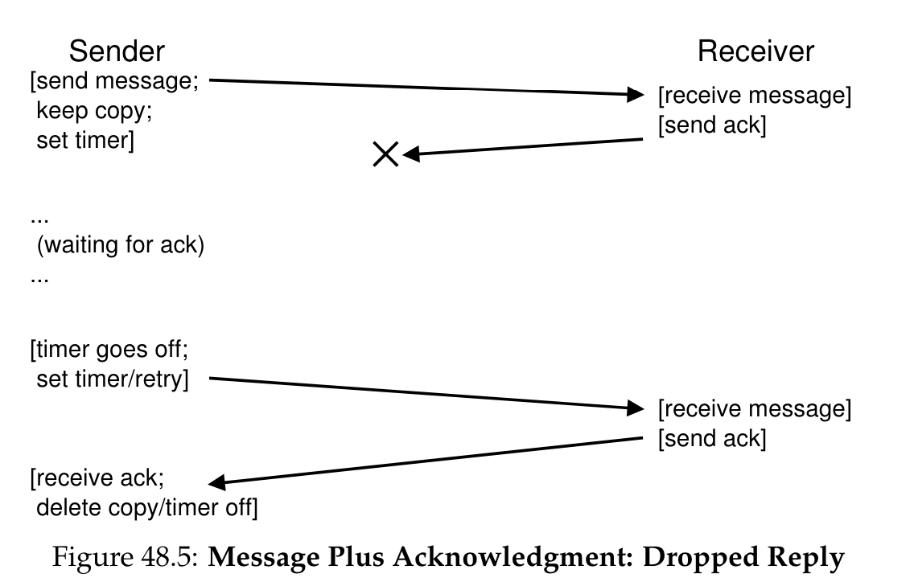
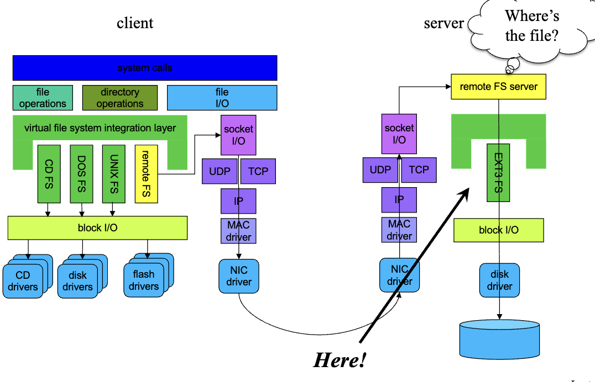
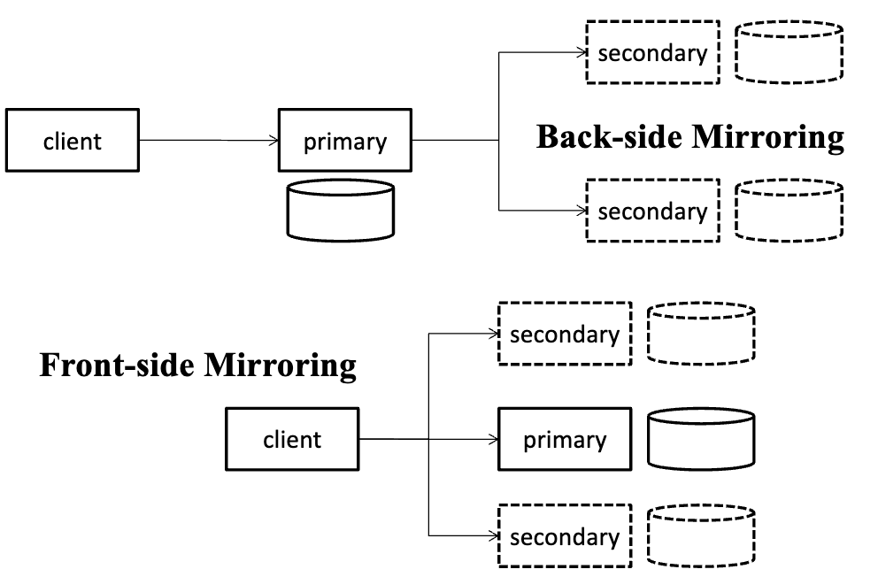
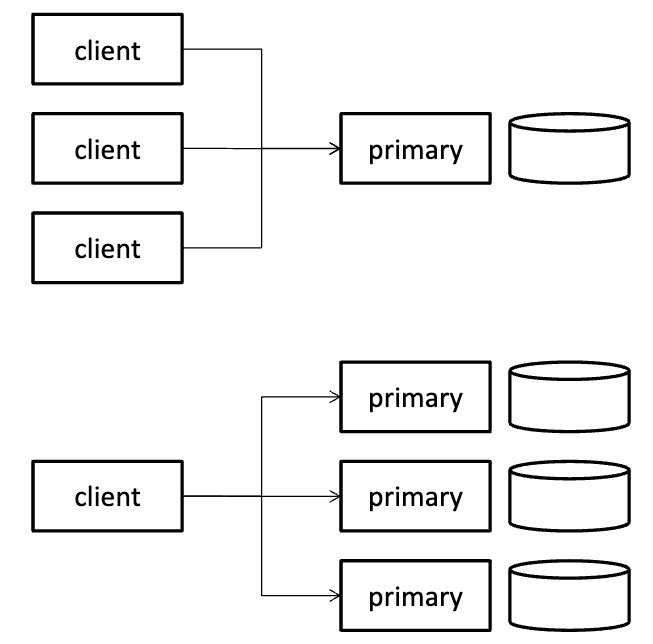
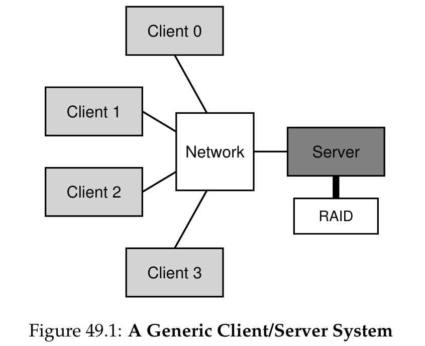
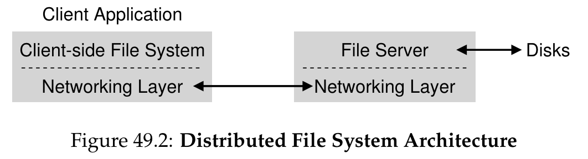

# Week 10 Notes

## Lecture 18: Distributed Systems

- Introduction
  - Most modern computing is done with distributed systems
  - Why is this an OS topic?
    - Because it's definitely a systems issue and even the OS on a single computer needs to worry about distributed issues
  - If you don't know a bit about distributed systems, you're not a modern computer scientist
- Why distributed systems?
  - Better scalability and performance
    - Apps require more resources than one computer has
    - Can we grow system capacity/bandwidth to meet demand?
  - Improved reliability and availability
    - 24/7 service despite disk/computer/software failures
  - Ease of use, with reduced operating expenses
    - Centralized management of all services and systems
    - Buy (better) services rather than computer equipment
  - Enabling new collaboration and business models
    - Collaborations that span system (or national) boundaries
    - A global free market for a wide range of new services
- A few little problems
  - Different machines don't share memory or any peripheral devices
    - So one machine can't easily know the state of another
    - Might cause synchronization problems
  - The only way to interact remotely is to use a network
    - Usually asynchronous, slow, and error prone
    - Usually not controlled by any single machine
    - So how can we know what's going on remotely?
  - Failures of one machine aren't visible to other machines
    - How can our computation be reliable if pieces fail?
- Transparency
  - Ideally a distributed system would be just like a single machine system but better
    - More resources
    - More reliable
    - Faster
  - Transparent distributed systems look as much like single machine systems as possible
- Destsch's "Seven Fallacies of Network Computing"
  - The network is reliable and secure
  - There's no latency (instant response time)
  - The available bandwidth is infinite
  - The topology of the network doesn't change
  - There is one administrator for the whole network
  - The cost of transporting additional data is zero
  - All locations on the network are equivalent
  - Bottom line: True transparency is not achievable
- Distributed system paradigms
  - Parallel processing
    - Relying on tightly coupled special hardware
    - Not widely used
  - Single system images
    - Make all the nodes look like one big computer
    - Somewhere between hard and impossible
    - Not popular
  - Loosely coupled system
    - Work with difficulties as best as you can
    - Typical modern approach to distributed systems
  - Cloud computing
    - A recent variant
- Loosely coupled systems
  - Characterization:
    - A parallel group of independent computers
    - Connected by a high speed LAN
    - Serving similar but independent requests
    - Minimal coordination and cooperation required
  - Motivation:
    - Scalability and price performance
    - Availability - if protocol permits stateless servers
    - Ease of management, reconfigurable capacity
  - Examples: Web servers, app servers
- Horizontal scalability
  - Each node largely independent
  - So you can add capacity just by adding a node "on the side"
  - Scalability can be limited by network instead of hardware or algorithms (or by a load balancer)
  - Reliability is high
    - Failure of one of N nodes just reduces capacity
- Horizontal scalability architecture
  - If I need more web server capacity
  - 
- Elements of loosely coupled architecture
  - Farm of independent servers
    - Servers run same software, serve different requests
    - May share a common backend database
  - Frontend switch
    - Distributes incoming requests among available servers
    - Can do both load balancing and fail-over
  - Service protocol
    - Stateless servers and idempotent operations (same result of you do it n times)
    - Successive requests may be sent to different servers
- Horizontally scaled performance
  - Individual servers are very inexpensive
    - Blade servers may be only $100-$200 each
  - Scalability is excellent
    - 100 servers deliver approximately 100x performance
  - Service availability is excellent
    - Frontend automatically bypasses failed servers
    - Stateless servers and client retries fail-over easily
  - The challenge is managing thousands of servers
    - Automated installation, global configuration services
    - Self monitoring, self-healing systems
    - Scaling limited by management, not hardware or algorithms
- Cloud computing
  - The most recent twist on distributed computing
  - What runs in a cloud?
    - In principle, anything
    - But general distributed computing is hard
  - So much of the work is run using special tools
  - These tools support particular kinds of parallel/distributed processing
    - Using a method like map-reduce or horizontal scaling
  - So the user need not be a distributed systems expert
- MapReduce
  - Perhaps the most common cloud computing software tool/technique
  - A method of dividing large problems into compartmentalized pieces
  - Each of which can be performed on a separate node
  - With an eventual combined set of results
- The idea behind MapReduce
  - There's a single function you want to perform on a lot of data, such as searching it for a particular string
  - Divide the data into disjoint pieces
  - Perform the function on each piece on a separate node (map)
  - Combine the results to obtain output (reduce)
- An example
  - We have 64 mb of text data
  - Count how many times each word occurs in the text
  - Divide it into 4 chunks of 16 mb
  - Assign each chunk to one processor
  - Perform the map function of "count words" on each
- On to reduce
  - We might have two more nodes assigned to doing the reduce operation
  - They'll each receive a share of data from a map node
  - The reduce node performs a reduce operation to "combine" the shares, outputting its own result
- But I wanted a combined list
  - No problem
  - Run another (slightly different) MapReduce on the outputs
  - Have one reduce node that combines everything
- Synchronization in MapReduce
  - Each map node produces an output file for each reduce note
  - It's produced atomically
  - The reduce node can't work on this data until the whole file is written
  - Forcing a synchronization point between the map and reduce phases
- Cloud computing and horizontal scaling
  - An excellent match
  - Rent some cloud nodes to be your web servers
  - If load gets heavy, ask the cloud for another web server node
  - As load lightens, release unneeded nodes
  - No need to buy new machines or administer your own machines
- What's hard about distributed synchronization?
  - Spatial separation
    - Different processes run on different systems
    - No shared memory for (atomic instruction) locks
    - They're controlled by different operating systems
  - Temporal separation
    - Can't "totally order" spatially separated events
    - Before/simultaneous/after lose their meaning
  - Independent modes of failure
    - One partner can die while others continue
- Leases: More robust locks
  - Obtained from resource manager
    - Gives client exclusive right to update the file
    - Lease "cookie" must be passed to server on update
    - Lease can be released at end of critical section
  - Only valid for a limited period of time
    - After which the lease cookie expires
      - Updates with stale cookies are not permitted
    - After which new leases can be granted
  - Handles a wide range of failures
    - Process, client node, server node, network
- Lock breaking and recovery
  - Revoking an expired lease is fairly easy
    - Lease cookie includes a "good until" time based on the server's clock
    - Any operation involving a "stale cookie" fails
  - This makes it safe to issue a new lease
    - Old lease-holder can no longer access object
    - But was object left in a "reasonable" state?
  - Object must be restored to last "good" state
    - Roll back to state prior to the aborted lease
    - Implement all-or-none transactions
- Why is distributed security harder than security in single machines?
  - Your OS cannot guarantee privacy and integrity
    - Network activities happen outside of the OS
    - Should you trust where they happen?
  - Authentication is harder
    - All possible agents may not be in local password file
  - The wire connecting the user to the system is insecure
    - Eavesdropping, replays, man-in-the-middle attacks
  - Even with honest partners, hard to coordinate distributed security
  - The Internet is an open network for all
    - Many sites on the Internet try to serve all comers
    - Core Internet makes no judgments on what's acceptable
    - Even supposedly private systems may be on Internet
- Goals of network security
  - Secure conversations
    - **Privacy**: Only you and your partner know what's said
    - **Integrity**: Nobody can tamper with your messages
  - Positive identification of both parties
    - Authentication of the identity of message sender
    - Assurance that a message is not a replay or forgery
    - **Non-repudiation**: He cannot claim "I didn't say that"
  - Availability
    - The network and other nodes must be reachable when they need to be
- Elements of network security
  - Cryptography
    - Symmetric cryptography for protecting bulk transport of data
    - Public key cryptography primarily for authentication
    - Cryptographic hashes to detect message alterations
  - Digital signatures and public key certificates
    - Powerful tools to authenticate a message sender
  - Filtering technologies
    - Firewalls, etc
    - To keep bad stuff from reaching our machines
- Tamper detection: Cryptographic hashes
  - Checksums often used to detect data corruption
    - Add up all bytes in a block, send sum along with data
    - Recipient adds up all the received bytes
    - If checksums agree, the data is probably OK
    - Checksum (parity, CRC, ECC) algorithms are weak
  - Cryptographic hashes are very strong checksums
    - **Unique**: Two message vanishingly unlikely to produce same hash
      - Particularly hard to find two messages with the same hash
    - **One way**: Cannot infer original input from output
    - **Well distributed**: Any change to input changes output
- Using cryptographic hashes
  - Start with a message you want to protect
  - Compute a cryptographic hash for that message
    - E.g., using the Secure Hash Algorithm 3 (SHA-3)
  - Transmit the hash securely
  - Recipient does same computation on received text
    - If both hash results agree, the message is intact
    - If not, the message has corrupted/compromised
- Secure hash transport
  - Why must the hash be transmitted securely?
    - Cryptographic hashes aren't keyed, so anyone can produce them (including a bad guy)
  - How to transmit hash securely?
    - Encrypt it
    - Unless secrecy required, cheaper than encrypting entire message
    - If you have a secure channel, could transmit it that way
      - But if you have secure channel, why not use it for everything?
- Putting it together: Secure Socket Layer (SSL)
  - A general solution for securing network communication, built on top of existing socket IPC
  - One direction, one for A->B, another for B->A
  - Establishes secure link between two parties
    - Goals:
      - **Privacy**: Nobody can snoop on conversation
      - **Integrity**: Nobody can generate fake messages
  - Certificate-based authentication of server
    - Typically done, but not necessarily needed
    - Client knows what server he's talking to
  - Optional certificate-based authentication of client
    - If server requires authentication and non-repudiation
  - PK used to distribute a symmetric session key
    - New key for each new socket
  - Rest of data transport switches to symmetric crypto
    - Giving safety of public key and efficiency of symmetric
- Digital signatures
  - Encrypting a message with private key signs it
    - Only you could have encrypted it, it must be from you
    - It has not been tampered with after you wrote it
  - Encrypting everything with your private key is a bad idea
    - Asymmetric encryption is extremely slow
  - If you only care about integrity, you don't need to encrypt it all
    - Compute a cryptographic hash of your message
    - Encrypt the cryptographic hash with your private key
    - Faster than encrypting whole message
  - 
- Signed load modules
  - How do we know we can trust a program?
    - Digital signatures can answer this question
  - Design a certification authority
    - Perhaps the OS manufacturer (Microsoft, Apple, ...)
  - They verify the reliability of the software
    - By code review, testing, etc
    - They sign a certified module with their private key
  - We can verify signature with their public key
    - Proves the module was certified by them
    - Proves the module has not been tampered with
- An important public key issue
  - If I have a public key, I can authenticate received messages and I know they were sent by the owner of the private key
  - But how can I be so sure who owns the private key?
  - I can get Microsoft's public key when I first buy their OS
    - So I can verify their load modules and updates
    - But how to handle the more general case?
  - I would like a certificate of authenticity
    - Guaranteeing who the real owner of a public key is
- What is a PK certificate?
  - Essentially a data structure containing:
    - An identity
    - A matching public key
    - Perhaps other information
    - A digital signature of those items
      - Signed by someone I trust and whose public key I already have
- Using public key certificates
  - If I know public key of the authority who signed it, I can validate that the signature is correct and that the certificate hasn't been tampered with
  - If I trust the authority who signed the certificate, I can trust they authenticated the certificate owner (e.g., we trust drivers licenses and passports)
  - But first I must know and trust signing authority, which really means I know and trust their public key
- A chicken and egg problem
- I can learn the public key fo a new partner using his certificate
- But to use his certificate, I need the public key of whoever signed it
- To get that public key, get out of band (through some other means)
  - Having the key in a trusted program, like a web browser
  - Hand delivered
- Conclusion
  - Distributed systems offer us much greater power than one machine can provide
  - They do so at costs of complexity and security risk
  - We handle the complexity by using distributed systems in a few carefully defined ways
  - We handle the security risk by proper use of cryptography and other tools

## [Distributed Systems: Goals and Challenges](https://htmlpreview.github.io/?https://github.com/markkampe/Operating-Systems-Reading/blob/master/distsystems.html)

- Goals
  - Collaboration and sharing
  - Client/server usage model
    - Doesn't make sense for all the equipment you need to be connected to your computer
      - Short time use
      - Waste of money
      - Can share equipment instead
    - Many situations where you can get better functionality and save money by using remote/centralized resources rather than requiring all resources to be connected to a client computer
  - Reliability and availability
    - Combine multiple ordinary systems > build systems out of the best possible components (in terms of reliability)
    - Key is to distribute service over multiple independent servers
      - Independent -> no single point of failure (no single component's failure would take out multiple systems)
    - If the client and server instances are to be distributed across multiple independent computers, then we're building a distributed system
  - Scalability
    - More successful system -> add more work to it over time -> more storage capacity, more network bandwidth, more computing power
    - Buying a new computer and throwing out the old one
      - Highly inefficient
      - If we're successful, our needs for capacity and power will eventually exceed even the largest computer
    - Design systems that can be expanded incrementally, by adding additional computers and storage as they're needed (scale-out over scale-up)
  - Flexibility
    - Run different parts of different computers or a single part on multiple computers
    - Change the deployment model (which services can run on which computers)
- Challenges
  - Many solutions that work on a single system do not work in distributed system
  - Distributed systems have new problems that were never encountered in single systems
  - New and more modes of failure
    - If something bad happens to a single system the whole system goes down
    - Partial failures are common
    - In a distributed system our only indication that a component has failed might be that we are no longer receiving messages from it
    - Problems are much more difficult to diagnose in a distributed system
    - If we expect a distributed system to continue operating despite the failures of individual components, all of the components need to be made more robust (eg. greater error checking, automatic fail-over, recovery and connection reestablishment)
    - One particularly tricky part of recovery is how to handle situations where a failed component was holding resource locks
      - Recognize problem, break locks, restore the resource to a clean state, prevent the previous owner from attempting to continue using the resource if they return
  - Complexity of distributed state
    - In a single computer system all system resource updates are correctly serialized and we can:
      - Place all operations on a single time-time (a total ordering)
      - At any moment, say what the state of every resource in the system is
    - In a distributed system:
      - Distinct nodes in a distributed system operate completely independently of one-another
      - Because of the independence of parallel events, different nodes may at any given instant, consider a single resource to be in different states
      - A resource doesn't actually have a single state
        - Its state is a vector of the state that the resource is considered to be in by each node in the system
    - Serialization approaches that worked very well in a single system can become prohibitively expensive in a distributed system
  - Complexity of management
    - A single computer system has a single configuration
    - A thousand different systems may each be configured differently
      - Different databases of known users
      - Services may be configured with different options
      - Different lists of which servers perform which functions
      - Switches may be configured with different routing and firewall rules
    - And even if we create a distributed management service to push management updates out to all nodes:
      - Some nodes may not be up when the updates are sent, and they won't learn of them
      - Networking problems may create isolated islands of nodes that are operating with a different configuration
  - Much higher loads
    - Often uncover weaknesses that had never caused problems under lighter loads
    - More nodes = more messages = increased overhead and longer delays = poor scaling, race conditions, or performance drops
  - Heterogeneity
    - In a single computer system, all of the applications:
      - Same ISA
      - Same version of the operating system
      - Same versions of the same libraries
      - Directly interact with one another through the operating system
    - In a distributed system, each node may be:
      - Different ISA
      - Different operating system
      - Different versions of the software and protocols
      - Components interact with one another through a variety of different networks and file systems
      - Make exhaustive testing impossible
  - Emergent phenomena
    - Things that don't happen in smaller systems can happen in larger systems
  - Peter Deutsch's "Seven Fallacies" of distributed computing
    - The network is reliable
      - Subroutine calls always happen
      - Messages and responses are not guaranteed to be delivered
    - Latency is zero
      - The time to make a subroutine call is negligible
      - The time for a a message exchange can easily be 1,000,000X greater
    - Bandwidth is Infinite
      - In-memory data copies can be performed at phenomenal rates
      - Network throughput is limited, and large numbers of clients can easily saturate NICs, switches and WAN links
    - The network is secure
      - While not perfect, operating systems are sufficiently well protected that we (relatively) seldom have to worry about malicious attacks within our own computer
      - Once we put a computer on a network it becomes susceptible to penetration attempts, man-in-the-middle attacks, and denial-of-service attacks
    - Topology does not change
      - In a distributed system, routes change and new clients/servers appear and disappear continuously
      - Distributed applications must be able to deal with an ever-changing set of connections to an ever-changing set of partners
    - There is one administrator
      - There may not be a single database of all known clients
      - Different systems may be administered with different privileges
      - Independently managed routers and firewalls may block some messages to/from some clients
    - Transport cost is zero
      - Network infrastructure is not free, and the capital and operational costs of equipment and channels to transport all of our data can dramatically increase the cost of a proposed service
    - The network is homogenous
      - Nodes on the network are running different versions, of different operating systems, on machines with different Instruction Set Architectures, word lengths, and byte orders, whose users speak different languages, use different character sets, and have very different means of representing even very standard information (e.g. dates)

## 47. A Dialogue on Distribution

- The peach is far away from you and may take some time to get the peach
- Lots of peaches, sometimes a peach becomes rotten
- Want to make sure that when anybody bites into a peach, they'll get a mouthful of deliciousness
- Building distributed systems is hard because things fail all the time
  - Messages get lost
  - Machines go down
  - Disks corrupt data
- Techniques to detect and recover from failure
  - Replication
  - Retry

## 48. [Distributed Systems](https://pages.cs.wisc.edu/~remzi/OSTEP/dist-intro.pdf)

- Introduction
  - When your web browser connects to a web server somewhere else on the planet, it's participating in a simple form of a client//server distributed system
  - Failure is a central challenge, also represents an opportunity
  - By collecting a set of machines together, we can build a system that appears to rarely fail, despite the fact that its components fail regularly
  - Good to view communication as a fundamentally unreliable activity
    - Bit corruption
    - Down or non-working links and machines
    - Lack of buffer space for all incoming packets
    - -> Packets sometimes do not reach their destination
  - System performance
  - Security
  - Communication
- Communication basics
  - Multitude of causes for packet loss or corruption
    - Some bits get flipped due to electrical or other similar problems during transmission
    - An element in the system, such as a network link or packet router or even the remote host are somehow damaged or otherwise not working correctly
    - Packet loss due to lack of buffering within a network switch, router, or endpoint
      - Memory cannot accommodate all of the packets
      - Only choice the router has is to drop one or more of the packets
      - Even if you could guarantee that all links work correctly and that all the components in the system (switches, routers, end hosts) were up and running as expected, loss is still possible for this reason
- Unreliable communication layers
  - Don't deal with packet loss
    - Let applications that know how to deal with packet loss communicate with a basis unreliable messaging layer (end-to-end argument)
  - Example of unreliable layer: UDP/IP networking stack available on virtually all modern systems
    - To use UDP, a process uses the sockets API to create a communication endpoint
    - Processes on other (or the same) machine(s) send UDP datagrams to the original process
      - **Datagram**: Fixed-sized message up to some max size
    - If you use it, you'll encounter situations where packets get lost (dropped) and thus do not reach their destination
    - Sender is never informed of the loss
    - UDP includes a checksum to detect some forms of packet corruption
- Reliable communication layers
  - Acknowledgement (ack)
  - Sender sends message to receiver (sets timer and keeps copy) -> receiver sends short message back to acknowledge its receipt
  - **Timeout** / **retry**: If no acknowledgement has been received when the timer goes off, the sender concludes that the message has been lost and performs a retry of the send
  - Be careful setting the timeout value
    - **Too small**: Sender will resend messages needlessly, thus wasting CPU time on the sender and network resources
    - **Too large**: Sender waits too long to resent and thus perceived performance at the sender is reduced
    - **Right value**: Wait just long enough to detect packet loss but no longer
    - **Exponential back-off**: Avoids situations where resources are being overloaded by an excess of resends
      - Adaptively adjusts timeout value
  - Want to guarantee that each message is received exactly once by the receiver (what if ack gets dropped?)
  - When the receiver sees a duplicate transmission, it acks the message but does not pass the message to the application that receives the data
  - Ways to detect duplicate messages
    - Sender could generate a unique ID for each message
    - Receiver could track every ID it has ever seen (costly, requires unbounded memory to track all IDs)
    - Sequence counter
      - Sender and receiver agree upon a start value (e.g., 1) for a counter that each side will maintain
      - Whenever a message is sent, the current value of the counter is sent along with the message
      - Counter value (N) serves as an ID for the message
      - After the message is sent, the sender then increments the value to N + 1
      - If the ID of a received message matches the receiver's counter, it acks the message and passes it up to the application
        - The receiver concludes this is the first time this message has been received
        - Receiver increments its counter and waits for the next message
      - If the ack is lost, sender will timeout and resent message N
        - Receiver's counter is higher and thus the receiver knows it has already received this message
        - Acks the message but doesn't pass it up to the application
  - **TCP/IP** / **TCP**: Most commonly used reliable communication layer
  - 
  - 
- Communication abstractions
  - Distributed shared memory (DSM) systems enable processes on different machines to share a large, virtual address space
  - Turns a distributed computation into something that looks like a multi-threaded application
  - Only difference is that these threads run on different machines instead of different processors within the same machine
  - Work through the virtual memory system of the OS
  - When a page is accessed on one machine
    - **Best case**: Page is already local on the machine, data is fetched quickly
    - **Other case**: page is currently on another machine, page fault occurs, page fault handler sends a message to the other machine to fetch the page, install it in the page table of the requesting process, and continue execution
  - Biggest problem is how it handles failure
    - Parts of data structures would become unavailable / parts of address space go missing
  - Another problem is performance
    - Some accesses are inexpensive but others cause page faults and expensive fetches from remote machines
  - Be careful to organize computations such that almost no communication occurs at all, defeating the point of such an approach
  - Nobody builds reliable distributed systems using DSM today
- Remote Procedure Call (RPC)
  - Programming language (PL) abstractions make more sense
  - Most dominant abstraction
  - Goal is to make the process of executing code on a remote machine as simple and straightforward as calling a local function
  - Stub generator / protocol compiler
    - Job is to remove some of the pain of packing function arguments and results into messages by automating it
    - Benefits
      - Avoid the simple mistakes that occur in writing such code by hand
      - Optimize such code and improve performance
    - Input is the set of calls a server wishes to export to clients
    - For the client, a client stub is generated, which contains each of the functions specified in the interface
    - A client program wishing to use this RPC service would link with this client stub and call into it to make RPCs
    - Internally, each of these functions in the client stub do all of the work needed to perform the remote procedure call
    - To the client, the code just appears as a function call (e.g., the client calls `func1(x)`)
    - Code in the client stub for `func1()` does this:
      - Create a message buffer (contiguous array of bytes of some size)
      - **Marshaling of arguments** / **serialization of the message**: Pack the needed information into the message buffer
        - Identifier for the function to be called
        - Arguments that the function needs
      - Send the message to the destination RPC server
        - Communication with the RPC server and all of the details required to make it operate correctly are handled by the RPC runtime library
      - Wait for the reply
        - Function calls are usually synchronous, call will wait for its completion
      - **Unmarshaling** / **deserialization**: Unpack return code and other arguments
        - Single return code, straightforward
        - More complex functions might return more complex results (e.g., a list), and the stub might need to unpack those as well
      - Return to the caller
    - Server steps
      - **Unmarshaling** / **deserialization**: Unpack the message
        - Takes the information out of the incoming message
        - Function identifier and arguments are extracted
      - Call into the actual function
        - RPC runtime calls into the function specified by the ID and passes in the desired arguments
      - Package the results
        - Return argument(s) are marshaled back into a single reply buffer
      - Send the reply
    - Important issues to consider
      - Complex arguments
        - Well-known types
        - Annotate the data structure with more information, enabling the compiler to know which bytes need to be serialized
      - Organization of the server with regards to concurrency
        - Simple server waits for requests in a simple loop and handles each request one at a time
          - Inefficient
          - If one RPC call blocks (e.g., on I/O), server resources are wasted
        - Most servers are constructed in some sort of concurrent fashion
        - **Thread pool**: Finite set of threads are created when the server starts
          - When a message arrives, it's dispatched to one of these worker threads, which then does the work of the RPC call, eventually replying
          - During this time, a main thread keeps receiving other requests and perhaps dispatching them to other workers
        - Standard costs arise (mostly in programming complexity) as the RPC calls may now need to use locks and other synchronization primitives
  - Run-time library
    - Handles much of the heavy lifting in an RPC system, most performance and reliability issues
    - Challenges
      - **Naming**: How to locate a remote service / which server a client should talk to for a particular remote service
        - Simplest approach builds on existing naming systems, e.g., hostnames and port numbers provided by current internet protocols
        - Client must know the hostname or IP address of the machine running the desired RPC service, as well as the port number it's using
          - **Port number**: Way of identifying a particular communication activity taking place on a machine, allowing multiple communication channels at once
        - Protocol suite must then provide a mechanism to route packets to a particular address from any other machine in the system
      - Which transport-level protocl should RPC be built upon
        - Reliable protocol (TCP/IP)
          - Can lead to a major inefficiency in performance
          - Two extra messages are sent (acks)
        - Unreliable communication layer (UDP/IP)
          - Many RPC packages are built on top of this
          - Enables a more efficient RPC layer
          - Adds the responsibility of providing reliability to the RPC system
            - RPC layer uses timeout/retry and acknowledgements
            - By using some form of sequence numbering, the communication layer can guarantee that each RPC takes place exactly once (no failure), or at most once (failure)
  - Other issues
    - What happens when a remote call takes a long time to complete?
      - Might appear as a failure to a client and trigger a retry
      - Use an explicit acknowledgement (from the receiver to sender) when the reply isn't immediately generated
        - Lets the client know the server received the request
      - Client can periodically ask whether the server is still working on the request
        - If server keeps saying yes, client should be happy and continue to wait
    - Run-time must also handle procedure calls with large arguments (larger than what can fit into a single packet)
      - Some lower-level network protocols provide such sender-side fragmentation (of larger packets into a set of smaller ones) and receiver-side reassembly (of smaller parts into one larger logical whole)
        - If not, the RPC run-time may have to implement such functionality itself
    - Byte ordering
      - How to communicate between machines of different endianness (big endian vs. little endian)
      - RPC packages often handle this by providing a well-defined endianness within their message formats
      - **Sun's RPC package**: XDR (eXternal Data Representation) layer provides this functionality
        - If the machine sending/receiving a message matches the endianness of XDR, messages are sent/received as expected
        - If different endianness, each piece of information in the message must be converted
      - Difference in endianness can have a small performance cost
    - Whether to expose the asynchronous nature of communication to clients, thus enabling some performance optimizations
      - Typical RPCs are made synchronously
      - Some RPC packages enable you to invoke an RPC asynchronously
      - When an asynchronous RPC is issues, the RPC package sends the request and returns immediately
        - Client is free to do other work, such as call other RPCs or other useful computation
        - Client will at some point want to see the results
        - Calls back into the RPC layer, telling to wait for outstanding RPCs to complete, at which point return arguments can be accessed
  - End-to end argument
    - Makes the case that the highest level in a system, i.e., usually the application at "the end," is ultimately the only locale within a layered system where certain functionality can truly be implemented
    - Contrast is an approach that tries to add reliability to lower levels of the system
      - Even though bytes were delivered reliably across the network, file transfer was not reliable
      - To build a reliable file transfer, one must include end-to-end checks of reliability, e.g., after the entire transfer is complete, read back the file on the receiver disk, compute a checksum, and compare that checksum to that of the file on the sender
    - But sometimes having lower layers provide extra functionality can indeed improve system performance or otherwise optimize a system
- Summary
  - Key to any distributed system is how you deal with that failure
  - Communication forms the heart of any distributed system

## 57. [Distributed System Security](https://pages.cs.wisc.edu/~remzi/OSTEP/security-distributed.pdf)

- Introduction
  - Problems
    - Other machines in the distributed system might not properly implement the security policies you want, or they might be adversaries impersonating trusted partners
      - Cannot control remote systems, but still have to be able to trust validity of the credentials and capabilities they give us
    - Machines in a distributed system communicate across a network that none of them fully control and that generally cannot be trusted
      - Adversaries often have equal access to that network and can forge, copy, replay, alter, destroy, and delay our messages, and generally interfere with our attempts to use the network
  - Cryptography major tool, but hard to get right
  - Use carefully designed standard tools
- The role of authentication
  - Try to arrange to agree on policies and hope everyone follows through on those agreements
  - Trust that some parties will behave well
    - Detect when they don't and adjust our trust in the parties accordingly
    - Take other compensating actions
  - For a trust-based solution to work, we have to be quite sure that the bits we send out can be verified by our buddies as truly coming from us, and we have to be sure that the bits coming in really were created by them
  - When working over a network, we need to authenticate based on a bundle of bits
    - Use a form of authentication based on what you know
  - Distributed system authentication relies on one of two elements:
    - Require the remote machine provides you with a password
    - Require the remote machine to provide evidence using a private key stored only on that machine
    - In each case, you need to know something to check the authentication:
      - Password (or, better, a cryptographic hash of the password + salt)
        - Useful if there are a vast number of parties who need to authenticate themselves to one party
        - The authentication provides evidence that somebody knows a password
        - If you want to know exactly who that is, only the party authenticating and the party checking can know it
        - Setting up easy
        - Ex: User authenticates itself to a website
      - Public key
        - Useful if there's one party who needs to authenticate himself to a vast number of parties
        - Many parties can know the key but only one party who knows the matching private key can authenticate themselves
        - Setting up and distributing hard
        - Ex: Website authentication (authenticate itself to all users)
  - Process if we want a remote partner to authenticate itself via passwords
    - Require remote partner to provide us with that password, which we'll check
    - Encrypt the transport of the password across the network
      - Requires that we already have a shared symmetric key or our partner's public key
      - How do we get the public key?
  - Even if you secure the network perfectly, you'll still face the major security challenge of the uncontrolled site you're interacting with on the other side of the network
    - Aka it's over if your compromised partner attacks you
- Public key authentication for distributed systems
  - Doesn't need to be secret, but need to be sure it really belongs to our partner
  - Face to face good but limiting
  - **Certificate**: Signed bundle of bits that contains information about the party that owns the public key, the public key itself, and some other information, such as an expiration date
    - Run through a cryptographic hash
    - Result is encrypted with the trusted third party's private key, digitally signing the certificate
  - If you obtain a copy of th certificate and can check the signature, you can learn someone else's public key even if you've never met or had any direct interaction with them
  - **Certificate Authorities (CAs)**: Create authoritative certificates trusted by many parties
  - Example
    - Cryptographic hashing algorithm on public key KF and other information -> hash HF -> encrypt HF with private key PA -> digital signature SF -> combine (all the information to produce) HF + SF into the certificate CF
    - If customer doesn't have public key, send CF to customer -> run information that's hashed to produce HF' -> use CA's public key to decrypt SF and get HF
      - If all is well, HF = HF'
  - Benefits
    - Signing authority and person giving the key didn't need to participate in the process of the customer checking the certificate
    - It only needs to be done once per customer
      - If lost, customer can extract it again from the certificate or go through the process of obtaining the certificate again
    - Customer has no need to trust the party claiming to be (key giver) until that identity had been proven by checking the certificate
  - Need a primal public key that you trust for this whole process to work, otherwise it's chicken and egg
    - Most commonly comes in a piece of software you obtain and install (Ex: browser)
  - Anyone can create a certificate
    - Getting one from someone whose business it is to issue certificates
    - Create one from scratch, following a certificate standard (X.509)
    - **Necessary requirement**: Party being authenticated and the parties performing the authentication must all trust whoever created the certificate
  - If you're building your own distributed system, you can create your own certificates from a machine you (and other participants in the system) trust and can handle the bootstrapping issue by carefully hand-installing the certificate signing machine's public key wherever it needs to be
    - Use existing software packages > coding your own (PGP)
  - If you're working with a fixed number of machines and you can distribute the public key by hand in some reasonable way, you don't need certificates
  - The only point of a PK certificate is to distribute the public key, so if your public keys are already where they need to be, you don't need certificates
  - **Replay attack**: When an adversary makes a copy of a legitimate message the site sent at some point in the past and then sends it again at some future date
    - **Solution**: Ensure that each encrypted message contains unique information not in any other message
- Password authentication for distributed systems
  - Add confidentiality to this cross-network authentication, generally by encrypting at least the password itself (though encrypting everything involved is better)
  - Encrypt user ID and password with company's public key (for transit)
  - Company, having the matching private key, will be able to check them, but nobody else can read them
  - Use authentication techniques to establish initial authenticity, then use something else to tie that initial authenticity to subsequent interactions
- SSL/TLS
  - Standard method of communicating between processes in modern systems is the socket
    - Equally true when the processes are on different machines
  - **SSL (Secure Socket Layer)**: Add cryptographic features to sockets
    - Did not get it quite right, insecure, should never be used for anything
    - Some very old devices might run software that don't support TLS
    - SSL is better than nothing
  - **Transport Layer Security (TLS)**: New version of encrypted sockets learned from the past mistakes of SSL
  - Concept
    - Move encrypted data through an ordinary socket
    - Set up a socket
    - Set up a special structure to perform whatever cryptography you want
    - Hook the output of that structure to the input of the socket
    - Reverse the process on the other end
  - Designed to support a variety of cryptographic operations and many different ciphers, as well as multiple methods to perform key exchange and authentication between the sender and receiver
  - Process of adding SSL to your program is intricate, requiring the use of particular libraries and a sequence of calls into those libraries to set up a correct SSL connection
    - Purpose is to allow a wide range of generality in the cryptographic options SSL supports and the ways you use those options in your program
  - One common requirement for setting up an SSL connection is how to securely distribute whatever cryptographic key you'll use for the connection you're setting up
    - Best cryptographic practice calls for you to use a brand new key to encrypt the bulk of your data for each connection you set up
    - Need to use symmetric cryptography to encrypt the data once you've authenticated your partner, and you want a fresh key for that
    - Even if you're running multiple simultaneous SSL connections with the same partner, you want a different symmetric key for each connection
  - How to set up a new SSL connection
    - SSL needs to bootstrap a secure connection based (usually) on asymmetric cryptography when no usable symmetric key exists
    - Start a negotiation between the client and the server
      - Usually ends in both sides finding some acceptable set of ciphers and techniques that hit a balance between security and performance
      - In some cases it may be important for you to specify which of these combinations are acceptable for your system (ciphers, secure hashes, key distribution strategies, authentication schemes, based on what version of SSL is installed, how it's configured, and how the programs that set up the SSL connection on each side were written)
    - Authenticate at least the server (client optional)
    - Create (using Diffie-Hellman key exchange) and distribute a new symmetric key
      - Diffie-Hellman key exchange
        - Share a secret key between two parties but they can only communicate over an insecure channel
        - Agree on two numbers, n (large prime number) and g (primitive mod n)
          - Don't need to be secret
        - A chooses a large random integer x, calculates X = g^x mod n, and sends X to B
        - B chooses a large random integer y, calculates Y = g^y mod n, and sends Y to A
        - Eavesdroppers can hear X and Y, but since A and B didn't send x or y, eavesdroppers don't know those values
        - A computes k = Y^x mod n
        - B computes k = X^y mod n
        - A and B get the same value k from those computations
        - Hard for eavesdroppers to guess k, x, or y
      - How to be sure who we're sharing the key with
        - Client obtains a certificate containing the server's public key (typically by having the server send it to the client) and to use the public key in that certificate to verify the authenticity of the server's messages
        - Having the server send the certificate is every bit as secure/insecure as having the client obtain the certificate through other means
        - Certificate security isn't based on the method used to transport it but on the cryptography embedded in the certificate
    - Run the communication through the chosen cipher using that key
      - Server signs its Diffie-Hellman messages with its private key, which will allow the client to determine that its partner in this key exchange is the correct server
      - Typically, the client doesn't provide or even have its own certificate, so it cannot sign its Diffie-Hellman messages
      - When the exchange completes, the client is pretty sure who the server is, but the server has no clue about the client's identity
      - Server can ask the client for a user ID and password later if they want the client to be able to do things that require more trust
      - Since creating the SSL connection sets up a symmetric key, the exchange of ID and password can be protected with that key
  - Is a protocol, not a software package
    - There are multiple different software packages that implement this protocol with different code
    - Software flaws in one implementation might not be in another
    - Protocol flaw vs. implementation flaw
- Other authentication approaches
  - After providing user ID and password, if your session is encrypted at this point, it could regard your proper use of the cryptography as a form of authentication
    - You might even be able to quit your web browser, start it up again, navigate back to that website, and still be treated as an authenticated user, without a new request for your password
    - At that point, you're no longer using the same cryptography you used before, since you would've established a new session and set up a new cryptographic key
    - How did your partner authenticate that you were the one receiving the new key?
      - Site you're working with has chosen to make a security tradeoff
      - **Web cookies**: Pieces of data that a website sends to a client with the intention that the client stores that data and sends it back again whenever the client next communicates with the server
      - Built into most browsers and handled invisible without any user intervention
      - With proper use of cryptography, a server that has verified the password of a client can create a web cookie that securely stores the client's identity
      - When the client communicates with the server again, the web browser automatically includes the cookie in the request, which allows the server to verify the client's identity without asking for a password again
      - Security problems
        - Eavesdropper uses a cookie that was copied as it went across the network
        - Someone other than the legitimate user using the computer that's running the web browser and storing the cookie
  - Challenge/response protocol
    - Remote machine sends you a challenge typically in the form of a number
    - To authenticate yourself, you must perform some operation on the challenge that produces a response
    - This should be an operation that only the authentic party can perform, so it probably relies on the use of a secret that party knows but no one else does
    - Secret is applied to the challenge, producing the response, which is sent to the server
    - Server must be able to verify that the proper response has been provided
    - Different challenge is sent every time, requiring a different response
      - Attackers gain no advantage by listening to and copying down old challenges and responses
      - Challenge and response need not be encrypted
    - Usually perform some kind of cryptographic operation on the challenge plus the secret to produce the response
      - Such operations are better performed by machines than people, so either your computer calculates the response for you or you have a special hardware token that takes care of it
    - Requires pre-arrangement between the challenging machine and the machine trying to authenticate itself
      - Hardware token or data secret must have been set up and distributed before the challenge is issued
  - Use an authentication server
    - You talk to a server that you trust and that trusts you
    - Party you wish to authenticate must also trust the server
    - Authentication server vouches for your identity in some secure form, usually involving cryptography
    - The party who needs to authenticate you is able to check the secure information provided by the authentication server and thus determine that the server verified your identity
    - Since the party you wish to communicate with trusts the authentication server, it now trusts that you are who you claim to be
    - In a vague sense, certificates and CAs are an offline version of such authentication servers
    - There are more active online versions that involve network interactions of various sorts between the two machines wishing to communicate and one or more authentication servers
      - Online versions are more responsive to changes in security conditions than offline versions like CAs
      - An old certificate that should not be honored is hard to get rid of, but an online authentication server can invalidate authentication for a compromised party instantly and apply the changes immediately
- Some higher level tools
  - **HTTPS**: Cryptographically protected version of the HTTP protocol
    - HTTP
      - Supports the World Wide Web
      - Doesn't have its own security features
    - Takes HTTP and connects it to SSL/TLS
      - Basically HTTP passed through an SSL connection
      - SSL takes care of establishing a secure connection, authenticating the web server using the certificate approach, and establishing a new symmetric encryption key known only to the client and server
    - Depends heavily on authentication -> uses certificates
    - Since HTTPS is intended primarily for use in web browsers, the certificates in question are gathered and managed by the browser
    - Modern browsers come configured with the public keys of many certificate signing authorities
    - Certificates for websites are checked against these signing authorities to determine if the certificate is real or bogus
    - Certificate tells you at some moment in time the signing authority thought it was a good idea to vouch that a particular public key blonds to a particular party
      - No implication that:
        - Party is good or evil
        - Matching private key is still secret
        - Certificate signing authority itself is secure and uncompromised, either when it created the certificate or at the moment you check it
    - HTTPS only vouches for authenticity
      - Authenticated website can still launch an attack on your client
    - Not all web browsers always supported HTTPS, typically because they didn't have SSL installed or configured
      - A website using HTTPS only wouldn't be able to interact with the client, since the client couldn't set up its end of the SSL socket
      - Standard solution for web servers was to fall back on HTTP
        - No security would be applied
        - **HSTS (HTTP Strict Transport Security)**: Push towards servers insisting on HTTPS and refusing to talk to clients who can't or won't speak HTTPS
          - Option for a website
          - If the website decides it will support HSTS, all interactions with it will be cryptographically secured for any client
          - Clients who can't or won't accept HTTPS will not be allowed to interact with such a website
          - Used by Google
    - Primarily intended to help secure web browsing, also used to secure other kinds of communications
    - You can only use HTTPS to secure your system if you commit ot using HTTP as your application protocol, and HTTP was intended primarily to support a human-based activity
      - You may be able to achieve far greater efficiency of your application by using SSL or SSH
  - **SSH (Secure Shell)**: Competitor to SSL most often used to set up secure sessions with remote computers
    - Available on Linux/Unix and to some extent on Windows
    - Envisioned as a secure remote shell, developed into a more general tool for allowing secure interactions between computers
    - Most commonly used for command line interfaces, but can support many other forms of secure remote interactions
      - Protect remote X Windows sessions
    - TCP ports can be forwarded through SSH, providing a powerful method to protect interactions between remote systems
    - SSH addresses many of the same problems seen by SSL often in similar ways
      - Remote users must be authenticated
      - Shared encryption keys must be established
      - Integrity must be checked
    - Typically relies on public key cryptography and certificates to authenticate remote servers
    - Clients frequently do not have their own certificates and private keys, in which case providing a user ID and password is permitted
    - Authentication server option, various ciphers (both for authentication and for symmetric encryption, requires negotiation) is also supported
    - **Man-in-the-middle attack**: Two parties think they're communicating directly but are actually communicating through a malicious third party without knowing it
      - Third party sees all of the messages passed between them and can alter or inject new messages without their knowledge
      - SSH can be subject to this
    - When you first use SSH to log into a remote machine you’ve never logged into before, you probably don’t have the public key associated with that remote machine
    - Get it by asking the remote site to send it to you
    - Securely authenticate that machine and set up encrypted communications
      - But what if there’s a man in the middle when you first attempt to log into the remote machine?
        - Man in the middle substitutes his own public key
        - Man in the middle can pose as the remote server
      - If you ever do use SSH this way, up will pop a message warning you of the danger and asking if you want to go ahead despite the risk
        - Folk wisdom suggests that everyone always says “yes, go ahead” when they get this message, including network security professionals
        - Folk wisdom suggests that all messages warning a user of the possibility of insecure actions are always ignored, which should suggest to you just how much security benefit will arise from adding such confirmation messages to your system
  - SSH is not built on SSL, but is a separate implementation
    - Two approaches each have their own bugs, features, and uses
    - A security flaw found in SSH will not necessarily have any impact on SSL, and vice versa
- Summary
  - The cornerstone of providing distributed system security tends to be ensuring that the insecure network connecting the system components doesn't introduce new security problems
  - Symmetric cryptography is used for transport of most data, since it's cheaper than asymmetric cryptography

## [Lease-Based Serialization](https://lasr.cs.ucla.edu/reiher/cs111/leases.html)

- Challenges of distributed locking
  - In a single node, a compare-and-swap mutex operation might take many tens of nanoseconds
    - Obtaining a lock through message exchange will likely take at least tens of milliseconds
    - That is a minimum one-million-X difference in performance
  - In a single node, a mutex operation (whether implemented with atomic instructions or system calls) is guaranteed to complete (though perhaps unsuccessfully)
    - In a distributed system the request or response could be lost
  - When a single node crashes, it takes all of its applications down with it, and when they restart, all locks will be re-acquired
    - In a distributed system the node holding the lock can crash without releasing it, and all the other actors will hang indefinitely waiting for a release that will never happen
  - If a process dies, the OS knows it, and has the possibility of automatically releasing all locks held by that process
    - If the OS dies, all lock-holding processes will also die, and nobody will have to cope with the fact that the OS no longer knows who holds what locks
    - When a node dies in a distributed system, there is no meta-OS to observe the failure and perform the cleanup
    - If the failed node happens to be the lock-manager, the remaining clients may find that their locks have been "forgotten"
  - In a single node it was possible to use some combination of atomic instructions and interrupt disables to prevent parallelism within critical sections
    - There are no WAN-scale atomic instructions or interrupt disables
  - In a single system, we might understand the resources well enough to be able to assign a total ordering to all resources, and so prevent circular dependencies (and thereby deadlocks)
    - In a distributed system the set of possible resources may not be orderable, or even known, which eliminates ordering as a practical means of deadlock prevention
- Addressing these challenges
  - Distributed consensus and multi-phase commits are too complex and expensive to be used for every locking operation
  - Much easier and more efficient to send all locking requests as messages to a central server, who will implement them with local locks
  - The more complex failure cases and greater deadlock risks can be dealt with by replacing locks with leases
    - A lock grants the owner exclusive access to a resource until the owner releases it
    - A lease grants the owner exclusive access to a resource until the owner releases it or the lease duration expires
  - For normal operation a lease works the same as a lock
    - Someone who wants exclusive access to a resource requests the lease
    - As soon as the resource becomes available, the lease is granted, and the requestor can use the resource
    - When the requestor is done, the lease is released and available for a new owner
  - Difference
    - Locks work on an honor system
      - An actor who does not yet have a lock will not enter the critical section that the lock protects
    - Leases are often enforced
      - When a request is sent to a remote server to perform some operation (e.g. update a record in a database), that request includes a copy of the requestor's lease
      - If the lease has expired, the responding resource manager will refuse to accept the request
        - Operations from the previous owner will no longer be accepted, and the lease can be granted to a new requestor
        - The system can automatically recover from any failure of the lease-holder (including deadlock)
  - Issues with leases
    - An expired lease prevents the previous owner from performing any further operations on the protected resource
      - But if the tardy owner was part-way through a multi-update transaction, the object may be left in an inconsistent state
      - If an object is subject to such inconsistencies, updates should be made in all-or-none transactions
      - If a lease expires before the operation is committed, the resource should fall back to its last consistent state
    - The choice of the lease period may involve some careful tuning
      - If the lease period is short, an owner may have to renew it many times to complete a session
      - If the lease period is long, it may take the system a long time to recover from a failure
  - Determining the lease period comes down to:
    - The number of operations that can be performed under a single lease-grant
    - The ratio of the costs of obtaining the lease to the costs of the operations that will be performed under that lease
    - A three second delay to obtain an IP address is trivial if the IP address can be used for 24 hours thereafter
    - A one second delay to get a lock on a file might amortize down to nothing if we could then use that lock to do one million writes
- Evaluating leases
  - **Mutual exclusion**: Leases are at least as good as locks, with the additional benefit of potential enforcement
  - **Fairness**: Depends on the policies implemented by the remote lock manager, who could easily implement either queued or prioritized requests
  - **Performance**: Remote operations are, by their very nature expensive
    - But we probably aren't going to network leases for local objects
    - If lease requests are rare and cover large numbers of operations, this can be a very efficient mechanism
  - **Progress**: Automatic preemption makes leases immune to deadlocks
    - But if a lease-holder dies, other would-be lessees must wait for the lease period to expire
  - **Robustness**: Leases are clearly more robust than those single-system mechanisms
  - Issues
    - While they easily recover from client failures, correct (highly stateful) recovery from lock-server failures is extremely complex
    - Automatic lease expiration is a very powerful feature, but it raises the issue of how to decide "what time it is" in a distributed system without a universal time standard
- Opportunistic locks
  - A requestor can ask for a long term lease, enabling that node to handle all future locking as a purely local operation
  - If another node requests access to the resource, the lock manager will notify the op-lock owner that the lease has been revoked, and subsequent locking operations will have to be dealt with through the centralized lock manager
- Summary
  - Locks are ignorant of Deutsch's Seven Fallacies and do not work well in distributed system

## Lecture 19: Accessing Remote Data

- Remote data: Goals and challenges
  - Sometimes the data we want (file, database, web page) isn't on our machine, but we'd like to be able to access it anyway
  - How do we provide access to remote data?
- Basic goals
  - Transparency
    - Indistinguishable from local files for all uses
    - All clients see all files from anywhere
  - Performance
    - **Per-client**: At least as fast as local disk
    - **Scalability**: Unaffected by the number of clients
  - Cost
    - **Capital**: Less than local (per client) disk storage
    - **Operational**: Zero, it requires no administration
  - **Capacity**: Unlimited, it's never full
  - **Availability**: 100%, no failures or service downtime
- Remote file access
  - Goal: Complete transparency
    - Normal file system calls work on remote files
    - Support file sharing by multiple clients
    - Performance, availability, reliability, scalability
  - Typical architecture
    - Exploits plug-in file system architecture
    - Client-side file system is a local proxy
    - Translates file operations into network requests
    - Server-side daemon receives/processes requests
    - Translates them into real file system operations
  - Architecture
    - 
  - Advantages
    - Very good application level transparency
    - Very good functional encapsulation
    - Able to support multi-client file sharing
    - Potential for good performance and robustness
  - Disadvantages
    - At least part of implementation must be in the OS
    - Client and server sides tend to be fairly complex
  - This is THE model for client/server storage
- Security for remote file systems
  - Major issues:
    - Privacy and integrity for data on the network
      - **Solution**: Encrypt all data sent over network
    - Authentication of remote users
    - Trustworthiness of remote sites
- Authentication approaches
  - Anonymous access
  - Peer-to-peer approaches / authentication
    - All participating nodes are trusted peers
      - Client-side authentication/authorization
        - All users are known to all systems
        - All systems are trusted to enforce access control
        - Example: Basic NFS
      - Advantages:
        - Simple implementation
      - Disadvantages:
        - You can't always trust all remote machines
        - Doesn't work in heterogeneous OS environment
        - Universal user registry is not scalable
  - Server authentication approaches
    - Client agent authenticates to each server
      - Authentication used for entire session
      - Authorization based on credentials produced by server
      - Example: Login-based FTP, SCP, CIFS
    - Advantages
      - Simple implementation
    - Disadvantages
      - May not work in heterogeneous OS environment
      - Universal user registry is not scalable
      - No automatic fail-over if server dies
  - Domain authentication approaches
    - Independent authentication of client and server
      - Each authenticates with independent authentication service
      - Each knows/trusts only the authentication service
    - Authentication service may issue signed "tickets" assuring each of the others' identity and rights
      - May be revocable or timed lease
    - May establish secure two-way session
      - **Privacy**: Nobody else can snoop on conversation
      - **Integrity**: Nobody can generate fake messages
    - Ex: Kerberos
- Distributed authorization
  - Authentication service returns credentials, which server checks against Access Control List
    - **Advantage**: Auth service doesn't know about ACLs
  - Authentication service returns capabilities, which server can verify (by signature)
    - **Advantages**: Servers do not know about clients
  - Both approaches are commonly used
    - **Credentials**: If subsequent authorization required
    - **Capabilities**: IF access can be granted all at once
- Reliability and availability
  - **Reliability**: High degree of assurance that service works properly
    - Challenging in distributed systems because of partial failures
    - Data is not lost despite failures
  - **Availability**: High degree of assurance that service is available whenever needed
    - Failures of some system elements don't prevent data access
    - Certain kinds of distributed systems can greatly improve availability
  - Both in the context of accessing remote files
- Achieving reliability
  - Must reduce probability of data loss
  - Typically by some form of redundancy
    - Disk/server failures must not result in data loss
      - RAID (mirroring, parity, erasure coding)
      - Copies on multiple servers
      - Backup, at the worst
  - Also important to automatically recover after failure
    - Remote copies of data become available again
    - Redundancy loss due to failure must be made up
- Reliability: Data mirroring
  - 
  - **Back-side mirroring**: Primary site, few backup sites that are secondary sites that you don't see unless something happens
  - **Front-side mirroring**: If here doesn't work, I'll try here, then here, basically "here here here" all at once
- Availability and fail-over
  - **Fail-over**: Transferring work/requests from failed server to some other server
  - Data must be mirrored to secondary server
  - Failure of primary server must be detected
  - Client must be failed-over to secondary
  - Session state must be reestablished
    - Idempotency helps a lot here
    - Client authentication/credentials
    - Session parameters (e.g., working directory, offset)
  - In-progress operations must be retransmitted
    - Client must expect timeouts, retransmit requests
    - Client responsible for writes until server acks
- Availability: Failure detect/rebind
  - If a server fails, clients need to detect it and rebind to a different server
  - Client driven recovery
    - Client detects server failure (connection error)
    - Client reconnects to (successor) server
    - Client reestablishes session
  - Transparent failure recovery
    - System detects server failure (health monitoring)
    - Successor assumes primary's IP address (or other redirection)
    - State reestablishment
      - Successor recovers last primary state checkpoint
      - Stateless protocol
- Availability: Stateless protocols
  - Stateful protocols (e.g., TCP)
    - Operations occur within a context
      - Server must save state to maintain that context
    - Each operation depends on previous operations
    - Replacement server must obtain session state to operate properly
  - Stateless protocols (e.g., HTTP)
    - Client supplies necessary context with each request
    - Each operation is self-contained and unambiguous
    - Successor server needs no memory of past events
  - Stateless protocols make failover easy
- Remote file system performance
  - Storage device bandwidth and performance
    - 
    - A single server has limited throughput
    - Since any storage device has bandwidth limitations, striping files across multiple servers provides scalable throughput by using the bandwidth of multiple storage devices
  - Performance for reads
  - Performance for writes
  - Overheads particular to remote file systems
- Network impacts on performance
  - Bandwidth limitations
    - Implications for client
    - Implications for server
  - Delay implications
    - Particularly important if acknowledgements required
  - Packet loss implications
    - If loss rate high, will require acknowledgement
- Performance of reads
  - Most file system operations are reads, so read performance is critical
  - Network read consists of several steps (multiple opportunities for optimizations):
    - Client application requests read
    - Read request is sent via network
    - Server receives read request
    - Server fetches requested data
    - Server sends data across network
    - Client receives data and gives it to application
- Read caching in remote file systems
  - Common way to improve read performance is through caching
  - Can use read-ahead, but costs of being wrong are higher than for local disk, though benefits are also higher
  - Client or server can speculatively request reads
    - Server can either send them or cache them locally
- Caching for reads
  - Client-side caching
    - Cache data permanently stored at the server at the client
    - Eliminates waits for remote read requests
    - Reduces network traffic
    - Reduces per-client load on server
      - But potential consistency issues
  - Server-side caching
    - Typically performed similarly to single machine caching
    - Reduces disk delays but not network problems
- Whole file vs. block caching
  - Many distributed file systems use whole file caching (e.g., AFS)
  - Higher network latency justifies whole file pulls
  - Stored in local (cache-only file system)
  - Satisfy early reads before entire file arrives
  - Block caching is also common (NFS)
    - Typically integrated into shared block cache
- Performance of writes
  - Writes at clients need to get to server(s) that store the data
    - And what about other clients caching that data?
  - Not caching the writes is very expensive since they need to traverse the network and probably be acknowledged
  - Caching approaches improve performance at potential cost of consistency
- Caching writes for distributed file systems
  - Write-back cache
    - Creates the illusion of fast writes
    - Combine small writes into larger writes
    - Fewer, larger network and disk writes
    - Enable local read-after-write consistency
  - Whole-file updates
    - No writes sent to server until `close(2)` or `fsync(2)`
    - Reduce many successive updates to final result
    - File might be deleted before it's written
    - Enable atomic updates, close-to-open consistency
    - But may lead to more potential problems of inconsistency
- Distributed cache consistency approaches
  - Time To Live
    - Delete items from cache after some time, hoping you don't miss any writes meanwhile
  - Check validity on use
    - Which requires remote access, defeating the purpose
  - Only allow one writer at a time per file
    - Too restrictive for most file systems
  - Change notifications
    - Usually the chosen solution
    - Notify cachers when main copy gets an update
    - When exactly does the main copy hear about updates?
- Reliability and availability performance
  - Distributed systems must expect some failures
  - Distributed file systems are expected to offer good service despite those failures
  - How do we characterize that performance characteristic?
  - How do we improve it?
    - Fewer failures
    - Quicker recovery from failures that occur
- Improving availability
  - Reduce Mean Time To Failure (MTTF)
    - Use more reliable components
    - Get rid of bugs
  - Or reduce Mean Time To Recovery (MTTR)
    - Use architectures that provide service quickly once recovery starts
    - There are several places where you can improve MTTR
- Scalability and performance: Network traffic
  - Network messages are expensive
    - They use NIC and network capacity to carry them and server CPU cycles to process them
    - Client delays awaiting responses
  - Minimize messages/client/second
    - Cache results to eliminate requests entirely
    - Enable complex operations with single request
    - Buffer up large writes in write-back ache
    - Pre-fetch large reads into local cache
- Conclusion
  - Accessing data on remote machines is key to most distributed processing
  - There are major challenges to doing so:
    - Performance
    - Consistency
    - Scalability
    - Reliability
  - Solutions are available but have associated costs and drawbacks
    - None of them are perfect for all purposes

## 49. [Sun's Network File System (NFS)](https://pages.cs.wisc.edu/~remzi/OSTEP/dist-nfs.pdf)

- Introduction
  - In a distributed file system, there are a number of client machines and one server (or a few)
  - The server stores the data on its disks and the client requests data through well-formed protocol messages
  - 
  - Server has the disks and clients send messages across a network to access their directories and files on those disks
  - Benefits
    - This setup allows for easy sharing of data across clients
    - **Centralized administration**: Backing up files can be done from the few server machines instead of from the multitude of clients
    - **Security**: Having all servers in a locked machine room prevents certain types of problems from arising
- A basic distributed file system
  - On the client side, there are client applications which access files and directories through the client-side file system
  - A client application issues system calls to the client-side file system (such as `open()`, `read()`, `write()`, `close()`, `mkdir()`, etc) to access files which are stored on the server
  - To client applications, the file system doesn't appear to be any different than a local (disk-based) file system, except perhaps for performance
    - Distributed file systems provide transparent access to files (same API, easy to use)
  - Role of the client-side file system is to execute the actions needed to service those system calls
  - Ex: If the client issues a `read()` request, the client-side file system may send a message to the server-side file system / file server to read a particular block
    - File server will read the block from disk (or its own in-memory cache) and send a message back to the client with the requested data
    - Client-side file system will then copy the data into the user buffer supplied to the `read()` system call
    - Request is complete
    - A subsequent `read()` of the same block on the client may be cached in client memory or on the client's disk
      - Best case, no network traffic need be generated
    - 
  - Two important pieces of software in a client/server distributed file system:
    - Client-side file system
    - File server
  - Why servers crash
    - **Power outage (temporarily)**: Only when power is restored can the machines be restarted
    - Bugs
    - Memory leaks
    - In distributed systems, if the network acts strangely (e.g., becomes partitioned and clients and servers are working but can't communicate), it'll seem as if a remote machine has crashed, but in reality it's just not currently reachable through the network
- On to NFS
  - Open protocol which specified the exact message formats that clients and servers would use to communicate
  - Different groups could develop their own NFS servers and thus compete in an NFS marketplace while preserving interoperability
- Focus: Simple and fast server crash recovery
  - NFSv2
  - Main goal was simple and fast server crash recovery (section title)
  - Makes a lot of sense in a multiple-client, single-server environment
  - Any minute that the server is down or unavailable makes all the client machines and their users unhappy and unproductive
  - As the server goes, so goes the entire system
- Key to fast crash recovery: Statelessness
  - Server doesn't keep track of anything about what's happening at each client
  - Protocol is designed to deliver in each protocol request all the information that's needed to complete the request
  - **Stateful protocol**: "Read some bytes from the file that's referred to by the descriptor I am passing you here"
    - File descriptor is a piece of shared state / distributed state between the client and the server
    - Complicates crash recovery
    - If server crashes after first read but before second read, server doesn't know what `fd` is referring to (information was lost when the server crashed)
    - To handle this situation, client and server would have to engage in some kind of recovery protocol, where the client would make sure to keep enough information around in its memory to be able to tell the server what it needs to know (file descriptor `fd` = file `foo`)
  - No fancy crash recovery is needed, the server just starts running again and a client, at worst, might have to retry a request
- The NFSv2 protocol
  - **File handle**: Used to uniquely describe the file or directory a particular operation is going to operate upon
    - Many of the protocol requests include a file handle
    - Three important components that comprise a unique identifier for a file or directory that a client wishes to access
      - **Volume identifier**: Informs the server which file system the request refers to (NFS server can export more than one file system)
      - **Inode number**: Tells the server which file within that partition the request is accessing
      - **Generation number**: Needed when reusing an inode number
        - By incrementing it whenever an inode number is reused, the server ensures that a client with an old file handle can't accidentally access the newly-allocated file
  - Protocol
    - `LOOKUP`: Used to obtain a file handle, which is subsequently used to access file data
      - Client passes a directory file handle and name of a file to look up, and the handle to that file (or directory) plus its attributes are passed back to the client from the server
    - **Mount protocol**: Obtains directory file handle for the root directory of a file system (?) and is how the clients and servers are first connected together
    - Once a file handle is available, the client can issue `READ` and `WRITE` protocol messages on a file to read or write the file
    - `READ`: Requires the protocol to pass along the file handle of the file along with the offset within the file and number of bytes to read
      - **Handle**: Tells the server which volume and which inode to read from
      - **Offset and count**: Tells which bytes of the file to read
      - Server issues the read and returns the data (and up-to-date attributes) to the client (or an error if there was a failure)
    - `WRITE`: Handled similarly, data is passed from the client to the server, and just a success code (and up-to-date attributes is returned)
    - `GETATTR`: Given a file handle, it fetches the attributes for that file, including the last modified time of the file
      - Important for caching
  - Attributes: Metadata that the file system tracks about each file
    - File creation time
    - Last modification time
    - Size
    - Ownership and permissions information
    - Etc
    - Same information that you would get if you called `stat()` on a file
- From protocol to distributed file system
  - **Client-side file system**: Tracks open files, translates application requests into the relevant set of protocol messages
  - **Server**: Responds to protocol messages, each of which contains all the information needed to complete the request
  - Client tracks all relevant state for the file access, including the mapping of the integer file descriptor to an NFS file handle as well as the current file pointer
    - Enables the client to turn each read request (does not specify the offset to read from explicitly) into a properly-formatted read protocol message which tells the server exactly which bytes from the file to read
    - Upon a successful read, the client updates the current file position
    - Subsequent reads are issued with the same file handle but a different offset
  - When the file is opened for the first time, the client-side file system sends a LOOKUP request message
    - One LOOKUP for every /
      - `/home/remzi/foo.txt`
      - One for `home` in `/`, one for `remzi` in `home`, one for `foo.txt` in `remzi`
  - Each server request has all the information needed to complete the request in its entirety
- Handling server failure with idempotent operations
  - Idempotency is powerful
    - The property of certain operations whereby they can be applied multiple times without changing the result beyond the initial application
    - When an operation can be issued more than once, it's much easier to handle failure of the operation; you can just try it
    - Life is more difficult when an operation isn't idempotent
  - When a client sends a message to the server, it sometimes doesn't reply
    - Request lost
    - Server down
    - Reply lost on way back from server
  - After sending the request, the client sets a timer to go off after a specified time period
    - If a reply is received before the timer goes off, the timer is canceled
    - If the timer goes off before any reply is received, the client assumes the request has not been processed and resends it
  - An operation is called idempotent when the effect of performing the operation multiple times is equivalent to the effect of performing the operation a single time
  - `LOOKUP` and `READ` requests are trivially idempotent
  - `WRITE` requests are also idempotent
  - Some operations are hard to make idempotent, such as making a directory that already exists
- Improving performance: Client-side caching
  - NFS client-side file system caches file data (and metadata) that it has read from the server in client memory
  - First access is expensive (i.e., it requires network communication), subsequent accesses are serviced quite quickly out of client memory
  - Cache also serves as a temporary buffer for writes
    - When a client application first writes to a file, the client buffers the data in client memory (in the same cache as the data it read from the file server) before writing the data out to the server
    - Such write buffering is useful because it decouples application `write()` latency from actual write performance, i.e., the application's call to `write()` succeeds immediately (and just puts the data in the client-side file system's cache)
    - Only later does the data get written out to the file server
- The cache consistency problem
  - **Update visibility**: By buffering writes at the client, other clients may get stale versions of the file
    - Changes made to a data item by one process or client are not immediately visible to other processes or clients that access the same data item through their caches
    - **Solution**: flush-on-close / close-to-open consistency semantics
      - When a file is written to and subsequently closed by a client application, the client flushes all updates (i.e., dirty pages in the cache) to the server
      - Ensures that a subsequent open from another node will see the latest file version
  - **Stale cache**: If a client flushes its writes to the file server and the server now has the latest version, another client could still have an older version in its cache
    - Cache holds an outdated version of a data item that has been changed in the underlying data store
    - If a program running on the other client reads the file, it'll get a stale version and not the most recent copy
    - **Solution**: Clients first check to see whether a file has changed before using its cached contents
      - Before using a cached block, the client-side file system will issue a `GETATTR` request to server to fetch the file's attributes (last modified time)
      - If the time of modification is more recent than the time that the file was fetched into the client cache, the client invalidates the file, thus removing it from the client cache and ensuring that subsequent reads will go to the server and retrieve the latest version of the file
      - Else, it'll go ahead and use the cached contents, increasing performance
      - **New problem**: Server is flooded with `GETATTR` requests
        - **Solution**: Attribute cache added to each client
          - Client still validates a file before accessing it, but most often would just look in the attribute cache to fetch the attributes
          - Attributes for a particular file were placed in the cache when the file was first accessed, then would timeout after a certain amount of time
          - During the timeout, all file accesses would determine that it was OK to use the cached file and thus do so with no network communication with the server
- Assessing NFS cache consistency
  - Flush-on-close introduced a performance problem
    - If a temporary or short-lived file was created on a client and then soon deleted, it would still be forced to the server
    - More ideal implementation might keep short-lived files in memory until they're deleted and thus remove server interaction entirely, perhaps increasing performance
  - Addition of an attribute cache made it very hard to understand or reason about exactly what version of a file one was getting
    - Sometimes you'd get latest version
    - Sometimes you'd get an old version because your attribute cache hadn't yet timed out and thus the client was happy to give you what was in client memory
    - Fine most of the time, occasionally leads to odd behavior
- Implications on server-side write buffering
  - NFS servers have caching concerns as well
  - When data (and metadata) is read from disk, NFS servers will keep it in memory and subsequent reads of said data (and metadata) will not go to disk, a potential small boost in performance
  - NFS server absolutely may not return success on a `WRITE` protocol request until the write has been forced to stable storage (e.g., to disk or some other persistent device)
  - Write buffering happens, crash, server already reported success to the client
    - To avoid this problem, NFS servers must commit each write to stable (persistent) storage before informing the client of success
    - Doing so enables the client to detect server failure during a write and thus retry until it finally succeeds
    - **New problem**: Write performance, without great care, can be the major performance bottleneck
  - How to build an NFS server that can perform writes quickly
    - Put writes in a battery-backed memory
    - Use a file system design specifically designed to write to disk quickly when one finally needs to do so

## 50. [The Andrew File System (AFS)](https://pages.cs.wisc.edu/~remzi/OSTEP/dist-afs.pdf)

- Introduction
  - Main goal is scale
  - Design a distributed file system such that a server can support as many clients as possible
  - Numerous aspects of design and implementation that affect scalability
    - Protocol between clients and servers
      - In NFS, protocol forces clients to check with the server periodically to determine if cached contents have changed
  - Reasonable user-visible behavior is also a first-class concern
  - In NFS, cache consistency is hard to describe because it depends directly on low-level implementation details, including client-side cache timeout intervals
  - In AFS, cache consistency is simple
    - When the file is opened, a client will generally receive the latest consistent copy from the server
- AFS Version 1
  - Aka ITC distributed file system
  - Basic design in place but didn't scale as desired
  - One of the basic tenets of all versions of AFS is whole-file caching on the local disk of the client machine that's accessing a file
    - When you `open()` a file, the entire file (if it exists) is fetched from the server and stored in a file on your local disk
      - AFS client-side code (Venus) sends a Fetch protocol message to the server
      - Fetch protocol message passes the entire pathname of the desired file to the file server (Vice), which would then traverse the pathname, find the desired file, and ship the entire file back to the client
      - Client-side code then caches the file on the local disk of the client (by writing it to local disk)
    - Subsequent application `read()` and `write()` operations are redirected to the local file system where the file is stored
      - Require no network communication and are fast
      - Once a block is accessed, it also may be cached in client memory
      - AFS uses client memory to cache copies of blocks that it has in its local disk
    - Upon `close()`, the file (if it's been modified) is flushed back to the server with a Store protocol message, sending the entire file and pathname to the server for permanent storage
    - The next time the file is accessed, AFSv1 does so much more efficiently
      - Client-side code first contacts the server (using the TestAuth protocol message) to determine whether the file has changed
      - If not, the client uses the locally-cached copy, thus improving performance by avoiding a network transfer
    - Only caches file contents; directories are only kept at the server
    - NFS caches blocks (not whole files, though NFS could cache every block of an entire file) and does so in client memory (not local disk)
- Problems with Version 1
  - Measurement is the key to understanding how systems work and how to improve them
  - Path-traversal costs are too high
    - When performing a Fetch or Store protocol request, the client passes the entire pathname to the server
    - Server must perform a full pathname traversal (root -> `home` -> `remzi` -> etc)
  - The client issues too many TestAuth protocol messages
    - Generated a large amount of traffic to check whether a local file (or its stat information) was valid with the TestAuth protocol message
    - Servers spent too much of their time telling clients whether it was OK to use their cached copies of a file
    - Most of the time, the answer was that the file hadn't changed
  - Load was not balanced across servers
    - **Solution**: Volumes (administrator could move across servers to balance load)
  - Server used a single distinct process per client, thus inducing context switching and other overheads
    - **Solution**: Building the server with threads instead of processes
- Improving the protocol
  - Server CPU became the bottleneck of the system
  - Server could only service 20 clients without becoming overloaded
- AFS Version 2
  - Introduced the notion of a callback to reduce the number of client/server interactions
  - **Callback**: A promise from the server to the client that the server will inform the client when a file that the client is caching has been modified
    - By adding this state to the system, the client no longer needs to contact the server to find out if a cached file is still valid
    - Assumes file is valid until the server tells it otherwise
    - Polling vs. interrupts
  - **File identifier (FID)**: Similar to NFS file handle
    - Used instead of pathnames to specify which file a client is interested in
    - Volume identifier
    - File identifier
    - **"Uniquifier"**: To enable reuse of the volume and file IDs when a file is deleted
    - Client would walk the pathname one piece at a time, caching the results
    - Ex: `/home/remzi/notes.txt`
      - Client Fetch the directory contents of `home`, put them in the local-disk cache, and set up a callback on `home`
      - Fetch the directory `remzi`, put it in the local-disk cache, and set up a callback on `remzi`
      - Fetch `notes.txt`, cache this regular file in the local disk, set up a callback, and finally return a file descriptor to the calling application
    - Difference from NFS is that with each fetch of a directory or file, the AFS client would establish a callback with the server, thus ensuring that the server would notify the client of a change in its cached state
    - Although the first access to `/home/remzi/notes.txt` generates many client-server messages, it also establishes callbacks for all the directories and the file, and thus subsequent accesses are entirely local and require no server interaction at all
    - In the common case where a file is cached at the client, AFS behaves nearly identically to a local disk-based file system
    - Second access should be just as fast as accessing a file locally
- Cache consistency
  - NFS
    - **Update visibility**: When will the server be updated with a new version of a file?
    - **Cache staleness**: Once the server has a new version, how long before clients see the new version instead of an older cached copy?
  - Consistency between processes on different machines
    - Between different machines, AFS makes updates visible at the server and invalidates cached copies at the exact same time (when the updated file is closed)
    - Server "breaks" callbacks for any clients with cached copies
    - Break is accomplished by contacting each client and informing it that the callback it has on the file is no longer valid
      - Ensures that clients will no longer read stale copies of the file
      - Subsequent opens on those clients will require a refetch of the new version of the file from the server (and will also serve to reestablish a callback on the new version of the file)
    - Processes on different machines are modifying a file at the same time
      - Last writer wins / last closer wins
      - Whichever client calls `close()` last will update the entire file on the server last and thus will be the "winning" file (i.e., the file that remains on the server for others to see)
      - All or nothing
      - Difference from a block-based protocol like NFS
        - Writes of individual blocks may be flushed to the server as each client is updating the file
        - Final file on the server could end up as a mix of updates from both clients
  - Consistency between processes on the same machine
    - Writes to a file are immediately visible to other local processes (i.e., a process doesn't have to wait until a file is closed to see its latest updates)
- Crash recovery
  - More involved than with NFS
  - Server not able to contact C1 while C1 is rebooting -> S tries to send it one ore more callback recall messages -> upon rejoining the system, C1 should treat all of its cache contents as suspect -> upon the next access to file F, C1 should first ask the server (with a TestAuth protocol message) whether its cached copy of file F is still valid -> if not, fetch the newer version from the server
  - Server recovery after a crash
    - Callbacks are kept in memory
    - When a server reboots, it has no idea which client machine has which files
    - Upon server restart, each client of the server must realize that the server has crashed and treat all of their cache contents as suspect and reestablish the validity of a file before using it
  - Recovery implementations
    - Server send a message to each client when it's up and running again
    - **Heartbeat message**: Clients check that the server is alive periodically
- Scale and performance of AFSv2
  - 20 -> 50 clients
  - Client-side performance often came quite close to local performance, because in the common case, all file accesses were local
  - File reads usually went to the local disk cache (and potentially local memory)
  - Only when a client created a new file or wrote to an existing one was there need to send a Store message to the server and update the file with new contents
  - Comparing systems
    - In many cases, the performance of each system is roughly equivalent
    - AFS is faster than NFS for a large-file sequential re-read
      - NFS can only cache blocks in client memory
      - If a large file is reread, the nFS client will have to refetch the entire file form the remote server
    - Sequential writes (of new files) performs similarly on both systems
    - AFS performs worse on a sequential file overwrite
      - Client fetches the old file in its entirety only to subsequently overwrite it
      - NFS will overwrite blocks and avoid the initial (useless) read
    - Workloads that access a small subset of data within large files perform much better on NFS than AFS
      - AFS fetches the entire file and writes the entire file back to server
      - NFS, as a block-based protocol, performs I/O that's proportional to the size of the read or write
  - The importance of workload
    - **Workload assumption**: Most files are not frequently shared and accessed sequentially in their entirety
    - **Not always correct**: Application that appends information periodically to a log
- AFS: Other improvements
  - True global namespace to clients
    - Ensures that all files are named the same way on all client machines
    - NFS in contrast allows each client to mount NFS servers in any way that they please and thus only by convention (and great administrative effort) would files be named similarly across clients
  - Mechanisms to authenticate users and ensure that a set of files could be kept private if a user so desired
    - NFS has quite primitive support for security
  - Flexible user-managed access control
    - Who can access which files
  - Tools to enable simpler management of servers for the administrators of the system
