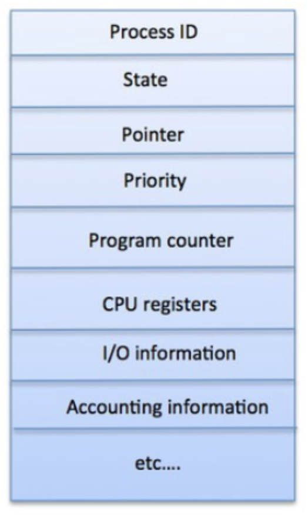
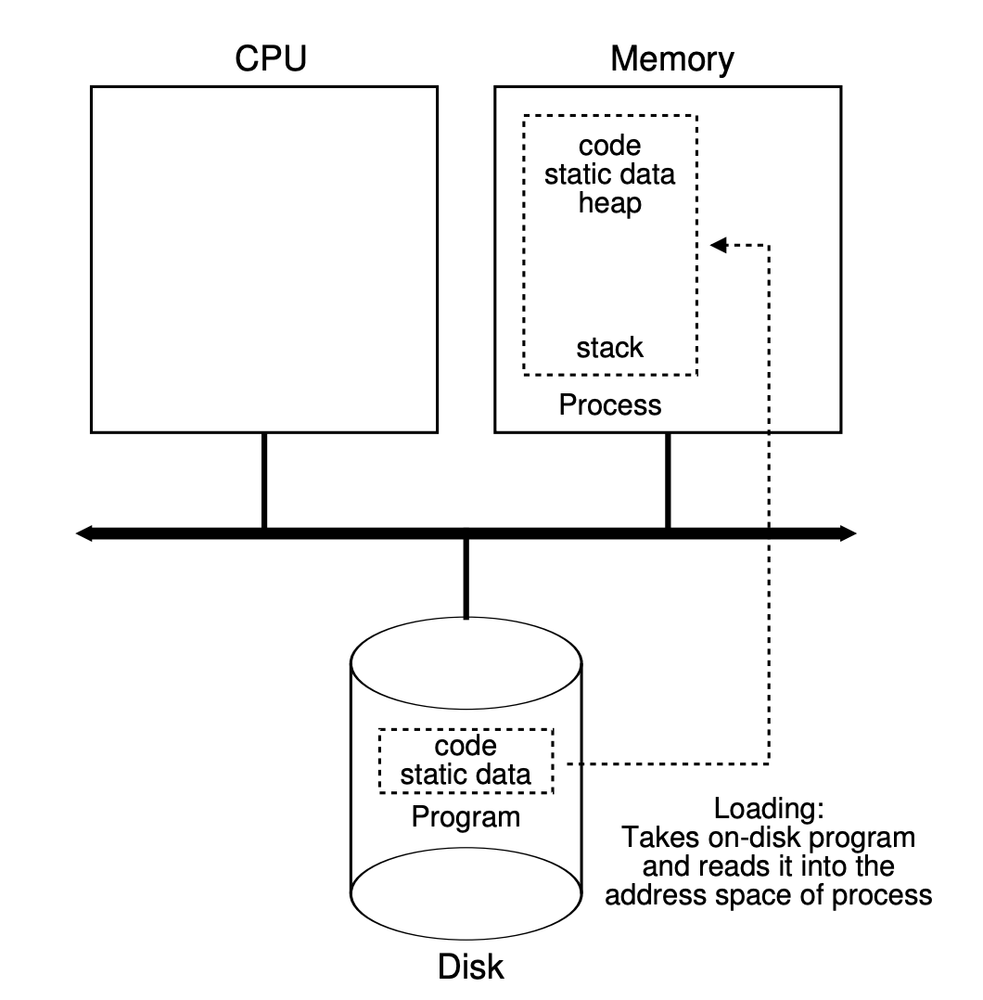
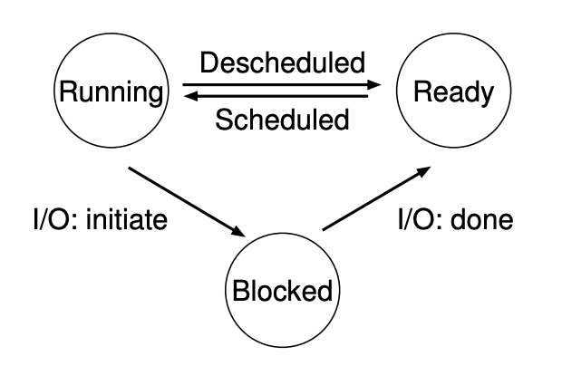
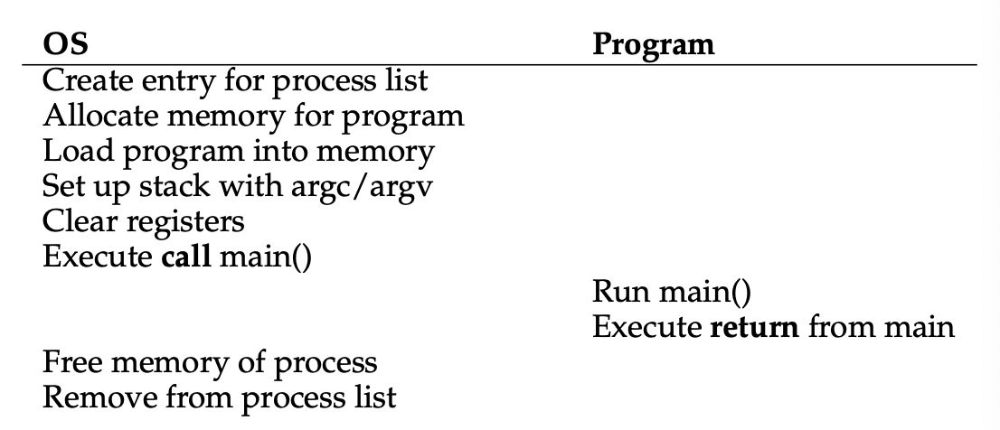

# Week 2 Notes

## Lecture 3: OS Interfaces and Abstractions

- OS Interfaces
  - Nobody buys a computer to run the OS
  - The OS is meant to support other programs via its abstract services
  - Usually intended to be very general
    - Supporting many different programs
  - Interfaces are required between the OS and other programs to offer general services
- Interfaces: APIs
  - Application Program Interfaces
  - A source level interface, specifying:
    - Include files, data types, constants
    - Macros, routines, and their parameters
  - A basis for software portability
    - Recompile program for the desired architecture
    - Linkage edit with OS-specific libraries
    - Resulting binary runs on that architecture and OS
  - An API compliant program will compile and run on any compliant system
    - APIs are primarily for programmers
  - Helps you write programs for your OS
- Interfaces: ABIs
  - Application Binary Interfaces
    - A binary interface, specifying:
      - Dynamically loadable libraries (DLLs)
      - Data formats, calling sequences, linkage conventions
    - The binding of an API to a hardware architecture
  - A basis for binary compatibility
    - One binary serves all customers for that hardware
      - E.g. all x86 Linux/BSD/MacOS/Solaris/...
  - An ABI compliant program will run (unmodified) on any compliant system
  - ABIs are primarily for users, they help you install binaries on your OS
  - Write code without wondering what hardware it's being run on
- Libraries and interfaces
  - Every library has an API
  - Normal libraries (shared and otherwise) are accessed through an API
    - Source-level definitions of how to access the library
    - Readily portable between different machines
  - Dynamically loadable libraries also called through an API
    - But the dynamic loading mechanism is ABI-specific
    - Issues of word length, stack format, linkages, etc
- Interfaces and interoperability
  - Strong, stable interfaces are key to allowing programs to operate together
  - Also key to allowing OS evolution
  - You don't want an OS upgrade to break your existing programs
  - Which means the interface between the OS and those programs better not change
- Side effects
  - Ex: If you use a 4th parameter in an API when the official API only takes 3 parameters
  - API only guarantees what's written in the API
  - A side effect occurs when an action on one object has non-obvious consequences
    - Effects not specified by interfaces
    - Perhaps even to other objects
  - Often due to shared state between seemingly independent modules and functions
  - Side effects lead to unexpected behaviors and the resulting bugs can be hard to find
  - In other words, not good
  - Tip: Avoid all side effects in complex systems
- Abstractions
  - Many things an operating system handles are complex
    - Often due to varieties of hardware, software, configurations
  - Life is easy for application programmers and users if they work with a simple abstraction
  - The operating system creates, manages, and exports such abstractions
- Critical OS abstractions
  - The OS provides some core abstractions that our computational model relies on
    - And builds others on top of those
  - Memory abstractions
    - Many resources used by programs and people relate to data storage
      - Variables
      - Chunks of allocated memory
      - Files
      - Database records
      - Messages to be sent and received
    - These all have some similar properties
      - You read them and you write them
      - But there are complications
    - Some complicating factors
      - Persistent vs. transient memory
        - Expect persistent memory to be there even if you took the machine down, removed all power from the machine, turned it off, then turned it back on again
          - Ex: File system
        - Expect transient memory to change when you turn off the machine
          - Ex: RAM
      - Size of memory operations
        - Size the user/application wants to work with
        - Size the physical device actually works with
      - Coherence and atomicity
        - **Coherence**: Write to location X and read location X, expect the same data you originally wrote to be there
        - **Atomicity**: Make sure all or none of the data you wrote is there
      - Latency
      - Same abstraction might be implemented with many different physical devices
        - Possibly of very different types
    - Where do the complications come from?
      - On a given machine, the OS doesn't have abstract devices with arbitrary properties
      - It has particular physical devices specific to that machine
        - With unchangeable, often inconvenient, properties
        - Different devices on other machines
      - The core OS abstraction problem:
        - Creating the abstract device with the desirable properties from physical devices that lacks them
    - An example
      - A typical file
      - We can read or write the file
        - We can read or write arbitrary amounts of data
      - **Coherence**: If we write the file, we expect our next read to reflect the results of the write
      - **Atomicity**: We expect the entire read/write to occur
      - If there are several read/writes to the file, we expect them to occur in some order
    - What is implementing the file?
      - Often a flash drive
      - Flash drives have peculiar characteristics
        - Write-once (sort of) semantics
          - Re-writing requires an erase cycle
          - Which erases a whole block
          - And is slow
        - Atomicity of writing typically at word level
        - Blocks can only be erased so many times
      - So the operating system needs to smooth out these oddities
    - What does that lead to?
      - Different structures for the file system
        - Since you can't easily overwrite data words in place
      - Garbage collection to deal with blocks largely filled with inactive data
      - Maintaining a pool of empty blocks
      - Wear-leveling in use of blocks
      - Something to provide desired atomicity of multi-word writes
  - Interpreter / processor abstractions
    - An interpreter is something that performs commands
    - Basically, the element of a computer (abstract or physical) that gets things done
    - At the physical level, we have a processor
    - That level is not easy to use
    - The OS provides us with higher level interpreter abstractions
    - Basic interpreter components
      - **An instruction reference**: Tells the interpreter which instruction to do next
      - **A repertoire**: The set of things the interpreter can do
      - **An environment reference**: Describes the current state on which the next instruction should be performed
      - **Interrupts**: Situations in which the instruction reference pointer is overridden
    - An example
      - A process
      - The OS maintains a program counter for the process
        - An instruction reference
      - Its source code specifies its repertoire
      - Its stack, heap, and register contents are its environment
        - With the OS maintaining pointers to all of them
      - No other interpreters should be able to mess up the process' resources
    - Implementing the process abstraction in the OS
      - Easy if there's only one process
      - But there are almost always multiple processes
      - The OS has limited physical memory to hold the environment information
      - There is usually only one set of registers, or one per core
      - The process shares the CPU or core with other processes
    - What does that lead to?
      - Schedulers to share the CPU among various processes
      - Memory management hardware and software
        - To multiplex memory use among the processes
        - Giving each the illusion of full exclusive use of memory
      - Access control mechanisms for other memory abstractions
        - So other processes can't fiddle with my files
  - Communications abstractions
    - A communication link allows one interpreter to talk to another
      - On the same or different machines
    - At the physical level, memory and cables
    - At more abstract levels, networks and interprocess communication mechanisms
    - Some similarities to memory abstractions, but also differences
    - Why are communication links distinct from memory?
      - Highly variable performance
      - Often asynchronous
        - And usually issues with synchronizing the parties
      - Receiver may only perform the operation because the send occurred
        - Unlike a typical read
      - Additional complications when working with a remote machine
    - Implementing the communications link abstraction in the OS
      - Easy if both ends are on the same machine, not so easy if they aren't
      - On same machine, use memory for transfer
        - Copy message from sender's memory to receiver's
        - Or transfer control of memory containing the message from sender to receiver
      - Again, more complicated when remote
    - What does that lead to?
      - Need to optimize costs of copying
      - Tricky memory management
      - Inclusion of complex network protocols in the OS itself
      - Worries about message loss, retransmission, etc
      - New security concerns that OS might need to address
- Generalizing abstractions
  - How can applications deal with many varied resources?
  - Make many different things appear the same
    - Applications can all deal with a single class
    - Often Lowest Common Denominator + sub-classes
  - Requires a common/unifying model
    - PDF for printed output
    - SCSI/SATA/SAS standard for disks, CDs, SSDs
  - Usually involves a federation framework
    - Does a translation from general -> specifics
- Federation frameworks
  - A structure that allows many similar, but somewhat different, things to be treated uniformly
  - By creating one interface that all must meet
  - Then plugging in implementations for the particular things you have
  - E.g., make all hard disk drives accept the same commands, even though you have 5 different models installed
- Are federation frameworks too limiting?
  - Does the common model have to be the LCD?
  - Not necessarily
    - The model can include optional features
      - Which (if present) are implemented in a standard way
      - But may not always be present (and can be tested for)
      - Ex: Color in a printer
  - Many devices will have features that cannot be exploited through the common model
    - There are arguments for and against the value of such features
- Other OS abstractions
  - There are many other abstractions offered by the OS
  - Often they provide different ways of achieving similar goals
    - Some higher level, some lower level
  - The OS must do work to provide each abstraction
    - The higher level, the more work
  - Programmers and users have to choose the right abstractions to work with
- Conclusion
  - Stable interfaces are critical to proper performance of an operating system
    - For program development (API)
    - For user experience (ABI)
  - Abstractions make operating systems easier to use for both programmers and consumers
  - The most important OS abstractions involve memory, interpreters, and communications

## Lecture 4: Process, Execution, and State

- What is a process?
  - A type of interpreter
  - An executing instance of a program
  - A virtual private computer
  - A process is an object
    - Characterized by its properties (state) and operations
    - Of course, not all OS objects are processes
    - But processes are a central and vital OS object type
  - Self-modifying code is evil
- What is "state"?
  - All persistent objects have "state"
    - Distinguishing them from other objects
    - Characterizing object's current condition
    - OS objects can have many different states
  - Contents of state depends on type of object
    - Complex operations often mean complex state
    - But always representable as a set of bits
    - We can save/restore the bits of the aggregate/total state
    - We can talk of a state subset (e.g., scheduling state)
  - Can have many different states
  - Type of object depends on state
  - Everything about an object is represented by the bits of its state
- Examples of OS object state
  - Scheduling priority of a process
  - Current pointer into a file
  - Completion condition of an I/O operation
  - List of memory pages allocated to a process
  - OS objects' state is mostly managed by the OS itself
    - Not (directly) by user code
    - It must ask the OS to access or alter state of OS objects
- Process address spaces
  - Each process has some memory addresses reserved for its private use
  - That set of addresses is called its address space
  - A process' address space is made up of all memory locations that the process can address
    - If an address isn't in its address space, the process can't request access to it
  - Modern OSes pretend that every process' address space can (but might not) include all of memory
    - But that's not true, under the covers
- Program vs. process address space
  - Program
    - Program is a set of bits sitting on the disk
    - **ELF**: Executable Link Format
    - ELF > compiled code > initialized data values > symbol table
  - Process
    - Includes shared code, private data, shared libraries, and private stack
    - Processes are running
  - When things are read only, they are sharable
- Process address space layout
  - All required memory elements for a process must be put somewhere in its address space
  - Different types of memory elements have different requirements
    - E.g., code is not writable but must be executable
    - And stacks are readable and writable but not executable
  - Each operating system has some strategy for where to put these process memory segments
- Layout of Linux processes in memory
  - 0x00000000 code
  - In between: data
  - 0xFFFFFFFF stack
  - In Linux systems,
    - Code segments are statically sized
    - Data segment grows up
    - Stack segment grows down
  - They aren't allowed to meet
    - OS keeps track and won't allow it to happen
- Address space: Code segments
  - We start with a load module
    - The output of a linkage editor
    - All external references have been resolved
    - All modules combined into a few segments
      - Text, data, BSS, etc
  - Code must be loaded into memory
    - Instructions can only be run from RAM
    - A code segment must be created
    - Code must be read in from the load module
    - Map segment into process' address space
  - Code segments are read/execute only and sharable
    - Many processes can use the same code segments
- Address space: Data segments
  - Data too must be initialized in address space
    - Process data segment must be created and mapped into the process' address space
    - Initial contents must be copied from load module
    - BSS segments must be initialized to all zeroes
  - Data segments:
    - Are read/write, and process private
    - Program can grow or shrink it (using the `sbrk` system call)
- Processes and stack frames
  - Modern programming languages are stack-based
  - Each procedure call allocates a new stack frame
    - Storage for procedure local (vs. global variables)
    - Storage for invocation parameters
    - Save and restore registers
      - Popped off stack when call returns
  - Most modern CPUs also have stack support
  - Stack too must be preserved as part of process state
  - Don't read/write part of the stack you shouldn't be touching
- Address space: Stack segment
  - Size of stack depends on program activities
    - E.g., amount of local storage used by each routine
    - Grows larger as calls nest more deeply
    - After calls return, their stack frames can be recycled
  - OS manages the process' stack segment
    - Stack segment created at same time as data segment
    - Some OSes allocated fixed sized stack at program load time
    - Some dynamically extend stack as program needs it
  - Stack segments are read/write and process private
    - Usually not executable
- Address space: Libraries
  - Static libraries are added to load module
    - Each load module has its own copy of each library
    - Program must be re-linked to get new version
  - Shared libraries use less space
    - One in-memory copy, shared by all processes
    - Keep the library separate from the load modules
    - Operating system loads library along with program
  - Reduced memory use, faster program loads
  - Easier and better library upgrades
- Other process state
  - Registers
    - General registers
    - Program counter, processor status, stack pointer, frame pointer
  - Process' own OS resources
    - Open files, current working directory, locks
  - But also OS-related state information
    - Like time spent (so far) executing a process
  - The OS needs some data structure to keep track of all this information
- Process descriptors
  - Basic OS data structure for dealing with processes
  - Stores all information relevant to the process
    - State to restore when process is dispatched
    - References to allocated resources
    - Information to support process operations
  - Managed by the OS
  - Used for scheduling, security decisions, allocation issues
- Linux process control box
  - The data structure Linux (and other Unix systems) use to handle processes
    - Aka PCB
  - An example of a process descriptor
  - Keeps track of: - Unique process ID - State of the process (e.g., running) - Address space information - And various other things
    
- Other process state
  - Not all process state is stored directly in the process descriptor
  - Other process state is in several other places
    - Application execution state is on the stack and in registers
    - Linux processes also have a supervisor-mode stack
      - To retain the state of in-progress system calls
      - To save the state of an interrupt-preempted process
    - A lot of process state is stored in the other memory areas
- Handling processes
  - Creating processes
    - Where do processes come from?
      - Created by the OS
        - Using some method to initialize their state
        - In particular, to set up a particular program to run
      - At the request of other processes
        - Which specify the program to run
        - And other aspects of their initial state
      - **Parent processes**: The process that created your process
      - **Child processes**: The processes your process created
    - Creating a process descriptor
      - The process descriptor is the OS' basic per-process data structure
      - So a new process needs a new descriptor
      - What does the OS do with the descriptor?
      - Typically puts it into a process table
        - The data structure the OS uses to organize all currently active processes
        - Process table contains one entry (e.g., a PCB) for each process in the system
        - Data structure maintained by the OS
    - What else does a new process need?
      - An address space to hold all of the segments it will need
      - So the OS needs to create one
        - And allocate memory for code, data, and stack
        - This is another data structure, itself
      - OS then loads program code and data into new segments
      - Initializes a stack segment
      - Sets up initial registers (PC, PC, SP)
      - CPU runs a lot faster than everything else
    - Choices for process creation
      - Start with a "blank" process
        - No initial state or resources
        - Have some way of filling in the vital stuff
          - Code
          - Program counter, etc
        - This is the basic Windows approach
          - The `CreateProcess()` system call
          - A very flexible way to create a new process
            - Many parameters with many possible values
          - Generally, the system call includes the name of the program to run
            - In one of a couple of parameter locations
          - Different parameters fill out other critical information for the new process
            - Environment information, priorities, etc
        - Basically, create a brand new process
        - The system call that creates it obviously needs to provide some information
          - Everything required to set up the process properly
          - At the minimum, what code is to be run
          - Generally a lot more than that
        - Other than bootstrapping, the new process is created by command of an existing process
      - Use the calling process as a template
        - Give new process the same stuff as the old one
        - Including code, PC, etc
        - This is the basic Unix/Linux approach
          - Process forking
          - Essentially clones the existing parent process
          - On assumption that the new child process is a lot like the old one
            - Designed decades ago for reasons no longer relevant
            - But the approach has advantages, like easing creation of pipelines
          - What happens after a fork?
            - There are now two processes with different IDs but otherwise mostly exactly the same
            - How do I profitably use that?
            - Program executes a fork
            - Now there are two programs with the same code and program counter
            - Write code to figure out which is the parent and which is the child
              - Usually, parent goes "one way" and the child goes "the other"
          - Forking and memory
            - Parent has code, data, and stack in memory
            - `fork()` creates the child process and copies the code and stack
              - Stack starts off with the same value as the existing value
            - Data can be very big
          - Forking and the data segments
            - Forked child shares the parent's code
            - But not its stack
              - It has its own stack, initialized to match the parent's
              - Just as if a second process running the same program had reached the same point in its run
            - Child should also have its own data segment
              - Forked processes do not share their data segments
              - But...
          - Forking and copy on write
            - If the parent had a big data area, setting up a separate copy for the child is expensive
              - And fork was supposed to be cheap
            - If neither parent nor child write the parent's data area, though, no copy necessary
            - So set it up as copy-on-write
            - If one of them writes it, then make a copy and let the process write the copy
              - The other process keeps the original
            - Marker on parent's data and child's data segment
              - If you do a write, we're going to have to suddenly copy a bunch of data
          - But fork isn't what I usually want!
            - Indeed, you usually don't want another copy of the same process
            - You want a process to do something entirely different
            - Handled with `exec()`
              - A Unix system call to "remake" a process
              - Changes the code associated with a process
              - Resets much of the rest of its state, too
                - Like open files
          - The `exec` call
            - A Linux/Unix system call to handle the common case
            - Replaces a process' existing program with a different one
              - New code
              - Different set of other resources
              - Different PC and stack
            - Essentially, called after you do a fork
              - Though you could call it without forking
          - How does the OS handle exec?
            - Must get rid of the child's old code
              - More precisely, don't point to it any more
            - And its stack and data areas
              - Latter is easy if you are using copy-on-write
            - Must load a brand new set of code for that process
            - Must initialize child's stack, PC, and other relevant control structure
            - To start a fresh program run for the child process
  - Destroying processes
    - Most processes terminate
      - All do, of course, when the machine goes down
      - But most do some work and then exit before that
      - Others are killed by the OS or another process
    - When a process terminates, the OS needs to clean it up
      - Essentially, getting rid of all of its resources
      - In a way that allows simple reclamation
    - What must the OS do to terminate a process?
      - Reclaim any resources it may be holding
        - Memory
        - Locks
        - Access to hardware devices
      - Inform any other process that needs to know
        - Those waiting for interprocess communications
        - Parent (and maybe child) processes
      - Remove process descriptor from process table and reclaim its memory
  - Running processes
    - Processes must execute code to do their job
    - Which means the OS must give them access to a processor core
    - But usually more processes than cores
      - Easily 400-600 on a typical modern machine
    - So processes will need to share the cores so they can't all execute instructions at once
    - Sooner or later, a process not running on a code needs to be put onto one
    - Loading a process
      - To run a process on a core, the core's hardware must be initialized
        - Either to an initial state or whatever state the process was in the last time it ran
      - Must load the core's registers
      - Must initialize the stack and set the stack pointer
      - Must set up any memory control structures
      - Must set the program counter
      - Then what?
    - How a process runs on an OS
      - It uses an execution model called limited direct execution
      - Most instructions are executed directly by the process on the core without any OS intervention
        - Gives us the fastest possible execution of the application code
      - Some instructions instead cause a trap to the operating system
        - Privileged instructions that can only execute in supervisor mode
        - The OS takes care of things from there
      - You have to write instructions that are overhead, instructions that are not associated with directly performing instructions in a program
        - Get system call to open a file > write a ton of instructions for that purpose > those instructions are OS instructions, they are overhead > overhead is evil
        - Want least overhead as possible
    - Limited direct execution
      - CPU directly executes most application code
        - Punctuated by occasional traps (for system calls)
        - With occasional timer interrupts (for time sharing)
      - Maximizing direct execution is always the goal
        - For Linux and Windows user mode processes
        - For OS emulation (e.g., Windows on Linux)
        - For virtual machines
      - Enter the OS as seldom as possible
        - Get back to the application as quickly as possible
      - The key to good system performance is limited direct execution being maximized
- Exceptions
  - The technical term for what happens when the process can't (or shouldn't) run an instruction
  - Some exceptions are routine
    - End-of-file, arithmetic overflow, conversion error
    - We should check for these after each operation
  - Some exceptions occur unpredictably
    - Segmentation fault (e.g., dereferencing NULL)
    - User abort (^C), hang-up, power-failure
    - These are asynchronous exceptions
- Asynchronous exceptions
  - Inherently unpredictable
  - Programs can't check for them, since no way of knowing when and if they happen
  - Some languages support try/catch operations
  - Hardware and OS can support traps which catch these exceptions and transfer control to the OS
  - Operating systems also use traps for system calls
    - Requests form a program for OS services
- Using traps for system calls
  - Made possible at processor design time, not OS design time
  - Reserve one or more privileged instruction for system calls
    - Most ISAs specifically define such instructions
  - Define system call linkage conventions
    - **Call**: r0 - system call number, r1 points to arguments
    - **Return**: r0 - return code, condition code indicates success/failure
  - Prepare arguments for the desired system call
  - Execute the designated system call instruction which causes an exception that traps to the OS
  - OS recognizes and performs the requested operation
    - Entering the SO through a point called a gate
  - Returns to instruction after the system call
- System call trap gates
  - **Trap gate**: Where you go in the OS to do a specific system call
  - Application program > (in supervisor mode) TRAP vector table > 1st level trap handler > system call dispatch > 2nd level handler (system service implementation) > return to user mode
- Trap handling
  - Partially hardware, partially software
  - Hardware portion of trap handling
    - Trap cause an index into trap vector table for PC/PS
    - Load new processor status word, switch to supervisor mode
    - Push PC/PS of program that caused trap onto stack
    - Load PC (with address of 1st level handler)
  - Software portion of trap handling
    - 1st level handler pushes all other registers
    - 1st level handler gathers info, selects 2nd level handler
    - 2nd level handler actually deals with the problem
      - Handle the event, kill the process, return ...
      - Could run a lot of OS code to do this
- Traps and the stack
  - The code to handle a trap is just code, although run in privileged mode
  - It requires a stack to run since it might call many routines
- Stacking and unstacking a system call
  - User-mode stack
  - Supervisor-mode stack
- Returning to user-mode
  - Return is opposite of interrupt/trap entry
  - 2nd level handler returns to 1st level handler
  - 1st level handler restores all registers from stack
  - Use privileged return instruction to restore PC/PS
  - Resume user-mode execution at next instruction
- Saved registers can be changed before return
  - Change stacker user r0 to reflect return code
  - Change stacker user PS to reflect success/failure
- Asynchronous events
  - Some things are worth waiting for
    - When I `read()`, I want to wait for the data
  - Other time waiting doesn't make sense
    - I want to do something else while waiting
    - I have multiple operations outstanding
    - Some events demand very prompt attention
  - We need event completion call-backs
    - This is a common programming paradigm
    - Computers support interrupts (similar to traps)
    - Commonly associated with I/O devices and timers
- User-mode signal handling
  - OS defines numerous types of signals
    - Exceptions, operator actions, communication
  - Processes can control their handling
    - Ignore this signal (pretend it never happened)
    - Designate a handler for this signal
    - Default action (typically kill or coredump process)
  - Analogous to hardware traps/interrupts
    - But implemented by the operating system
    - Delivered to user mode processes
- Managing process state
  - A shared responsibility
  - The process itself takes care of its own stack and the contents of its memory
  - The OS keeps track of resources that have been allocated to the process
    - Which memory segments
    - Open files and devices
    - Supervisor stack
    - And many other things
- Blocked processes
  - One important process state element is whether a process is ready to run
    - No point in trying to run it if it isn't ready to run
    - Processes not ready to run are blocked
  - Why might it not be ready to run?
  - Perhaps it's waiting for I/O
  - Or for some resource request to be satisfied
  - The OS keeps track of whether a process is blocked
- Blocking and unblocking processes
  - Why do we block processes?
    - Blocked/unblocked are notes to scheduler
    - So the scheduler knows not to choose them
    - And so other parts of OS know if they later need to unblock
  - Any part of OS can set blocks, any part can remove them
    - And a process can ask to be blocked itself through a system call
- Who handles blocking?
  - Usually happens in a resource manager
    - When process needs an unavailable resource
      - Change process' scheduling state to "blocked"
      - Call the scheduler and yield the CPU
    - When the required resource becomes available
      - Change process' scheduling state to "ready"
      - Notify scheduler that a change has occurred
- Conclusion
  - Processes are the fundamental OS interpreter abstraction
  - They are created by the OS at application request and managed via process descriptors
  - There are different methods for creating processes
  - Processes use system calls to transfer control to the OS to obtain system services

## 3. [A Dialogue on Virtualization](http://pages.cs.wisc.edu/~remzi/OSTEP/dialogue-virtualization.pdf)

- We have a peach (physical peach)
- Many eaters would like to eat this peach
- We give eaters virtual peaches, which are created from the one physical peach
- It looks to each eater like they have a physical peach, but in reality they don't
- This is because most of the time the eaters are doing something else, and thus, you can snatch the peach away and give it to someone else for a while

## 4. [The Abstraction: The Process](http://pages.cs.wisc.edu/~remzi/OSTEP/cpu-intro.pdf)

- Introduction
  - **Process**: Running program
    - Program is lifeless, it just sits on the disk with a bunch of instructions and maybe static data, waiting to spring into action
    - Operating system takes the bytes and gets them running
  - **Virtualizing**: Run one process, stop it and run another, etc
  - **Time sharing**: Allows users to run as many concurrent processes as they would like; basic technique used by an OS to share a resource
    - Potential cost is performance, as each will run more slowly if the CPU(s) must be shared
  - **Space sharing**: A resource is divided (in space) among those who wish to use it
    - Example: Disk space is naturally a space-shared resource; once a block is assigned to a file, it is normally not assigned to another file until the user deletes the original file
  - **Mechanisms**: Low-level machinery; low-level methods or protocols that implement a needed piece of functionality
  - **Context switch**: Gives the OS the ability to stop running one program and start running another on a given CPU (time-sharing mechanism)
  - **Policies**: Algorithms for making some kind of decision within the OS
    - Ex: Given a number of possible programs to run on a CPU, which program should the OS run?
    - Would be decided by a scheduling policy, likely using historical information workload knowledge, and performance metrics
- The abstraction: A process
  - **Process**: The abstraction provided by the OS of a running program
  - **Machine state**: What a program can read or update when it's running
    - One component is the memory
    - Instructions and the data that the running program reads and writes lie in memory
    - **Address space**: The memory that the process can address (part of the process)
    - **Registers**: Many instructions explicitly read or update registers
      - **Program Counter (PC)** / **Instruction Pointer (IP)**: Tells us which instruction of the program will execute next
      - **Stack pointer** / **frame pointer**: Used to manage the stack for function parameters, local variables, and return addresses
  - Programs often access persistent storage devices too
    - **I/O information**: Might include a list of the files the process currently has open
  - In many OS, a common design paradigm is to separate high-level policies from their low-level mechanisms
    - **Mechanism**: Provides the answer to a how question about a system
      - Ex: How does an OS perform a context switch?
    - Policy: Proves the answer to a which question
      - Ex: Which process should the OS run right now?
    - **Modularity**: Separating the two allows one to easily change policies without having to rethink the mechanism
- Process API
  - **Create**: Create new processes
  - **Destroy**: Destroy processes forcefully
  - **Wait**: Wait for a process to stop running
  - **Miscellaneous control**: Other methods such as suspending a program and then resuming it
  - **Status**: Get some status information about a process, such as how long it has run for, or what state it is in
  - 
- Process creation: A little more detail
  - Load its code and any static data into memory, into the address space of the process
    - Done eagerly in early (or simple) operating systems (aka all at once before running the program)
    - Done lazily (by loading pieces of code or data only as they are needed during program execution) in modern OSes
  - Programs initially reside on disk (or on flash-based SSDs in modern systems) in some kind of executable format
  - Memory must be allocated for the program's run-time stack
  - Initialize the stack with arguments (fill in parameters to main() function, i.e., argc and argv array)
  - OS may also allocate some memory for the program's heap
    - **Heap**: Used for explicitly requested dynamically-allocated data
    - Programs request such space by calling `malloc()` and free it explicitly by calling `free()`
  - OS will also do some other initialization tasks, particularly as related to I/O
  - By jumping to the `main()` routine, the OS transfers control of the CPU to the newly-created process, and thus the program begins its execution
- Process States
  - **Running**: A process is running on a processor (executing instructions)
  - **Ready**: A process is ready to run but for some reason the OS has chosen not to run it at this given moment
  - **Blocked**: A process has performed some kind of operation that makes it not ready to run until some other event takes place
    - Ex: When a process initiates an I/O request to a disk, it becomes blocked and thus some other process can use the processor
  - 
  - **Scheduled**: When a process moves from ready to running
  - **Descheduled**: When a process moves from running to ready
  - Once a process has become blocked, the OS will keep it as such until some event occurs (-> ready)
- Data structures
  - **Process list** / **task list**: Tracks the state of each process / running program in the system
  - **Process Control Block (PCB)** / **process descriptor**: The individual structure that stores information about a process
  - **Register context**: Will hold the contents of a stopped process's registers
  - **Context switch**: When a process is stopped, its registers will be saved to this memory location; by restoring these registers, the OS can resume running the process
  - Other states
    - **Initial**: The state the process is in when it's being created
    - **Final**: Exited but not yet cleaned up (called zombie state in UNIX-based systems)
      - Can be useful as it allows other processes (usually the parent) to examine the return code of the process and see if the just-finished process executed successfully (usually return zero if successful, non-zero otherwise)
      - When finished, the parent will make one final call (e.g., `wait()`) to wait for the completion of the child and to also indicate to the OS that it can clean up any relevant data structures that referred to the now-extinct process

## 5. [Interlude: Process API](http://pages.cs.wisc.edu/~remzi/OSTEP/cpu-api.pdf)

- Introduction
  - UNIX creates new processes with a pair of system calls: `fork()` and `exec()`
  - `wait()` can be used by a process wishing to wait for a pricess it has created to complete
- The `fork()` system call
  - Used to create a new process
  - The strangest routine you will ever call
  - **Process identifier** / **PID**: Used to name the process if one wants to do something with the process, such as stop it from running
  - The process calls `fork()` -> the process that is created is an almost exact copy of the calling process
  - The newly-created process doesn't start running at `main()`, rather, it just comes into life as if it had called `fork()` itself
  - While the parent receives the PID of the newly-created child, the child receives a return code of zero
  - The output is not deterministic, either the parent or the child might run first
  - **CPU scheduler**: Determines which process runs at a given moment in time
- The `wait()` system call
  - More complete sibling: `waitpid()`
  - Used sometimes for a parent to wait for a child process to finish what it has been doing
  - When child is done, `wait()` returns to parent
- Finally, the `exec()` system call
  - Useful when you want to run a program that is different from the calling program
  - `fork()` is only useful if you want to keep running copies of the same program
  - Given the name of an executable and some arguments, it loads code (and static data) from that executable and overwrites its current code segment (and current static data) with it
  - The heap and stack and other parts of the memory space of the program are re-initialized
  - Then the OS runs that program, passing in any arguments as the `argv` of that process
  - A successful call to `exec()` never returns
- Why? Motivating the API
  - The separation of `fork()` and `exec()` is essential in building a UNIX shell because it lets the shell run code after the call to `fork()` but before the call to `exec()`
  - In most cases:
    - The shell figures out where in the file system the executable resides
    - Calls `fork()` to create a new child process to run the command
    - Calls some variant of `exec()` to run the command
    - Waits for the command to complete by calling `wait()`
    - When the child completes, the shell returns from `wait()` and prints out a prompt again
  - `pipe()` aka |
    - The output of one process is connected to an in-kernel pipe (i.e., queue), and the input of another process is connected to that same pipe
    - The output of one process seamlessly is used as input to the next, and useful chains of commands can be strung together
- Process control and users
  - `kill()`: used to send signals to a process, including directives to pause, die, and other useful imperatives
  - C-c: Sends a SIGINT (Interrupt) to the process (normally terminating it)
  - C-z: Sends a SIGTSTP (stop) signal, pausing the process in mid-execution
  - A process should use the `signal()` system call to "catch" various signals
    - Doing so ensures that when a particular signal is delivered to a process, it will suspend its normal execution and run a particular piece of code in response to the signal
- Useful tools
  - `ps`: Allows you to see which processes are running
  - man pages: To see what useful flags you can pass to `ps`
  - `top`: Displays the processes of the system and how much CPU and other resources they are eating up
  - `kill`: Used to send arbitrary signals to processes
  - `killall`: Slightly more user friendly `kill`
  - **Superuser** / **root**: Special abilities are given, can control all processes

## 6. [Mechanism: Limited Direct Execution](http://pages.cs.wisc.edu/~remzi/OSTEP/cpu-mechanisms.pdf)

- Challenges in building virtualization machinery
  - Performance
  - Control
  - Obtaining high performance while maintaining control
- Basic technique: Limited direct execution
  - **Limited direct execution**: A technique used to make a program run as fast as one might expect
  - "**Direct execution**": Run the program directly on the CPU
  - 
  - Problems:
    - If we just run a program, how can the OS make sure the program doesn't do anything that we don't want it to do, while still running it efficiently?
    - When we are running a process, how does the OS stop it from running and switch to another process, thus implementing the time sharing we require to virtualize the CPU?
  - Without limits on running programs, the OS wouldn't be in control of anything and thus would be "just a library"
- Problem #1: Restricted operations
  - **User mode**: Code that runs in user mode is restricted in what it can do
    - Applications do not have full access to hardware resources
  - **Kernel mode**: The mode the OS (or kernel) runs in
    - Code that runs can do what it likes, including privileged operations such as issuing I/O requests and executing all types of restricted instructions
    - The OS has access to the full resources of the machine
    - Special instructions to trap into the kernel and return-from-trap back to user-mode programs are also provided, as well as instructions that allow the OS to tell the hardware where the trap table resides in memory
  - **System call**: Allow the kernel to carefully expose certain key pieces of functionality to user programs, such as accessing the file system, creating and destroying processes, communicating with other processes, and allocating more memory
  - To execute a system call, a program must execute a special trap instruction
    - This instruction jumps into the kernel and raises the privilege level to kernel mode
  - **Return-from-trap**: Returns into the calling user program while simultaneously reducing the privilege level back to user mode
  - The hardware must make sure to save enough of the caller's registers in order to be able to return correctly when the OS issues the return-from-trap instruction
  - Kernel sets up a trap table at boot time
    - OS tells the hardware what code to run when certain exceptional events occur and the locations of the trap handlers
  - User code cannot specify an exact address to jump to, but rather must request a particular service via number
  - Limited Direct Execution (LDE) protocol
    - At boot time, the kernel initializes the trap table, and the CPU remembers its location for subsequent use
    - When running a process, the kernel sets up a few things before using a return-from-trap instruction to start the execution of the process
      - This switches the CPU to user mode and begins running the process
      - When the process wishes to issue a system call, it traps back into the OS, which handles it and once again returns control via a return-from-trap to the process
      - The process then completes its work and returns from `main()`
- Problem #2: Switching between processes
  - **Cooperative approach**: The OS trusts the processes of the system to behave reasonably
    - Processes that run for too long are assumed to periodically give up the CPU so that the OS can decide to run some other task
    - Most processes transfer control of the CPU to the OS by making system calls
    - Applications also transfer control to the OS when they do something illegal
- A non-cooperative approach: The OS takes control
  - **A timer interrupt**: A timer device can be programmed to raise an interrupt every so many milliseconds
    - When the interrupt is raised, the currently running process is halted, and a pre-configured interrupt handler in the OS runs
- Saving and restoring context
  - **Scheduler**: Makes the decision whether to continue running the currently-running process or switch to a different one
  - **Context switch**: The OS saves a few register values for the currently-executing process and restores a few for the soon-to-be-executing process
    - The OS ensures that when the return-from-trap instruction is finally executed, the system resumes execution of another process
- Worried about concurrency?
  - OS might disable interrupts during interrupt processing
    - Ensures that when one interrupt is being handled, no other one will be delivered to the CPU
  - Locking schemes can protect concurrent access to internal data structures
    - This enables multiple activities to be ongoing within the kernel at the same time, particularly useful on multiprocessors

## [Object Modules, Linkage Editing, Libraries](http://htmlpreview.github.io/?https://github.com/markkampe/Operating-Systems-Reading/blob/master/objmods.html)

- Introduction
  - **Process**: An executing instance of a program
  - C sources are source files that can be translated into machine language and combined with other machine language models to create executable programs
  - From the OS's perspective, a program is a file full of ones and zeros, that when loaded into memory, become machine-language instructions that can be executed by the computer on which we are running
- The software generation tool chain
  - Files that represent programs can be divided into a few general classes:
    - **Source modules**: Editable text in some language (e.g. C, assembler, Java) that can be translated into machine language by a compiler or assembler
    - **Relocatable object modules**: Sets of compiled or assembled instructions created from individual source modules, but which are not yet complete programs
    - **Libraries**: Collections of object modules, from which we can fetch functions that are required by (and not contained in) the original source/object modules
    - **Load modules**: Complete programs (usually created by combining numerous object modules) that are ready to be loaded into memory (by the operating system) and executed (by the CPU)
  - Components of software tool chain in the order they're used:
    - Compiler
    - Assembler
    - Linkage editor
    - Program loader
- Object modules
  - **Relocatable object modules**: Program fragments that create programs when combined together
    - Differ from executable (load) modules
      - They may be incomplete, in that they make references to code or data items that must be supplied from other modules
      - Because they haven't yet been combined together into a program, it has not yet been determined where (at which addresses) they will be loaded into memory, and so even references to code or data items within the same module can have only relative (to the start of the module) addresses
  - The code (machine language instructions) within an object module are ISA specific
  - ELF module is divided into multiple consecutive sections:
    - Header
    - Code and data
    - Symbol table
    - Collection of relocation entries
- Libraries
  - **Library**: A collection of (usually related) object modules
  - Building a program usually starts by combining a group of enumerated object modules (that constitute the core of the program to be built)
    - Will almost surely contain unresolved external references
  - The next step is to search a list of enumerated libraries to find module that contain the required functions
    - Can satisfy the unresolved external references
  - Libraries are not always orthogonal and independent
- Linkage editing
  - At least three things need to be done to turn a collection of relocatable object modules into a runnable program:
    - **Resolution**: Search the specified libraries to find object modules that can satisfy all unresolved external references
    - **Loading**: Lay the text and data segments from all of those object modules down in a single virtual address space, and note where (in that virtual address space) each symbol was placed
    - **Relocation**: Go through all of the relocation entries in all of the loaded object modules, each reference to correctly reflect the chosen addresses
  - **Linkage editing**: Filling in all of the linkages between the loaded modules
- Load modules
  - Differs from an object module in that it's complete and requires no relocation
  - Each section specifies the address (in the process' virtual address space) at which it should be loaded
  - When the OS is instructed to load a new program, it:
    - Consults the load module to determine the required text and data segment sizes and locations
    - Allocates the appropriate segments within the virtual address space
    - Reads the contents of the text and data segments from the load module into memory
    - Creates a stack segment, and initializes the stack pointer to point to it
    - Now ready to execute
    - OS transfers control to its entry point
- Static vs. shared libraries
  - **Static linking**: Library modules are directly (and permanently) incorporated into the load module
    - Not efficient
    - Libraries can't be updated
  - How to implement shared libraries (no notes taken)
    - Shared segment contains only read-only code
    - Shared segment will not be linkage edited against the client program, and so cannot make any static calls or reference global variables to/in the client program
- Dynamically loaded libraries
  - Libraries that are not loaded (or perhaps even chosen) until they are actually needed
  - Can become incorporated into a process:
    - **Implicitly**: Application isn't aware, linkage editor makes provisions
      - From the client perspective, are almost indistinguishable from statically loaded libraries or shared libraries
      - Can reduce the size of load modules (vs. statically linked libraries) and allow a single on-disk/in-memory code segment to be shared by multiple concurrently running programs
    - **Explicitly**: Application chooses the library and requests the OS to load it for use
      - The greater functionality and performance benefits of DLLs are only available when the client applications become aware of them
  - External references from DLLs
    - Many run-time loaders support the ability for DLLs to use the services of other libraries, or even to call global methods or access global information in the hosting application
- Comparison
  - Shared libraries are a more efficient mechanism for binding libraries to client applications
  - DLLs are a mechanism to dynamically extend the functionality of a client application based on resources and information that may not be available until the moment they're needed

## [Stack Frames and Linkage Conventions](http://htmlpreview.github.io/?https://github.com/markkampe/Operating-Systems-Reading/blob/master/linkage.html)

- The stack model of programming languages
  - Most modern programming languages support procedure-local variables
  - They're most commonly stored in a Last-In-First-Out stack
- Subroutine linkage conventions
  - ISA specific, and in some cases language-specific
  - Following examples based on Intel x86 architecture
  - Basic elements of subroutine linkage:
    - Parameter passing
    - Subroutine call
    - Register saving
    - Allocating space for the local variables (and perhaps computational temporaries) in the called routine
  - When the called routine completes, the process of returning is fairly symmetric:
    - Return value
    - Popping the local storage (for the called routine) off the stack
    - Register restoring
    - Subroutine return
  - x86 register conventions (not noted)
  - If the called routine needs to use any non-volatile registers it must save them
- Traps and interrupts
  - **Interrupts**: To inform the software that an external event has happened
  - **Traps**: To inform the software of an execution fault
  - Similar to procedure calls in that:
    - We want to transfer control to an interrupt or trap handler
    - We need to save the state of the running computation before doing so
    - After the event has been handled, we want to restore the saved state and resume the interrupted computation
  - Key differences between a procedure call and an interrupt/trap (not noted)
  - A typical interrupt or trap mechanism process (not noted)
- Summary
  - Procedure and trap/interrupt linkage instructions provide us with:
    - A preliminary low level definition of the state of a computation and what it means to save and restore that state
    - An introduction to the basic CPU-supported mechanisms for synchronous and and asynchronous transfers of control
    - An initial example of how it might be possible to interrupt an on-going computation, do other things, and then return to the interrupted computation as if it had never been interrupted
