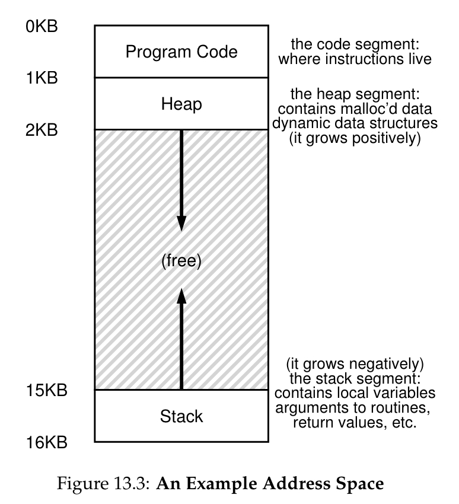

# Week 3 Notes

## Lecture 5: Scheduling

- What is scheduling?
  - An operating system often has choices about what to do next
  - In particular:
    - For a resource that can serve one client at a time
    - When there are multiple potential clients
    - Who gets to use the resource next?
    - And for how long?
  - Making those decisions is scheduling
- OS scheduling examples
  - What job to run next on an idle core?
    - How long should we let it run?
  - In what order to handle a set of block requests for a flash drive?
  - If multiple messages are to be sent over the network, in what order should they be sent?
  - We'll primarily consider scheduling processes
- How do we decide how to schedule?
  - Generally, we choose goals we wish to achieve
  - And design a scheduling algorithm that is likely to achieve those goals
  - Different scheduling algorithm try to optimize different quantities
  - So changing our scheduling algorithm can drastically change system behavior
- The process queue
  - The OS typically keeps a queue of processes that are ready to run
    - Ordered by whichever one should run next
    - Which depends on the scheduling algorithm used
  - When time comes to schedule a new process, grab the first one on the process queue
  - Processes that are not ready to run either:
    - Aren't in that queue
    - Or are at the end
    - Or are ignored by scheduler
- Potential scheduling goals
  - **Maximize throughput**: Get as much work done as possible
  - **Minimize average waiting time**: Try to avoid delaying too many for too long
  - **Ensure some degree of fairness**: Minimize worst case waiting time
  - **Meet explicitly priority goals**: Scheduled items tagged with a relative priority
  - **Real time scheduling**: Scheduled items tagged with a deadline to be met
- Different kinds of systems, different scheduling goals
  - How should we schedule our cores?
  - Time sharing
    - Fast response time to interactive programs
    - Each user gets an equal share of the CPU
  - Batch
    - Maximize total system throughput
    - Delays of individual processes are unimportant
  - Real-time
    - Critical operations must happen on time
    - Non-critical operations may not happen at all
  - Service Level Agreement (SLA)
    - To share resources between multiple customers
    - Make sure all agreements are met
    - Various agreements may differ in details
- Scheduling: Policy and mechanism
  - The scheduler will move jobs onto and off of a processor core (dispatching)
    - Requiring various mechanics to do so
    - Part of the scheduling mechanism
  - How dispatching is done should not depend on the policy used to decide who to dispatch
  - Desirable to separate the choice of who runs (policy) from the dispatching mechanism
    - Also desirable that OS process queue structure not be policy-dependent
- Preemptive vs. non-preemptive scheduling
  - When we schedule a piece of work, we could let it use the resource until it finishes
  - Or we could interrupt it part way through, allowing other pieces of work to run instead
  - **Non-preemptive**: If the scheduled work always runs to completion
    - Pros
      - Low scheduling overhead
      - Tends to produce high throughput
      - Conceptually very simple
    - Cons
      - Poor response time
      - Bugs can cause machine to freeze up if process contains infinite loop, e.g.
      - Poor fairness (by most definitions)
      - May make real time and priority scheduling difficult
  - **Preemptive**: If the scheduler temporarily halts running work to run something else
    - Pros
      - Can give good response time
      - Can produce very fair usage
      - Good for real-time and priority scheduling
    - Cons
      - More complex
      - Requires ability to cleanly halt process and save its state
      - May not get good throughput
      - Possibly higher overhead
- Scheduling the CPU
  - New process > ready queue > dispatcher > context switcher > CPU > might yield back to ready queue (or preemption) OR resource request to resource manager
- Scheduling and performance
  - How you schedule important system activities has a major effect on performance
  - Performance has different aspects, you may not be able to optimize for all of them
  - Scheduling performance has very different characteristic under light vs. heavy load
  - Important to understand the performance basics regarding scheduling
- General comments on performance
  - Performance goals should be quantitative nad measurable
    - If we want "goodness" we must be able to quantify it
    - You cannot optimize what you do not measure
  - **Metrics**: The way and units in which we measure
    - Choose a characteristic to be measured: It must correlate well with goodness/badness of service
    - Find a unit to quantify that characteristic: It must be a unit that can actually be measured
    - Define a process for measuring the characteristic
- How should we quantify scheduler performance?
  - Candidate metric: **Throughput** (processes/second)
    - But different processes need different run times
    - Process completion time not controlled by scheduler
  - Candidate metric: **Delay** (milliseconds)
    - But specifically what delays should we measure?
      - Time to finish a job (turnaround time)?
      - Time to get some response?
    - Some delays are not the scheduler's fault
      - Time to complete a service request
      - Time to wait for a busy resource
  - Software can't optimize what it doesn't control
- Why don't we achieve ideal throughput?
  - Scheduling isn't free
    - It takes time to dispatch a process (overhead)
    - More dispatches means more overhead (lost time)
    - Less time (per second) is available to run processes
  - How to minimize the performance gap
    - Reduce the overhead per dispatch
    - Minimize the number of dispatches (per second)
  - This phenomenon is seen in many areas besides process scheduling
- Why does response time explode?
  - Real systems have finite limits such as queue size
  - When limits exceeded, requests are typically dropped
    - Which is an infinite response time, for them
    - There may be automatic retries (e.g., TCP), but they could be dropped, too
  - If load arrives a lot faster than it is services, lots of stuff gets dropped
  - Unless you're careful, overheads explode during periods of heavy load
- Graceful degradation
  - When is a system "overloaded"?
    - When it is no longer able to meet its service goals
  - What can we do when overloaded?
    - Continue service, but with degraded performance
    - Maintain performance by rejecting work
    - Resume normal service when load drops to normal
  - What should we not do when overloaded?
    - Allow throughput to drop to zero (i.e., stop doing work)
    - Allow response time to grow without limit
- Non-preemptive scheduling
  - Scheduled process runs until it yields CPU
  - Works well for simple systems
    - Small numbers of processes
    - With natural producer consumer relationships
  - Good for maximizing throughput
  - Depends on each process to voluntarily yield
    - A piggy process can starve others
    - A buggy process can lock up the entire system
- Non-preemptive scheduling algorithms
  - First come first served
    - The simplest of all scheduling algorithms
    - Run first process on ready queue until it completes or yields
    - Then run next process on queue until it completes or yields
    - Highly variable delays, depends on process implementations
    - All processes will eventually be served
    - When does it work well?
      - It may deliver very poor response time
      - Thus it makes the most sense:
        - When response time is not important (e.g., batch)
        - Where minimizing overhead is more important than any single job's completion time (e.g., expensive HW)
        - In embedded (e.g., telephone or set-top box) systems
          - Where computations are brief
          - And/or exist in natural producer/consumer relationships
  - Shortest job next
  - Real time schedulers
    - For certain systems, some things must happen at particular times
      - E.g., industrial control systems
      - If you don't stamp the widget before the conveyer belt moves on, you have a worthless widget
    - These systems must schedule on the basis of real-time deadlines
    - Can be either hard or soft
    - Hard real time schedulers
      - The system absolutely must meet its deadlines
      - By definition, unmet deadline = system failure
        - E.g., controlling a nuclear power plant...
      - How can we ensure no missed deadlines?
      - Typically by very, very careful analysis
        - Make sure no possible schedule causes a deadline to be missed
        - By working it out ahead of time
        - Then scheduler rigorously enforces deadlines
      - Ensuring hard deadlines
        - Must have deep understanding of the code used in each job
          - You know exactly how long it will take
        - Vital to avoid non-deterministic timings
          - Even if the non-deterministic mechanism usually speeds things up
          - You're screwed if it ever slows them down
        - Typically means you do things like turn off interrupts
        - And scheduler is non-preemptive
        - Typically you set up a pre-defined schedule
          - No run time decisions
    - Soft real time schedulers
      - Highly desirable to meet your deadlines
      - But some (or any) of them can occasionally be missed
      - Goal of scheduler is to avoid missing deadlines with the understanding that you miss a few
      - May have different classes of deadlines, some "harder" than others
      - Need not require quite as much analysis
      - Soft real time schedulers and non-preemption
        - Not as vital that tasks run to completion to meet their deadline
          - Also not as predictable, since you probably did less careful analysis
        - In particular, a new task with an earlier deadline might arrive
        - If you don't pre-empt, you might not be able to meet that deadline
      - What if you don't meet a deadline?
        - Depends on the particular type of system
        - Might just drop the job whose deadline you missed
        - Might allow system to fall behind
        - Might drop some other job in the future
        - At any rate, it will be well defined in each particular system
      - What algorithms do you use?
        - Most common is Earliest Deadline First
        - Each job has a deadline associated with it based on a common clock
        - Keep the job queue sorted by those deadlines
        - Whenever one job completes, pick the first one off the queue
        - Prune the queue to remove missed deadlines
        - Goal: Minimize total lateness
- Preemptive scheduling
  - Again in the context of CPU scheduling
  - A thread or process is chose to run
  - It runs until either it yields
  - Or the OS decides to interrupt it
  - At which point some other process/thread runs
  - Typically, the interrupted process/thread is restarted later
- Implications of forcing preemption
  - A process can be forced to yield at any time if a more important process becomes ready, perhaps as a result of an I/O completion interrupt
  - If running process's importance is lowered, perhaps as a result of having run for too long, interrupted process might not be in a "clean" state
    - Which could complicate saving and restoring its state
    - Enables enforced "fair share" scheduling
    - Introduces gratuitous context switches
      - Not required by the dynamics of processes
    - Creates potential resource sharing problem
- Implementing preemption
  - Need a way to get control away from process
    - E.g., process makes a sys call or clock interrupt
  - Consult scheduler before returning to process
    - Has any ready process had its priority raised?
    - Has any process been awakened?
    - Has current process had its priority lowered?
  - Scheduler finds highest priority ready process
    - If current process, return as usual
    - If not, yield on behalf of current process and switch to higher priority process
- Clock interrupts
  - Modern processors contain a clock
  - A peripheral device with limited powers
  - Can generate an interrupt at a fixed time interval
  - Which temporarily halts any running process
  - Good way to ensure that a runaway process doesn't keep control forever
  - Key technology for preemptive scheduling
- Round robin scheduling algorithm
  - Goal: Fair share scheduling
    - All processes offered equal shares of CPU
    - All processes experience similar queue delays
  - All processes are assigned a nominal time slice
    - Usually the same sized slice for all
  - Each process is scheduled in turn
    - Runs until it blocks or its time slice expires
    - Then put at the end of the process queue
  - Then the next process is run
  - Eventually, each process reaches front of queue
  - Properties
    - All processes get relatively quick chance to do some computation
      - At the cost of not finishing any process as quickly
      - A big win for interactive processes
    - Far more context switches, which can be expensive
    - Runaway processes do relatively little harm
      - Only take 1/nth of the overall cycles
    - Round robin and I/O interrupts
      - Processes get halted by round robin scheduling if their time slice expires
      - If they block for I/O (or anything else) on their own, the scheduler doesn't halt them, they "halt themselves"
      - Thus, some percentage of the time round robin acts no differently than FIFO
        - When I/O occurs in a process and it blocks
    - Choosing a time slice
      - Performance of a preemptive scheduler depends heavily on how long the time slice is
      - Long time slices avoid too many context switches, which waste cycles
        - So better throughput and utilization
      - Short time slices provide better response time to processes
      - How to balance?
    - Costs of a context switch
      - Entering the OS
        - Taking interrupt, saving registers, calling scheduler
      - Cycles to choose who to run
        - The scheduler/dispatcher does work to choose
      - Moving OS context to the new process
        - Switch stack, non-resident process description
      - Switching process address spaces
        - Map-out old process, map-in new process
      - Losing instruction and data caches -> probably the most important cost nowadays
        - Greatly slowing down the next hundred instructions
- Comparing Round Robin to FIFO
  - Context switches; 27 vs. 5 for FIFO
    - Clearly more expensive
  - First job completed: 475 msec vs. 350 for FIFO
    - Can take longer to complete first process
  - Average waiting time: 100 msec vs. 595 for FIFO
    - For first opportunity to compute
    - Clearly more responsive
- Priority scheduling algorithm
  - Sometimes processes aren't all equally important
  - We might want to preferentially run the more important processes first
  - How would our scheduling algorithm work then?
  - Assign each job a priority number
  - Run according to priority number
- Priority and preemption
  - If non-preemptive, priority scheduling is just about ordering processes
  - Much like shortest job first, but ordered by priority instead
  - But what if scheduling is preemptive?
  - In that case, when new process is created, it might preempt running process if its priority is higher
- Problems with priority scheduling
  - Possible starvation
  - Can a low priority process ever run? If not, is that really the effect we wanted?
  - May make more sense to adjust priorities
    - Processes that have run for a long time have priority temporarily lowered
    - Processes that have not been able to run have priority temporarily raised
- Multi-level feedback queue (MLFQ) scheduling
  - One time slice length may not fit all processes
  - Create multiple ready queues
    - Short quantum (foreground) tasks that finish quickly
      - Short but high priority time slices
      - To optimize response time
    - Long quantum (background) tasks that run longer
      - Longer but low priority time slices
      - To minimize overhead
  - Round robin within a queue
- How do I know what queue to put new processes into?
  - If it's in the wrong queue, its scheduling disciple causes it problems
  - Start all processes in short quantum (high priority) queue
    - Give it a standard allocation of CPU
    - Every time it runs, reduce its allocation
    - Move to longer quantum (lower priority) queue after it uses its allocation
  - Periodically move all processes to a higher priority queue to avoid starvation
- What benefits do we expect from MLFQ?
  - Acceptable response time for interactive jobs
    - Or other jobs with regular external inputs
    - It won't be too long before they're scheduled
    - But they won't waste CPU running for a long time
  - Efficient but fair CPU use for non-interactive jobs
    - They run for a long time slice without interruption
    - If they're starved, eventually they get a priority boost
  - Dynamic and automatic adjustment of scheduling based on actual behavior of jobs
  - OS runs important background (?) tasks when there's nothing to do (?)
    - Most of the time OS has nothing to do
- Conclusion
  - Operating systems often have choices about what to do next
  - Scheduling is a general term for a method of choosing what to do next
  - Scheduling can be preemptive or non-preemptive
  - Different scheduling algorithms optimize different performance metrics

## 7. [Scheduling: Introduction](https://pages.cs.wisc.edu/~remzi/OSTEP/cpu-sched.pdf)

- Workload assumptions
  - **Workload**: The processes running in the system
  - **Fully-operational scheduling discipline**: Making assumptions about the workload that are unrealistic > relax them > develop them into this
  - **Jobs**: Aka processes
  - Each job runs for the same amount of time
  - All jobs arrive at the same time
  - Once started, each job runs to completion
  - All jobs only use the CPU (i.e., they perform no I/O)
  - The run-time of each job is known
- Scheduling metrics
  - **Turnaround time**: The time at which the job completes minus the time at which the job arrived in the system
    - Also a performance metric
    - T_turnaround = T_completion - T_arrival
    - T_arrival = 0 (because assumption) > T_arrival = T_completion
  - **Fairness**: Measured by Jain's Fairness Index
  - Performance and fairness is inversely related
- First in, first out (FIFO)
  - First come, first served (FCFS)
  - Simple, easy to implement, works pretty well (with assumptions)
  - **Convoy effect**: A number of relatively-short potential consumers of a resource get queued behind a heavyweight resource consumer
  - Relax assumption 1
- Shortest job first (SJF)
  - **Non-preemptive schedulers**: Run each job to completion before considering whether to run a new job
  - Virtually all modern schedulers are preemptive
  - **Scheduler can perform a context switch**: Stopping one running process temporarily and resuming (or starting) another
  - This is a non-preemptive scheduler
  - Relax assumption 2
- Shortest time-to-completion first (STCF)
  - Relax assumption 3
  - When B and C arrive, it can preempt ob A and decide to run another job, perhaps continuing A later
  - SJF + preemption
  - Preemptive shortest job first (PSJF)
  - Any time a new job enters the system, the scheduler determines which of the remaining jobs (including the new job) has the least time left, and schedules that one
- A new metric: Response time
  - **Response time**: Rhe time from when the job arrives in a system to the first time it is scheduled
  - T_response = T_firstrun - T_arrival
  - STCF and related disciplines are good for turnaround time, but not really for response time
- Round Robin (RR)
  - Instead of running jobs to completion, RR runs a job for a time slice / scheduling quantum and then switches to the next job in the run queue
  - Repeatedly does this until jobs are finished
  - Sometimes called time-slicing
  - The length of a time slice must be a multiple of the timer-interrupt period
  - The shorter the length of the time slice, the better the performance of RR under the response-time metric
  - But if the time slice is too short, the cost of context switching will dominate overall performance
  - Amortization
- Incorporating I/O
  - Relax assumption 4
  - Overlap: The CPU is ued by one process while waiting for the I/O of another process to complete (utilizes the system better)
  - Treat each CPU burst as a job, the scheduler then makes sure processes that are "interactive" get run frequently
- No more oracle
  - Last assumption worst assumption to make
- Summary of schedulers
  - **SJF, STCF**: Optimizes turnaround time, bad for response time
  - **RR**: Optimizes response time, bad for turnaround

## 8. [Scheduling: The Multi-Level Feedback Queue](http://pages.cs.wisc.edu/~remzi/OSTEP/cpu-sched-mlfq.pdf)

- Introduction
  - MLFQ address two fundamental problems:
    - It would like to optimize turnaround time
    - It would like to make a system feel responsive to interactive users and thus minimize response time
  - In essence, it learns from the pat to predict the future
- MLFQ: Basic rules
  - Has a number of distinct queues, each assigned a different priority level
  - At any given time, a job that is ready to run is on a single queue
  - Uses priorities to decide which job should run at a given time: A job with higher priority is chosen to run
  - If jobs have the same priority, use the RR scheduling among those jobs
  - Rule 1: If Priority(A) > Priority(B), A runs (B doesn't)
  - Rule 2: If Priority(A) = Priority(B), A & B run in RR
  - Varies the priority of a job based on its observed behavior
- Attempt #1: How to change priority
  - **Allotment**: The amount of time a job can spend at a given priority level before the scheduler reduces its priority
  - First attempt at a priority-adjustment algorithm:
    - Rule 3: When a job enters the system, it is placed at the highest priority (the topmost queue)
    - Rule 4a: If a job uses up its allotment while running, its priority is reduced (i.e., it moves down one queue)
    - Rule 4b: If a job gives up the CPU (for example, by performing an I/O operation) before the allotment is up, it stays at the same priority level (i.e., its allotment is reset)
  - Problems:
    - **Starvation**: If there are "too many" Interactive jobs in the system, they will combine to consume all CPU time, and thus long-running jobs will never receive any CPU time (they starve)
    - **Game the scheduler**: Before the allotment is used, issue an I/O operation and thus relinquish the CPU; doing so allows you to remain in the same queue, and thus gain a higher percentage of CPU time
    - A program may change its behavior over time
  - Attempt #2: The priority boost
    - Periodically boost the priority of all the jobs in the system
    - Rule 5: After some time period S, move all the jobs in the system to the topmost queue
      - Processes are guaranteed not to starve
      - If a CPU-bound job has become interactive, the scheduler treats it properly once it has received the priority boost
    - **Voo-doo constants**: Constants that seem to require some form of black magic to set them correctly
      - If S is set to high, long-running jobs could starve
      - Too low, and interactive jobs may not get a proper share of the CPU
      - **Ousterhout's Law**: Avoid voo-doo constants
- Attempt #3: Better accounting
  - To prevent gaming of our scheduler, perform better accounting of CPU time at each level of the MLFQ
  - Instead of forgetting how much of its allotment a process used at a given level when it performs I/O, the scheduler should keep track
  - Once a process has used its allotment, it's demoted to the next priority queue
  - Rule 4a and 4b > Rule 4: Once a job uses up its time allotment at a given level (regardless of how many times it has given up the CPU), its priority is reduced (i.e., it moves down one queue)
- Tuning MLFQ and other issues
  - High-priority queues are usually given short time slices
  - Low-priority queues contain long-running jobs that are CPU-bound, longer time slices work well
  - Advice: Users/administrators provide some hints to the OS
- MLFQ: Summary
  - If Priority(A) > Priority(B), A runs (B doesn't)
  - If Priority(A) = Priority(B), A & B run in RR fashion using the time slice (quantum length) of the given queue
  - When a job enters the system, it is placed at the highest priority (the topmost queue)
  - Once a job uses up its time allotment at a given level (regardless of how many times it has given up the CPU), its priority is reduced (i.e., it moves down one queue)
  - After some time period S, move all the jobs in the system to the topmost queue

## [Real-Time Scheduling](https://lasr.cs.ucla.edu/reiher/cs111/realtime.html)

- Introduction
  - Priority scheduling is inherently a best effort approach
  - If our task is competing with priority tasks, it may not get as much time as it requires
- What are real-time systems
  - A real-time system is one whose correctness depends on timing as well as functionality
  - Traditional scheduling algorithm metrics
    - Turnaround time (throughput)
    - Fairness
    - Mean response time
  - Real-time system metrics
    - **Timeliness**: How closely does it meet its timing requirements (e.g. ms/day of accumulated tardiness)
    - **Predictability**: How much deviation is there in delivered timeliness
    - **Feasibility**: Whether or not it's possible to meet the requirements for a particular task set
    - **Hard real-time**: There are strong requirements that specified tasks be run a specified intervals (or within a specified response time)
      - Failure to meet this requirement (perhaps by as little as a fraction of a micro-second) may result in system failure
    - **Soft real-time**: We may want to provide very good (e.g. microseconds) response time, the only consequences of missing a deadline are degraded performance or recoverable failures
  - Real-time scheduling characteristics that make scheduling easier:
    - We may actually know how long each task will take to run
    - Starvation (of low priority tasks) may be acceptable
    - The workload may be relatively fixed
- Real-time scheduling algorithms
  - In the simplest real-time systems, where the tasks and their execution times are all known, there might not even be a scheduler
  - In more complex real-time system, with a larger (but still fixed) number of tasks that do not function in a strictly pipeline fashion, it may be possible to static scheduling
  - Dynamic scheduling algorithms
    - How they choose the next (ready) task to run
      - Shortest job first
      - Static priority: Highest priority ready task
      - Soonest start-time deadline first (ASAP)
      - Soonest completion-time deadline first (slack time)
    - How they handle overload (infeasible requirements)
      - Best effort
      - **Periodicity adjustments**: Run lower priority tasks less often
      - **Work shedding**: Stop running lower priority tasks entirely
  - **Preemption**: Means of improving mean response time by breaking up the execution of long-running, compute-intensive tasks
    - Prevents a buggy (infinite loop) program from taking over the CPU
    - The trade-off between improved response time and increased overhead (for the added context switches) almost always favors preemptive scheduling
      - May not be true for real-time systems
        - Preempting a running task will almost surely cause it to miss its completion deadline
        - Since we so often know what the expected execution time for a task will be, we can schedule accordingly and should have little need for preemption
        - Embedded and real-time systems run fewer and simpler tasks than general purpose time systems, and the code is often much better tested, so infinite loop bugs are extremely rare

## Lecture 6: Memory Management

- Memory management
  - Memory is one of the key assets used in computing
  - In particular, memory abstractions that are usable from a running program
    - Which, in modern machines, typically means RAM
  - We have a limited amount of it
  - Lots of processes need to use it
  - How do we manage it?
- Memory management goals
  - Transparency
    - Process sees only its own address space
    - Process is unaware memory is being shared
  - Efficiency
    - High effective memory utilization
    - Low run-time cost for allocation/relocation
  - Protection and isolation
    - Private data will not be corrupted
    - Private data cannot be seen by other processes
- Physical memory allocation
  - Physical memory is divided between the OS kernel, process private data, and shared code segments
- Physical and virtual addresses
  - A RAM cell has a particular physical address
    - Essentially a location on a memory chip
  - Decades ago, that address was used by processes to name memory locations
  - Now processes use virtual addresses
    - Which are not locations on a memory chip
    - And usually aren't the same as the actual physical addresses
  - More flexibility in memory management, but requires virtual to physical translation
- Aspects of the memory management problem
  - Most processes can't perfectly predict how much memory they will use
  - The processes expect to find their existing data when they need it where they left it
  - The entire amount of data required by all processes may exceed amount of available physical memory
  - Switching between processes must be fast
    - Can't afford much delay for copying data
  - The cost of memory management itself must not be too high
- Memory management strategies
  - Fixed partition allocations
    - Pre-allocate partitions for n processes
      - One or more per process
      - Usable only by owning process
      - Reserving space for largest possible process
    - Partitions come in one or a few set sizes
    - Very easy to implement
      - Common in old batch processing systems
      - Allocation/deallocation very cheap and easy
    - Well suited to well-known job mix
    - Memory protection and fixed partitions
      - Need to enforce partition boundaries to prevent one process from accessing another's memory
      - Could use hardware for this purpose
        - Special registers that contain the partition boundaries
        - Only accept addresses within the register values
      - Basic scheme doesn't use virtual addresses
    - Problems
      - Presumes you know how much memory will be used ahead of time
      - Limits the number of processes supported to the total of their memory requirements
      - Not great for sharing memory
      - Fragmentation causes inefficient memory use
    - Fragmentation
      - A problem for all memory management systems
        - Fixed partitions suffer it especially badly
      - Causes unallocated memory to be unusable
      - Because of inefficiencies in memory allocation
      - With too much fragmentation you can't provide memory for as many processes as you theoretically could
      - Example
        - Three processes A, B, C with memory requirements 6mb, 3mb, 2mb
        - Available partition sizes: 8mb, 4mb, 4mb
        - Total waste: 2mb + 1mb + 2mb = 5mb / 16mb = 31%
      - Comes in two kinds:
        - Internal
          - Wasted space inside fixed sized blocks
            - The requester was given more than he needed
            - The unused part is wasted and can't be used for others
          - Can occur whenever you force allocation in fixed-sized chunks
          - Caused by a mismatch between the chosen size of a fixed-sized block and the actual sizes that processes use
          - Average waste: 50% of each block
        - External
    - Summary
      - Very simple
      - Inflexible
      - Subject to a lot of internal fragmentation
      - Not used in many modern systems
        - But a possible option for special purpose systems, like embedded systems
        - Where we know exactly what our memory needs will be
  - Dynamic partitions
    - Like fixed partitions, except variable sized, usually almost any size requested
    - Each partition has contiguous addresses
    - Processes have access permissions for the partitions
    - Potentially shared between processes
    - Each process could have multiple partitions with different sizes and characteristics
    - In basic scheme, still only physical addresses
    - Problems
      - Not relocatable
        - Once a process has a partition, you can't easily move its contents elsewhere
      - Not easily expandable
      - Impossible to support applications with larger address spaces than physical memory
        - Also can't support several applications whose total needs are greater than physical memory
      - Also subject to fragmentation of a different kind
    - Relocation and expansion
      - Partitions are tied to particular address ranges at least during an execution
      - Can't just move the contents of a partition to another set of addresses
        - All the pointers in the contents will be wrong
        - And generally you don't know which memory locations contain pointers
      - Hard to expand because there may not be space "nearby"
    - Illustrating the expansion problem
      - Process B is between Process A and C and Process B wants to expand its partition size
      - If it does that, Process B steps on Process C's memory
      - We can't move C's partition out of the way and we can't move B's partition to a free area
      - We're stuck and must deny an expansion request that we have enough memory to handle
    - How to keep track of variable sized partitions?
      - Start with one large "heap" of memory
      - Maintain a free list
        - Systems data structure to keep track of pieces of unallocated memory
      - When a process requests more memory:
        - Find a large enough chunk of memory
        - Carve off a piece of the requested size
        - Put the remainder back on the free list
      - When a process frees memory
        - Put freed memory back on the free list
    - Managing the free list
      - Fixed sized blocks are easy to track
        - A bit map indicating which blocks are free
      - Variable chunks require more information
        - A linked list of descriptors, one per chunk
        - Each descriptor lists the size of the chunk and whether it's free
        - Each has a pointer to the next chunk on list
        - Descriptors often kept at front of each chunk
      - Allocated memory may have descriptors too
    - Free chunk carving
      - Find a large enough free chunk
      - Reduce its length to requested size
      - Create a new header for residual chunk
      - Insert the new chunk into the list
      - Mark the carved piece as in use
    - Variable partitions and fragmentation
      - Variable sized partitions not as subject to internal fragmentation
        - Unless requester asked for more than he will use, which is actually pretty common
        - But at least the memory manager gave him no more than he requested
      - Unlike fixed sized partitions, though, subject to another kind of fragmentation (external)
    - External fragmentation
      - We gradually build up small, unusable memory chunks scattered through memory
      - Causes and effects
        - Each allocation creates leftover free chunks and over time they become smaller and smaller
        - The small leftover fragments are useless
          - They're too small to satisfy any request
          - A second form of fragmentation waste
        - Solutions:
          - Try not to create tiny fragments
          - Try to recombine fragments into big chunks
    - How to avoid creating small fragments?
      - Be smart about which free chunk of memory you use to satisfy a request
      - But being smart costs times
      - Some algorithm choices:
        - Best fit
          - Search for the "best fit" chunk: Smallest size greater than or equal to requested size
          - Advantages: Might find a perfect fit
          - Disadvantages:
            - Have to search the entire list every time
            - Quickly creates very small fragments
        - Worst fit
          - Search for the "worst fit" chunk: Largest size greater than or equal to requested size
          - Advantages: Tends to create very large fragments... for a while, at least
          - Disadvantages: Still have to search the entire list every time
        - First fit
          - Take the first chunk you find that is big enough
          - Advantages:
            - Very short searches
            - Creates random sized fragments
          - Disadvantages:
            - The first chunks quickly fragment
            - Searches become longer
            - Ultimately it fragments as badly as best fit
        - Next fit
          - After each search, set guess pointer to chunk after the one we chose
          - That is the point at which we will begin our next search
          - Tries to get advantages of both first and worst fit
            - Short searches (maybe shorter than first fit)
            - Spreads out fragmentation (like worst fit)
          - Guess pointers are a general technique
            - If they're right, they save a lot of time
            - If they're wrong, the algorithm still works
            - They can be used in a wide range of problems
      - Coalescing partitions
        - All variable sized partition allocation algorithms have external fragmentation
          - Some get it faster, some spread it out
        - We need a way to reassemble fragments
          - Check neighbors whenever a chunk is freed
          - Recombine free neighbors whenever possible
          - Free list can be designed to make this easier
            - Order list by chunk address so neighbors are close
        - Counters forces of external fragmentation
      - Fragmentation and coalescing
        - Opposing processes that operate in parallel
          - Which of the two processes will dominate?
        - What fraction of space is typically allocated?
          - Coalescing works better with more free space
        - How fast is allocated memory turned over?
          - Chunks held for a long time cannot be coalesced
        - How variable are requested chunk sizes?
          - High variability increases fragmentation rate
        - How long will the program execute?
          - Fragmentation, like rust, gets worse with time
      - Variable sized partition summary
        - Eliminates internal fragmentation
          - Each chunk is custom-made for requestor
        - Implementation is more expensive
          - Long searches of complex free lists
          - Carving and coalescing
        - External fragmentation is inevitable
          - Coalescing can counteract the fragmentation
        - Must we choose the lesser of two evils?
      - Why aren't memory request sizes randomly distributed?
        - In real systems, some sizes are requested much more often than others
        - Many key services use fixed-size buffers
          - File systems (for disk I/O)
          - Network protocols (for packet assembly)
          - Standard request descriptors
        - These account for much transient use
          - They are continuously allocated and freed
        - OS might want to handle them specially
      - Buffer pools
        - If there are popular sizes, reserve special pools of fixed size buffers and satisfy matching requests from those pools
        - Benefits: Improved efficiency
          - Much simpler than variable partition allocation
            - Eliminates searching, carving, coalescing
          - Reduces (or eliminates external fragmentation)
        - But we must know how to reserve
          - Too little and the buffer pool doesn't help much
          - Too much and we will have a lot of unused buffer space
        - Only satisfy perfectly matching requests
          - Otherwise, back to internal fragmentation
      - How are buffer pools used?
        - Process requests a piece of memory for a special purpose (e.g., to send a message)
        - System supplies one element from buffer pool
        - Process uses it, completes, frees memory
          - Maybe explicitly
          - Maybe implicitly, based on how such buffers are used
            - E.g., sending the message will free the buffer "behind the process' back" once the message is gone
      - How big should the buffer pool be?
        - Resize it automatically and dynamically
        - If we run low on fixed sized buffers, get more memory from the free list and carve it up into more fixed sized buffers
        - If our free buffer list gets too large return some buffers to the free list
        - If the free list gets dangerously low ask each major service with a buffer pool to return space
        - This can be turned by a few parameters:
          - Low space (need more) threshold
          - High space (have too much) threshold
          - Nominal allocation (what we free down to)
        - Resulting system is highly adaptive to changing loads
      - Lost memory
        - One problem with buffer pools: Memory leaks
          - The process is done with the buffer but doesn't free it
        - Also a problem when a process manages its own memory space
          - E.g., it allocates a big area and maintains its own free list
        - Long running processes with memory leaks can waste huge amounts of memory
      - Garbage collection
        - One solution to memory leaks
        - Don't count on processes to release memory
        - Monitor how much free memory we've got
        - When we run low, start garbage collection
          - Search data space finding every object pointer
          - Note address/size of all accessible objects
          - Compute the complement (what is inaccessible)
          - Add all inaccessible memory to the free list
      - How do we find all accessible memory?
        - Object oriented languages often enable this
          - All object references are tagged
          - All object descriptors include size information
        - It is often possible for system resources where all possible references are known (e.g., we know who has which files open)
      - General garbage collection
        - Find all the pointers in allocated memory
        - Determine "how much" each points to
        - Determine what is and is not still pointed to
        - Free what isn't pointed to
        - Problems
          - A location in the data or stack segments might seem to contain addresses, but
            - Are they truly pointers or might they be other data types whose values happen to resemble addresses?
            - If pointers, are they themselves still accessible?
            - We might be able to infer this (recursively) for pointers in dynamically allocated structures
            - But what about pointers in statically allocated (potentially global) areas?
          - And how much is "pointed to," one word or a million?
      - Compaction and relocation
        - Garbage collection is just another way to free memory, doesn't greatly help or hurt fragmentation
      - Ongoing activity can starve coalescing
        - Chunks reallocated before neighbors become free
      - We could stop accepting new allocations but processes needing more memory would block until some is freed, slowing the system
      - We need a way to rearrange active memory
        - Re-pack all processes in one end of memory
        - Create one big chunk of free space at other end
  - Relocation
    - The ability to move a process' data from the region where it was initially loaded into a new and different region of memory
    - What's so hard about that?
    - All addresses in the program will be wrong
      - References in the code segment
        - Calls and branches to other parts of the code
        - References to variables in the data segment
      - Plus new pointers created during execution that point into data and stack segments
    - The relocation problem
      - It is not generally feasible to relocate a process
        - Maybe we could relocate references to code if we kept the relocation information around
        - But how can we relocate references to data?
          - Pointer values may have been changed
          - New pointers may have been created
      - We could never find/fix all address references like the general case of garbage collection
      - Can we make processes location independent?
    - Memory segment relocation
      - A natural model
        - Process address space is made up of multiple segments
        - Use the segment as the unit of relocation
        - Long tradition, from the IBM system 360 to Intel x86 architecture
      - Computer has special relocation registers called segment base registers
        - Pointing to the start (in physical memory) of each segment
        - CPU automatically adds base register to every address
      - OS uses these to perform virtual address translation
        - Set base register to start of region where program is loaded
        - If program is moved, reset base registers to new location
        - Program works no matter where its segments are loaded
    - Relocation and safety
      - A relocation mechanism (like base registers) is good
        - It solves the relocation problem and enables us to move process segments in physical memory
        - But just relocation is insufficient
      - We also need protection to prevent processes from reaching outside its allocated memory (e.g., by overrunning the end of a mapped segment)
    - Segments also need a length (or limit) register
      - Specifies maximum legal offset (from start of segment)
      - Any address greater than this is illegal
      - CPU should report it via a segmentation exception (trap)
    - How much of our problem does relocation solve?
      - We can use variable sized partitions, cutting down on internal fragmentation
      - We can move partitions around which helps coalescing be more effective, but still requires contiguous chunks of data for segments, so external fragmentation is still a problem
    - We need to get rid of the requirement of contiguous segments
- Conclusion
  - RAM memory is a scarce resource that the OS must manage carefully
  - Fixed partition management is inflexible and causes internal fragmentation
  - Variable partition management is more complex and causes external fragmentation
  - Garbage collection and compaction help, but require ability to relocate partitions, which is hard

## 12. [A Dialogue on Memory Virtualization](http://pages.cs.wisc.edu/~remzi/OSTEP/dialogue-vm.pdf)

- Every address generated by a user program is a virtual address
- The OS provides the illusion that it has its own large and private memory for:
  - **Ease of use**: The OS will give each program the view that it has a large contiguous address space to put its code and data into
  - **Isolation and protection**: We don't want one errant program to be able to read or overwrite some other program's memory
- The proper OS response to errant process behavior is to kill the offending process

## 13. [The Abstraction: Address Spaces](http://pages.cs.wisc.edu/~remzi/OSTEP/vm-intro.pdf)

- Early systems
  - The OS was a set of routines (library) that sat in memory, and there would be one running program (a process) that currently sat in physical memory and used the rest of memory
- Multiprogramming and time sharing
  - **Multiprogramming**: Multiple processes are ready to run at a given time and the OS would switch between them, such as when one decided to perform an I/O
  - One way to implement time sharing: Run one process for a short while, giving it full access to all memory > stop it > save all of its state to some kind of disk > load some other process's state > run it for a while
    - Too slow, particularly as memory grows
  - Leave processes in memory while switching between them, allowing the OS to implement time sharing efficiently
  - **Protection**: You don't want a process to be able to read or write some other process's memory
- The address space
  - **Address space**: An abstraction, the running program's view of memory in the system
    - Contains all of the memory state of the running program
    - **Code**: Instructions
    - **Stack**: Used by the program while it is running to keep track of where it is in the function call chain, allocate local variables, and pass parameters and return values to and from routines
    - **Heap**: Used for dynamically-allocated, user-managed memory
    - 
  - When process A tries to perform a load at address 0 (virtual address), the OS in tandem with some hardware support must somehow make sure the load doesn't actually go to physical address 0 but rather to physical address 320KB (where A is loaded into memory)
- Goals
  - **Transparency**: The OS should implement virtual memory in a way that is invisible to the running program
    - The program shouldn't be aware of the fact that memory is virtualized
    - The program behaves as if it has its own private physical memory
  - **Efficiency**: The OS should strive to make the virtualization as efficient as possible, both in terms of time and space
    - In implementing time-efficient virtualization, the OS will have to rely on hardware support, including hardware features such as TLBs
  - **Protection**: The OS should make sure to protect processes from one another as well as the OS itself from processes

## 14. [Interlude: Memory API](http://pages.cs.wisc.edu/~remzi/OSTEP/vm-api.pdf)

- Types of memory
  - **Stack memory** / **automatic memory**: Allocations and deallocations of it are managed implicitly by the compiler for you, the programmer
  - **Heap memory**: Allocations and deallocations are explicitly handled by you, the programmer
- The `malloc()` call

  - You pass it a size asking for some room on the heap, and it either succeeds and gives you back a pointer to the newly-allocated space, or fails and returns `null`

  ```
  #include <stdlib.h>
  ...
  void *malloc(size_t size);

  double *d = (double *) malloc(sizeof(double));
  malloc(strlen(s) + 1); // declaring space for a string
  ```

- The `free()` call

```
int *x = malloc(10 * sizeof(int));
...
free(x);
```

- Common errors
  - **Garbage collector**: Figures out what memory you no longer have references to and frees it for you
  - **Segmentation fault**: You did something wrong with memory
  - Errors
    - Forgetting to allocate memory
    - **Buffer overflow**: Not allocating enough memory
    - Forgetting to initialize allocated memory
      - Your program will eventually encounter an **uninitialized read**: Reads from the heap some data of unknown value
    - Forgetting to free memory
      - Leads to memory leak
    - **Dangling pointer**: Freeing memory before you're done with it
      - Can crash the program or overwrite valid memory
    - **Double free**: Freeing memory repeatedly
      - Result of doing so is undefined
      - Crashes are a common outcome
    - **Invalid frees**: Calling `free()` incorrectly
- Underlying OS support
  - `malloc()` and `free()` are library calls
  - `brk`: Used to change the location of the program's **break**: the location of the end of the heap
    - It takes one argument (the address of the new break) and either increases or decreases the size of the heap based on whether the new break is larger or smaller than the current break
  - `sbrk`: Passed an increment but otherwise serves a similar purpose
  - You should never directly call `brk` or `sbrk`
  - `mmap()`: Can obtain memory from the OS
    - Can create an anonymous memory region within your program that isn't associated with any particular file but rather with swap space
    - This memory can be treated like a heap and managed as such
- Other calls
  - `calloc()`: Allocates memory and also zeroes it before returning
    - This prevents some errors where you assume that memory is zeroed and forget to initialize it yourself
  - `realloc()`: Makes a new larger region of memory, copies the old region into it, and returns the pointer to the new region

## 15. [Mechanism: Address Translation](http://pages.cs.wisc.edu/~remzi/OSTEP/vm-mechanism.pdf)

- Introduction
  - **Limited Direct Execution (LDE)**: For the most part, let the program run directly on the hardware; however, at certain key points in time, arrange it so that the OS gets involved and makes sure the right thing happens
    - By interposing at those critical points in time, the OS ensures that it maintains control over the hardware
  - **Hardware-based address translation**: The hardware transforms each memory access, changing the virtual address provided by the instruction to a physical address where the desired information is actually located
    - Thus, on each and every memory reference, an address translating is performed by the hardware to redirect application memory references to their actual locations in memory
  - The OS must manage memory and keep track of which locations are free and which are in use to maintain control over how memory is used
- Assumptions
  - The user's address space must be placed contiguously in physical memory
  - The size of the address space is less than the size of physical memory
  - Each address space is exactly the same size
- Dynamic (hardware-based) relocation
  - Base and bounds / dynamic relocation
  - **Two hardware registers within each CPU**: Base register and bounds (limit register)
    - Allows us to place the address space anywhere we'd like in physical memory and do so while ensuring that the process can only access its own address space
  - Each program is written and compiled as if it's loaded at address zero, but when a program starts running, the OS decides where in physical memory it should be loaded and sets the base register to that value
  - When the process is running, when any memory reference is generated by the process, it's translated by the processor:
    - Physical address = virtual address + base
  - **Address translation**: Transforming a virtual address into a physical address
  - **Dynamic relocation**: Called this because this relocation of the address happens at runtime and because we can move address spaces even after the process has started running
  - The processor will first check that the memory reference is within bounds to make sure it's legal
  - **Memory Management Unit (MMU)**: The part of the processor that helps with address translation
  - **Bound registers**: Holds the size of the address space or the physical address of the end of the address space
  - In the early days before hardware support arose, some systems performed a crude form of relocation purely via software methods
    - **Static relocation**: A piece of software known as the loader takes an executable that is about to be run and rewrites its addresses to the desired offset in physical memory
    - Does not provide protection, as processes can generate bad addresses and thus illegally access other process's or even OS memory
    - Hardware support is likely needed for true protection
    - Once placed, it is difficult to later relocate an address space to another location
- Hardware support: A summary
  - A single bit, perhaps stored in some kind of processor status word, indicates which mode the CPU is currently running in
  - Very good summary, not noted but recommend reading
- Operating system issues
  - The OS must take action when a process is created, finding space for its address space in memory
  - The OS must do some work when a process is terminated, reclaiming all of its memory for use in other processes or the OS
    - Upon termination of a process, the OS puts its memory back on the free list and cleans up any associated data structures as need be
  - The OS must perform a few additional steps when a context switch occurs
    - The OS must save and restore the base-and-bounds pair when it switches between processes
    - When the OS decides to stop running a process, it must save the values of the base and bounds registers to memory, in some per-process structure such as the process structure or process control block (PCB)
    - When a process is stopped, it's possible for the OS to move an address space from one location in memory to another rather easily
      - Deschedule the process
      - Copy the address space from the current location to the new location
      - Update the saved base register (in the process structure) to the point to the new location
    - The OS must provide exception handlers or functions to be called
- Summary
  - **Internal fragmentation**: The type of waste that happens because the space inside the allocated unit is not all used

## 16. [Segmentation](http://pages.cs.wisc.edu/~remzi/OSTEP/vm-segmentation.pdf)

- Segmentation: Generalized base/bounds
  - **Segmentation**: Instead of having just one base and bounds pair in our MMU, why not have a base and bounds pair per logical segment of the address space?
  - **Segment**: A contiguous portion of the address space of a particular length
  - **Sparse address spaces**: Large address spaces with large amounts of unused address space
  - **Segmentation fault**: Arises from a memory access on a segmented machine to an illegal address
- Which segment are we referring to?
  - **Explicit**: Chop up the address space into segments based on the top few bits of the virtual address
  - If we have three segments (code, heap, stack), we need two bits
    - Segment: 13, 12
    - Offset: 11-0
    - Place virtual address according to this format
    - If the top two bits (segment) are 00, the hardware knows the virtual address is in the code segment, and thus uses the code base and bounds pair to relocate the address to the correct physical location
    - If the top two bits are 01, the hardware knows the address is in the heap, and thus uses the heap base and bounds
  - **Implicit**: The hardware determines the segment by noticing how the address was formed
    - If the address was generated from the program counter, then the address is within the code segment
    - If the address is based off of the stack or base pointer, it must be in the stack segment
    - Any other address must be in the heap
- What about the stack?
  - The hardware needs to know which way the segment grows
    - 1: Grows in positive direction
    - 0: Grows in negative direction
  - To obtain the correct negative offset, subtract the maximum segment size from the offset and add the resulting number to the base
  - The bounds check can be calculated by ensuring the absolute value of the negative offset is less than or equal to the segment's current size
- Support for sharing
  - To save memory, sometimes it's useful to share certain memory segments between address spaces
  - **Protection bits**: Indicate whether or not a program can read or write a segment or execute code that lies within the segment
  - Hardware also has to check whether a particular access is permissible
- Fine-grained vs. coarse-grained segmentation
  - **Coarse-grained**: Chops up the address space into relatively large, coarse chunks
    - Ex: Code, stack, heap
  - **Fine-grained**: Allows for address spaces to consist of a large number of smaller segments
- OS support
  - Issues for operating systems:
    - **Context switch**: The segment registers must be saved and restored
    - OS interaction when segments grow or shrink
    - **Managing free space in physical memory**: Each segment might be a different size
  - **External fragmentation**: Physical memory quickly becomes full of little holes of free space, making it difficult to allocate new segments or grow existing ones
    - One solution to this problem would be to compact physical memory by rearranging the existing segments
      - Expensive
      - Makes requests to grow existing segments hard to serve and may thus cause further rearrangement to accommodate such requests
    - Use a free-list management algorithm that tries to keep large extents of memory available for allocation
    - **Best-fit**: Keeps a list of free spaces and returns the one closest in size that satisfies the desired allocation to the requester
    - Worst-fit, first-fit, buddy algorithm

## 17. [Free-Space Management](https://pages.cs.wisc.edu/~remzi/OSTEP/vm-freespace.pdf)

- Assumptions
  - A basic interface such as that provided by `malloc()` and `free()`
  - We're primarily concerned with external fragmentation
  - Once memory is handed out to a client, it cannot be relocated to another location in memory
    - No compaction of free space is possible
  - The allocator manages a contiguous region of bytes
  - **Free list**: Generic data structure used to manage free space in the heap, contains references to all of the free chunks of space in the managed region of memory
  - **Internal fragmentation**: Any unasked for (and thus unused) space in a chunk handed out that's bigger than requested
- Low-level mechanisms
  - Splitting and coalescing
    - **Splitting**: The allocator will find a free chunk of memory that can satisfy the request and split it into two
      - Commonly used in allocators when requests are smaller than the size of any particular free chunk
      - The first chunk will be returned to the caller
      - The second chunk will remain on the list
    - **Coalescing**: When returning a free chunk in memory, look carefully at the address of the chunk you're returning as well as the nearby chunks of free space; if the newly-freed space sits right next to one (or two) existing free chunks, merge them into a single larger free chunk
  - Tracking the size of allocated regions
    - Most allocators store a little bit of extra information in a header block which is kept in memory, usually just before the handed-out chunk of memory
    - The header minimally contains the size of the allocated region
      - It may also contain additional pointers to speed up deallocation, a magic number to provide additional integrity checking, and other information
    - The size of the free region is the size of the header plus the size of the space allocated to the user
    - Thus, when a user requests n bytes of memory, the library searches for a free chunk of size n + the size of the header
  - Embedding a free list
    - Build a list inside the free space itself
    - Initialize the list with one entry of size X (X-byte chunk of memory) (minus the header size)
    - If a chunk of memory is requested, the library will find a chunk that is large enough to accommodate the request, and because there's only one chunk the X-size chunk will be chosen and split into two
      - One chunk big enough to service the request (and header) and the remaining free chunk
  - Growing the heap
    - If the heap runs out of space, the simplest approach is just to fail
      - In some cases this is the only option, and thus returning NULL is an honorable approach
    - Most traditional allocators start with a small-sized heap and then request more memory from the OS when they run out
    - To service the `sbrk` request, the OS finds free physical pages, maps them into the address space of the requesting process, and then returns the value of the end of the new heap
- Basic strategies
  - The ideal allocator is both fast and minimizes fragmentation
  - Best fit
    - Search through the free list and find chunks of free memory that are as big or bigger than the request size
    - Return the one that is the smallest in that group of candidates (best-fit chunk / smallest fit)
    - Tries to reduce wasted space
    - Pays a heavy performance penalty when performing an exhaustive search for the correct free block
  - Worst fit
    - Find the largest chunk and return the requested amount
    - Keep the remaining (large) chunk on the free list
    - Tries to leave big chunks free instead of lots of small chunks
    - Can be costly, performs badly, leading to excess fragmentation while still having high overheads
  - First fit
    - Finds the first block that is big enough and returns the requested amount fo the user
    - Fast but sometimes pollutes the beginning of the free list with small objects
    - **Address-based ordering**: By keeping the list ordered by the address of the free space, coalescing becomes easier and fragmentation tends to be reduced
  - Next fit
    - Keeps an extra pointer to the location within the list where one was looking last
    - Spread the searches for free space throughout the list more uniformly, thus avoiding splintering of the beginning of the list
- Other approaches
  - Segregated lists
    - If a particular application has one (or a few) popular-sized request that it makes, keep a separate list just to manage objects of that size
    - All other requests are forwarded to a more general memory allocator
    - Fragmentation is much less of a concern
    - Allocation and free requests can be served quite quickly when they're of the right size, as no complicated search of a list is required
    - How much memory should one dedicate to the pool of memory that serves specialized requests of a given size, as opposed to the general pool?
    - Slab allocator handles issue nicely (not noted)
  - Buddy allocation
    - When a request for memory is made, the search for free space recursively divides free space by two until a block that is big enough to accommodate the request is found (and a further split into two would result in a space that's too small)

## [Garbage Collection](http://htmlpreview.github.io/?https://github.com/markkampe/Operating-Systems-Reading/blob/master/gc_defrag.html#GC)

- Introduction
  - **Garbage collection**: Seeking out no-longer-in-use resources and recycling them for reuse
  - **Defragmentation**: Reassigning and relocating previously allocated resources to eliminate external fragmentation to create densely allocated resources with large contiguous pools of free space
  - Garbage collection > defragmentation
- Garbage collection
  - Allocated resources are freed by an explicit or implicit action on the client's part
    - `close(2)`, `free(3)`, `delete`, return, `exit(2)`
  - If a resource is sharable by multiple concurrent clients, we can't free it simply because one client called close
    - The resource manager may maintain an active reference count for each resource
  - In garbage collection
    - Resources are allocated and never explicitly freed
    - When the pool of available resources becomes dangerously small, the system initiates garbage collection:
      - Begin with a list of all the resources that originally existed
      - Scan the process to find all resources that are still reachable
      - Each time a reachable resource is found, remove it from the original resource list
      - At the end of the scan, anything that is still in the list of original resources and is no longer referenced by the process can be freed
      - After freeing the unused resources, normal program operation can resume
  - Might be unable to identify all active resource references in an arbitrary program
- Defragmentation
  - Changes which resources are allocated
  - Not much noted, feels like there wasn't any new ideas, just talked about some examples
