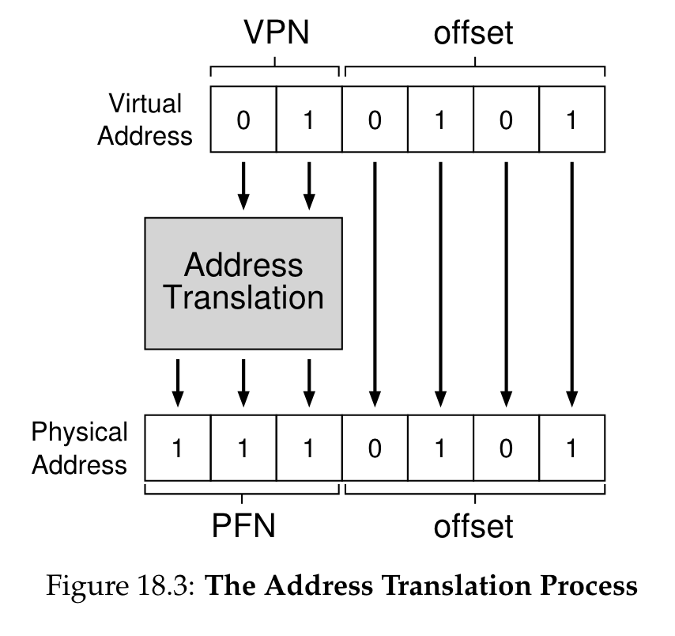

# Week 4 Notes

## Lecture 7: Memory Management - Swapping, Paging, and Virtual Memory

- How much of our problem have we solved?
  - We can use variable sized partitions, cutting down on internal fragmentation
  - We can move partitions around, which helps coalescing be more effective, but segments still need contiguous chunks of memory, so external fragmentation is still a problem
  - We still can't support more process data needs than we have physical memory
- Swapping
  - What if we don't have enough RAM to handle all processes' memory needs or perhaps even to handle one process?
  - Maybe we can keep some of their memory somewhere other than RAM, maybe on a disk (hard or flash)
  - Of course, you can't directly use code or data on a disk
- Swapping to disk
  - An obvious strategy to increase effective memory size
  - When a process yields or is blocked, copy its memory to disk
  - When it's scheduled, copy it back
  - If we have relocation hardware, we can put the memory in different RAM locations
  - Each process could see a memory space as big as the total amount of RAM
- Downsides to simple swapping
  - If we actually move everything out, the costs of a context switch are very high
    - Copy all of RAM out to disk
    - And then copy other stuff from disk to RAM
    - Before the newly scheduled process can do anything
  - We're still limiting processes to the amount of RAM we actually have
- Paging
  - Paged address translation
  - Paging and fragmentation
  - Paging memory management units
- Segmentation revisited
  - Segment relocation solved the relocation problem for us
  - It used base registers to compute a physical address from a virtual address, allowing us to move data around in physical memory by only updating the base register
  - It did nothing about external fragmentation because segments are still required to be contiguous
  - We need to eliminate the "contiguity requirement"
- The paging approach
  - Divide physical memory (RAM) into units of a single fixed size
    - A pretty small one, like 1-4K bytes or words
    - Typically called a page frame
  - Treat the virtual address space in the same way
    - Call each virtual unit a page
  - For each virtual address space page, store its data in one physical address page frame
    - Any page frame, not one specific to this page
  - Use some magic per-page translation mechanism to convert virtual to physical pages
- Paging and fragmentation
  - A segment is implemented as a set of virtual pages
  - Internal fragmentation averages only 1/2 page (half of the last one)
  - External fragmentation is completely non-existent as we never carve up pages
  - Tremendous reduction in fragmentation costs
- Providing the magic translation mechanism
  - On per page basis, we need to change a virtual address to a physical address on every memory reference
  - Needs to be fast so we'll use hardware
  - **Memory Management Unit (MMU)**: A piece of hardware designed to perform the magic quickly
- Paging and MMUs
  - Virtual page number is used as an index into the page table
  - Valid bit is checked to ensure that this virtual page number is legal
  - Offset within page remains the same
  - Selected entry contains physical page number
- The MMU hardware
  - MMUs used to sit between the CPU and bus, now they're typically integrated into the CPU
  - What about the page tables?
    - Originally implemented in special fast registers
    - Can't do that now since we can't afford so many fast registers
- Handling big page tables
  - So now they're stored in normal memory
  - But we can't afford two bus cycles for each memory access
    - One to look up the page table entry
    - One to get the actual data
  - So we have a very fast set of MMU registers used as a cache
    - Which means we need to worry about hit ratios, cache invalidation, and other nasty issues
    - TANSTAAFL
- The MMU and multiple processes
  - There are several processes running
  - Each needs a set of pages
  - We can put any page anywhere
  - But if they need more pages that we've physically got, something's got to go
  - How do we handle these ongoing paging requirements?
- Where do we keep extra pages?
  - We have more pages than RAM so some of them must be somewhere other than RAM
  - In paged system, typically some pages are kept on persistent memory device
  - But code can only access a page in RAM
- Ongoing MMU operations
  - What if the current process adds or removes pages?
    - Directly update active page table in memory
    - Privileged instruction to flush (stale) cached entries
  - What if we switch from one process to another?
    - Maintain separate page tables for each process
    - Privileged instruction loads pointer to new page table
    - A reload information flushes previously cached entires
  - How to share pages between multiple processes?
    - Make each page table point to same physical page
    - Can be read-only or read/write sharing
- Demand paging
  - If we can't keep all our pages in RAM, some are out on disk
  - But we can't directly use them on disk, so which ones do we put out on disk?
  - And how do we get them back if it turns out we need to use them?
- What is demand paging?
  - A process doesn't actually need all its pages in memory to run, it only needs those it actually references
  - So why bother loading up all the pages when a process is scheduled to run?
  - And why get rid of all of a process's pages when it yields?
  - Move pages onto and off of disk "on demand"
- How to make demand paging work
  - The MMU must support "not present" pages
    - Generates a fault/trap when they are referenced
    - OS can bring in the requested page and retry the faulted reference
  - Entire process needn't be in memory to start running
    - Start each process with a subset of its pages
    - Load additional pages as program demands them
  - The big challenge will be performance
- Achieving good performance for demand paging
  - Demand paging will perform poorly if most memory references require disk access
    - Worse than swapping in all the pages at once, maybe
  - So we need to be sure most don't by ensuring that the page holding the next memory reference is almost always already there
- Demand paging and locality of reference
  - How can we predict what pages we need in memory?
  - Primarily, rely on locality of reference
    - The next address you ask for is likely to be close to the last address you asked for
  - Programs typically display locality of reference
- Why is locality of reference usually present?
  - Code usually executes sequences of consecutive or nearby instructions
    - Most branches tend to be relatively short distances (into code in the same routine)
  - We typically need access to things in the current or previous stack frame
  - Many heap references to recently allocated structures (e.g., creating or processing a message)
  - No guarantees, but all three types of memory are likely to show locality of reference
- Page faults
  - Page tables no longer necessarily contain pointers to pages of RAM
  - In some cases, the pages are not in RAM, they're out on disk (hard or flash)
  - When a program requests an address from such a page, generate a page fault, which is intended to tell the system to go get it
- Handling a page fault
  - Initialize page table entries to "not present"
  - CPU faults if "not present" page is referenced
    - Fault enters kernel, just like any other exception
    - Forwarded to page fault handler
    - Determine which page is required, where it resides
    - Schedule I/O to fetch it, then block the process
    - Make page table entry point to newly read-in page
    - Back up user-mode PC to retry failed instruction
    - Return to user-mode and try again
  - Meanwhile, other processes can run
- Page faults don't impact correctness
  - Page faults only slow a process down
  - After a fault is handled, the desired page is in RAM
  - And the process runs again and can use it based on the OS ability to save process state and restore it
  - Programs never crash because of page faults but they might be very slow if there are too many
- Demand paging performance
  - Page faults may block processes
  - Overhead (fault handling, paging in and out)
    - Process is blocked while we're reading in pages
    - Delaying execution and consuming cycles
    - Directly proportional to the number of page faults
  - Key is having the "right" pages in memory
    - **Right pages**: Few faults, little paging activity
    - **Wrong pages**: Many faults, much paging
  - We can't control which pages we read in
    - Key to performance is choosing which to kick out
- Virtual memory
  - A generalization of what demand paging allows
  - A form of memory where the system provides a useful abstraction
    - A very large quantity of memory for each process, all directly accessible via normal addressing, at a speed approaching that of actual RAM
  - The state of the art in modern memory abstractions
- The basic concept
  - Give each process an address space of immense size, perhaps as big as your hardware's word size allows
  - Allow processes to request segments within that space (they typically don't use the entire space)
  - Use dynamic paging and swapping to support the abstraction
  - The key issue is how to create the abstraction when you don't have that much real memory
- The key VM technology: Replacement algorithms
  - The goal is to have each page already in memory when a process accesses it
  - We can't know ahead of time what pages will be accessed, so we rely on locality of access
    - In particular, to determine which pages to move out of memory and onto disk
  - If we make wise choices, the pages we need in memory will still be there
- The basics of page replacement
  - We keep some set of all pages in memory
    - As many as will fit
    - Probably not all belonging to a single process
  - Under some circumstances, we need to replace one of them with another page that's on disk (e.g., when we have a page fault)
  - Paging hardware and MMU translation allows us to choose any page for ejection to disk
  - Which one of them should go?
- The optimal replacement algorithm
  - Replace the page that will be next referenced furthest in the future
  - Why is this the right page?
    - It delays the next page fault as long as possible
    - Fewer page faults per unit time = lower overhead
  - A slight problem:
    - We would need an oracle to know which page this algorithm calls for and we don't have one
      - **Oracle**: Systems that perfectly predict the future
- Do we require optimal algorithms?
  - Not absolutely
  - What's the consequence of being wrong?
    - We take an extra page fault that we shouldn't have
    - Which is a performance penalty, not a program correctness penalty
    - Often an acceptable tradeoff
  - The more often we're right, the fewer page faults we take
  - For traces, we can run the optimal algorithm, comparing it to what we use when live
- Approximating the optimal
  - Rely on locality of reference
  - Note which pages have recently been used
    - Perhaps with extra bits in the page tables
    - Updated when the page is accessed
  - Use this data to predict future behavior
  - If locality of reference holds, the pages we accessed recently will be accessed again soon
- Candidate replacement algorithms
  - **Random, FIFO**: These are dogs, forget 'em
  - **Least Frequently Used**: Sounds better, but it really isn't
  - Least Recently Used
    - Assert that near future will be like the recent past
    - If we haven't used a page recently, we probably won't use it soon
- Naive LRU
  - Each time a page is accessed, record the time
  - When you need to eject a page, look at all timestamps for pages in memory
  - Choose the one with the oldest timestamp
  - Will require us to store timestamps somewhere
  - To search all timestamps every time we need to eject a page
- Maintaining information for LRU
  - Can we keep it in the MMU?
    - MMU would note the time whenever a page is referenced
    - But MMU translation must be blindingly fast
      - Getting/storing time on every fetch would be very expensive
    - At best MMU will maintain a read and a written bit per page
  - Can we maintain this information in software?
    - Complicated and time consuming
    - If we maintain real timestamps, multiple overhead instructions for each real memory reference
  - We need a cheap software surrogate for LRU
    - No extra instructions per memory reference
    - Mustn't cause extra page faults
    - Can't scan entire list each time on replacement since it's big
- Clock algorithms
  - A surrogate for LRU
  - Organize all page frames in a circular list
  - MMU sets a reference bit for the frame on access
  - Scan whenever we need another page
    - For each frame, ask MMU if frame's reference bit is set
    - If so, clear the reference bit in the MMU and skip this frame
    - If not, consider this page to be the least recently used
    - Next search starts from this position, not head of list
  - Use position in the scan as a surrogate for age
  - No extra page faults, usually scan only a few pages
- Comparing true LRU to clock algorithm
  - Same number of loads and replacements but didn't replace the same pages
  - Both are just approximations to the optimal
  - If LRU clock's decisions are 98% as good as true LRU and can be done for 1% of the cost (in hardware and cycles) it's a bargain
- Page replacement and multiprogramming
  - We don't want to clear out all the page frames on each context switch
    - When switched-out process runs again, we don't want a bunch of page faults
  - To deal with sharing page frames:
    - Single global page frame pool
      - Treat the entire set of page frames as a shared resource
      - Approximate LRU for the entire set
      - Replace whichever process' page is LRU
      - Probably a mistake
        - Bad interaction with round-robin scheduling
        - The guy who was last in the scheduling queue will find all his pages swapped out, and not because he isn't using them
        - When he's scheduled, lots of page faults
    - Fixed allocation of page frames per process
      - Set aside some number of page frames for each running process
        - Use an LRU approximation separately for each
        - Fixed number of pages per process is bad
          - Different processes exhibit different locality
            - Which pages are needed changes over time
            - Number of pages needed changes over time
          - Much like different natural scheduling intervals
        - We need a dynamic customized allocation
    - Working set-based page frame allocations
      - Give each running process an allocation of page frames matched to its needs
      - Know what its needs are by using working sets
      - Sets of pages used by a process in a fixed length sampling window in the immediate past
      - Allocate enough page frames to hold each process' working set
      - Each process runs replacement within its own set
      - Optimal working sets
        - The optimal working set for a process is the number of pages needed during the next time slice
        - If we run the process in fewer frames, needed pages will replace one another continuously and the process will run very slowly
        - To know what the working set size is, observe the process's behavior
        - To know which pages should be in the working set, no need to guess, the process will fault for them
      - Implementing working sets
        - Manage the working set size
          - Assign page frames to each in-memory process
          - Processes page against themselves in working set
          - Observe paging behavior (faults per unit time)
          - Adjust number of assigned page frames accordingly
        - Page stealing algorithms to adjust working sets
          - E.g., working set-clock
          - Track last use time for each page, for owning process
          - Find page (approximately) least recently used (by its owner)
          - Processes that need more pages tend to get more
          - Processes that don't use their pages tend to lose them
- Thrashing
  - Working set size characterizes each process, such as how many pages it needs to run for x milliseconds
  - What if we don't have enough memory?
    - Sum of working sets exceeds available page frames
    - No one will have enough pages in memory
    - Whenever anything runs, it'll grab a page from someone else, so they'll get a page fault soon after they start running
  - When systems thrash, all processes run slow until the system takes action
- Preventing thrashing
  - We usually cannot add more memory or squeeze working set sizes (this will also cause thrashing)
  - We can reduce the number of competing processes
    - Swap some of the ready processes out to ensure enough memory for the rest to run
  - Swapped-out processes won't run for quite a while
  - But we can round-robin which are in and which are out
- Clean vs. dirty pages
  - Consider a page, recently paged in from disk
    - There are two copies, one on disk, one in memory
  - If the in-memory copy has not been modified, there's still an identical valid copy on disk
    - The in-memory copy is said to be "clean"
    - Clean pages can be replaced without writing them back to disk
  - If the in-memory copy has been modified, the copy on disk is no longer up-to-date
    - The in-memory copy is said to be "dirty"
    - If paged out of memory, it must be written to disk
- Dirty pages and page replacement
  - Clean pages can be replaced at any time, the copy on disk is already up to date
  - Dirty pages must be written to disk before the frame can be reused
    - A slow operation we don't want to wait for
  - Could only kick out clean pages, but that would limit flexibility
  - How to avoid being hamstrung by too many dirty page frames in memory?
- Pre-emptive page laundering
  - Clean pages give memory manager flexibility
    - Many pages that can, if necessary, be replaced
  - We can increase flexibility by converting dirty pages to clean ones
  - Ongoing background write-out of dirty pages
    - Find and write out all dirty, non-running pages
      - No point in writing out a page that is actively in use
    - On assumption we will eventually have to page out
    - Make them clean again, available for replacement
- Conclusion
  - Paging allows us to use RAM more efficiently
    - More processes runnable
  - Virtual memory provides a good abstraction for programmers but typically requires demand paging to work
  - Key technology for VM is page replacement
  - Working set approaches allow us to minimize page faults

## 18. [Paging: Introduction](https://pages.cs.wisc.edu/~remzi/OSTEP/vm-paging.pdf)

- Introduction
  - OS takes one of two approaches when solving most any space-management problem
    - Chop things up into variable-sized pieces (segmentation in virtual memory)
      - Space can become fragmented and thus allocation becomes more challenging over time
    - Chop up space into fixed-sized pieces (paging in virtual memory)
      - **Page frames**: Array of fixed-sized slots, each frame can contain a single virtual-memory page
- A simple example and overview
  - Paging is more flexible, the system will be able to support the abstraction of an address space effectively, regardless of how a process uses the address space
  - Paging is more simple, the OS simply finds free pages
    - Can be done with a free list
    - **Page table**: Per-process data structure used to record where each virtual page of the address space is placed in physical memory
      - Stores address translations for each of the virtual pages of the address space, thus letting us know where in physical memory each page resides
  - To translate the virtual address, you need the virtual page number (VPN) and the offset within the page
    - 
- Where are page tables stored?
  - **Page table**: Stores virtual-to-physical address translations, lets the system know where each page of an address space actually resides in physical memory
    - One page table per process in the system
    - Exact structure is either determined by the hardware (older systems) or can be more flexibly managed by the OS (modern systems)
  - Page tables are very large
  - Stored in memory somewhere
- What's actually in the page table?
  - **Linear page table**: Just an array; the OS indexes the array by the virtual page number (VPN) and looks up the page-table entry (PTE) at that index in order to find the desired physical frame number (PFN)
  - **Valid bit**: Indicates whether the particular translation is valid
    - Space in between cop/heap and stack is marked as invalid
  - **Protection bit**: Indicates whether the page could be read from, written to, or executed from
  - **Present bit**: Indicates whether this page is in physical memory or on disk (i.e., it has been swapped out)
    - **Swapping**: Allows the OS to free up physical memory by moving rarely-used pages to disk
  - **Dirty bit**: Indicates whether the page has been modified since it was brought into memory
  - **Reference bit** / **accessed bit**: Used to track whether a page has been accessed and is useful in determining which pages are popular and thus should be kept in memory
    - Such knowledge is critical during page replacement
- Paging: Also too slow
  - For every memory reference, paging requires us to perform one extra memory reference in order to first fetch the translation from the page table
  - Without careful design of both hardware and software, page tables will cause the system to run too slowly as well as take up too much memory
- A memory trace
  - When it runs, each instruction fetch will generate two memory references:
    - One to the page table to find the physical frame that the instruction resides within
    - One to the instruction itself to fetch it to the CPU for processing
- Summary
  - Advantages
    - It does not lead to external fragmentation, as paging divides memory into fixed-sized units
    - It is quite flexible, enabling the sparse use of virtual address spaces
  - Disadvantages
    - If not implemented well, it'll lead to a slower machine and memory waste

## 19. [Paging: Faster Translations (TLBs)](https://pages.cs.wisc.edu/~remzi/OSTEP/vm-tlbs.pdf)

- Introduction
  - To speed address translation, we're going to add a translation-lookaside buffer (TLB)
    - Part of the chip's memory-management unit (MMU)
    - Hardware cache of popular virtual-to-physical address translations
    - Address-translation cache
  - Upon each virtual memory reference, the hardware first checks the TLB to see if the desired translation is held therein
    - If so, the translation is performed quickly without having to consult the page table
- TLB basic algorithm
  - Algorithm for the hardware:
    - Extract the virtual page number (VPN) from the virtual address and check if the TLB holds the translation for the VPN
    - If it does, we have a TLB hit, which means the TLB holds the translation
      - We can now extract the page frame number (PFN) from the relevant TLB entry, concatenate that onto the offset from the original virtual address, and form the desired physical address (PA) and access memory, assuming protection checks do not fail
    - If the CPU doesn't find the translation in the TLB (TLB miss), we have some more work to do
      - Hardware accesses the page table to find the translation, and assuming that the virtual memory reference generated by the process is valid and accessible, updates the TLB with the translation
      - Once the TLB is updated, the hardware retries the instruction
  - The TLB is built on the premise that in the common case, translations are found in the cache
    - Little overhead is added as the TLB is found near the processing core and is designed to be quite fast
  - When a miss occurs, the high cost of paging is incurred
- Example: Accessing an array
  - Example not noted
  - The idea behind hardware caches is to take advantage of locality in instruction and data references
    - Keeps copies of memory in small, fast on-chip memory
    - Instead of having to go to a slow memory to satisfy a request, the processor can access it quickly and avoid spending the costly time it takes to access memory
  - **Temporal locality**: An instruction or data item that has been recently accessed will likely be re-accessed soon in the future
  - **Spatial locality**: If a program accesses memory at address x, it will likely soon access memory near x
- Who handles the TLB miss?
  - In the olden days, the hardware
  - In modern systems, the hardware raises an exception, which pauses the current instruction stream, raises the privilege level to kernel mode, and jumps to a trap handler
  - The primary advantage of the software-managed approach is **flexibility**: The OS can use any data structure it wants to implement the page table, without necessitating hardware change
  - Another advantage is simplicity, the hardware doesn't do much on a miss
- TLB contents: What's in there?
  - **Fully associative**: Any given translation can be anywhere in the TLB, and the hardware will search the entire TLB in parallel to find the desired translation
  - TLB entry: VPN | PFN | other bits
  - **Valid bit**: Indicates whether the entry has a valid translation or not
  - **Protection bit**: Determines how a page can be accessed (read and execute, read and write, etc)
  - **Other fields**: Address-space identifier, dirty bit, etc
- TLB issue: Context switches
  - Flush the TLB on context switches (empty it before running the next process)
    - On a software-based system, this can be accomplished with an explicit (and privileged) hardware instruction
    - With a hardware-managed TLB, the flush could be enacted when the page-table base register is changed
    - Sets all valid bits to 0
    - Each time a process runs, it must incur TLB misses as it touches its data and code pages
      - If the OS switches between processes frequently, this cost may be high
  - **Address Space Identifier (ASID)**: Like a process identifier (PID), but usually it has fewer bits
    - Added hardware support to enable sharing of the TLB across context switches
    - With these, the TLB can hold translations from different processes at the same time without any confusion
    - The hardware needs to know which process is currently running to perform translations, and thus the OS must set some privileged register to the ASID of the current process on a context switch
- Issue: Replacement policy
  - **Cache replacement**: When we're installing a new entry in the TLB, we have to replace an old one
  - Goal is to minimize the miss rate (or increase hit rate) and improve performance
  - Evict the least-recently-used (LRU) entry
    - Tries to take advantage of locality in the memory-reference stream
  - **Random policy**: Evicts a TLB mapping at random
    - Useful due to its simplicity and ability to avoid corner-case behaviors
- A real TLB entry
  - **Culler's Law**: RAM isn't always RAM
    - The term random-access memory (RAM) implies that you can access any part of Ram just as quickly as another
    - Sometimes randomly accessing your address space, particularly if the number of pages accessed exceeds the TLB coverage, can lead to severe performance penalties
- Summary
  - **Exceeding the TLB coverage**: If the number of pages a program accesses in a short period of time exceeds the number of pages that fit into the TLB, the program will generate a large number of TLB misses, and thus run quite a bit more slowly
    - One solution: Include support for larger page sizes
    - Support for larger pages is often exploited by programs such as a database management system (DBMS)
  - TLB access can easily become a bottleneck in the CPU pipeline, in particular with what's called a physically-indexed cache
    - Address translation has to take place before the cache is accessed, which can slow things down quite a bit
    - **Solution**: Virtually-indexed cache (introduces new issues too)

## 21. [Beyond Physical Memory: Mechanisms](https://pages.cs.wisc.edu/~remzi/OSTEP/vm-beyondphys.pdf)

- Introduction
  - Assumption: Every address space of every running process fits into memory, all pages reside in physical memory
  - In our memory hierarchy, big and slow hard drives sit at the bottom, with memory just above
  - **Memory overlays**: Used in older systems, requires programmers to manually move pieces of code or data in and out of memory as they were needed
- Swap space
  - **Swap space**: Space on the disk for moving pages back and forth
  - The OS needs to remember the disk address of a given page
  - The size of the swap space determines the maximum number of memory pages that can be in use by a system at a given time
- The present bit
  - When the hardware looks in the PTE, it may find that the page is not present in physical memory
    - The way the hardware or OS determines this is through the present bit
      - **1**: Page is present in physical memory
      - **0**: Page is not in memory bur rather on disk somewhere
  - **Page fault**: The act of accessing a page that is not in physical memory
    - OS is invoked to service the page fault
    - Page-fault handler runs
- The page fault
  - If a page is not present and has been swapped to disk, the OS will need to swap the page into memory to service the page fault
  - When the OS receives a page fault for a page, it looks in the PTE to find the address and issues the request to disk to fetch the page into memory
  - When the disk I/O completes, the OS will then update the page table to mark the page as present, update the PFN field of the page-table entry (PTE) to record the in-memory location of the newly-fetched page, and retry the instruction
  - This next attempt may generate a TLB miss, which would then be serviced and update the TLB with the translation
  - A last restart would find the translation in the TLB and thus proceed to fetch the desired data or instruction from memory at the translated physical address
  - While the I/O is in flight, the process will be in the blocked state
    - The OS will be free to run other ready processes while the page fault is being serviced
    - Because I/O is expensive, this overlap of the I/O (page fault) of one process and the execution of another is yet another way a multiprogrammed system can make the most effective use of its hardware
- What if memory is full?
  - OS might like to first page out one or more pages to make room for the new page(s) the OS is about to bring in
  - **Page-replacement policy**: The process of picking a page to kick out or replace
- Page fault control flow
  - Three cases when a TLB miss occurs:
    - The page was both present and valid
      - The TLB miss handler can grab the PFN from the PTE, retry the instruction, and continue
    - The page fault handler must be run
      - Valid page but it's not present in physical memory
    - The access could be to an invalid page, due to a bug for example
      - Hardware traps this invalid access and the OS trap handler runs, likely terminating the offending process
  - To service the page fault
    - OS must find a physical frame for the soon-to-be-faulted-in page to reside within
      - If there's no page, we'll have to wait for the replacement algorithm to run and kick some pages out of memory
    - With a physical frame in hand, the handler then issues the I/O request to read in the page from swap space
    - The OS updates the page table and retries the instruction
    - Retry > TLB miss > retry > TLB hit
- When replacements really occur
  - To keep a small amount of memory free, most operating systems have some kind of high watermark (HW) and low watermark (LW)
  - When the OS notices that there are fewer than LW pages available, a background thread (swap daemon / page daemon) that is responsible for freeing memory runs
  - The thread evicts pages until there are HW pages available
  - Background thread goes to sleep
  - Many systems will cluster or group a number of pages and write them out at once to the swap partition, thus increasing the efficiency of the disk
    - Clustering reduces seek and rotational overheads of a disk

## 22. [Beyond Physical Memory: Policies](https://pages.cs.wisc.edu/~remzi/OSTEP/vm-beyondphys-policy.pdf)

- Introduction
  - When little memory is free, the memory pressure forces the OS to start paging out pages to make room for actively-used pages
  - **Replacement policy**: Decides which page(s) to evict
- Cache management
  - Main memory can be viewed as a cache for virtual memory pages in the system
  - **Goal for replacement policy**: Minimize the number of cache misses, maximizing the number of cache hits
  - Average memory access time (AMAT): AMAT = T_M + (P_Miss \* T_D)
    - **T_M**: The cost of accessing memory
    - **T_D**: The cost of accessing disk
    - **P_Miss**: The probability of not finding the data in the cache (a miss)
      - Varies from 0 to 1
      - 10% miss rate means P_Miss = 0.1
      - When you miss, you must additionally pay the cost of fetching the data from disk
- The optimal replacement policy
  - Replace the page that will be accessed furthest in the future
  - Types of misses
    - **Compulsory miss** / **cold-start miss**: Occurs because the cache is empty to begin with and this is the first reference to the item
    - **Capacity miss**: Occurs because the cache ran out of space and had to evict an item to bring a new item into the cache
    - **Conflict miss**: Arises in hardware because of limits on where an item can be placed in a hardware cache, due to set-associativity
      - It doesn't arise in the OS page cache because such caches are always fully-associative (there are no restrictions on where in memory a page can be placed)
- A simple policy: FIFO
  - Pages are placed in a queue when they enter the system
  - When a replacement occurs, the page on the fail of the queue is evicted
  - Simple to implement
  - **Belady's Anomaly**: Cache hit rate decreases when the cache gets larger (with FIFO)
  - **Stack property**: A cache of size N + 1 naturally includes the contents of a cache of size N
    - When increasing the cache size, hit rate will either stay the same or improve
    - LRU has this, FIFO and random do not
- Another simple policy: Random
  - Picks a random page to replace under memory pressure
  - Simple to implement
- Using history: LRU
  - **Frequency**: If a page has been accessed many times, perhaps it shouldn't be replaced as it clearly has some value
  - **Recency**: The more recently a page has been accessed, perhaps the more likely it will be accessed again
  - **Least-Frequently-Used (LFU)**: Replaces the least-frequently-used page when an eviction must take place
  - **Least-Recently-Used (LRU)**: Replaces the least-recently-used page
  - Opposites: Most-Frequently-Used (MFU) and Most-Recently-Used (MRU)
    - In most cases these do not work well as they ignore the locality most programs exhibit
- Workload examples
  - When there's no locality in the workload, it doesn't matter which policy you're using
  - When the cache is large enough to fit the entire workload, it also doesn't matter which policy you use
- Implementing historical algorithms
  - Upon each page access, we must update some data structure to move this page to the front of the list
  - The system has to do some accounting work on every memory reference
  - It's expensive to implement perfect LRU
- Approximating LRU
  - **Use bit** / **reference bit**: One per page of the system, live in memory somewhere
    - **1**: Whenever a page is referenced
    - OS clears it to 0
  - **Clock algorithm**: Imagine all the pages of the system arranged in a circular list
    - A clock hand points to some particular page to begin with
    - When a replacement must occur, the OS checks if the currently-pointed to page P has a use bit of 1 or 0
    - If 1, this implies P is not a good candidate for replacement
    - The use bit for P is set to 0 and the clock hand is incremented to the next page
    - Continues until it finds a use bit that's set to 0
- Considering dirty pages
  - If a page has been modified (dirty), it must be written back to disk to evict it, which is expensive
  - If it hasn't been modified (clean), the eviction is free; the physical frame can simply be reused for other purposes without additional I/O
  - **Modified bit** / **dirty bit**: Set any time a page is written
    - Clock algorithm can be changed to scan for pages that are both unused and clean to evict first
    - Then looks for unused and dirty
- Other VM policies
  - **Page selection policy**: OS has to decide when to bring a page into memory
    - **Demand paging**: The OS brings the page into memory when it's accessed, "on demand"
    - **Prefetching**: If the OS can guess a page is about to be used and brings it in ahead of time
      - If P is brought into memory, P + 1 will likely be accessed soon and should also be brought into memory
  - **Clustering** / **grouping of write**: Collect a number of pending writes together in memory and write them to disk in one, more efficient, write
- Thrashing
  - **Thrashing**: When the system is constantly paging
  - **Admission control**: It is sometimes better to do less work well than to try to do everything at once poorly
  - O**ut-of-memory killer**: Chooses a memory-intensive process and kills it
- Summary
  - **Scan resistant algorithms**: LRU-like but tries to avoid the worst-case behavior of LRU
  - Just buy more memory

## [Working Sets](https://htmlpreview.github.io/?https://github.com/markkampe/Operating-Systems-Reading/blob/master/workingsets.html)

- LRU is not enough
  - The reason LRU works so well is that most programs exhibit some degree of temporal and spatial locality:
    - If they use some code or data, they are likely to come back to access the same locations again
    - If they access code or data in a particular page, they are likely to reference other code (or data) in the same vicinity
    - But these are statements about a single program or process
  - With the exception of shared text segments, separate processes seldom access the same pages
    - The most recently used pages in memory belong to the process that will not be run for a long time
    - The least recently used pages in memory belong to the process that is just about to run again
    - This destroys strict temporal and spatial locality, as reference behavior becomes periodic (rather than continuous)
  - Give each process its own dedicated set of page frames
    - When that process needs a new page, let LRU replace the oldest page in that set
    - Per-process LRU, work well with Round-Robin scheduling
- The concept of a working set
  - We don't need to give each process as many pages of physical memory as appear in the virtual address space
  - We don't even need to give each process as many pages of its virtual address as it will ever access
  - It is a good thing if a process experiences occasional page faults, and has to replace old pages with new ones
  - What we want to avoid is page faults due to running a process in too little memory
  - The ideal mean-time-between-page-faults would be equal to the time-slice length
  - As we give a process fewer and fewer page frames in which to operate, the page fault rate rises and our performance gets worse
  - **Thrashing**: The dramatic degradation in system performance associated with not having enough memory to efficiently run all of the ready processes
  - Swap out processes if there isn't enough memory for those processes
    - The improved performance resulting from reducing the number of page faults will more than make up for the delays processes experience while being swapped between primary and secondary storage
  - **Working size set**: There is, for any given computation, at any given time, a number of pages such that:
    - If we increase the number of page frames allocated to that process, it makes very little difference in the performance
    - If we reduce the number of page frames allocated to that process, the performance suffers noticeably
- How large is a working set
  - The amount of memory needed depends on complexity and point of execution
  - If a process is experiencing many page faults, its working set is larger than the memory currently allocated to it
  - If a process is not experiencing page faults, it may have too much memory allocated to it
- Implementing working set replacement

```
while...
{
  // see if this page is old enough to replace
  owningProc = page->owner;
  if (page->referenced) {
  	// assume it was just referenced
  	page->lastRef = owningProc->accumulatedTime;
  	page->referenced = 0;
  } else {
  	// has it gone unreferenced long enough?
  	age = owningProc->accumulatedTime - page->lastRef;
  	if (age > targetAge)
  		return(page);
  }
}
```

- Pages only age when their owner runs without referencing them
- If a page is younger than the target age, we do not want to replace it, since recycling of young pages indicates we may be thrashing
- If a page is older than the target age, we take it away from its current owner, and give it to a new (needy) process
- If there are no pages older than the target age, we apparently have too many processes to fit in the available memory:
  - If we complete a full scan without finding anything that is older than the target age, we can replace the oldest page in memory
    - This works, but at the cost of the very expensive complete scan that the clock algorithm was supposed to avoid
  - If we believe that our target age was well chosen (to avoid thrashing) we probably need to reduce the number of processes in memory
- Dynamic equilibrium to the rescue
  - Page stealing algorithm
  - A process that needs another page steals it from a process that does not seem to need it as much
  - Every process is continuously losing pages that it has not recently referenced / stealing pages from other processes
  - Processes that reference more pages more often will accumulate larger working sets
  - When programs change their behavior, their allocated working sets adjust promptly and automatically

## Lecture 8: Threads, IPC, and Synchronization

- Why not just processes?
  - Processes are very expensive
    - To create: They own resources
    - To dispatch: They have address spaces
  - Different processes are very distinct
    - They cannot share the same address space
    - They cannot (usually) share resources
  - Not all programs require strong separation
    - Multiple activities working cooperatively for a single goal
    - Mutually trusting elements of a system
- What is a thread?
  - Strictly a unit of execution/scheduling
    - Each thread has its own stack, PC, registers
    - But other resources are shared with other threads
  - Multiple threads can run in a process
    - They all share the same code and data space
    - They all have access to the same resources
    - This makes them cheaper to create and run
  - Sharing the CPU between multiple threads
    - User level threads (with voluntary yielding)
    - Scheduled system threads (with preemption)
- When should you use processes?
  - To run multiple distinct programs
  - When creation/destruction are rare events
  - When running agents with distinct privileges
  - When there are limited interactions and shared resources
  - To prevent interference between executing interpreters
  - To firewall one from failures of the other
- When should you use threads?
  - For parallel activities in a single program
  - When there is frequent creation and destruction
    - Creating/destroying threads is cheap
  - When all can run with same privileges
  - When they need to share resources
  - When they exchange many messages/signals
  - When you don't need to protect them from each other
- Thread state and thread stacks
  - Each thread has its own registers, PS, PC
  - Each thread must have its own stack area
  - Maximum stack size specified when thread is created
    - A process can contain many threads
    - They cannot all grow towards a single hole
    - Thread creator must know max required stack size
    - Stack space must be reclaimed when thread exits
  - Procedure linkage conventions are unchanged
- User level threads vs. kernel threads
  - Kernel threads:
    - An abstraction provided by the kernel
    - Still share one address space
    - But scheduled by the kernel so multiple threads can use multiple cores at once
  - User level threads:
    - Kernel knows nothing about them
    - Provided and managed via user-level library
    - Scheduled by library, not by kernel
- Communications between processes
  - Even fairly distinct processes may occasionally need to exchange information
  - The OS provides mechanisms to facilitate that since processes can't normally "touch" each other
  - These mechanisms are referred to as "inter-process communications" (IPC)
- Goals for IPC mechanisms
  - Simplicity
  - Convenience
  - Generality
  - Efficiency
  - Robustness and reliability
  - Some of these are contradictory and partially handled by providing multiple different IPC mechanisms
- OS support for IPC
  - Provided through system calls
  - Typically requiring activity from both communicating processes
    - Usually can't "force" another process to perform IPC
  - Usually mediated at each step by the OS to protect both processes and ensure correct behavior
- OS IPC mechanics
  - For local processes
  - Data is in memory space of sender
  - Data needs to get to memory space of receiver
  - Two choices:
    - The OS copies the data
    - The OS uses VM techniques to switch ownership of memory to the receiver
- Which to choose?
  - Copying the data
    - Conceptually simple
    - Less likely to lead to user/programmer confusion since each process has its own copy of the bits
    - Potentially high overhead
  - Using VM
    - Much cheaper than copying the bits
    - Requires changing page tables
    - Usually only one of the two processes sees the data at a time (precisely what you want for some types of IPC)
- IPC: Synchronous and asynchronous
  - Synchronous IPC
    - Writes block until data is sent/delivered/received
    - Reads block until new data is available
    - Very easy for programmers
  - Asynchronous operations
    - Writes return when system accepts data
      - No confirmation of transmission/delivery/reception
      - Requires auxiliary mechanism to learn of errors
    - Reads return promptly if no data available
      - Requires auxiliary mechanism to learn of new data
      - Often involves "wait for any of these" operation
    - Much more efficient in some circumstances
- Typical IPC operations
  - Create/destroy an IPC channel
  - **Write/send/put**: Insert data into the channel
  - **Read/receive/get**: Extract data from the channel
  - **Channel content query**: How much data is currently in the channel?
  - Connection establishment and query
    - Control connection of one channel end to another
    - Provide information like:
      - Who are end-points?
      - What is status of connections?
- IPC: Messages vs. streams
  - A fundamental dichotomy in IPC mechanisms
  - Streams
    - A continuous stream of bytes
    - Read or write a few or many bytes at a time
    - Write and read buffer sizes are unrelated
    - Stream may contain app-specific record delimiters
      - Known by application, not by IPC mechanism
  - Messages (aka datagrams)
    - A sequence of distinct messages
    - Each message has its own length (subject to limits)
      - The IPC mechanism knows about these
    - Each message is typically read/written as a unit
    - Delivery of a message is typically all or nothing
  - Each style is suited for particular kinds of interactions
- IPC and flow control
  - **Flow control**: Making sure a fast sender doesn't overwhelm a slow receiver
  - Queued IPC consumes system resources
    - Buffered in the OS until the receiver asks for it
  - Many things can increase required buffer space
    - Fast sender, non-responsive receiver
  - Must be a way to limit required buffer space
    - **Sender side**: Block sender or refuse communication
    - **Receiving side**: Stifle sender, flush old data
    - Handled by network protocols or OS mechanism
  - Mechanisms for feedback to sender
- IPC reliability and robustness
  - Within a single machine, OS won't accidentally "lose" IPC data
  - Across a network, requests and responses can be lost
  - Even on single machine, though, a sent message may not be processed
    - The receiver is invalid, dead, or not responding
  - And how long must the OS be responsible for IPC data?
- Reliability options
  - When do we tell the sender "OK"?
    - When it's queued locally?
    - When it's added to receiver's input queue?
    - When the receiver has read it?
    - When the receiver has explicitly acknowledged it?
  - How persistently does the system attempt delivery?
    - Especially across a network
    - Do we try retransmissions? How many?
    - Do we try different routes or alternate servers?
  - Do channel/contents survive receiver restarts?
    - Can a new server instance pick up where the old left off?
- Some styles of IPC
  - Pipelines
    - Data flows through a series of programs
      - `ls | grep | sort | mail`
      - Macro processor | compiler | assembler
    - Data is a simple byte stream
      - Buffered in the operation system
      - No need for intermediate temporary files
    - There are no security/privacy/trust issues since they're all under control of a single user
    - Error conditions
      - **Input**: End of file
      - **Output**: Next program failed
    - Simple, but very limiting
  - Sockets
    - Connections between addresses/ports
      - Connect/listen/accept
      - **Lockup**: Registry, DNS, service discovery protocols
    - Many data options
      - Reliable or best effort datagrams
      - Streams, messages, remote procedure calls, etc
    - Complex flow control and error handling
      - Retransmissions, timeouts, node failures
      - Possibility of reconnection or fail-over
    - Trust/security/privacy/integrity
    - Very general, but more complex
  - Shared memory
    - OS arranges for processes to share read/write memory segments (actual shared RAM)
      - Mapped into multiple processes' address spaces
      - Applications must provide their own control of sharing
      - OS is not involved in data transfer
        - They're just memory reads and writes via limited direction execution
        - So very fast
    - Simple in some ways, terribly complicated in others
      - The cooperating processes must achieve whatever synchronization/consistency effects they want themselves
    - Only works on a local machine
  - Mailboxes
  - Named pipes
  - Simple messages
  - IPC signals
- Synchronization
  - Making things happen in the "right" order
  - Easy if only one set of things is happening
  - Easy if simultaneously occurring things don't affect each other, hideously complicated otherwise
  - Can't avoid it because we must have parallelism
- The benefits of parallelism
  - **Improved throughput**: Blocking of one activity doesn't stop others
  - **Improved modularity**: Separating complex activities into simpler pieces
  - **Improved robustness**: The failure of one thread does not stop others
  - A better fit to emerging paradigms
    - Client server computing, web based services
    - Our universe is cooperating parallel processes
- Why is there a problem?
  - Sequential program execution is easy
    - First instruction one, then instruction two, etc
    - Execution order is obvious and deterministic
  - Independent parallel programs are easy if the parallel streams don't interact in any way
  - Cooperating parallel programs are hard if the two execution streams aren't synchronized
    - Results depend on the order of instruction execution
    - Parallelism makes execution order non-deterministic
    - Results become combinatorially intractable
- Synchronization problems
  - Race conditions
    - What happens depends on execution order of processes/threads running in parallel
      - Sometimes one way, sometimes another
      - These happen all the time, most don't matter
    - But some race conditions affect correctness
      - Conflicting updates (mutual exclusion)
      - Check/act races (sleep/wakeup problem)
      - Multi-object updates (all-or-none transactions)
      - Distributed decisions based on inconsistent views
    - Each of these classes can be managed if we recognize the race condition and danger
  - Non-deterministic execution
    - Parallel execution makes process behavior less predictable
      - Processes block for I/O or resources
      - Time-slice end preemption
      - Interrupt service routines
      - Unsynchronized execution on another core
      - Queuing delays
      - Time required to perform I/O operations
      - Message transmission/delivery time
    - Which can lead to many problems
- What is "synchronization"?
  - True parallelism is too complicated, we're not smart enough to understand it
  - Pseudo-parallelism may be good enough
    - Mostly ignore it but identify and control key points of interaction
  - Synchronization refers to that control
  - Actually two interdependent problems
    - Critical section serialization
    - Notification of asynchronous completion
  - They're often discussed as a single problem
    - Many mechanisms simultaneously solve both
    - Solution to either requires solution to the other
  - They can be understood and solved separately
- The critical section problem
  - A critical section is a resource that's shared by multiple interpreters
    - By multiple concurrent threads, processes, or CPUs
    - By interrupted code and interrupt handler
  - Use of the resource changes its state
    - Contents, properties, relation to other resources
  - Correctness depends on execution order
    - When scheduler runs/preempts which threads
    - Relative timing of asynchronous events
- These kinds of interleavings seem pretty unlikely
  - To cause problems, things have to happen exactly wrong, but you're executing a billion instructions per second, so even very low probability events can happen with frightening frequency
  - Often, one problem blows up everything that follows
- Critical sections and mutual exclusion
  - Critical sections can cause trouble when more than one thread executes them at a time
    - Each thread doing part of the critical section before any of them do all of it
  - Preventable if we ensure that only thread can execute a critical section at a time
  - We need to achieve mutual exclusion of the critical section (if one of them is running it, the other definitely isn't)
- One solution: Interrupt disables
  - Temporarily block some or all interrupts
    - If there aren't any interrupts, nobody preempts my code in the middle
    - Can be done with a privileged instruction
    - Side-effect of loading new Processor Status Word
  - Abilities
    - Prevent time-slice end (timer interrupts)
    - Prevent re-entry of device driver code
  - Dangers
    - May delay important operations
    - A bug may leave them permanently disabled
    - Won't solve all sync problems on multi-core machines since they can have parallelism without interrupts
- Downsides of disabling interrupts
  - Not an option in user mode
    - Requires use of privileged instructions
    - Can be used in OS kernel code though
  - Dangerous if improperly used
    - Could disable preemptive scheduling, disk I/O, etc
  - Delays system response to important interrupts
    - Received data isn't processed until interrupt serviced
    - Device will sit idle until next operation is initiated
  - May prevent safe concurrency
- Other possible solutions
  - Avoid shared data whenever possible
  - Eliminate critical sections with atomic instructions
    - Atomic (uninterruptable) read/modify/write operations
    - Can be applied to 1-8 contiguous bytes
    - Simple: Increment/decrement, and/or/xor
    - Complex: Test-and-set, exchange, compare-and-swap
  - Use atomic instructions to implement locks
    - Use the lock operations to protect critical sections
- Conclusion
  - Processes are too expensive for some purposes
  - Threads provide a cheaper alternative
  - Threads can communicate through memory
  - Processes need IPC
  - Both processes and threads allow parallelism which is vital for performance but raises correctness issues

## 25. [A Dialogue on Concurrency](https://pages.cs.wisc.edu/~remzi/OSTEP/dialogue-concurrency.pdf)

- **Multi-threaded applications**: Each thread is like an independent agent running around in the program, doing things on the program's behalf, accessing memory
  - If we don't coordinate access to memory between threads, the program won't work as expected
- The OS must support multi-threaded applications with primitives such as locks and condition variables
- The OS itself was the first concurrent program - it must access its own memory very carefully

## 26. [Concurrency: An Introduction](https://pages.cs.wisc.edu/~remzi/OSTEP/threads-intro.pdf)

- Introduction
  - **Thread**: Like a separate process except they share the same address space and can access the same data
    - Has a program counter (PC) that tracks where the program is fetching instructions for
    - Has its own private set of registers it uses for computation
  - Context switch must take place if there are two threads that are running on a single processor, when switching from running one (T1) to running the other (T2)
  - **Thread control block (TCB)**: Stores the state of each thread of a process
    - The address space remains the same (no need to switch which page table we're using)
  - One stack per thread, placed in thread-local storage
- Why use threads?
  - Parallelism
    - Speed up processes considerably
    - **Parallelization**: The task of transforming your standard single-threaded program into a program that does the work on multiple CPUs
  - To avoid blocking program progress due to slow I/O
    - Threading enables overlap of I/O with other activities within a single program, much like multiprogramming did for processes across programs
  - Why threads over processes?
    - Threads share an address space and make it easy to share data
    - Processes are a more sound choice for logically separate tasks where little sharing of data structures in memory is needed
- An example: Thread creation
  - `pthread_join()`: Waits for a particular thread to complete
  - What runs next is determined by the OS scheduler, but it's hard to know what will run at any given moment in time
- Why it gets worse: Shared data
  - When we run the code, even on a single processor, we don't necessarily get the desired result
  - Not only is each run wrong, but it also yields a different result every time
- The heard of the problem: Uncontrolled scheduling
  - The code to increment `counter` has been run twice, but `counter`, which started at 50, is now only equal to 51 (should be 52)
  - **Race condition** / **data race**: The results depend on the timing of the code's execution
  - **Indeterminate**: It's not known what the output will be and it's likely to be different across runs
  - **Critical section**: Code where multiple threads executing the code can result in a race condition
    - A piece of code that accesses a shared variable (or shared resource) and must not be concurrently executed by more than one thread
  - **Mutual exclusion**: Guarantees that if one thread is executing within the critical section, the others will be prevented from doing so
  - **Atomic**: "all or nothing"; it should either appear as if all of the actions you wish to group together occurred, or that none of them occurred, with no in-between state visible
  - **Transaction**: The grouping of many actions into a single atomic action
- The wish for atomicity
  - One way to solve this problem would be to have more powerful instructions that, in a single step, did exactly whatever we needed done and thus removed the possibility of an untimely interrupt
  - In the general case, we won't have such an instruction
  - Instead, we ask the hardware for a few useful instructions upon which we can build a general set of synchronization primitives
- One more problem: Waiting for another
  - One thread must wait for another to complete some action before it continues
    - Ex: When a process performs a disk I/O and is put to sleep
    - When the I/O completes, the process needs to be roused from its slumber so it can continue
- Important terms
  - **Critical section**: A piece of code that accesses a shared resource, usually a variable or data structure
  - **Race condition** / **data race**: Arises if multiple threads of execution enter the critical section at roughly the same time
    - Both attempt to update the shared data structure, leading to a surprising outcome
  - **Indeterminate program**: Consists of one or more race conditions
    - The output of the program varies from run to run, depending on which threads ran when
    - The outcome is thus not deterministic, something we usually expect from computer systems
  - **Mutual exclusion primitives**: Using these guarantees that only a single thread ever enters a critical section, thus avoiding races, and resulting in deterministic program outputs

## 27. [Interlude: Thread API](https://pages.cs.wisc.edu/~remzi/OSTEP/threads-api.pdf)

- Thread creation
  - `int pthread_create(pthread_t *thread, const pthread_attr_t *attr, void *(*start_routine)(void*), void *arg);`
  - `thread`: A pointer to a structure of type `pthread_t`
    - Use this structure to interact with the thread
    - Pass it to `pthread_create()` to initialize it
  - `attr`: Used to specify any attributes this thread might have
    - Ex: Setting the stack size, information about the scheduling priority of the thread
    - Initialized with a separate call to `pthread_attr_init()`
  - **Function pointer**: Tells us which function the thread should start running in
    - Tells us a function name `start_routine`, which is passed a single argument of type `void *`, and returns a value of type `void *` (void pointer)
  - `arg`: The argument to be passed to the function where the thread begins execution
  - Having a void pointer as an argument to the function `start_routine` allows us to pass in any type of argument
  - Having it as a return value allows the thread to return any type of result
- Thread completion
  - Call the routine `pthread_join()` to wait for a thread to complete
  - `int pthread_join(pthread_t thread, void **value_ptr);`
  - `thread`: Used to specify which thread to wait for
  - `value_ptr`: Pointer to the return value you expect to get back
    - Can pass `NULL` if we don't care about the return value
  - If we're just passing in a single value, we don't have to package it up as an argument
  - Never return a pointer which refers to something allocated on the thread's call stack
    - When the function returns, the value is automatically deallocated
    - Passing back a pointer to a now deallocated variable is bad
  - A parallel program that creates threads to execute a particular task (in parallel) will likely use join to make sure all work completes before exiting or moving onto the next stage of computation
- Locks
  - `int pthread_mutex_lock(pthread_mutex_t *mutex);`
  - `int pthread_mutex_unlock(pthread_mutex_t *mutex);`
  - Useful for when you have a critical section and thus needs to be protected to ensure correct operation
  - If no other thread holds the lock when `pthread_mutex_lock()` is called, the thread will acquire the lock and enter the critical section
  - If another thread does indeed hold the lock, the thread trying to grab the lock will not return from the call until it has required the lock (implying that the thread holding the lock has released it via the unlock call)
  - Many threads may be stuck waiting inside the lock acquisition function at a given time
  - Only the thread with the lock acquired should call unlock
  - All locks must be properly initialized in order to guarantee that they have the correct values to begin with and thus work as desired when lock and unlock are called
    - `pthread_mutex_t lock = PTHREAD_MUTEX_INITIALIZER;`
    - Dynamic way:
    ```
    int rc = pthread_mutex_init(&lock, NULL);
    assert(rc == 0); // always check success
    ```
    - A corresponding call to `pthread_mutex_destroy()` should be made when you're done with the lock
  - Check error codes
  - Lock acquisition
    - `int pthread_mutex_trylock(pthread_mutex_t *mutex);`: Returns failure if the lock is already held
    - `int pthread_mutex_timedlock(pthread_mutex_t *mutex, strict timespec *abs_timeout);`: Returns after a timeout or after acquiring the lock, whichever happens first
      - Timedlock with a timeout of zero degenerates to the trylock case
    - Both of these should be avoided, but there are a few cases where avoiding getting stuck in a lock acquisition routine can be useful
- Condition variables
  - Useful when some kind of signaling must take place between threads, if one thread is waiting for another to do something before it can continue
  - `int pthread_cond_wait(pthread_cond_t *cond, pthread_mutex_t *mutex);`: Puts the calling thread to sleep and waits for some other thread to signal it, usually when something in the program has changed that the now-sleeping thread might care about
  ```
  pthread_mutex_t lock = PTHREAD_MUTEX_INITIALIZER;
  pthread_cond_t cond = PTHREAD_COND_INITIALIZER;
  Pthread_mutex_lock(&lock);
  while (ready == 0)
    Pthread_cond_wait(&cond, &lock);
  Pthread_mutex_unlock(&lock);
  ```
  - After initialization, a thread checks to see if the variable `ready` has yet been set to something other than zero
  - If not, the thread calls the wait routine to sleep until some other thread wakes it
  - Before returning after being woken, `pthread_cond_wait()` reacquires the lock, ensuring that any time the waiting thread is running between the lock acquire at the beginning of the wait sequence, and the lock release at the end, it holds the lock
  - The waiting thread rechecks the condition in a while loop
    - Using a while loop is the simple and safe thing to do
    - It's safer to view waking up as a hint that something might have changed, rather than an absolute fact
  - `int pthread_cond_signal(pthread_cond_t *cond);`
  ```
  Pthread_mutex_lock(&lock);
  ready = 1;
  Pthread_cond_signal(&cond);
  Pthread_mutex_unlock(&lock);
  ```
  - When signaling (and when modifying the global variable `ready`), we always make sure to have the lock held
    - This ensures we don't accidentally introduce a race condition
  - The reason why the wait call takes a lock as its second parameter is because that the wait call, in addition to putting the calling thread to sleep, releases the lock when putting said caller to sleep
  - To use a condition variable, one has to in addition have a lock that's associated with the condition
  - When calling either of the above routines, the lock should be held
- Compiling and running
  - To compile them, include the header `pthread.h`
  - You must also explicitly link with the pthreads library, by adding the `-pthread` flag
  - `prompt> gcc -o main main.c -Wall -pthread`
- Aside: Thread API guidelines
  - Keep it simple
  - Minimize thread interactions
  - Initialize locks and condition variables
  - Check your return codes
  - Be careful with how you pass arguments to, and return values from, threads
  - Each thread has its own stack
    - To share data between threads, the values must be in the heap or otherwise some locale that's globally accessible
  - Always use condition variables to signal between threads
  - Use the manual pages
    - `man -k pthread`

## [User-Mode Thread Implementation](https://htmlpreview.github.io/?https://github.com/markkampe/Operating-Systems-Reading/blob/master/usermodethreads.html)

- Introduction
  - Problems with processes being the only unit of parallel computation:
    - Processes are very expensive to create and dispatch, due to the fact that each has its own virtual address space and ownership of numerous system resources
    - Each process operates in its own address space, and cannot share in-memory resources with parallel processes
  - A thread:
    - Is an independently scheduleable unit of execution
    - Runs within the address space of a process
    - Has access to all of the system resources owned by that process
    - Has its own general registers
    - Has its own stack (within the owning process' address space)
  - Distinctions
    - A process is a container for an address space and resources
    - A thread is the unit of scheduled execution
- A simple threads library
  - When threads were first added to Linux they were entirely implemented in a user-mode library, with no assistance from the operating system
  - The basic model is:
    - Each time a new thread was created:
      - We allocate memory for a (fixed size) thread-private stack from the heap
      - We create a new thread descriptor that contains identification information, scheduling information, and a pointer to the stack
      - We add the new thread to a ready queue
    - When a thread calls `yield()` or `sleep()` we save its general registers (on its own stack), and then select the next thread on the ready queue
    - To dispatch a new thread, we simply restore its saved registers (including the stack pointer), and return from the call that caused it to yield
    - If a thread called `sleep()` we would remove it from the ready queue
    - When it was re-awakened, we would put it back onto the ready queue
    - When a thread exited, we would free its stack and thread descriptor
  - Eventually people wanted preemptive scheduling to ensure good interactive response and prevent buggy threads from tying up the application:
    - Linux processes can schedule the delivery of (SIGALARM) timer signals and register a handler for them
    - Before dispatching a thread, the we can schedule a SIGALARM that will interrupt the thread if it runs too long
    - If a thread runs too long, the SIGALARM handler can yield on behalf of that thread, saving its state, moving on to the next thread in the ready queue
- Kernel implemented threads
  - Two fundamental problems with implementing threads in a user mode library
    - What happens when a system call blocks
      - Process is blocked until that operation completes
      - All threads (within that process) stop executing
      - Since the threads were implemented in user-mode, the operating system has no knowledge of them and cannot know that other threads (in that process) might still be runnable
    - Exploiting multi-processors
      - If the operating system isn't aware that a process is comprised of multiple threads, those threads cannot execute in parallel on the available cores
  - These problems are solved if threads are implemented by the operating system rather than by a user-mode thread library
- Performance implications
  - If non-preemptive scheduling can be used, user-mode threads operating in with a sleep/yield model are much more efficient than doing context switches through the operating system
  - If preemptive scheduling is to be used, the costs of setting alarms and servicing the signals may well be greater than the cost of simply allowing the operating system to do the scheduling
  - If the threads can run in parallel on a multi-processor, the added throughput resulting from true parallel execution may be far greater than the efficiency losses associated with more expensive context switches through the operating system.

## [Introduction to IPC](https://htmlpreview.github.io/?https://github.com/markkampe/Operating-Systems-Reading/blob/master/ipc.html)

- Introduction
  - We can divide process interactions into a two broad categories:
    - The coordination of operations with other processes:
      - Synchronization (e.g. mutexes and condition variables)
      - The exchange of signals (e.g. kill(2))
      - Control operations (e.g. fork(2), wait(2), ptrace(2))
    - The exchange of data between processes:
      - Uni-directional data processing pipelines
      - Bi-directional interactions
- Simple uni-directional byte streams
  - Characteristics of pipes
    - Each program accepts a byte-stream input, and produces a byte-stream output that is a well defined function of the input
    - Each program in the pipeline operates independently, and is unaware that the others exist or what they might do
    - Byte streams are inherently unstructured
      - If there is any structure to the data they carry (e.g. newline-delimited lines or comma-separated-values) these conventions are implemented by parsers in the affected applications
    - Ensuring that the output of one program is suitable input to the next is the responsibility of the agent who creates the pipeline
    - Similar results could be obtained by writing the output of each program into a (temporary) file, and then using that file as input to the next program
  - Pipes are temporary files with a few special features that recognize the difference between a file and an inter-process data stream:
    - If the reader exhausts all of the data in the pipe, but there is still an open write file descriptor, the reader does not get an End of File (EOF)
      - Rather the reader is blocked until more data becomes available, or the write side is closed
    - The available buffering capacity of the pipe may be limited
      - **Flow control**: If the writer gets too far ahead of the reader, the operating system may block the writer until the reader catches up
    - Writing to a pipe that no longer has an open read file descriptor is illegal, and the writer will be sent an exception signal (SIGPIPE)
    - When the read and write file descriptors are both closed, the file is automatically deleted
- Named pipes
  - A baby-step towards explicit connections
  - Like a persistent pipe, whose reader and writer(s) can open it by name, rather than inheriting from a `pipe(2)` system call
  - Readers and writers have no way of authenticating one-another's identities
  - Writes from multiple writers may be interspersed, with no indications of which bytes came from whom
  - They do not enable clean fail-overs from a failed reader to its successor
  - All readers and writers must be running on the same node
- Mailboxes
  - Data is not a byte-stream
    - Rather each write is stored and delivered as a distinct message
  - Each write is accompanied by authenticated identification information about its sender
  - Unprocessed messages remain in the mailbox after the death of a reader and can be retrieved by the next reader
  - Subject to single node/single operating system restrictions
- General network connections
  - Linux APIs:
    - `socket(2)`: Create an inter-process communication end-point with an associated protocol and data model
    - `bind(2)`: Associate a socket with a local network address
    - `connect(2)`: Establish a connection to a remote network address
    - `listen(2)`: Await an incoming connection request
    - `accept(2)`: Accept an incoming connection request
    - `send(2)`: Send a message over a socket
    - `recv(2)`: Receive a message from a socket
  - These APIs directly provide a range of different communications options:
    - Byte streams over reliable connections (e.g. TCP)
    - Best effort datagrams (e.g. UDP)
  - But they also form a foundation for higher level communication/service models
    - **Remote Procedure Calls**: Distributed request/response APIs
    - **RESTful service models**: Layered on top of HTTP GETs and PUTs
    - **Publish/Subscribe services**: Content based information flow
- Shared memory
  - Sometimes performance is more important than generality
  - High performance for Inter-Process Communication means generally means:
    - **Efficiency**: Low cost (instructions, nano-seconds, watts) per byte transferred
    - **Throughput**: Maximum number of bytes (or messages) per second that can be transferred
    - **Latency**: Minimum delay between sender write and receiver read
  - The fastest and most efficient way to move data between processes is through shared memory:
    - Create a file for communication
    - Each process maps that file into its virtual address space
    - The shared segment might be locked-down, so that it is never paged out
    - The communicating processes agree on a set of data structures (e.g. polled lock-free circular buffers) in the shared segment
    - Anything written into the shared memory segment will be immediately visible to all of the processes that have it mapped in to their address spaces
  - Cons
    - This can only be used between processes on the same memory bus
    - A bug in one of the processes can easily destroy the communications data structures
    - There is no authentication (beyond access control on the shared file) of which data came from which process
- Network connections and out-of-band signals
  - Occasionally, we would like to make it possible for an important message to go directly to front of the line
  - If the recipient was local, we might consider sending a signal that could invoke a registered handler, and flush (without processing) all of the buffered data (**out-of-band**: Does not travel over the normal data path)
  - We can achieve a similar effect with network based services by opening multiple communications channels:
    - One heavily used channel for normal requests
    - Another reserved for out-of-band requests
  - The server on the far end periodically polls the out-of-band channel before taking requests from the normal communications channel
  - The chosen polling interval represents a trade-off between added overhead (to check for out-of-band messages) and how long we might go (how much wasted work we might do) before noticing an out-of-band message
