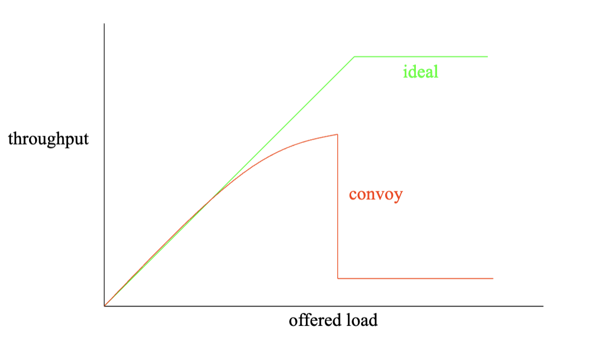

# Week 5 Notes

## Lecture 9: Mutual Exclusion and Asynchronous Completion

- Mutual exclusion
  - Critical sections can cause trouble when more than one thread executes them at a time
    - Each thread doing part of the critical section before any of them do all of it
  - Preventable if we ensure that only one thread can execute a critical section at a time
  - We need to achieve mutual exclusion of the critical section
    - If one thread is running the critical section, the other definitely isn't
- Critical sections in applications
  - Most common for multithreaded applications which frequently share data structures
  - Can also happen with processes which share operating system resources like files or multiple related data structures
  - Avoidable if you don't share resources of any kind but that's not always feasible
- Recognizing critical sections
  - Generally involves updates to object state
    - May be updates to a single object
    - May be related updates to multiple objects
  - Generally involves multi-step operations
    - Object state inconsistent until operation finishes
    - Pre-emption compromises object or operation
  - Correct operation requires mutual exclusion
    - Only one thread at a time has access to object(s)
    - Client 1 completes before client 2 starts
- Critical sections and atomicity
  - Using mutual exclusion allows us to achieve atomicity of a critical section
  - Atomicity has two aspects:
    - Before or after atomicity
      - A enters critical section before B starts
      - B enters critical section after A completes
      - There is no overlap
    - All or none atomicity
      - An update that starts will complete or will be undone
      - An uncompleted update has no effect
    - Correctness generally requires both
- Options for protecting critical sections
  - Turn off interrupts
    - Not available for applications, limits all concurrency
  - Avoid shared data whenever possible
    - Often impossible
  - Protect critical sections using hardware mutual exclusion
    - In particular, atomic CPU instructions
    - Also often impossible
  - Software locking
- Avoiding shared data
  - A good design choice when feasible
  - Don't share things you don't need to share
  - But not always an option
  - Even if possible, may lead to inefficient resource use
  - Sharing read only data also avoids problems
    - If no writes, the order of reads doesn't matter
    - But a single write can blow everything out of the water
- Atomic instructions
  - CPU instructions are uninterruptible
  - What can they do?
    - Read/modify/write operations
    - Can be applied to 1-8 contiguous bytes
    - **Simple**: Increment/decrement, and/or/xor
    - **Complex**: Test-and-set, exchange, compare-and-swap
  - Can we do an entire critical section in one instruction?
    - With careful design, some data structures can be implemented this way
    - Usually not feasible
  - Doesn't help with waiting synchronization
- Locking
  - Protect critical sections with a data structure
  - Locks
    - The party holding a lock can access the critical section
    - Parties not holding the lock cannot access it
  - A party needing to use the critical section tries to acquire the lock
    - If it succeeds, it goes ahead
  - When finished with critical section, release the lock, which someone else can then acquire
- Software locks
  - ISAs usually do not include instructions for completely building locks
    - Individual instructions are properly serialized
    - But multiple instructions are not
  - So we need to build locks in software
    - Leading to issues of enforcing their mutual exclusion
    - Which have different solutions in different cases
- How do we build locks?
  - The very operation of locking and unlocking a lock is itself a critical section
    - If we don't protect it, two threads might acquire the same lock
  - Sounds like a chicken and egg problem
  - But we can solve it with hardware assistance
  - Individual CPU instructions are atomic, so if we can implement a lock with one instruction...
- Using single instructions to build locks
  - The core operation of acquiring a lock (when it's free) requires:
    - Check that no one else has it
    - Change something so others know we have it
  - Sounds like we need to do two things in one instruction
  - No problem, hardware designers have provided for that
- Lock enforcement
  - Locking resources only works if either:
    - It's not possible to use a locked resource without the lock
    - Everyone who might use the resource carefully follows the rules
  - Otherwise, a thread might use the resource when it doesn't hold the lock
  - We'll return to practical options for enforcement later
- What happens when you don't get the lock?
  - You could just give up, but then you'll never execute your critical section
  - You could try to get it again, but it still might not be available
  - So you could try to get it yet again...
- Spin waiting
  - The computer science equivalent of "are we there yet?"
  - Check if the event occurred
  - If not, check again
  - And again
  - And again
  - ...
  - Spin waiting for a lock is called spin locking
- Spin locks: Pluses and minuses
  - Pluses
    - Properly enforces access to critical sections
      - Assuming properly implemented locks
    - Simple to program
  - Minuses
    - Wasteful
      - Spinning uses processor cycles
    - Likely to delay freeing of desired resource
      - The cycles burned could be used by the locking party to finish its work
    - Bug may lead to infinite spin-waits
- The asynchronous completion problem
  - Parallel activities move at different speeds
  - One activity may need to wait for another to complete
  - The asynchronous completion problem is: How to perform such waits without killing performance?
  - Examples of asynchronous completions
    - Waiting for an I/O operation to complete
    - Waiting for a response to a network request
    - Delaying execution for a fixed period of real time
  - Can we use spin locks for this synchronization?
- Spinning sometimes makes sense
  - When awaited operation proceeds in parallel
    - A hardware device accepts a command
    - Another core releases a briefly held spin lock
  - When awaited operation is guaranteed to happen soon
    - Spinning is less expensive than sleep/wakeup
  - When spinning doesn't delay awaited operation
    - Burning CPU delays running another process
    - Burning memory bandwidth slows I/O
  - When contention is expected to be rare
    - Multiple waiters greatly increase the cost
- Yield and spin
  - Check if your event occurred
  - Maybe check a few more times
  - But then yield
  - Sooner or later you get rescheduled
  - And then you check again
  - Repeat checking and yielding until your event is ready
  - Problems
    - Extra context switches (expensive)
    - Still wastes cycles if you spin each time you're scheduled
    - You might not get scheduled to check until long after event occurs
    - Works very poorly with multiple waiters (potential unfairness)
- Fairness and mutual exclusion
  - What if multiple processes/threads/machines need mutually exclusive access to a resource?
  - Locking can provide that
  - But can we make guarantees about fairness?
  - Such as:
    - Anyone who wants the resource gets it sooner or later (no starvation)
    - Perhaps ensuring FIFO treatment
    - Or enforcing some other scheduling discipline
- How can we wait?
  - Spin locking/busy waiting
  - Yield and spin
  - Either spin option may still require mutual exclusion and any time spent spinning is wasted
  - And fairness may be an issue
- Completion events
  - If you can't get the block, block
  - Ask the OS to wake you when the lock is available
  - Similarly for anything else you need to wait for
    - Such as I/O completion
    - Or another process to finish its work
  - Implemented with condition variables
- Condition variables
  - Create a synchronization object associated with a resource or request
  - Initially set to "event hasn't happened"
  - Requester blocks and is queued awaiting event on that object
  - Upon completion, the event is "posted"
    - Posting event to object unblocks one or more waiters for that event
  - If event is persistent, return condition variable to "event hasn't happened"
- Condition variables and the OS
  - Generally the OS provides condition variables or library code that implements threads does
  - Block a process or thread when a condition variable is used, moving it out of the ready queue
  - It observes when the desired event occurs
  - It then unlocks the blocked process or thread putting it back in the ready queue and possibly preempting the running process
- Handling multiple waits
  - Threads will wait on several different things
  - Pointless to wake up everyone on every event
    - Each should wake up only when his event happens
  - So OS (or thread package) should allow easy selection of "the right one" when some particular event occurs
  - But what if several threads are waiting for the same thing?
- Waiting lists
  - Suggests each completion event needs an associated waiting list
    - This isn't the ready queue
    - When posting an event, consult list to determine who's waiting for that event
    - Then what?
      - Wake up everyone on that event's waiting list
      - One-at-a-time in FIFO order
      - One-at-a-time in priority order (possible starvation)
    - Choice depends on event and application
- Who to wake up?
  - Who wakes up when a condition variable is signaled?
    - `pthread_cond_wait`: At least one blocked thread
    - `pthread_cond_broadcast`: All blocked threads
  - The broadcast approach may be wasteful
    - If the event can only be consumed once
    - Potentially unbounded waiting times
  - A waiting queue would solve these problems
    - Each post wakes up the first client on the queue
- Locking and waiting lists
  - Spinning for a lock is usually a bad thing
    - Locks should probably have waiting lists
  - A waiting list is a (shared) data structure
    - Implementation will likely have critical sections, which may need to be protected by a lock
  - This seems like a circular dependency
    - Locks have waiting lists
    - Which must be protected by locks
    - What if we must wait for the waiting list lock?
    - Where does it end?
- A sleep/wakeup race
  - Let's say thread B has locked a resource and thread A needs to get that lock
  - So thread A will call `sleep()` to wait for the lock to be free
  - Meanwhile, thread B finishes using the resource so thread B will call `wakeup()` to release the lock
  - No other threads are waiting for the resource
- Solving the problem
  - There's clearly a critical section in `sleep()`
    - Starting before we test the posted flag
    - Ending after we put ourselves on the notify list and block
  - During this section, we need to prevent:
    - Wakeups of the event
    - Other people waiting on the event
  - This is a mutual-exclusion problem
    - We just need a lock
- Conclusion
  - Two classes of synchronization problems:
    - **Mutual exclusion**: Only allow one of several activities to happen at once
    - **Asynchronous completion**: Properly synchronize cooperating events
    - Locks are one way to assure mutual exclusion
    - Spinning and completion events are ways to handle asynchronous completions

## 28. [Locks](https://pages.cs.wisc.edu/~remzi/OSTEP/threads-locks.pdf)

- Locks: The basic idea
  ```
  lock_t mutex; // some globally-allocated lock 'mutex'
  ...
  lock(&mutex);
  balance = balance + 1;
  unlock(&mutex);
  ```
  - You must declare a lock variable of some kind
  - Either available (or unlocked or free) and thus no thread holds the lock, or acquired (or locked or held), and exactly one thread holds the lock and presumably is in a critical section
  - The thread that holds the lock and enters the critical section is said to be the owner of the lock
  - Calling the routine `lock()` tries to acquire the lock
    - If no other thread holds the lock, the thread will acquire the lock and enter the critical section
  - If another thread then calls `lock()` on that same lock variable, it will not return while the lock is held by another thread
  - Once the owner of the lock calls `unlock()`, the lock is now available again
  - If no other threads are waiting for the lock, the state of the lock is changed to free
  - If there are waiting threads, one of them will notice this change of the lock's state, acquire the lock, and enter the critical section
- Pthread locks
  - **Mutex**: The name that the POSIX library uses for a lock, since a lock is used to provide mutual exclusion between threads
  ```
  pthread_mutex_t lock = PTHREAD_MUTEX_INITIALIZER;
  Pthread_mutex_lock(&lock); // wrapper, exits on failure
  balance = balance + 1;
  Pthread_mutex_unlock(&lock);
  ```
  - **Coarse-grained locking strategy**: Using one big lock that is used any time any critical section is accessed
  - **Fine-grained locking strategy**: Use different locks to protect different data and data structures
- Evaluating locks
  - **Mutual exclusion**: Does the lock work, preventing multiple threads from entering a critical section?
  - **Fairness**: Does each thread contending for the lock get a fair shot at acquiring it once it's free?
  - **Performance**: The time overheads added by using the lock
    - No contention
    - Multiple threads are contending
    - Multiple CPUs
- Controlling interrupts
  - Simple
  - Requires us to allow any calling thread to perform a privileged operation and trust that the facility is not abused (trust not good)
  - Does not work on multiprocessors
  - Can lead to interrupts becoming lost, which can lead to serious systems problems
- A failed attempt: Just using loads/stores
  - Single flag variable
  - If another thead happens to call `lock()` while the first thread is in the critical section, it will spin-wait in the while loop for that thread to call `unlock()` and clear the flag
  - Problems
    - Correctness
      - Because it's running concurrently, it might be possible for both threads to set the flag to 1 and enter the critical section
  - Performance
    - **Spin-waiting**: The thread endlessly checks the value of a flag
    - Wastes time waiting for another thread to release a lock
- Building working spin locks with test-and-set
  - Test-and-set / atomic exchange
  - Returns the old value pointed to by `old_ptr` and updates said value to `new`
  - It enables you to "test" the old value (which is what's returned) while simultaneously "setting" the memory location to a new value
  - The simplest type of lock to build and spins using CPU cycles until the lock becomes available
  - To work correctly on a single processor, it requires a preemptive scheduler
- Evaluating spin locks
  - **Correctness**: Yes
  - **Fairness**: Spin locks don't provide any fairness guarantees
    - A thread spinning may spin forever, under contention
  - **Performance**:
    - **Single CPU**: Performance overheads can be quite painful
    - **Multiple CPUs**: Works reasonably well (if the number of threads roughly equals the number of CPUs)
- Compare-and-swap
  - Compare-and-exchange
  - Test whether the value at the address specified by `ptr` is equal to `expected`
    - If so, update the memory location pointed to by `ptr` with the new value
    - If not, do nothing
    - In either case, return the original value at that memory location, allowing the code calling compare-and-swap to know whether it succeeded or not
  - Checks if the flag is 0 and if so, atomically swaps in a 1 thus acquiring the lock
  ```
  void lock(lock_t *lock) {
    while (CompareAndSwap(&lock->flag, 0, 1) == 1)
      // spin
  }
  ```
- Load-linked and store-conditional
  - The load-linked and store-conditional instructions can be used in tandem to build locks and other concurrent structures
  - **Load-linked**: Fetches a value from memory and places it in a register
  - **Store-conditional**: Only succeeds (and updates the value stored at the address just load-linked from) if no intervening store to the address has taken place
    - On success, returns 1 and updates the value at `ptr` to `value`
    - If it fails, the value at `ptr` is not updated and 0 is returned
  ```
  void lock(lock_t *lock) {
    while (LoadLinked(&lock->flag) || !StoreConditional(&lock_>flag, 1))
      // spin
  }
  ```
- Fetch-and-add
  - Atomically increments a value while returning the old value at a particular address
  - Use to build a ticket lock
  - When a thread wishes to acquire a lock, it first does an atomic fetch-and-add on the ticket value
  - That value is now considered this thread's "turn"
  - The globally shared `lock->turn` is then used to determine which thread's turn it is
  - When `(myturn == turn)` for a given thread, it's that thread's turn to enter the critical section
  - Unlock is accomplished by incrementing the turn such that the next waiting thread (if there is one) can now enter the critical section
  - This solution ensures progress for all threads
- Too much spinning: What now?
  - These solutions can be quite inefficient
  - Any time a thread gets caught spinning, it wastes an entire time slice doing nothing but checking a value that isn't going to change
  - With N threads contending for a lock, N - 1 time slices may be wasted
- A simple approach: Just yield, baby
  - When you're going to spin, just give up the CPU to another thread
  - Call `yield()` when the thread wants to give up the CPU and let another thread run
  - Thread can be in one of three states:
    - Running
    - Ready
    - Blocked
  - Yield moves the caller from the running state to the ready state, promotes another thread to running, then deschedules itself
  - Still costly approach, the cost of a context switch can be substantial
  - Does not address starvation
- Using queues: Sleeping instead of spinning
  - The real problem with some previous approaches (other than the ticket lock) is that they leave too much to chance
  - The scheduler determines which thread runs next
    - If the scheduler makes a bad choice, a thread that runs must either spin waiting for the lock or yield the CPU immediately
  - `park()`: Puts a calling thread to sleep
  - `unpark(threadID)`: Wakes a particular thread as designated by `threadID`
  - Used to build a lock that puts a caller to sleep if it tries to acquire a held lock and wakes it when the lock is free
  - **Priority inversion**: Arises when a higher-priority task is delayed or blocked because a lower-priority task holds a resource, such as a lock, that the higher-priority task needs to proceed
    - Occurs because the lock's ownership is based on the order of acquisition rather than the priority of the tasks
    - Solutions
      - Avoid using spin locks
      - **Priority inheritance**: A higher-priority thread waiting for a lower-priority thread can temporarily boost the lower thread's priority, thus enabling it to run and overcoming the inversion
      - Ensure all threads have the same priority
  - Basically
    - We combined the old test-and-set idea with an explicit queue of lock waiters to make a more efficient lock
    - We used a queue to help control who gets the lock next and avoid starvation
  - **Wakeup/waiting race**: When the subsequent park by the first thread sleeps forever
    - By calling `setpark()`, a thread can indicate it's about to park
    - If it happens to be interrupted and another thread calls unpark before park is actually called, the subsequent park returns immediately instead of sleeping
    - A different solution could be to pass the guard into the kernel
      - The kernel could take precautions to atomically release the lock and dequeue the running thread
- Different OS, different support
  - Linux: Provides a futex (similar to the Solaris interface but provides more in-kernel functionality)
  - Each futex has associated with it a specific physical memory location and a per-futex in-kernel queue
  - `futex_wait(address, expected)`: Puts the calling thread to sleep, assuming the value at the address `address` is equal to `expected`
    - If it's not equal, the call returns immediately
  - `futex_wake(address)`: Wakes one thread that's waiting on the queue
- Two-phase locks
  - Realizes spinning can be useful, particularly if the lock is about to be released
  - In the first phase, the lock spins for a while, hoping that it can acquire the lock
  - If the lock isn't acquired during the first spin phase, a second phase is entered, where the caller is put to sleep, and only woken up when the lock becomes free later
  - It basically spins in a loop for a fixed amount of time before using futex support to sleep

## [flock(2) man page](https://man7.org/linux/man-pages/man2/flock.2.html)

- Apply or remove an advisory lock on an open file specified by `fd`
- `#include <sys/file.h>`
- `int flock(int fd, int operation)`
- `operation`
  - `LOCK_SH`: Place a shared lock - more than one process may hold a shared lock for a given file at a given time
  - `LOCK_EX`: Place an exclusive lock - only one process may hold an exclusive lock for a given file at a given time
  - `LOCK_UN`: Remote an existing lock held by this process
- A call to `flock()` may block if an incompatible lock is held by another process
  - To make a nonblocking request, include `LOCK_NB` (by ORing) with any of the above operations
- A single file may not simultaneously have both shared and exclusive locks
- Return value
  - On success, zero is returned
  - On error, -1 is returned
- Errors
  - `EBADF`: `fd` is not an open file descriptor
  - `EINTR`: While waiting to acquire a lock, the call was interrupted by delivery of a signal caught by a handler
  - `EINVAL`: `operation` is invalid
  - `ENOLCK`: The kernel ran out of memory for allocating lock records
  - `EWOULDBLOCK`: The file is locked and the `LOCK_NB` flag was selected

## [lockf(3) man page](https://man7.org/linux/man-pages/man3/lockf.3.html)

- Apply, test, or remove a POSIX lock on a section of an open file
- `#include <unistd.h>`
- `int lockf(int fd, int cmd, off_t len)`
  - `fd`: File
  - `cmd`: Action
  - `len`
    - **Positive**: The section consists of byte positions `pos..pos+len-1`
    - **Negative**: The section consists of byte positions `pos-len..pos-1`
    - `pos`: Current file position
    - **0**: The section extends from the current file position to infinity, encompassing the present and future end-of-file positions
- Valid operations
  - `F_LOCK`: Set an exclusive lock on the specified section of the file
    - If (part of) this section is already locked, the call blocks until the previous lock is released
    - If this section overlaps an earlier locked section, both are merged
    - File locks are released as soon as the process holding the locks closes some file descriptor for the file
    - A child process does not inherit these locks
  - `F_TLOCK`: Same as `F_LOCK` but the call never blocks and returns an error instead if the file is already locked
  - `F_ULOCK`: Unlock the indicated section of the file
    - This may cause a locked section to be split into two locked sections
  - `F_TEST`: Test the lock: Return 0 if the specified section is unlocked or locked by this process
    - Return -1, set `errno` to `EAGAIN` (`EACCES` on some other systems), if another process holds a lock
- Return value
  - On success, zero is returned
  - On error, -1 is returned
- Errors
  - `EACCES` or `EAGAIN`: The file is locked and `F_TLOCK` or `F_TEST` was specified, or the operation is prohibited because the file has been memory-mapped by another process
  - `EBADF`: `fd` is not an open file descriptor or `cmd` is `F_LOCK` or `F_TLOCK` and `fd` is not a writable file descriptor
  - `EDEADLK`: The command was `F_LOCK` and this lock operation would cause a deadlock
  - `EINTR`: While waiting to acquire a lock, the call was interrupted by delivery of a signal caught by a handler
  - `EINVAL`: An invalid operation was specified in `cmd`
  - `ENOLCK`: Too many segment locks open, lock table is full

## Lecture 10: Semaphores and Other Synchronization Primitives

- Semaphores
  - A theoretically sound way to implement locks
    - With important extra functionality critical to use in computer synchronization problems
    - Thoroughly studied and precisely specified
      - Not necessarily so usable, however
    - Like any theoretically sound mechanism, could be gaps between theory and implementation
  - Computation semaphores
    - Concept introduced in 1968 by Edsger Dijkstra
      - Cooperating sequential processes
    - THE classic synchronization mechanism
      - Behavior is well specified and universally accepted
      - A foundation for most synchronization studies
      - A standard reference for all other mechanisms
    - More powerful than simple locks
      - They incorporate a FIFO waiting queue
      - They have a counter rather than a binary flag
- Semaphores - operations
  - Semaphore has two parts:
    - An integer counter (initial value unspecified)
    - A FIFO waiting queue
  - P (proberen/test): “wait”
    - Decrement counter, if count >= 0, return
    - If counter < 0, add process to waiting queue
  - V (verhogen/raise): “post” or “signal”
    - Increment counter
    - If queue non-empty, wake one of the waiting process
- Using semaphores for exclusion
  - Initialize semaphore count to one (1)
    - Count reflects # threads allowed to hold lock
  - Use P/wait operation to take the lock
    - The first wait will succeed (0)
    - Subsequent waits will block (-1)
  - Use V/post operation to release the lock
    - Increment semaphore count to indicate one less waiting request (0)
    - If any threads are waiting, unblock the first in line
  - Using semaphores for notifications
    - Initialize semaphore count to zero (0)
      - Count reflects # of completed events
    - Use P/wait operation to await completion
      - If already posted, it will return immediately
      - Else all callers will block until V/post is called (-1)
    - Use V/post operation to signal completion
      - Increment the count (-1)
      - If any threads are waiting, unblock the first in line
    - One signal per wait: No broadcasts
- Counting semaphores
  - Initialize semaphore count to the number of available resources (3)
  - Use P/wait operation to consume a resource (0)
    - If available, it will return immediately
    - Else all callers will block until V/post is called (-1)
  - Use V/post operation to produce a resource
    - Increment the count ()
    - If any threads are waiting, unblock the first in line
  - One signal per wait: No broadcasts
- Limitations of semaphores
  - Semaphores are a very basic mechanism
    - They are simple, and have few features
    - More designed for proofs than synchronization
  - They lack many practical synchronization features
    - It is easy to deadlock with semaphores
    - One cannot check the lock without blocking
    - They do not support reader/writer shared access
    - No way to recover from a wedged V operation
    - No way to deal with priority inheritance
  - Nonetheless, most OSs support them
- Locking to solve high level synchronization problems
  - Mutexes and object level locking
    - Mutex
      - A Linux/Unix locking mechanism
      - Intended to lock sections of code
        - Locks expected to be held briefly
      - Typically for multiple threads of the same process
      - Low overhead and very general
    - Object level locking
      - Mutexes protect code critical sections
        - Brief durations (e.g., nanoseconds, milliseconds)
        - Other threads operating on the same data
        - All operating in a single address space
      - Persistent objects (e.g., files) are more difficult
        - Critical sections are likely to last much longer
        - Many different programs can operate on them
        - May not even be running on a single computer
      - **Solution**: Lock objects (rather than code)
        - Typically somewhat specific to object type
    - Linux file descriptor locking
      - `int flock(fd, operation)`
      - Supported operations:
        - `LOCK_SH`: Shared lock (multiple allowed)
        - `LOCK_EX`: Exclusive lock (one at a time)
        - `LOCK_UN`: Release a lock
      - Lock applies to open instances of same `fd`
        - Lock passes with the relevant `fd`
        - Distinct opens are not affected
      - Locking with `flock()` is purely advisory
        - Does not prevent reads, writes, unlinks
    - Advisory vs enforced locking
      - Enforced locking
        - Done within the implementation of object methods
        - Guaranteed to happen, whether or not user wants it
        - May sometimes be too conservative
      - Advisory locking
        - A convention that “good guys” are expected to follow
        - Users expected to lock object before calling methods
        - Gives users flexibility in what to lock, when
        - Gives users more freedom to do it wrong (or not at all)
        - Mutexes and `flocks()` are advisory locks
    - Linux ranged file locking
      - `int lockf(fd, cmd, offset, len)`
        - Supported cmds:
          - F_LOCK ... get/wait for an exclusive lock
          - F_ULOCK ... release a lock
          - F_TEST/F_TLOCK ... test, or non-blocking request
          - offset/len specifies portion of file to be locked
        - Lock applies to file (not the open instance)
          - Process specific
          - Closing any fd for the file releases for all of a process’ fds for that file
        - Locking may be enforced
          - Depending on the underlying file system
  - Problems with locking
    - Performance and overhead
      - Performance of locking
        - Locking often performed as an OS system call
          - Particularly for enforced locking
        - Typical system call overheads for lock operations
        - If they are called frequently, high overheads
        - Even if not in OS, extra instructions run to lock and unlock
      - Locking costs
        - Locking used when you need to protect critical sections to ensure correctness
        - Many critical sections are very brief, in and out in a matter of nanoseconds
        - Overhead of the locking operation may be much higher than time spent in critical section
      - What if you don't get your lock?
        - Then you block
        - Blocking is much more expensive than getting a lock (e.g., 1000x)
          - Microseconds to yield and context switch
          - Milliseconds if swapped-out or a queue forms
        - Performance depends on conflict probability
          - C_expected = (C_block _ P_conflict) + (C_get _ (1 - P_conflict))
      - What if everyone needs one resource?
        - One process gets the resource
        - Other processes get in line behind him
          - Forming a convoy
          - Processes in a convoy are all blocked waiting for the resource
        - Parallelism is eliminated
          - B runs after A finishes
          - C after B
          - And so on, with only one running at a time
        - That resource becomes a bottleneck
    - Contention
      - Convoy formation
        - In general P_conflict = 1 - (1 - (T_critical / T_total))^threads
          - Nobody else in critical section at the same time
        - Unless a FIFO queue forms
          - P_conflict = 1 - (1 - ((T_wait + T_critical) / T_total))^threads
          - Newcomers have to get into line
          - And an (already huge) T_wait gets even longer
        - If T_wait reaches the mean inter-arrival time the line becomes permanent, parallelism ceases
        - 
      - Priority inversion
        - Priority inversion can happen in priority scheduling systems that use locks
          - A low priority process P1 has mutex M1 and is preempted
          - A high priority process P2 blocks for mutex M1
          - Process P2 is effectively reduced to priority of P1
        - Depending on specifics, results could be anywhere from inconvenient to fatal
        - The pathfinder priority inversion
          - Special purpose hardware running VxWorks real time OS
          - Used preemptive priority scheduling
            - So a high priority task should get the processor
          - Multiple components shared an “information bus”
            - Used to communicate between components
            - Essentially a shared memory region
            - Protected by a mutex
        - Handling priority inversion problems
          - In a priority inversion, lower priority task runs because of a lock held elsewhere, preventing the higher priority task from running
        - Solving priority inversion
          - Temporarily increase the priority of the meteorological task
            - While the high priority bus management task was blocked by it
            - So the communications task wouldn’t preempt it
            - When lock is released, drop meteorological task’s priority back to normal
          - **Priority inheritance**: A general solution to this kind of problem
  - Solving locking problems
    - Reducing overhead
      - Not much more to be done here
      - Locking code in operating systems is usually highly optimized
      - Certainly typical users can't do better
    - Reducing contention
      - Eliminate the critical section entirely
        - Eliminate shared resource, use atomic instructions
      - Eliminate preemption during critical section
      - Reduce time spent in critical section
      - Reduce frequency of entering critical section
      - Reduce exclusive use of the serialized resource
      - Spread requests out over more resources
- Eliminating critical sections
  - Eliminate shared resource
    - Give everyone their own copy
    - Find a way to do your work without it
  - Use atomic instructions
    - Only possible for simple operations
  - Great when you can do it
  - But often you can't
- Eliminate preemption in critical section
  - If your critical section can't be preempted, no synchronization problems
  - May require disabling interrupts
    - Not always an option
- Reducing time in critical section
  - Eliminate potentially blocking operations
    - Allocate required memory before taking lock
    - Do I/O before taking or after releasing lock
  - Minimize code inside the critical section
    - Only code that is subject to destructive races
    - Move all other code out of the critical section
    - Especially calls to other routines
  - Cost: This may complicate the code
    - Unnaturally separating parts of a single operation
- Reduced frequency of entering critical section
  - Can we use critical section less often?
    - Less use of high-contention resource/operations
    - Batch operations
  - Consider “sloppy counters”
    - Move most updates to a private resource
    - Costs:
      - Global counter is not always up-to-date
      - Thread failure could lose many updates
    - Alternative:
      - Sum single-writer private counters when needed
- Remove requirement for full exclusivity
  - Read/write locks
  - Reads and writes are not equally common
    - File reads and writes: Reads/writes > 50
    - Directory search/create: Reads/writes > 1000
  - Only writers require exclusive access
  - Read/write locks
    - Allow many readers to share a resource
    - Only enforce exclusivity when a writer is active
    - Policy: When are writers allowed in?
      - Potential starvation if writers must wait for readers
- Spread requests over more resources
  - Change lock granularity
  - Coarse grained - one lock for many objects
    - Simpler, and more idiot-proof
    - Greater resource contention (threads/resource)
  - Fine grained - one lock per object (or sub-pool)
    - Spreading activity over many locks reduces contention
    - Dividing resources into pools shortens searches
    - A few operations may lock multiple objects/pools
  - TANSTAAFL
    - Time/space overhead, more locks, more gets/releases
    - Error-prone: Harder to decide what to lock when
- Lock granularity - pool vs. elements
  - Consider a pool of objects, each with its own lock
  - Most operations lock only one buffer within the pool
  - But some operations require locking the entire pool
    - Two threads both try to add buffer AA to the cache
    - Thread 1 looks for buffer B while thread 2 is deleting it
  - The pool lock could become a bottle-neck, so
    - Minimize its use
    - Reader/writer locking
    - Sub-pools ...
- The snake in the garden
  - Locking is great for preventing improper concurrent operations
  - With careful design, it can usually be made to perform well
  - But that care isn’t enough
  - If we aren’t even more careful, locking can lead to our system freezing forever
  - Deadlock

## 29. [Lock-based Concurrent Data Structures](https://pages.cs.wisc.edu/~remzi/OSTEP/threads-locks-usage.pdf)

- Introduction
  - Adding locks to a data structure to make it usable by threads makes the structure thread safe
- Concurrent counters
  - Simple but not scalable
    - Adds a single lock, which is acquired when calling a routine that manipulates the data structure and is released when returning from the call
    - Similar to a data structure built with monitors, where locks are acquired and released automatically as you call and return from object methods
    - If your data structure is too slow, you'll have to do more than add a single lock
    - **Perfect scaling**: Ideally, you'd like to see the threads complete just as quickly on multiple processors as the single thread does on one
      - Even though more work is done, it's done in parallel, and hence the time taken to complete the task isn't increased
  - Scalable counting
    - **Approximate counter**: Represents a single logical counter via numerous local physical counters, one per CPU core, as well as a single global counter
      - On a machine with four CPUs, there are four local counters and one global one
      - There are locks, one for each local counter, and one for the global counter
      - When a thread running on a given core wishes to increment the counter, it increments its local counter
      - Because each CPU has its own local counter, threads across CPUs can update local counters without contention, and thus updates to the counter are scalable
      - To keep the global counter up to date, the local values are periodically transferred to the global counter by acquiring the global lock and incrementing it by the local counter's value
      - The local counter is then reset to zero
      - How often the local-to-global transfer occurs is determined by a threshold S
        - The smaller S is, the more the counter behaves like the non-scalable counter (performance is poor but the global count is quite accurate)
        - The bigger S is, the more scalable the counter, but the further off the global value might be from the actual count (performance is excellent but the global count lags (by at most the number of CPUs multiplied by S))
- Concurrent linked lists
  - The code acquires a lock in the insert routine upon entry and releases it upon exit
  - If `malloc()` happens to fail, the code must release the lock before failing the insert
  - Scaling linked lists
    - **Hand-over-hand locking** / **lock coupling**: Instead of having a single lock for the entire list, you add a lock per node of the list
      - When traversing the list, the code first grabs the next node's lock and then releases the current node's lock
      - Enables a high degree of concurrency in list operations
      - Hard to make it faster than the simple single lock approach, as the overheads of acquiring and releasing locks for each node of a list traversal is prohibitive
- Concurrent queues
  - There are two locks, one for the head and one for the tail
  - The enqueue routine will only access the tail lock and the queue only the head lock
  - Add a dummy node, which enables the separation of head and tail operations
- Concurrent hash table
  - Uses a lock per hash bucket (each of which is represented by a list)

## 30. [Condition Variables](https://pages.cs.wisc.edu/~remzi/OSTEP/threads-cv.pdf)

- Definition and routines
  - **Condition variable**: An explicit queue that threads can put themselves on when some state of execution (condition) is not as desired (by waiting on the condition)
    - Some other thread, when it changes said state, can then wake one (or more) of those waiting threads and allow them to continue (by signaling on the condition)
  - `pthread_cond_t c;`: Declares `c` as a condition variable
  - A condition variable has two operations associated with it
    - `wait()`: Executed when a thread wishes to put itself to sleep
      - `pthread_cond_wait(pthread_cont_t *c, pthread_mutex_t *m)`
      - Takes a mutex as a parameter
        - Assumes that the mutex is locked when `wait()` is called
        - Release the lock and put the thread to sleep (atomically)
        - When the thread wakes up (after some other thread has signaled it), it must reacquire the lock before returning to the caller
        - Complexity prevents race conditions from occuring when a thread is trying to put itself to sleep
    - `signal()`: Executed when a thread has changed something in the program and wants to wake a sleeping thread waiting on this condition
      - `pthread_cond_signal(ptthread_cond_t *c)`
  - Hold the lock when calling signal or wait
  - Wait always
    - Assumes the lock is held when you call it
    - Releases said lock when putting the caller to sleep
    - Reacquires the lock just before returning
- The producer/consumer (bounded buffer) problem
  - **Producer**: Generates data items and places them in a buffer
  - **Consumer**: Grabs said items from the buffer and consumes them in some way
  - Put data into the buffer when `count` is zero (when the buffer is empty)
  - Get data from the buffer when `count` is one (when the buffer is full)
  - **Mesa semantics**: Focus is on asynchronous message passing and non-blocking operations
    - Signaling a thread only wakes them up, it's a hint that the state of the world has changed, but there's no guarantee that when the woken thread runs, the state will still be as desired
    - Virtually every system employs this
    - Always use while loops
  - **Hoare semantics**: Focus is on synchronous communication and blocking operations
    - Harder to build but provides a stronger guarantee that the woken thread will run immediately upon being woken
  - Producer threads wait on the condition empty and signals fill
  - Consumer threads wait on fill and signal empty
  - This way, a consumer can never accidentally wake a consumer and a producer can never accidentally wake a producer
  - **Spurious wakeups**: In some thread packages, due to details of the implementation, it's possible that two threads get woken up though just a single signal has taken place
    - Further reason to recheck the condition a thread is waiting on
  - Add more buffer slots so that multiple values can be produced before sleeping, and similarly multiple values can be consumed before sleeping
    - Enables more concurrency and efficiency
    - Reduces context switches
    - Allows concurrent producing/consuming to take place, increasing concurrency
  - A producer only sleeps if all buffers are currently filled
  - A consumer only sleeps if all buffers are currently empty
- Covering conditions
  - Replace `pthread_cond_signal()` with a call to `pthread_cond_broadcast()`, which wakes up all waiting threads
    - Guarantee that any threads that should be woken are
    - Negative performance impact, as we might needlessly wake up other waiting threads that will recheck the condition and then immediately go back to sleep
  - **Covering condition**: Covers all the cases where a thread needs to wake up (conservatively)

## 31. [Semaphores](https://pages.cs.wisc.edu/~remzi/OSTEP/threads-sema.pdf)

- Introduction
  - **Semaphore**: A single primitive for all things related to synchronization, can be used as both locks and condition variables
- Semaphores: A definition
  - **Semaphore**: An object with an integer value that we can manipulate with two routines
    - `sem_wait()`: Will either return right away (because the value of the semaphore was one or higher when we called `sem_wait()`), or it will cause the caller to suspend execution awaiting for a subsequent post
      - Multiple calling threads may call into `sem_wait()`, and thus all be queued waiting to be woken
      - Decrement the value of semaphore s by one
      - Wait if value of semaphore s is negative
    - `sem_post()`: Increments the value of the semaphore and then, if there is a thread waiting to be woken, wakes one of them up
    - The initial value of the semaphore determines its behavior
    - The value of the semaphore, when negative, is equal to the number of waiting threads
    ```
    #include <semaphore.h>
    sem_t s;
    sem_init(&s, 0, 1); // initialize it to the value 1, 0 indicates that the semaphore is shared between threads in the same process
    ```
- Binary semaphores (locks)
  - Initial value is 1
  - Called a binary semaphore because locks only have two states (held and not held)
  - Scheduler state
    - **Run**: The thread is running
    - **Ready**: Runnable but not running
    - **Sleep**: The thread is blocked
  - Went through some examples and what the threads do in those scenarios, not noted
- Semaphores for ordering
  - One thread is waiting for something to happen and another thread makes that something happen and then signals that it's happened, thus waking the waiting thread
  - Similar to use of condition variables
  - The parent calls `sem_wait()` and the child `sem_post()` to wait for the condition of the child finishing its execution to become true
  - Initial value is 0
  - Went through some examples and what the threads do in those scenarios, not noted
- Setting the value of a semaphore
  - Consider the number of resources you're willing to give away immediately after initialization
  - **Lock**: 1 because you're willing to have the lock locked (given away) immediately after initialization
  - **Ordering**: 0 because there's nothing to give away at the start
    - Only when the child thread is done is the resource created, at which point the value is incremented to 1
- The producer/consumer (bounded buffer) problem
  - First attempt introduces two semaphores, `empty` and `full`, which the threads will use to indicate when a buffer entry has been emptied or filled, respectively
  - The producer first waits for a buffer to become empty to put data into it, and the consumer waits for a buffer to become filled before using it
  - Use the binary semaphore and add some locks to provide mutual exclusion -> leads to a deadlock
    - The consumer holds the mutex and is waiting for the someone to signal full
    - The producer could signal full but is waiting for the mutex
  - Reduce the scope of the lock
    - Move the mutex acquire and release to be just around the critical section
    - The full and empty wait and signal code is left outside
- Reader-writer locks
  - **Inserts**: Change the state of the list
  - **Lookups**: Read the data structure
    - As long as we can guarantee that no insert is ongoing, we can allow many lookups to proceed concurrently
  - If some thread wants to update the data structure in question, it should call the new pair of synchronization operations
    - `rwlock_acquire_writelock()`: Acquire a write lock
    - `rwlock_release_writelock()`: Release it
    - Use the `writelock` semaphore to ensure that only a single writer can acquire the lock and thus enter the critical section to update the data structure in question
  - When acquiring a read lock, the reader first acquires `lock` and then increments the `readers` variable to track how many readers are currently inside the data structure
  - The important step then taken within `rwlock_acquire_readlock()` occurs when the first reader acquires the lock
    - The reader also acquires the write lock by calling `sem_wait()` on the `writelock` semaphore, and then releasing the lock by calling `sem_post()`
    - Once a reader has acquired a read lock, more readers will be allowed to acquire a read lock too
    - Any thread that wishes to acquire the write lock will have to wait until all readers are finished
    - The last one to exit the critical section calls `sem_post()` on "writelock" and thus enables a waiting writer to acquire the lock
  - Not a fair approach, often add more overhead and thus do not end up speeding up performance compared to just using simple and fast locking primitives
  - **Hill's Law**: Big and dumb is better
- The dining philosophers
  - Assume there are five philosophers sitting around a table
    - Between each pair of philosophers is a single fork (five total)
    - The philosophers each have times where they think, and don't need any forks and times where they eat
    - To eat, a philosopher needs two forks (left and right)
  - Change how forks are acquired by at least one of the philosophers
    - Philosopher 4 gets the forks in a different order than the others
    - Breaks the deadlock in the scenario where all philosophers follow the same rule
- Thread throttling
  - How can a programmer prevent too many threads from doing something at once and bogging the system down?
    - Decide upon a threshold for too many and then use a semaphore to limit the number of threads concurrently executing the piece of code in question
  - A form of admission control
  - By initializing the value of the semaphore to the maximum number of threads you wish to enter the memory-intensive region at once, and then putting a `sem_wait()` and `sem_post()` around the region, a semaphore can naturally throttle the number of threads that are ever concurrently in the dangerous region of the code
- How to implement semaphores
  - **Zemaphores**: Use one lock and one condition variable, plus a state variable to track the value of the semaphore
