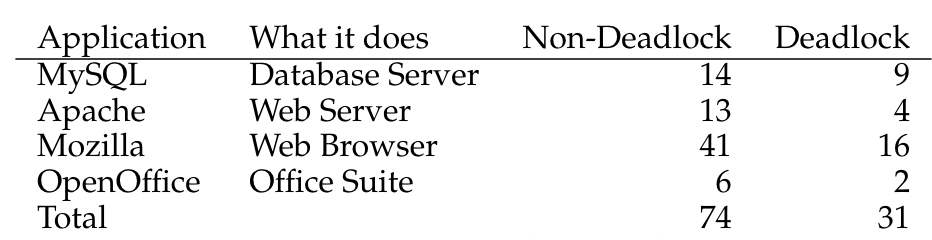

# Week 6 Notes

## Lecture 11: Deadlock - Problems and Solutions

- Deadlock
  - A situation where two entities have each locked some resource and need the other's locked resource to continue
  - Neither will unlock till they lock both resources, hence, neither can ever make progress
- Why are deadlocks important?
  - A major peril in cooperating parallel interpreters
    - They're relatively common in complex applications
    - They result in catastrophic system failures
  - Finding them through debugging is very difficult
    - They happen intermittently and are hard to diagnose
    - They're much easier to prevent at design time
  - Once you understand them, you can avoid them
    - Most deadlocks result from careless/ignorant design
    - An ounce of prevention is worth a pound of cure
- Deadlocks may not be obvious
  - Process resource needs are ever-changing, depending on:
    - What data they're operating on
    - Where in computation they are
    - What errors have happened
  - Modern software depends on many services, most of which are ignorant of one another and each of which requires numerous resources
  - Services encapsulate much complexity, so we don't know:
    - What resources they require
    - When/how they're serialized
- Deadlocks and different resource types
  - Commodity resources
    - Clients need an amount of it (e.g., memory)
    - Deadlocks result from over-commitment
    - Avoidance can be done in resource manager
  - General resources
    - Clients need a specific instance of something
      - A particular file or semaphore
      - A particular message or request completion
    - Deadlocks result from specific dependency relationships
    - Prevention is usually done at design time
- Four basic conditions for deadlocks
  - Mutual exclusion
    - The resources in question can each only be used by one entity at a time
    - If multiple entities can use a resource, then just give it to all of them
    - If only one can use it, once you've given it to one, no one else gets it until the resource holder releases it
    - P1 having the resource precludes P2 from getting it
    - You can't deadlock over a shareable resource
      - Perhaps maintained with atomic instructions
      - Even reader/writing locking can help
        - Readers can share, writers may be handled other ways
    - You can't deadlock on your private resources
      - Can we give each process its own private resource?
  - Incremental allocation
    - Processes/threads are allowed to ask for resources whenever they want, as opposed to getting everything they need before they start
    - If they must pre-allocate all resources, either:
      - They get all they need and run to completion
      - They don't get all they need and abort
      - In either case, no deadlock
    - Deadlock requires you to block holding resources while you ask for others
    - Allocate all of your resources in a single operation
      - If you can't get everything, system returns failure and locks nothing
      - When you return, you have all or nothing
    - Non-blocking requests
      - A request that can't be satisfied immediately will fail
    - Disallow blocking while holding resources
      - You must release all held locks prior to blocking
        - Could be blocking for a reason not related to resource locking
        - How can releasing locks before you block help? Won’t the deadlock just occur when you attempt to reacquire them?
          - When you reacquire them, you'll be required to do so in a single all-or-none transaction
          - Such a transaction doesn't involve hold-and-block, and so cannot result in a deadlock
      - Reacquire them again after you return
  - No pre-emption
    - When an entity has reserved a resource, you can't take it away from them, not even temporarily
    - If you can, deadlocks are simply resolved by taking someone's resource away to give to someone else
    - But if you can't take anything away from anyone, you're stuck
    - Deadlock can be broken by resource confiscation
      - Resources "leases" with time-outs and "lock breaking"
      - Resource can be seized and reallocated to new client
    - Revocation must be enforced
      - Invalidate previous owner's resource handler
      - If revocation is not possible, kill previous owner
    - Some resources may be damaged by lock breaking
      - Previous owner was in the middle of critical section
      - May need mechanisms to audit/repair resource
    - Resources must be designed with revocation in mind
    - When can the OS "seize" a resource?
      - When it can revoke access by invalidating a process's resource handle
        - If process has to use a system service to access the resource, that service can stop honoring requests
      - When can't the OS revoke a process's access to a resource?
        - If the process has direct access to the object
          - E.g., the object is part of the process's address space
          - Revoking access requires destroying the address space
          - Usually killing the process
  - Circular waiting / circular dependencies
    - A waits on B which waits on A
    - In graph terms, there's a cycle in a graph of resource requests
    - Could involve a lot more than two entities
    - But if there's no such cycle, someone can complete without anyone releasing a resource, allowing even a long chain of dependencies to eventually unwind (maybe not very fast though)
    - Use total resource ordering
      - All requesters allocate resources in same order
      - First allocate R1 and then R2 afterwards
      - Someone else may have R2 but he doesn't need R1
    - Assumes we know how to order the resources
      - By resource type (e.g., groups before members)
      - By relationship (e.g., parents before children)
    - May require a lock dance
      - Release R2, allocate R1, reacquire R2
      - List head -> buffer -> buffer -> buffer
      - List head must be locked for searching, adding, and deleting
      - Individual buffers must be locked to perform I/O and other operations
      - To avoid deadlock, we must always lock the list head before we lock an individual buffer
      - To find a desired buffer:
        - Read lock list head
        - Search for desired buffer
        - R/W lock desired buffer
        - Unlock list head
        - Return (locked) buffer
      - To delete a (locked) buffer:
        - Unlock buffer (because we can't lock the list head while we hold the buffer lock)
        - Write lock list head
        - Search for desired buffer
        - Lock desired buffer
        - Remove from list
        - Unlock list head
- Deadlock avoidance
  - Use methods that guarantee that no deadlock can occur, by their nature
  - Advance reservations for commodity resources
    - Resource manager tracks outstanding reservations and only grants reservations if resources are available
    - Over-subscriptions are detected early before processes ever get the resources
    - Client must be prepared to deal with failures but these do not result in deadlocks
  - Dilemma: Over-booking vs. under-utilization
    - Processes generally cannot perfectly predict their resource needs
    - To ensure they have enough, they tend to ask for more than they will ever need
    - Either the OS:
      - Grants requests until everything's reserved (in which case most of it won't be used)
      - Or grants requests beyond the available amount (in which case sometimes someone won't get a resource he reserved)
  - Handling reservation problems
    - Clients seldom need all resources all the time
    - All clients won't need max allocation at the same time
    - Can one safely overbook resources?
      - Ex: Seats on an airplane
    - What is a "safe" resource allocation?
      - One where everyone will be able to complete
      - Some people may have to wait for others to complete
      - We must be sure there are no deadlocks
  - Commodity resource management in real systems
    - Advanced reservation mechanisms are common
      - Memory reservations
      - Disk quotas, quality of service contracts
    - Once granted, system must guarantee reservations
      - Allocated failures only happen at reservation time
      - One hopes before the new computation has begun
      - Failures will not happen at request time
      - System behavior is more predictable, easier to handle
    - But clients must deal with reservation failures
  - Dealing with reservation failures
    - Resource reservation eliminates deadlock
    - Apps must still deal with reservation failures
      - Application design should handle failures gracefully
        - E.g., refuse to perform new request, but continue running
      - App must have a way of reporting failure to requester
        - E.g., error messages or return codes
      - App must be able to continue running
        - All critical resources must be reserved at start-up time
  - Isn't rejecting app requests bad?
    - It's not great, but it's better than failing later
    - With advance notice, app may be able to adjust service to not need the unavailable resource
    - If app is in the middle of servicing a request, we may have other resources allocated
      - And the request half-performed
      - If we fail then, all of this will have to be unwound
      - Could be complex, or even impossible
    - Deadlock prevention
      - Deadlock avoidance tries to ensure no lock ever causes deadlock
      - Deadlock prevention tries to ensure that a particular lock doesn't cause deadlock by attacking one of the four necessary conditions for deadlock
        - If any one of those conditions don't hold, no deadlock
  - Which approach should you use?
    - No universal solution to all deadlocks
      - Don't need one solution for all resources
      - Only need a solution for each resource
    - Solve each individual problem any way you can
      - Make resources sharable whenever possible
      - Use reservations for commodity resources
      - Ordered locking or no hold-and-block where possible
      - As a last resort, leases and lock breaking
    - OS must prevent deadlocks in all system services
      - Applications are responsible for their own behavior
  - One more deadlock "solution"
    - Ignore the problem
    - In many cases, deadlocks are very improbable
    - Doing anything to avoid or prevent them might be very expensive
    - So just forget about them and hope for the best
    - But what if the best doesn't happen?
- Deadlock detection and recovery
  - Allow deadlocks to occur
  - Detect them once they've happened, preferably as soon as possible after they occur
  - Do something to break the deadlock and allow someone to make progress
  - Is this a good approach? Either in general or when you don't want to avoid or prevent deadlocks?
- Implementing deadlock detection
  - To detect all deadlocks, need to identify all resources that can be locked
    - Not always clear in an OS
    - Especially if some locks are application level
  - Must maintain wait-for graph or equivalent structure
  - When lock requested, structure is updated and checked for deadlock
    - Better to just reject the lock request? And not let the requester block?
- Deadlocks outside the OS
  - Some applications use locking internally, not as an OS feature, but built into their own code
    - Ex: Database systems
      - Often allow locking of records and enforce that locking
  - The OS knows nothing of those locks and thus offers no help in handling those deadlocks
  - Deadlock detection may make sense here since the database knows of all relevant locks
    - Deadlocks here typically handled by rolling back one of the deadlocked transactions
- Not all synchronization bugs are deadlocks
  - There are lots of reasons systems hang and make no progress
  - Sometimes it really is a deadlock, sometimes it's something else
    - Livelock
    - Flaws in lock implementation
    - Simple bugs in how code operates
  - If there are no locks, it's not a deadlock
  - Even if there are locks, it might not be
- Dealing with general synchronization bugs
  - Deadlock detection seldom makes sense
    - It is extremely complex to implement
    - Only detects true deadlocks for a known resource
    - Not always clear cut what you should do if you detect one
  - Service/application health monitoring is better
    - Monitor application progress/submit test transactions
    - If response takes too long, declare service "hung"
  - Health monitoring is easy to implement, it can detect a wide range of problems
    - Deadlocks, livelocks, infinite loops and waits, crashes
- Related problems that health monitoring can handle
  - Livelock
    - Process is running but won't free R1 until it gets message
    - Process that will send the message is blocked for R1
  - Sleeping Beauty, waiting for "Prince Charming"
    - A process is blocked, awaiting some completion that will never happen
    - E.g., the sleep/wakeup race we talked about earlier
  - Priority inversion hands like the Mars Pathfinder case
  - None of these is a true deadlock
    - Wouldn't be found by a deadlock detection algorithm
    - But all leave the system just as hung as a deadlock
  - Health monitoring handles them
- How to monitor process health
  - Look for obvious failures
    - Process exits or core dumps
  - Passive observation to detect hangs
    - Is process consuming CPU time, or is it blocked?
    - Is process doing network and/or disk I/O?
  - External health monitoring
    - "Pings", null requests, standard test requests
  - Internal instrumentation
    - White box audits, exercisers, and monitoring
- What to do with "unhealthy" processes?
  - Kill and restart "all of the affected software"
  - How many and which processes to kill?
    - As many as necessary, but as few as possible
    - The hung processes may not be the ones that are broken
  - How will kills and restarts affect current clients?
    - That depends on the service APIs and/or protocols
    - Apps must be designed for cold/warm/partial restarts
  - Highly available systems define restart groups
    - Groups of processes to be started/killed as a group
    - Define inter-group dependencies (restart B after A)
- Failure recovery methodology
  - Retry if possible, but not forever
    - Client shouldn't be kept waiting indefinitely
    - Resources are being held while waiting to retry
  - Roll-back failed operations and return an error
  - Continue with reduced capacity or functionality
    - Accept requests you can handle, reject those you can't
  - Automatic restarts (cold, warm, partial)
  - Escalation mechanisms for failed recoveries
    - Restart more groups, reboot more machines
- Making synchronization easier
  - Locks, semaphores, mutexes are hard to use correctly
    - Might not be used when needed
    - Might be used incorrectly
    - Might lead to deadlock, livelock, etc
  - One approach
    - We identify shared resources (objects whose methods may require serialization)
    - We write code to operate on those objects
      - Just write the code
      - Assume all critical sections will be serialized
    - Compiler generates the serialization
      - Automatically generated locks and releases
      - Using appropriate mechanisms
      - Correct code in all required places
  - Monitors
    - Protected classes
      - Each monitor object has a mutex
        - Automatically acquired on any method invocation
        - Automatically released on method return
      - Good encapsulation
        - Developers need not identify critical sections
        - Clients need not be concerned with locking
        - Protection is completely automatic
      - High confidence of adequate protection
    - Use
    ```
    monitor CheckBook {
        // object is locked when any method is invoked
        private int balance;
        public int balance() {
            return(balance);
        }
        public int debit(int amount) {
            balance -= amount;
            return(balance);
        }
    }
    ```
    - Simplicity vs. performance
      - Monitor locking is very conservative
        - Lock the entire object on any method
        - Lock for entire duration of any method invocations
      - This can create performance problems
        - They eliminate conflicts by eliminating parallelism
        - If a thread blocks in a monitor a convoy can form
      - TANSTAAFL
        - Fine-grained locking is difficult and error prone
        - Course-grained locking creates bottle-necks
    - Java synchronized methods
      - Each object has an associated mutex
        - Only acquired for specified methods
          - Not all object methods need to be synchronized
        - Nested calls (by same thread) do not reacquire
        - Automatically released upon final return
      - Static synchronized methods lock class mutex
      - Advantage: Finer lock granularity, reduced deadlock risk
      - Cost: Developer must identify serialized methods and they still might be too conservative
      ```
      class CheckBook {
        private int balance;
        // object is not locked when this method is invoked
        public int balance() {
            return(balance);
        }
        // object is locked when this method is invoked
        public synchronized int debit(int amount) {
            balance -= amount;
            return(balance);
        }
      }
      ```
- Conclusion
  - Parallelism is necessary in modern computers to achieve high speeds
  - Parallelism brings with it many changes for serious errors
    - Generally non-deterministic errors
    - Deadlock is just one of them
  - Those working with parallel code need to understand synchronization
    - Its problems and the solutions to those problems, and the costs associated with the solutions

## 32. [Common Concurrency Problems](https://pages.cs.wisc.edu/~remzi/OSTEP/threads-bugs.pdf)

- What types of bugs exist?
  
- Non-deadlock bugs
  - Make up a majority of concurrency bugs
  - Atomicity-violation bugs
    - The desired serializability among multiple memory accesses is violated (i.e. a code region is intended to be atomic, but the atomicity is not enforced during execution)
    - **Solution**: Add locks around the shared-variable references
  - Order-violation bugs
    - The desired order between two (groups of) memory accesses is flipped (i.e., A should always be executed before B, but the order is not enforced during execution)
    - **Solution**: Enforce ordering (can use condition variables)
- Deadlock bugs
  - Occurs when a thread is holding a lock and waiting for another one, but the thread that holds the other lock is waiting for the lock to be released
  - The presence of a cycle in a graph is indicative of a deadlock
  - Why do deadlocks occur?
    - In large code bases, complex dependencies arise between components
      - Ex: Virtual memory system might need to access the file system to page in a block from disk; file system might require a page of memory to read the block into and thus contact the virtual memory system
    - Due to the nature of encapsulation
  - Conditions for deadlock
    - **Mutual exclusion**: Threads claim exclusive control of resources that they require (e.g., a thread grabs a lock)
    - **Hold-and-wait**: Threads hold resources allocated to them (e.g., locks that they have already acquired) while waiting for additional resources (e.g., locks that they wish to acquire)
    - **No preemption**: Resources (e.g., locks) cannot be forcibly removed from threads that are holding them
    - **Circular wait**: There exists a circular chain of threads such that each thread holds one or more resources (e.g., locks) that are being requested by the next thread in the chain
    - If any of these four conditions are not met, deadlock cannot occur
  - Prevention
    - Circular wait
      - Most practical prevention technique
      - Write your locking code such that you never induce a circular wait
      - Provide a total ordering on lock acquisition
        - Ex: Always acquire L1 before L2
      - In more complex systems, total lock ordering mny be difficult to achieve due to having more than two locks
        - Can use partial ordering instead
    - Hold-and-wait
      - Acquire all locks at once atomically
      ```
      pthread_mutex_lock(prevention);
      pthread_mutex_lock(L1);
      pthread_mutex_lock(L2);
      ...
      pthread_mutex_unlock(prevention);
      ```
      - By first grabbing the lock `prevention`, this code guarantees that no untimely thread switch can occur in the midst of lock acquisition
      - Requires that any time any thread grabs a lock, it first acquires the global prevention lock
      - Grabbing locks in different orders is fine
      - This approach requires us to know exactly which locks must be held and to acquire them ahead of time
      - Likely to decrease concurrency as all locks must be acquired early on (at once) instead of when they are truly needed
    - No preemption
      - `pthread_mutex_trylock()`: Either grabs the lock (if it's available) and returns success or returns an error code indicating the lock is held
      - Able to grab the locks in different orders
      - Might lead to livelock
        - Possible but unlikely that two threads could both be repeatedly attempting this sequence and repeatedly failing to acquire both locks
        - Systems are running through this code sequence over and over again but progress isn't being made
        - **Solution**: Add a random delay before looping back and trying the entire thing over again
          - Skirts around the hard parts of using a trylock approach
          - The first problem that would likely exist again arises due to encapsulation: If one of these locks is buried in some routine that is getting called, the jump back to the beginning becomes more complex to implement
          - If the code had acquired some resources other than L1 along the way, it must make sure to carefully release them as well
    - Mutual exclusion
      - **Lock-free (and related wait-free) approach**: Using powerful hardware instructions, you can build data structures in a manner that does not require explicit locking
        - Livelock is still a possibility (not sure if this is referring to the specific code example or in general)
  - Deadlock avoidance via scheduling
    - Requires some global knowledge of which locks various threads might grab during their execution and subsequently schedules said threads in a way as to guarantee no deadlock can occur
    - Basically if you know which threads need which locks, you can schedule the threads such that threads that would cause deadlocks with each other shouldn't be scheduled at the same time
    - **Tom West's Law:** Not everything worth doing is worth doing well
    - Fear of deadlock causes loss of performance
    - Ex: Dijkstra's Banker's Algorithm
  - Detect and recover
    - Allow deadlocks to occasionally occur and then take some action once such a deadlock has been detected
    - Deadlock detector runs periodically, building a resource graph and checking it for cycles
    - In the event of a cycle (deadlock), the system needs to be restarted

## [Deadlock Avoidance](https://htmlpreview.github.io/?https://github.com/markkampe/Operating-Systems-Reading/blob/master/avoidance.html)

- Introduction
  - For these cases, deadlock avoidance may be an easy and effective solution:
    - Mutual exclusion is fundamental
    - Hold and block are inevitable
    - Preemption is unacceptable
    - The resource dependency networks are imponderable
  - In situations where some process will free up resources when it completes but it needs more resources to complete, it's common to keep track of free resources and refuse to grant requests that would put the system into a dangerously resource-depleted state
  - **Deadlock avoidance**: Making such case-by-case decisions to avoid deadlocks
- Reservations
  - The failure of a random allocation request in mid-operation might be difficult to gracefully handle
  - Common to ask processes to reserve their resources before they actually need them
  - Other scenarios where we could refuse to:
    - Create new files when file system space gets low
    - Create new processes if we found ourselves thrashing due to pressure on main memory
    - Create or bind sockets when network traffic saturates our service level agreement
  - In each case there's a request (to which we can return an error) before we reach actual resource exhaustion, which helps us avoid a resource-exhaustion deadlock
- Over-booking
  - Considered relatively safe to grant somewhat more reservations than we actually have the resources to fulfill
  - Reward for over-booking is that we can get more work done with the same resources
  - Danger is that there might be a demand we can't gracefully handle
  - Ex: Airlines, network bandwidth
  - In OS, the notion of killing random processes is so abhorrent that most OS refuse to over-book and it's common to instead under-book (e.g. reserve the last 10% for emergency/super-user use)
- Dealing with rejection
  - What should a process do when some resource allocation request fails?
    - **Simple program:** Log an error message and exit
    - **Stubborn program**: Continue retrying the request (in hope that the problem is transient)
    - **Robust program:** Return errors for requests that can't be processed (for what of resources) but continue trying to serve new requests (in the hope that the problem is transient)
    - **Civic-minded program**: Attempt to reduce its resource use (and therefore the number of requests it can serve)
  - Since the allocation request failed with a clean error, the process has the opportunity to try to manage the situation in the most graceful possible way

## [Health Monitoring and Recovery](https://htmlpreview.github.io/?https://github.com/markkampe/Operating-Systems-Reading/blob/master/monitoring.html)

- How to determine if the system is deadlocked
  - Identify all of the blocked processes
  - Identify the resource on which each process is blocked
  - Identify the owner of each blocking resource
  - Determine whether or not the implied dependency graph contains any loops
- Formal deadlock detection in real systems
  - Is difficult to perform
  - Is inadequate to diagnose most hangs
  - Does not enable us to fix the problem
- Health monitoring
  - How to know whether or not the system is making progress (alert us of potential deadlock, livelock, loop, etc)
    - Have an internal monitoring agent watch message traffic or a transaction log to determine whether or not work is continuing
      - Might be able to monitor logs or statistics to determine that the service is processing requests at a reasonable rate (and perhaps even that no requests have been waiting too long)
      - If the internal monitoring agent fails, it may not be able to detect and report errors
    - Ask clients to submit failure reports to a central monitoring service when a server appears to have become unresponsive
      - Can determine whether or not the monitored application is responding to requests
      - Does not mean that some other requests have not been deadlocked or otherwise wedged
    - Have each server send periodic heart-beat messages to a central health monitoring service
      - Can only tell us that the node and application are still up and running
      - Cannot tell us if the application is actually serving requests
    - Have an external health monitoring service send periodic test requests to the service that is being monitored, and ascertain that they are being responded to correctly and in a timely fashion
      - Can determine whether or not the monitored application is responding to requests
      - Does not mean that some other requests have not been deadlocked or otherwise wedged
  - Use a combination of these methods
    - First line of defense: Internal monitoring agent that closely watches key applications to detect failures and hangs
    - If the internal monitoring agent is responsible for sending heart-beats (or health status reports) to a central monitoring agent, a failure of the internal monitoring agent will be noticed by the central monitoring agent
    - An external test service that periodically generates test transactions provides an independent assessment that might include external factors (e.g. switches, load balancers, network connectivity) that would not be tested by the internal and central monitoring services
- Managed recovery
  - The software should be designed so that any process in the system can be killed and restarted at any time
  - When a process restarts, it should be able to reestablish communication with the other processes and resume working with minimal disruption
  - The software should be designed to support multiple levels of restart
    - **Warm-start**: Restore the last saved state (from a database or from information obtained from other processes) and resume service where we left off
    - **Cold-start**: Ignore any saved state (which may be corrupted) and restart new operations from scratch
    - **Reset and reboot**: Reboot the entire system and then cold-start all of the applications
  - The software might also designed be for progressively escalating scope of restarts:
    - Restart only a single process, and expect it to resync with the other processes when it comes back up
    - Maintain a list of all of the processes involved in the delivery of a service, and restart all processes in that group
    - Restart all of the software on a single node
    - Restart a group of nodes, or the entire system
  - Gives us the opportunity to begin with minimal disruption, restarting only the process that seems to have failed
- False reports
  - Declaring a process to have failed can potentially be a very expensive operation
  - The best option would be for a failing system to detect its own problem, inform its partners, and shut-down cleanly
  - If the failure is detected by a missing heart-beat, it may be wise to wait until multiple heart-beat messages have been missed before declaring the process to have failed
  - To distinguish a problem with a monitored system from a problem in the monitoring infrastructure, we might want to wait for multiple other processes/nodes to notice and report the problem
  - Trade-offs / mark-out thresholds:
    - If we do not take the time to confirm suspected failures, we may suffer unnecessary service disruptions from forcing unnecessary fail-overs from healthy servers
    - If we mis-diagnose the cause of the problem and restart the wrong components we may make the problem even worse
    - If we wait too long before initiating fail-overs, we are prolonging the service outage
- Other managed restarts
  - Non-disruptive rolling upgrades
    - Possible if a system is capable of operating without some of its nodes
    - Take nodes down, one-at-a-time, upgrade each to a new software release, and then reintegrate them into the service
    - The new software must be up-wards compatible with the old software, so that new nodes can interoperate with old ones
    - If the rolling upgrade does not seem to be working, there needs to be an automatic fall-back option to return to the previous (working) release
  - Prophylactic reboots
    - Automatically restart every system at a regular interval (e.g. a few hours or days) to fix bugs/memory leaks that happen over time

## [Java Synchronization](https://docs.oracle.com/javase/tutorial/essential/concurrency/syncmeth.html)

- Synchronized methods
- Add `synchronized` to its declaration
- If `count` is an instance of `SynchronizedCounter`, then making these methods synchronized has two effects:
  - It is not possible for two invocations of synchronized methods on the same object to interleave
    - When one thread is executing a synchronized method for an object, all other threads that invoke synchronized methods for the same object block (suspend execution) until the first thread is done with the object
  - When a synchronized method exits, it automatically establishes a happens-before relationship with any subsequent invocation of a synchronized method for the same object
    - This guarantees that changes to the state of the object are visible to all threads
- Constructors cannot be synchronized
  - Doesn't make sense because only the thread that creates an object should have access to it while it's being constructed
- Be careful that a reference to the object doesn't leak prematurely
  - Ex: Calling `instances.add(this)` to the constructor will allow other threads to use `instances` to access the object before construction of the object is complete
- Prevents thread interference and memory consistency errors: If an object is visible to more than one thread, all reads or writes to that object's variables are done through `synchronized` methods
  - Exception: `final` fields can be safely read through non-synchronized methods, once the object is constructed

## [Java Intrinsic Lock](https://docs.oracle.com/javase/tutorial/essential/concurrency/locksync.html)

- Aka monitor lock or monitor
- Enforces exclusive access to an object's state and establishes happens-before relationships that are essential to visibility
- Every object has an intrinsic lock associated with it
- By convention, a thread that needs exclusive and consistent access to an object's fields has to acquire the object's intrinsic lock before accessing them, and then release the intrinsic lock when it's done with them
- A thread is said to own the intrinsic lock between the time it has acquired the lock and released the lock
- As long as a thread owns an intrinsic lock, no other thread can acquire the same lock
- The other thread will block when it attempts to acquire the lock
- When a thread releases an intrinsic lock, a happens-before relationship is established between that action and any subsequent acquisition of the same lock
- When a thread invokes a synchronized method, it automatically acquires the intrinsic lock for that method's object and releases it when the method returns
  - The lock release occurs even if the return was caused by an uncaught exception
- If a static synchronized method is invoked, the thead acquires the intrinsic lock for the `Class` object associated with the class
  - Access to class's static fields is controlled by a lock that's distinct from the lock for any instance of the class
- Synchronized statements
  - Must specify the object that provides the intrinsic lock
  ```
  public void addName(String name) {
      synchronized(this) {
          lastName = name;
          nameCount++;
      }
      nameList.add(name);
  }
  ```
  - Useful for improving concurrency with fine-grained synchronization
- Allowing a thread to acquire the same lock more than once enables reentrant synchronization
  - Synchronized code, directly or indirectly, invokes a method that also contains synchronized code, and both sets of code use the same lock
  - Without reentrant synchronization, synchronized code would have to take many additional precautions to avoid having a thread cause itself to block
