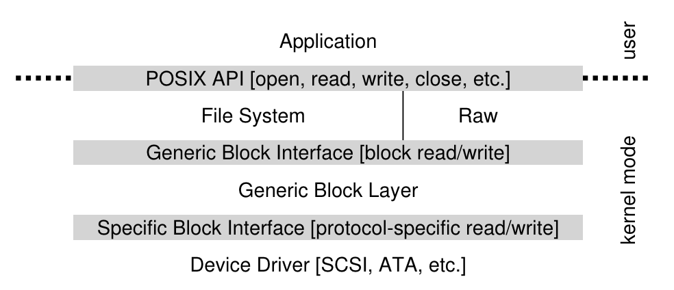

# Week 7 Notes

## Lecture 12: Devices, Device Drivers, and I/O

- Welcome to the wonderful world of peripheral devices!
  - Our computers typically have lots of devices attached to them
  - Each device needs to have some code associated with it to perform whatever operations it does and to integrate it with the rest of the system
  - In modern commodity OSes, the code that handles these devices dwarfs the rest
- Peripherals role in computers
  - Most peripherals are attached to a bus which allows other components to talk to them
  - Peripherals are built to perform certain specific commands (not arbitrary independent computations)
  - Signals on the bus to the peripheral order it to "do its thing", which is done asynchronously to other activities
  - Signals on the bus from the peripheral indicate the result
- Devices and performance
  - Most devices are very slow compared to CPU, bus, RAM (sometimes several orders of magnitude slower)
  - Leads to challenges in managing devices, primarily performance challenges
    - System must operate at CPU speeds, not device speeds
    - But often correct application behavior requires device interactions
    - System code must handle the mismatch
- Peripheral device code and the OS
  - Why are peripheral devices the OS's problem?
  - Why can't they be handled in user-level code?
  - Maybe they sometimes can, but some of them are critical for system correctness
    - E.g., the flash drive holding swap space
  - Some of them must be shared among multiple processes, which is often rather complex
  - Some of them are security-sensitive
  - Perhaps more appropriate to put the code in the OS
- Where the device driver fits in
  - At one end you have an application like a web browser
  - At the other end you have a very specific piece of hardware like an Intel Gigabit CT PCI-E Network Adapter
  - In between is the OS
  - When the application sends a message, the OS needs to invoke the proper device driver, which feeds detailed instructions to the hardware
- Device drivers
  - Generally, the code for these devices is pretty specific to them
  - It's basically code that drivers the device
    - Makes the device perform the operations it's designed for
  - So typically each system device is represented by its own piece of code (the device driver)
  - A Linux 2.6 kernel came with over 3200 of them
- Typical properties of device drivers
  - Highly specific to the particular device
    - A system only needs drivers for devices it hosts
  - Inherently modular
  - Usually interacts with the rest of the system in limited, well-defined ways
  - Their correctness is critical (device behavior correctness and overall correctness)
  - Generally written by programmers who understand the device well (but are not necessarily experts on systems issues)
- Abstractions and device drivers
  - OS defines idealized device classes
    - Flash drive, display, printer, network, etc
  - Classes define expected interfaces/behavior
    - All drivers in class support standard methods
  - Device drivers implement standard behavior
    - Make diverse devices fit into a common mold
    - Protect applications from device eccentricities
  - Abstractions regularize and simplify the chaos of the world of devices
- What can driver abstractions help with?
  - Encapsulate knowledge of how to use the device
    - Map standard operations into operations on device
    - Map device states into standard object behavior
    - Hide irrelevant behavior from users
    - Correctly coordinate device and application behavior
  - Encapsulate knowledge of optimization
    - Efficiently perform standard operations on a device
  - Encapsulate fault handling
    - Understanding how to handle recoverable faults
    - Prevent device faults from becoming OS faults
- How do device drivers fit into a modern OS?
  - There may be a lot of them
  - They're each pretty independent
  - You may need to add new ones later
  - So a pluggable model is typical
  - OS provides capabilities to plug in particular drivers in well defined ways, making it easy to change or augment later
    - Plug in the ones a given machine needs
- Layering device drivers
  - The interactions with the bus, down at the bottom, are pretty standard
    - How you address devices on the bus, coordination of signaling and data transfers, etc
    - Not too dependent on the device itself
  - The interactions with the applications, up at the top, are also pretty standard
    - Typically using some file-oriented approach
  - In between are some very device specific things
- A pictorial view
  - 
- Device drivers vs. core OS code
  - Device driver code can be in the OS, but what belongs in core OS vs. a device driver?
  - Common functionality belongs in the OS
    - Caching
    - File systems code not tied to a specific device
    - Network protocols above physical/link layers
  - Specialized functionality belongs in the drivers
    - Things that differ in different pieces of hardware
    - Things that only pertain to the particular piece of hardware
- Devices and interrupts
  - Devices are primarily interrupt-driven
    - Drivers aren't processes, thus they aren't scheduled
  - Devices work at different speed than the CPU
    - Typically often much slower
  - They can do their own work while CPU does something else
  - They use interrupts to get the CPU's attention
- Devices and busses
  - Devices are not connected directly to the CPU
  - Both CPU and devices are connected to a bus
  - Sometimes the same bus, sometimes a different bus
  - Devices communicate with CPU across the bus
  - Bus used both to send/receive interrupts and to transfer data and commands
    - Devices signal controller when they're done/ready
    - When device finishes, controller puts interrupt on bus
    - Bus then transfers interrupt to the CPU
    - Perhaps leading to movement of data
- CPUs and interrupts
  - Interrupts look very much like traps
    - Traps come from CPU
    - Interrupts are caused externally to CPU
  - Unlike traps, interrupts can be enabled/disabled by special CPU instructions
    - Device can be told when they may generate interrupts
    - Interrupt may be held pending until software is ready for it
- Device performance
  - Good device utilization
    - Key system devices limit system performance
      - File system I/O, swapping, network communication
      - These devices are much slower than the CPU
    - If device sits idle, its throughput drops
      - This may result in lower system throughput
      - Longer service queues, slower response times
    - Delays can disrupt real-time data flows resulting in unacceptable performance or possible loss of irreplaceable data
    - It's very important to keep key devices busy
      - But CPU must not be held up waiting for devices
      - Start request n+1 immediately when n finishes
  - Poor I/O device utilization
    - If the only times the device is doing work is really little
    - Idle most of the time and barely busy
  - How to achieve good utilization
    - The usual way: Exploit parallelism
    - Devices operate independently of the CPU, so a device and the CPU can operate in parallel
    - But often devices and the CPU need to access RAM
    - How to handle that?
- What's really happening on the CPU?
  - Modern CPUs try to avoid going to RAM
    - Working with registers
    - Caching on the CPU chip itself
  - If things go well, the CPU doesn't use the memory bus that much
    - If it does, life will be slow anyways, since RAM is much slower than the CPU
  - So one way to parallelize activities is to let a device use the bus instead of the CPU
- Direct Memory Access (DMA)
  - Allows any two devices attached to the memory bus to move data directly without passing it through the CPU first
  - Bus can only be used for one thing at a time, so if it's doing DMA, it's not servicing CPU requests
  - But often the CPU doesn't need it anyways
  - With DMA, data moves from device to memory at bus/device/memory speed
- Keeping key devices busy
  - Allow multiple requests to be pending at a time
    - Queue them just like processes in the ready queue
    - Requesters block to await eventual completions
  - Use DMA to perform the actual data transfers
    - Data transferred with no delay at device speed
    - Minimal overhead imposed on CPU
  - When the currently active request completes
    - Device controller generates a completion interrupt
    - OS accepts interrupt and calls appropriate handler
    - Interrupt handler posts completion to requester
    - Interrupt handler selects and initiates next transfer
- Multi-tasking and interrupt driven I/O
  - 
  - Light blue: Running user code
- Bigger transfers are better
  - Good to move a lot of data, bad to move a little data, from a performance perspective
  - Larger transfer size (bytes) leads to higher throughput (mb/s)
- Why are bigger transfers better?
  - All transfers have per-operation overhead
    - DMA-related, device-related, OS-related
    - Instructions to set up operation
    - Device time to start new operation
    - Time and cycles to service completion interrupt
  - Larger transfers have lower overhead/byte
    - This is not limited to software implementations
- I/O and buffering
  - Most I/O requests cause data to come into the memory or to be copied to a device
  - That data requires a place in memory, commonly called a buffer
  - Data in buffers is ready to send to a device
  - An existing empty buffer is ready to receive data from a device
  - OS needs to make sure buffers are available when devices are ready to use them
- OS buffering issues
  - Fewer/larger transfers are more efficient
    - They may not be convenient for applications
    - Natural record sizes tend to be relatively small
  - Operating system can consolidate I/O requests
    - Maintain a cache of recently used disk blocks
    - Accumulate small writes, flush out as blocks fill
    - Read whole blocks, deliver data as requested
  - Enables read-ahead
    - OS reads/caches blocks not yet requested
- Deep request queues
  - Having many I/O operations queued is good
    - Maintains high device utilization (little idle time)
    - Reduces mean seek distance/rotational delay for disks
    - May be possible to combine adjacent requests
    - Can sometimes avoid performing a write at all
  - Ways to achieve deep queues:
    - Many processes/threads making requests
    - Individual processes making parallel requests
    - Read-ahead for expected data requests
    - Write-back cache flushing
- Scatter/gather I/O
  - Many device controllers support DMA transfers
    - Entire transfer must be contiguous in physical memory
  - User buffers are in paged virtual memory
    - So buffers may be spread all over physical memory
    - **Scatter**: Read from device to multiple page frames
    - **Gather**: Writing from multiple page frames to device
  - Three basic approaches apply:
    - Copy all user data into physically contiguous buffer
    - Split logical request into chain-scheduled page requests
    - I/O MMU may automatically handle scatter/gather
- Gather writes from paged memory
  - 
- Scatter reads into paged memory
  - 
- Memory mapped I/O
  - DMA may not always be the best way to do I/O
    - Designed for large contiguous transfers
    - Some devices have many small sparse transfers (e.g., consider a video game display adaptor)
  - Instead, treat registers/memory in device as part of the regular memory space
    - Accessed by reading/writing those locations
  - For example, a bit-mapped display adaptor
    - 1M pixel display controller on the CPU memory bus
    - Each word of memory corresponds to one pixel
    - Application uses ordinary stores to update display
  - Low overhead per update, no interrupts to service
  - Relatively easy to program
- Trade-off: Memory mapping vs. DMA
  - DMA performs large transfers efficiently
    - Better utilization of both the devices and the CPU
      - Device doesn't have to wait for CPU to do transfers
    - But there's considerable per transfer overhead
      - Setting up the operation, processing completion interrupt
  - Memory-mapped I/O has no per-op overhead
    - But every byte is transferred by a CPU instruction
      - No waiting because device accepts data at memory speed
  - DMA better for occasional large transfers
  - **Memory-mapped**: Better frequent small transfers
  - **Memory-mapped devices**: More difficult to share
- Generalizing abstractions for device drivers
  - Every device type is unique to some extent, at least in hardware details
  - Implying each requires its own unique device driver
  - But there are many commonalities particularly among classes of devices
    - All flash drives, network cards, graphics cards, etc
  - Can we simplify the OS by leveraging these commonalities?
  - By defining simplifying abstractions?
- Providing the abstractions
  - The OS defines idealized device classes
    - Flash, display, printer, tape, network, serial ports
  - Classes define expected interfaces/behavior
    - All drivers in class support standard methods
  - Device drivers implement standard behavior
    - Make diverse devices fit into a common mold
    - Protect applications from device eccentricities
  - Interfaces (as usual) are key to providing abstractions
- Device driver interface (DDI)
  - Standard (top-end) device driver entry-points
    - **Top-end**: From the OS to the driver
    - Basis for device-independent applications
    - Enables system to exploit new devices
    - A critical interface contract for third party developers
  - Some entry points correspond directly to system calls (e.g., open close, read, write)
  - Some are associated with OS frameworks
    - Flash drivers are meant to be called by block I/O
    - Network drivers are meant to be called by protocols
- DDIs and sub-DDIs
  - 
- Standard driver classes and clients
  - 
- Drivers: Simplifying abstractions
  - Encapsulate knowledge of how to use a device
    - Map standard operations to device-specific operations
    - Map device states into standard object behavior
    - Hide irrelevant behavior from users
    - Correctly coordinate device and application behavior
  - Encapsulate knowledge of optimization
    - Efficiently perform standard operations on a device
  - Encapsulation of fault handling
    - Knowledge of how to handle recoverable faults
    - Prevent device faults from becoming OS faults
- Kernel services for device drivers
  - 
- Driver/kernel interface
  - Specifies bottom-end services OS provides to drivers
    - Things drivers can ask the kernel to do
    - Analogous to an ABI for device driver writers
  - Must be very well-defined and stable
    - To enable third party driver writers to build drivers so old drivers continue to work on new OS versions
  - Each OS has its own DKI, but they're all similar
    - Memory allocation, data transfer, and buffering
    - I/O resource (e.g., ports, interrupts) management, DMA
    - Synchronization, error reporting
    - Dynamic module support, configuration, plumbing
- Criticality of stable interfaces
  - Drivers are largely independent from the OS
    - They are built by different organizations
    - They might not be co-packaged with the OS
  - OS and drivers have interface dependencies
    - OS depends on driver implementations of DDI
    - Drivers depends on kernel DKI implementations
  - These interfaces must be carefully managed
    - Well-defined and well-tested
    - Upwards-compatible evolution
- Linux device driver abstractions
  - An example of how an OS handles device drivers
  - Basically inherited from earlier Unix systems
  - A class-based system
  - Several super-classes
    - Block devices
    - Character devices
    - Some regard network devices as a third major class
  - Other divisions within each super-class
- Why classes of drivers?
  - Classes provide a good organization for abstraction
  - They provide a common framework to reduce amount of code required for each new device
  - The framework ensure all devices in class provide certain minimal functionality
  - But a lot of driver functionality is very specific to the device, implying that class abstractions don't cover everything
- Character device superclass
  - Devices that read/write one byte at a time
    - "Character" means byte, not ASCII
  - May be either stream or record structured
  - May be sequential or random access
  - Support direct, synchronous reads and writes
  - Common examples:
    - Keyboards
    - Monitors
    - Most other devices
- Block device superclass
  - Devices that deal with a block of data at a time
  - Usually a fixed size block
  - Most common example is a disk drive
  - Reads or writes a single sized block (e.g., 4K bytes) of data at a time
  - Random access devices, accessible one block at a time
  - Support queued, asynchronous reads and writes
- Why a separate superclass for block devices?
  - Block devices span all forms of block-addressable random access storage
    - Hard disks, CDs, flash, and even some tapes
  - Such devices require some very elaborate services
    - Buffer allocation, LRU management of a buffer cache, data copying services for those buffers, scheduled I/O, asynchronous completion, etc
  - Important system functionality (file systems and swapping/paging) implemented on top of block I/O
  - Block I/O services are designed to provide very high performance for critical functions
- Network device superclass
  - Devices that send/receive data in packets
  - Originally treated as character devices
  - But sufficiently different from other character devices that some regard as distinct
  - Only used in the context of network protocols
    - Unlike other devices
    - Which leads to special characteristics
  - Typical examples are Ethernet cards, 802.11 cards, Bluetooth devices
- Identifying device drivers
  - The major device number specifies which device driver to use for it
  - Might have several distinct devices using the same drivers
    - E.g., multiple disk drives of the same type
    - Or one disk drive divided into logically distinct pieces
  - Minor device number distinguishes between those
- Accessing Linux device drivers
  - Done through the file system
  - Special files
    - Files that are associated with a device instance
    - UNIX/LINUX uses `<block/character, major, minor>`
      - Major number corresponds to a particular device driver
      - Minor number identifies an instance under that driver
      - `brw-r----- 1 root operator 14, 0 Apr 11 13:03 disk0`
        - `brw`: A block special device
        - `14`: Major number
        - `0`: Minor number
  - Opening a special file opens the associated device
    - Open/close/read/write/etc calls map to calls to appropriate entry-points of the selected driver
- Conclusion
  - Proper handling of devices is a critical part of the OS's job
  - Each device is handled by a specialized piece of software called a device driver
  - The OS uses a layered approach to get from application requests to device commands
  - Poor utilization of devices can cause serious performance problems

## 35. [A Dialogue on Persistance](https://pages.cs.wisc.edu/~remzi/OSTEP/dialogue-persistence.pdf)

- A firm or obstinate continuance in a course of action in spite of difficulty or opposition
- You have to do a lot more work to make the peach persist
- Make information persist despite computer crashes, disk failures, or power outages

## 36. [I/O Devices](https://pages.cs.wisc.edu/~remzi/OSTEP/file-devices.pdf)

- System architecture
  - CPU is attached to the main memory of the system via some kind of memory bus or interconnect
  - Some devices are connected to the system via a general I/O bus, which in many modern systems would be PCI (or one of its many derivatives)
    - Graphics and some other higher-performance I/O devices might be found here
  - Peripheral bus: SCSI, SATA, USB
    - These connect slow devices to the system, including disks, mice, and keyboards
      
  - Need a hierarchical structure because of physics and cost
    - The faster a bus is, the shorter it must be
      - A high-performance memory bus doesn't have much room to plug devices and such into it
      - Engineering a bus for high performance is quite costly
      - Components that demand high performance are nearer the CPU
  - Modern systems increasingly use specialized chipsets and faster point-to-point interconnects to improve performance
  - Keywords: DMI (Direct Media Interface), eSATA (external SATA), ATA (AT Attachment), SATA (Serial ATA), PCIe (Peripheral Component Interconnect Express), NVMe persistent storage device
    - Also check chapter for diagram
- A canonical device
  - Device has two important components
    - Hardware interface it presents to the rest of the system
      - Allows the system software to control its operation
    - Internal structure
      - Implementation specific
      - Responsible for implementing the abstraction the device presents to the system
      - Very simple devices will have one or a few hardware chips to implement their functionality
      - More complex devices will include a simple CPU, some general purpose memory, and other device-specific chips to get their job done
      - Ex: Modern RAID controllers might consist of hundreds of thousands of lines of firmware (i.e., software within a hardware device) to implement its functionality
- The canonical protocol
  - Registers
    - **Status register**: Can be read to see the current status of the device
    - **Command register**: Tell the device to perform a certain task
    - **Data register**: Pass data to the device or get data from the device
  - By reading and writing these registers, the OS can control device behavior
  - Typical interaction
  ```
  While (STATUS == BUSY)
    ; // wait until device is not busy
  Write data to DATA register
  Write command to COMMAND register
    (starts the device and executes the command)
  While (STATUS == BUSY)
    ; // wait until device is done with your request
  ```
  - OS waits until device is ready to receive a command by repeatedly reading the status register (polling)
  - OS sends some data down to the data register
  - **Programmed I/O (PIO)**: When the main CPU is involved with the data movement
  - OS writes a command to the command register
    - Doing so implicitly lets the device know that both the data is present and that it should begin working on the command
  - OS waits for the device to finish by again polling it in a loop, waiting to see if it is finished
  - Issue
    - Polling seems inefficient
      - Wastes a great deal of CPU time just waiting for the (potentially slow) device to complete its activity, instead of switching to another ready process and thus better utilizing the CPU
- Lowering CPU overhead with interrupts
  - OS can issue a request, put the calling process to sleep, and context switch to another task
  - When the device is finally finished with the operation, it'll raise a hardware interrupt, causing the CPU to jump into the OS at a predetermined interrupt service routine (ISR) / interrupt handler
  - **Handler**: Piece of OS code that will finish the request and wake the process waiting for the I/O, which can then proceed as desired
  - Interrupts allow for overlap of computation and I/O, which is key for improved utilization
  - Interrupts are not always the best solution
    - In the case where a device performs its tasks very quickly
    - Cases where a flood of interrupts may overload a system and lead it to livelock
  - If a device is:
    - **Fast**: Poll
    - **Slow**: Interrupt
    - **Unknown/varies**: Hybrid that polls for a little while, and then if the device is not finished yet, uses interrupts (two-phased)
  - Coalescing
    - A device which needs to raise an interrupt first waits for a bit before delivering the interrupt to the CPU
    - While waiting, other requests may soon complete, and thus multiple interrupts can be coalesced into a single interrupt delivery, thus lowering the overhead of interrupt processing
    - Waiting too long will increase the latency of a request
- More efficient data movement with DMA
  - When using programmed I/O (PIO) to transfer a large chunk of data to a device, the CPU is overburdened with a rather trivial task, and thus wastes a lot of time and effort that could better be spent running other processes
    - 1 (wants to write some data to the disk) -> copy -> 2 -> 1
  - **Solution**: Direct Memory Access (DMA)
    - **DMA engine**: Very specific device within a system that can orchestrate transfers between devices and main memory without much CPU intervention
    - OS programs DMA engine by telling it where the data lives in memory, how much data to copy, and which device to send it to
    - OS is done with the transfer and can proceed with other work
    - When the DMA is complete, the DMA controller raises an interrupt, and the OS thus knows the transfer is complete
    - 1 -> 2 (DMA does c, disk later does 1) -> 1
    - Copying is handled by the DMA controller
- Methods of device interaction
  - Explicit I/O instructions
    - Oldest method used by IBM mainframes for many years
    - Specify a way for the OS to send data to specific device registers and thus allow the construction of the protocols described above
    - x86: `in` and `out` can be used to communicate with devices
      - Ex: To send data to a device, the caller specifies a register with the data in it, and a specific port which names the device
    - Such instructions are usually privileged
  - Memory-mapped I/O
    - The hardware makes device registers available as if they were memory locations
    - To access a particular register, the OS issues a load (to read) or store (to write) the address
    - The hardware then routes the load/store to the device instead of main memory
    - No new instructions are needed to support it
- Fitting into the OS: The device driver
  - Want to keep the OS as general as possible
  - Build a file system that works on top of SCSI disks, IDE disks, USB keychain drives, etc
  - **Abstraction**: At the lowest level, a piece of software (device driver) in the OS must know in detail how a device works
    - Any specifics of device interaction are encapsulated within the device driver
  - 
    - Diagram shows a raw interface to devices, which enables special applications (such as a file-system checker or a disk defragmentation tool) to directly read and write blocks without using the file abstraction
  - Downsides to encapsulation:
    - If there's a device with many special capabilities but has to present a generic interface to the rest of the kernel, those special capabilities will go unused
    - Ex: Linux with SCSI devices (rich error reporting) - higher levels of software only receive generic EIO error code, any extra detail that SCSI may have provided is lost to the file system
  - Over 70% of OS code is found in device drivers
  - As drivers are often written by amateurs (instead of full-time kernel developers), they tend to have many more bugs and are thus a primary contributor to kernel crashes
- Case study: A simple IDE disk driver
  - IDE disk has four types of registers: Control, command block, status, and error
  - These registers are available by reading or writing to specific "I/O addresses" using (on x86) the `in` and `out` I/O instructions
  - Basis protocol to interact with the device, assuming it's already been initialized:
    - Wait for drive to be ready
    - Write parameters to command registers
    - Start the I/O
    - Data transfer (for writes)
    - Handle interrupts
    - Error handling
  - For more code details, check OSTEP
  - `ide_rw()`: Queues a request (if there are others pending) or issues it directly to the disk (via `ide_start_request()`)
    - The routine waits for the request to complete and the calling process is put to sleep
  - `ide_start_request()`: Used to send a request (and perhaps data, in the case of a write) to the disk
    - `in` and `out` x86 instructions are called to read and write device registers respectively
    - `ide_wait_ready()`: The start request routine uses this function to ensure the drive is ready before issuing a request to it
    - `ide_intr()`: Invoked when an interrupt takes place
      - Reads data from the device (if the request is a read, not a write), wakes the process waiting for the I/O to complete, and if there are more requests in the I/O queue, launches the next I/O via `ide_start_request()`
- Historical notes
  - Read OSTEP

## [Device Drivers: Classes and Services](https://lasr.cs.ucla.edu/classes/111_fall16/readings/device_drivers.html)

- Introduction
  - Device drivers represent both:
    - **Generalizing abstractions**: Gathering a myriad of very different devices together and synthesizing a few general classes (e.g. disks, network interfaces, graphics adaptors) and standard models, behaviors and interfaces to be implemented by all drivers for a given class
    - **Simplifying abstractions**: Providing an implementation of standard class interfaces while opaquely encapsulating the details of how to effectively and efficiently use a particular device
  - For reasons of performance and control, Operating Systems tend not to be implemented in object oriented languages
  - The number and diversity of these devices creates tremendous demands for object oriented code reuse:
    - We want the system to behave similarly, no matter what the underlying devices were being used to provide storage, networking, etc
      - To ensure this, we would like most of the higher level functionality to be implemented in common, higher level modules
    - We would like to minimize the cost of developing drivers to support new devices
      - This is most easily done if the majority of the functionality is implemented in common code that can be inherited by the individual driver
    - As system functionality and performance are improved, we would like to ensure that those benefits accrue not only to new device drivers, but also to older device drivers
  - These needs can be satisfied by implementing the higher level functionality (associated with each general class of device) in common code that uses per-device implementations of a standard sub-class driver to operate over a particular device; this requires:
    - Deriving device-driver sub-classes for each of the major classes of device
    - Defining sub-class specific interfaces to be implemented by the drivers for all devices in each of those classes
    - Creating per-device implementations of those standard sub-class interfaces
- Major driver classes
  - Block devices
    - Random-access devices, addressable in fixed size (e.g. 512 byte, 4k byte) blocks
    - Their drivers implement a `request` method to ensure asynchronous DMA requests
    - Request descriptor
      - Desired operation (e.g. byte count, target device, disk address, and in-memory buffer address)
      - Completion information (how much data was transferred, error indications)
      - Condition variable the requester could use to await the eventual completion of the request
    - A read or write request could be issued for any number of blocks, but in most cases a large request would be broken into multiple single-block requests, each of which would be passed, block at a time, through the system buffer cache
      - Also implement a `fsync` method to flush out any buffered writes
  - Character devices
    - May be sequential access or may be byte-addressable
    - Support the standard synchronous `read(2)`, `write(2)`, and (indirectly) `seek(2)` operations
    - For devices that supported DMA, read and write operations were expected to be done as a single (potentially very large) DMA transfer between the device and the buffers in user address space
  - Even in the oldest Unix systems, device drivers were divded into distinct classes (implementing different interfaces) based on the needs of distinct classes of clients
    - Block devices were designed to be used, within the operating system, by file systems, to access disks
      - Forcing all I/O to go through the system buffer cache is almost surely the right thing to do with file system I/O
    - Character devices were designed to be used directly by applications
      - The potential for large DMA transfers directly between the device and user-space buffers meant that character (or raw) I/O operations might be much more efficient than the corresponding requests to a block device
  - Block devices and character devices are not mutually exclusive
    - A single driver could export both block and character interfaces
    - A file system would be mounted on top of the block device, while back-up and integrity-checking software might access the disk through its (potentially much more efficient) character device
  - All device drivers support:
    - `initialize` and `cleanup` methods (for dynamic module loading and unloading)
    - `open` and `release` methods (roughly corresponding to the `open(2)` and `close(2)` system calls)
    - Optional catch-all `ioctl(2)` method
  - 
  - In more contemporary systems, it is possible for a client to specify that block I/O should not be passed through the system buffer cache
- Driver sub-classes
  - As system functionality evolved, the operating system began to implement higher level services for other sub-classes of devices:
    - Input editing and output translation for terminals and virtual terminals
    - Address binding and packet sending/receipt for network interfaces
    - Display mapping and window management for graphics adaptors
    - Character-set mapping for keyboards
    - Cursor positioning for pointing devices
    - Sample mixing, volume and equalization for sound devices
  - As sub-systems evolved, new device driver methods were defined to enable more effective communication between the higher level frameworks and the lower level device drivers in each sub-class
  - **Device Driver Interface (DDI)**: Sub-class specific interface
  - In some cases, the higher frameworks have been implemented in user-mode, so that some of the new interfaces have been specified as behavior rather than new methods
  - Rewards for this structure:
    - Sub-class drivers become easier to implement because so much of the important functionality is implemented in higher level software
    - The system behaves identically over a wide range of different devices
    - Most functionality enhancements to will be in the higher level code, and so should automatically work on all devices within that sub-class
  - Price for the rewards is that all device drivers must implement exactly the same interfaces:
    - If a driver does not (correctly) implement the standard interfaces for its device sub-class, it will not work with the higher level software
    - If a driver implements additional functionality (not defined in the standard interfaces for its device sub-class), those features will not be exploited by the standard higher level software
- Service for device drivers
  - Nearly impossible to implement a completely self-contained device driver
  - Most device drivers are likely to require a range of resources and services from the operating system:
    - Dynamic memory allocation
    - I/O and bus resource allocation and management
    - Condition variable operations (wait and signal)
    - Mutual exclusion
    - Control of, and being called to service interrupts
    - DMA target pin/release, scatter/gather map management
    - Configuration/registry services
  - **Driver-Kernel Interface (DKI)**: The collection of services, exposed by the operating system for use by device drivers
    - Interface stability for DKI functions is every bit as important as it is for the DDI entry points
    - If an operating system eliminates or incompatibly changes a DKI function, device drivers that depend on that function may cease working
    - The requirement to maintain stable DKI entry points may greatly constrain our ability to evolve our operating system implementation
    - Similar issues arise for other classes of dynamically loadable kernel modules (such as network protocols and file systems)
  - Unlike traditional class derivation, where sub-class implementations inherit most of their implementation from their parent, we see a different sort of inheritance
    - While each new sub-class and instance is likely to be a new implementation, what they inherit is pre-existing higher level frameworks that do do most of their work for them

## [Dynamically Loadable Kernel Modules](https://lasr.cs.ucla.edu/classes/111_fall16/readings/dynamic_modules.html)

- Introduction
  - Design systems to provide a common framework, but that expects problem-specific implementations to be provided at a later time
    - This approach is embraced by several standard design patterns (e.g. Strategy, Factory, Plug-In)
    - These approaches have a few key elements in common:
      - All implementations provide similar functionality in accordance with a common interface
      - The selection of a particular implementation can be deferred until run time
      - Decoupling the overarching service from the plug-in implementations makes it possible for a system to work with a potentially open-ended set of of algorithms or adaptors
  - In most programs the set of available implementations is locked in at build-time
  - But many systems have the ability to select and load new implementations at run time as dynamically loadable modules
    - Ex: Browser plug-ins
    - Operating systems may also support many different types of dynamically loadable modules (e.g., file systems, network protocols, device drivers)
  - Why we want device drivers to be dynamically loadable:
    - The number of possible I/O devices is far too large to build all of them in to the operating system
    - If we want an operating system to automatically work on any computer, it must have the ability to automatically identify and load the required device drivers
    - Many devices (e.g., USB) are hot-pluggable, and we cannot know what drivers are required until the the associated device is plugged in to the computer
    - New devices become available long after the operating system has been shipped, and so must be after market addable
    - Most device drivers are developed by the hardware manufacturers, and delivered to customers independently from the operating system
- Choosing which module to load
  - In the abstract, a program needs an implementation and calls a Factory to obtain it
  - How does the Factory know what implementation class to instantiate?
    - For a browser plugin, there might be a MIME-type associated with the data to be handled, and the browser can consult a registry to find the plug-in associated with that MIME-type
      - This is a very general mechanism, but it presumes that data is tagged with a type, and that somebody is maintaining a tag-to-plugin registry
    - At the other extreme, the Factory could load all of the known plug-ins and call a probe method in each to see which (if any) of the plug-ins could identify the data and claim responsibility for handling it
      - Dynamically loadable device drivers used to use this method, but it was both unreliable (might incorrectly accept the wrong device) and dangerous (touching random registers in random devices)
  - Today most I/O busses support self-identifying devices
    - Each device has type, model, and even serial number information that can be queried in a standard way (e.g., by walking the configuration space)
    - This information can be used, in combination with a device driver registry, to automatically select a driver for a given device
    - These registries may support precedence rules that can chose the best from among multiple competing drivers (e.g., a generic VGA driver, a GeForce driver, and a GeForce GTX 980 driver)
- Loading a new module
  - In many cases, the module to be loaded may be entirely self-contained (it makes no calls outside of itself) or uses only standard shared libraries (which are expected to be mapped in to the address space at well known locations)
    - In these cases loading a new module is as simple as allocating some memory (or address space) and reading the new module into it
  - In many cases (including device drivers and file systems) the dynamically loaded module may need to make use of other functions (e.g., memory allocation, synchronization, I/O) in the program into which it is being added
    - This means that the module to be loaded will (like an object module) have unresolved external references, and requires a run-time loader (a simplified linkage editor) that can look up and adjust all of those references as the new module is being loaded
    - These references can only be from the dynamically loaded module into the program into which it is loaded (e.g., the operating system)
    - The main program can never have any direct references into the dynamically loaded module because the dynamically loaded module may not always be there
- Initialization and registration
  - When the run-time loader is invoked to load a new dynamically loadable module, it is common for it to return a vector that contains a pointer to at least one method: an initialization function
  - After the module has been loaded into memory, the main program calls its initialization method
  - For a dynamically loaded device driver, the initialization method might:
    - Allocate memory and initialize driver data structures
    - Allocate I/O resources (e.g., bus addresses, interrupt levels, DMA channels) and assign them to the devices to be managed
    - Register all of the device instances it supports
      - Part of this registration would involve providing a vector (of pointers to standard device driver entry points) that client software could call in order to use these device instances
  - Device instance configuration and initialization is another area where self-identifying devices have made it much easier to implement dynamically loaded device drivers:
    - Long ago, devices were configured for particular bus addresses and interrupt levels with mechanical switches, that would be set before the card was plugged in to the bus
      - These resource assignments would be recorded in a system configuration table, which would be compiled (or read during system start-up) into the operating system, and used to select and configure corresponding device driver instances
    - More contemporary busses (like PCIe or USB) provide mechanisms to discover all of the available devices and learn what resources (e.g., bus addresses, DMA channels, interrupt levels) they require
      - The device driver can then allocate these resources from the associated bus driver, and assign the required resources to each device
- Using a dynamically loaded module
  - The operating system will provide some means by which processes can open device instances
  - In Linux the OS exports a pseudo file system (/dev) that is full of special files, each one associated with a registered device instance
    - When a process attempts to open one of those special files, the operating system creates a reference from the open file instance to the registered device instance
    - From then on, when ever the process issues a `read(2)`, `write(2)`, or `ioctl(2)` system call on that file descriptor, the operating system forwards that call to the appropriate device driver entry point
  - A similar approach is used when higher level frameworks (e.g., terminal sessions, network protocols or file systems) are implemented on top of a device
    - Each of those services maintains open references to the underlying devices, and when they need to talk to the device (e.g., to queue an I/O request or send a packet) the OS forwards that call to the appropriate device driver entry point
  - The system often maintains a table of all registered device instances and the associated device driver entry points for each standard operation
    - Whenever a request is to be made for any device, the operating system can simply index into this table by a device identifier to look up the address of the entry point to be called
    - Such mechanisms for registering heterogenous implementations and forwarding requests to the correct entry point are often referred to as federation frameworks because they combine a set of independent implementations into a single unified framework
- Unloading
  - When all open file descriptors into those devices have been closed and the driver is no-longer needed, the operating system can call an shut-down method that will cause the driver to:
    - Un-register itself as a device driver
    - Shut down the devices it had been managing
    - Return all allocated memory and I/O resources back to the operating system
  - After which, the module can be safely unloaded and that memory freed as well
- The criticality of stable interfaces
  - All of this is completely dependent on stable and well specified interfaces:
    - The set of entry-points for any class of device driver must be well defined, and all drivers must compatibly implement all of the relevant interfaces
    - The set of functions within the main program (OS) that the dynamically loaded modules are allowed to call must be well defined, and the interfaces to each of those functions must be stable
  - If one device driver did not implement a standard entry point in the standard way, clients of that device would not work
  - Some functionality may be optional, and it may be acceptable for a device driver to refuse some requests
    - But this may make the application responsible for dealing with some version incompatibilities
  - If an operating system does not implement some standard service function (e.g., memory allocation) in the standard way, a device driver written to that interface standard may not work when loaded into the non-compliant operating system
  - There is often a tension between the conflicting needs to support new hardware and software features while retaining compatibility with old device drivers
- Hot-pluggable devices and drivers
  - One of the major advantages of dynamically loadable modules is that they can be loaded at any time; not merely during start-up
  - Hot-plug busses (e.g., USB) can generate events whenever a device is added to, or removed from the bus
  - In many systems a hot-plug manager:
    - Subscribes to hot-plug events
    - When a new device is inserted, walks the configuration space to identify the new device, finds, and loads the appropriate driver
    - When a device is removed, finds the associated driver and calls its removal method to inform it that the device is no longer on the bus
  - Hot-pluggable busses often have multiple power levels, and a newly inserted device may receive only enough power to enable it to be queried and configured
    - When the driver is ready to start using the device, it can instruct the bus to fully power the device
  - Some hot-pluggable busses also have mechanical safety interlocks to prevent a device from being removed while it is still in use
    - In these cases the driver must shut down and release the device before it can be removed

## Lecture 13: File Systems

- Introduction
  - Most systems need to store data persistently so it's still there after a reboot or power down
  - Typically a core piece of functionality for the system which is going to be used all the time
  - Even the operating system itself needs to be stored this way
  - So we must store some data persistently
- Our persistent data options
  - Use raw storage blocks to store the data
    - On a hard disk, flash drive, whatever
    - Those make no sense to users
    - Not even easy for OS developers to work with
  - Use a database to store the data
    - Probably more structure (and possibly overhead) than we need or can afford
  - Use a file system
    - Some organized way of structuring persistent data
    - Which makes sense to users and programmers
- The basic file system concept
  - Organize data into natural coherent units like a paper, spreadsheet, message, program
  - Store each unit as its own self-contained entity
    - A file
    - Store each file in a way allowing efficient access
  - Provide some simple, powerful organizing principle for the collection of files
    - Making it easy to find and organize them
- File systems and hardware
  - File systems are typically stored on hardware providing persistent memory (e.g. flash drives)
  - With the expectation that a file put in one "place" will be there when we look again
  - Performance considerations will require us to match the implementation to the hardware
  - But ideally, the same user-visible file system should work on any reasonable hardware
- Flash drives
  - Solid state persistent storage devices (i.e., no moving parts)
  - Reads and writes are fairly fast (reads up to 100 mb/s and writes up to 40 mb/s)
  - But a given block can only be written once
    - Writing again requires erasing
    - Much slower and erases large sectors of the drive
- Data and metadata
  - File systems deal with two kinds of information
  - **Data**: The information that the file is actually supposed to store
    - E.g., the instructions of the program or the words in the letter
  - **Metadata**: Information about the information the file stores
    - E.g., how many bytes are there and when was it created
    - Sometimes called attributes
  - Ultimately, both data and metadata must be stored persistently and usually on the same piece of hardware
- A further wrinkle
  - We want our file system to be agnostic to the storage medium
  - Same program should access the file system the same way, regardless of medium
    - Otherwise it's hard to write portable programs
  - Should work for flash drives of different types
  - Or if we use a hard disk instead of flash, a RAID instead of one disk, if we don't use persistent memory at all (e.g. RAM file systems)
- Desirable file system properties
  - Persistence
  - Early use model
    - For accessing one file and organizing collections of files
  - Flexibility
    - No limit on number of files or file size, type, contents
  - Portability across hardware device types
  - Performance
  - Reliability
  - Suitable security
- The performance issue
  - Our file system should ideally be as fast as everything else
    - Like CPU, memory, and the bus
    - So it doesn't provide a bottleneck
  - But these devices operate at nanosecond speeds
  - Flash drives are ~1000x slower
  - Suggesting we'll need to do some serious work to hide the mismatch
- The reliability issue
  - Persistence implies reliability
  - We want our files to be there when we check, no matter what
  - So our file systems must be free of errors
    - Hardware or software
- "Suitable" security
  - Whoever owns the data should be able to control who accesses it, using some well-defined access control model and mechanism
  - With strong guarantees that the system will enforce their desired controls
    - Implying we'll check on access to the extent performance allows
- Basics of file system design
  - Where do file systems fit in the OS?
  - File control data structures
- File systems and the OS
  - 
  - **File system API**: File container operations, directory operations, file I/O
  - **Virtual file system integration layer**: A common internal interface for file systems
  - **Example file systems**: LIDF FS, DOS FS, UNIX FS, EXTS FS
  - **Non-file system services that use the same API**: Device I/O, socket I/O
- File systems and layered abstractions
  - At the top, apps think they're accessing files
  - At the bottom, various block devices are reading and writing blocks
  - There are multiple layers of abstraction in between
  - Why not translate directly from application file operations to devices' block operations?
- The file system API
  - Highly desirable to provide a single API to programmers and users for all files
  - Regardless of how the file system underneath is actually implemented
  - A requirement if one wants program portability
    - Very bad if a program won't work because there's a different file system underneath
  - Three categories of system calls here
    - File container operations
    - Directory operations
    - File I/O operations
- File container operations
  - Standard file management system calls
    - Manipulate files as objects
    - These operations ignore the contents of the file
  - Implemented with standard file system methods
    - Get/set attributes, ownership, protection, etc
    - Create/destroy files and directories
    - Create/destroy links
  - Real work happens in file system implementation
- Directory operations
  - Directories provide the organization of a file system
    - Typically hierarchical
    - Sometimes with some extra wrinkles
  - At the core, directories translate a name to a lower-level file pointer
  - Directory operations tend to be related to that
    - Find a file by name
    - Create new name/file mapping
    - List a set of known names
- File I/O operations
  - **Open**: Use name to set up an open instance
  - Read data from file and write data to file
    - Implemented using logical block fetches
    - Copy data between user space and file buffer
    - Request file system to write back block when done
  - **Seek**: Change logical offset associated with open instance
  - Map file into address space
    - File block buffers are just pages of physical memory
    - Map into address space, page it to and from file system
- The virtual file system (VFS) layer
  - Federation layer to generalize file systems
    - Permits rest of OS to treat all file systems as the same
    - Support dynamic addition of new file systems
  - Plug-in interface for file system implementations
    - DOS FAT, Unix, EXT3, ISO 9660, NFS, etc
    - Each file system implemented by a plug-in module
    - All implement same basic methods
      - Create, delete, open, close, link, unlink
      - Get/put block, get/set attributes, read directory, etc
    - Implementation is hidden from higher level clients
      - All clients see are the standard methods and properties
- The file systems layer
  - Desirable to support multiple different file systems
  - All implemented on top of block I/O
    - Should be independent of underlying devices
  - All file systems perform same basic functions
    - Map names to files
    - Map `<file, offset>` into `<device, block>`
    - Manage free space and allocate it to files
    - Create and destroy files
    - Get and set file attributes
    - Manipulate the file name space
- Why multiple file systems?
  - Why not instead choose one "good" one?
  - There may be multiple storage devices
    - E.g., hard disk and flash drive
    - They might benefit from very different file systems
  - Different file systems provide different services, despite the same interface
    - Differing reliability guarantees
    - Differing performance
    - Read-only vs. read/write
  - Different file systems used for different purposes
    - E.g., a temporary file system
- File systems and block I/O devices
  - File systems typically sit on a general block I/O layer
  - A generalization abstraction - make all hardware look the same
  - Implements standard operations on each block device
    - Asynchronous read (physical block #, buffer, bytecount)
    - Asynchronous write (physical block #, buffer, bytecount)
  - Map logical block numbers to device addresses
    - E.g., logical block number to `<cylinder, head, sector>`
  - Encapsulate all the particulars of device support
    - I/O scheduling, initiation, completion, error handlings
    - Size and alignment limitations
- Why device independent block I/O?
  - Allows unified LRU buffer cache for drive data
    - Hold frequently used data until it's needed again
    - Hold pre-fetched read-ahead data until it's requested
  - Provides buffers for data re-blocking
    - Adapting file system block size to device block size
    - Adapting file system block size to user request sizes
  - Handles automatic buffer management
    - Allocation, deallocation
    - Automatic write-back of changed buffers
- Why do we need that cache?
  - File access exhibits a high degree of reference locality at multiple levels:
    - Users often read and write parts of a single block in small operations, reusing that block
    - Users read and write the same files over and over
    - Users often open files from the same directory
    - OS regularly consults the same meta-data blocks
  - Having common cache eliminates many disk accesses, which are slow
- Why a single block I/O cache?
  - Why not one per process (or user)? Or one per device?
  - A single cache is more efficient when multiple suers access the same file
  - A single cache provides better hit ratio than several independent caches
    - Whether per process, user, or device
    - Generally true for caching, not just here
- File systems control structures
  - A file is a named collection of information
  - Primary roles of file system:
    - To store and retrieve data
    - To manage the media/space where data is stored
  - Typical operations:
    - Where is the first block of this file? Next block? Block 35?
    - Allocate a new block to the end of this file
    - Free all blocks associated with this file
- Finding data on devices
  - Essentially a question of how you manage the space on your device
  - Space management on a device is complex
    - There are millions of blocks and thousands of files
    - Files are continuously created and destroyed
    - Files can be extended after they have been written
    - Data placement may have performance effects
    - Poor management leads to poor performance
  - Must manage the space assigned to each file
    - On-device, master data structure for each file
- On-device file control structures
  - On-device description of important attributes of a file
    - Particularly where its data is located
  - Virtually all file systems have such data structures
    - Different implementations, performance, and abilities
    - Implementation can have profound effects on what the file system can do (well or at all)
    - A core design element of a file system
    - Paired with some kind of in-memory representation of the same information
- The basic file control structure problem
  - A file typically consists of multiple data blocks
  - The control structure must be able to find them
  - Preferably be able to find any of them quickly
    - I.e., shouldn't need to read the entire file to find a block near the end
  - Blocks can be changed
  - New data can be added to the file or old data deleted
- The in-memory representation
  - There's an on-disk structure pointing to device blocks (and holding other information)
  - When file is opened, an in-memory structure is created
  - Not an exact copy of the device version
    - The device version points to device blocks
    - The in-memory version points to RAM pages or indicates that the block isn't in memory
    - Also keeps track of which blocks have been written and which aren't
- In-memory structures and processes
  - What if multiple processes have the same file open? Should they share one control structure or have one each?
  - In-memory structures typically contain a cursor pointer indicating how far into the file data has been read/written
  - Sounds that should be per-process...
- Per-process or not?
  - What if cooperating processes are working with the same file?
    - They might want to share a file cursor
  - And how can we know when all processes are finished with an open file?
    - So we can reclaim space used for its in-memory descriptor
  - Implies a two-level solution
    - A structure shared by all
    - A structure shared by cooperating processes
- The Unix approach
  - 
- File system structure
  - How do I organize a device into a file system?
    - Linked extents
      - The DOS FAT file system
    - File index blocks
      - Unix System V file system
- Basics of file system structure
  - Most file systems live on block-oriented devices
  - Such volumes are divided into fixed-sized blocks
    - Many sizes are used: 512, 1024, 2048, 4096, 8192
  - Most blocks will be used to store user data
  - Some will be used to store organizing "meta-data"
    - Description of the file system (e.g., layout and state)
    - File control blocks to describe individual files
    - Lists of free blocks (not yet allocated to any file)
  - All file systems have such data structures
    - Different OSes and file systems have very different goals
    - These result in very different implementations
- The boot block
  - The 0th block of a device is usually reserved for the boot block
    - Code allowing the machine to boot an OS
    - Not just for DOS, for all OSes
  - Not usually under the control of a file system
    - It typically ignores the boot block entirely
  - Not all devices are bootable
    - But the 0th block is usually reserved, "just in case"
  - So file systems start work at block 1
- Managing allocated space
  - A core activity for a file system, with various choices
  - What if we give each file the same amount of space?
    - Internal fragmentation, just like memory
  - What if we allocate just as much as file needs?
    - External fragmentation and compaction, just like memory
  - Perhaps we should allocate space in "pages"
    - How many chunks ("pages") can a file contain?
  - The file control data structure determines this
    - It only has room for so many pointers, then file is "full"
  - So how do we want to organize the space in a file?
- Linked extents
  - A simple answer
  - File control block contains exactly one pointer to the first chunk of the file
    - Each chunk contains a pointer to the next chunk
    - Allows us to add arbitrarily many chunks to each file
  - Pointers can be in the chunks themselves
    - This takes away a little of every chunk
    - To find chunk N, you have to read the first N-1 chunks
  - Or pointers can be in auxiliary "chunk linkage" table
    - Faster searches, especially if table kept in memory
- The DOS file system
  - 
  - DOS file systems divide space into "clusters" (name for chunks)
    - Cluster size (multiple of 512) fixed for each file system
    - Clusters are numbered 1 through N
  - File control structure points to first cluster of a file
  - File Allocation Table (FAT), one entry per cluster
    - An example of a chunk linkage table
    - Contains the number of the next cluster in file
    - A 0 entry means that the cluster is not allocated
    - A -1 entry means "end of file"
  - File system is sometimes called "FAT", after the name of this key data structure
- DOS FAT clusters
  - 
- DOS file system characteristics
  - To find a particular block of a file:
    - Get number of first cluster from directory entry
    - Follow chain of points through File Allocation Table
  - Entire File Allocation Table is kept in memory
    - No disk I/O is required to find a cluster
    - For very large files the in-memory search can still be long
  - Width of FAT determines max file system size
    - How many bits describe a cluster address?
    - Originally 8 bits, eventually expanded to 32
- How big a file can the DOS file system handle?
  - There's one entry in the FAT table per cluster
    - Only clusters with entires in the FAT table exist
  - The FAT table has some maximum size
    - Kept in memory on a machine with little RAM
    - Originally 4096 entries
  - Each cluster has some size
    - Originally 512 bytes
  - Original max file size ~2^12 \* 2^9 = 2^21 = 4M bytes
- File index blocks
  - A different way to keep track of where a file's data blocks are on the device
  - A file control block points to all blocks in file
    - Very fast access to any desired block
    - But how many pointers can the file control block hold?
  - File control block could point at extent descriptors (of bigger than block size)
    - But this still gives us a fixed number of extents
- Hierarchically structured file index blocks
  - To solve the problem of file size being limited by entries in file index block, the basic file index block points to blocks
  - Some of these contain pointers which in turn point to blocks
  - Can point to many extents, but still a limit to how many
    - But that limit might be a very large number
    - Has potential to adapt to a wide range of file sizes
- Unix System V file system
  - 
- Unix inodes and block pointers
  - 
- Why is this a good idea?
  - The UNIX pointer structure seems ad hoc and complicated
  - Why not something simpler? (e.g., all inode block pointers are triple indirect)
  - File sizes are not random
    - The majority of files are only a few thousand bytes long
  - Unix approach allows us to access up to 40K bytes (assuming 4K blocks) without extra I/Os
    - Remember, the double and triple indirect blocks must be fetched off disk
- How big a file can Unix handle?
  - The on-disk inode contains 13 block pointers
    - First 10 point to first 10 blocks of file
    - 11th points to an indirect block (which contains pointers to 1024 blocks)
    - 12th points to a double indirect block (pointing to 1024 indirect blocks)
    - 13th points to a triple indirect block (pointing to 1024 double indirect blocks)
  - Assuming 4K bytes per block and 4 bytes per pointer
    - 10 direct blocks = 10 \* 4K bytes = 40K bytes
    - Indirect block = 1K \* 4K = 4M bytes
    - Double indirect = 1K \* 4M = 4G bytes
    - Triple indirect = 1K \* 4G = 4T bytes
    - At the time the system was designed, that seemed impossibly large
    - But...
- Unix inode performance issues
  - The inode is in memory whenever file is open
  - So the first ten blocks can be found with no extra I/O
  - After that, we must read indirect blocks
    - The real pointers are in the indirect blocks
    - Sequential file processing will keep referencing it
    - Block I/O will keep it in the buffer cache
  - 1-3 extra I/O operations per thousand blocks
    - Any block can be found with 3 or fewer reads

## 39. [Interlude: Files and Directories](https://pages.cs.wisc.edu/~remzi/OSTEP/file-intro.pdf)

- Introduction
  - Two key operating system abstractions
    - **Process**: Virtualization of the CPU
    - **Address space**: Virtualization of memory
    - In tandem, these two abstractions allow a program to run as if it's in its own private, isolated world and has its own memory and processor
  - **Persistent-storage device**: Stores information permanently (or at least for a long time)
    - Ex: Hard disk drive, solid-state storage drive
- Files and directories
  - Two key abstractions in the virtualization of storage
    - **File**: Linear array of bytes, each of which you can read or write
      - Has some kind of low-level name (inode number / i-number), usually a number of some kind (user is not aware of this name)
    - Directory
      - Also has a low-level name (i.e., an inode number), but its contents are quite specific
      - Contains a list of (user-readable name, low-level name) pairs
        - Ex: File with low-level name "10" and user-readable name "foo"
        - The directory that "foo" resides in would have an entry ("foo", "10") that maps the user-readable name to the low-level name
      - Each entry in a directory refers to either files or other directories
      - **Directory tree** / **directory hierarchy**: Created by placing directories within other directories, all files and directories are stored in this
        - Starts at a root directory (/) and uses some kind of separator to name subsequent sub-directories until the desired file or directory is named
          - Ex: Directory `foo` in root directory `/`, `bar.txt` in `foo`, absolute pathname is `/foo/bar.txt`
  - In most systems, the OS doesn't know much about the structure of the file (e.g., whether it's a picture, text file, or C code)
  - Responsibility of the file system is to store such data persistently on disk and make sure that when you request the data again, you get what you put there in the first place
  - Directories and files can have the same name as long as they're in different locations in the file-system tree
  - `bar.txt`
    - `bar`: Arbitrary name
    - `txt`: Used to indicate the type of the file
      - This is just a convention and not enforced
  - One great thing provided by the file system: A convenient way to name all the files we're interested in
    - Names are really important in systems as the first step to accessing any resource is being able to name it
- Creating files
  - `int fd = open("foo", O_CREAT|O_WRONLY|O_TRUNC, S_IRUSR|S_IWUSR);`
    - Creates a file called "foo" in the current working directory
    - Important to note: `open()` and passing in `O_CREAT`
    - `O_CREAT`: Creates the file if it doesn't exist
    - `O_WRONLY`: Ensures that the file can only be written to
    - `O_TRUNC`: If the file already exists, truncates it to a size of zero bytes thus removing any existing content
    - Third parameter: Specifies permissions
    - `S_IRUSR`: Makes the file readable by the owner
    - `S_IWUSR`: Makes the file writeable by the owner
    - Returns a file descriptor (integer, private per process, used in Unix systems to access files)
      - Once a file is opened, you use the file descriptor to read or write the file, assuming you have permission to do so
      - **Capability**: Opaque handle that gives you the power to perform certain operations
      - A pointer to an object of type file
        - Once you have such an object, you can call other "methods" to access the file, like `read()` and `write()`
      - Managed by the OS on a per-process basis
        - Some kind of simple structure (e.g. an array) is kept in the `proc` structure on Unix systems
        - A simple array (with a maximum of `NOFILE` open files), indexed by the file descriptor, tracks which files are opened on a per-process basis
        - Each entry of the array is a pointer to a `struct file`, which will be used to track information about the file being read or written
    - Older version: `int fd = creat("foo")`
  - `strace`: Trace which system calls a program makes, see the arguments and return codes, and generally get a very good idea of what is going on
    - `-f`: Follows any fork'd children
    - `-t`: Reports the time of day at each call
    - `-e trace=open,close,read,write`: Only traces calls to those system calls and ignores all others
    - `dstruss` on Mac
- Reading and writing files
  - On command line: use `cat` to read
    - Open the file for reading
      - First call to `open()` returns 3 since each running process already has three files open: Standard input (which the process can read to receive input), standard output (which the process can write to to dump information to the screen), and standard error (which the process can write error messages to)
      - Represented by file descriptors 0, 1, and 2 respectively
    - Repeatedly read some bytes from a file using `read()`
      - `read(3, "hello\n", 4096)`
      - **First arg**: File descriptor, tells the file system which file to read
      - **Second arg**: Points to a buffer where the result of the `read()` will be placed
      - **Third arg**: Size of the buffer (4 KB)
      - Returns the number of bytes it read (6)
    - `write(1, "hello\n", 6)`
      - Write "hello" to the screen (standard output)
      - Might call the library routine `printf()`
    - `read` returns 0 since there are no bytes left in the file
    - `close()`
  - Writing a file
    - File is opened for writing
    - `write()` is called, perhaps repeatedly for larger files
    - `close()`
  - Each process maintains an array of file descriptors, each of which refers to an entry in the system-wide open file table
    - Each entry in the table tracks which underlying file the descriptor refers to, the current offset, and other relevant details such as whether the file is readable or writeable
- Reading and writing, but not sequentially
  - **Sequential**: From beginning to end
  - Use `lseek()` to read or write to a specific offset within a file
    - `off_t lseek(int fildes, off_t offset, int whence);`
    - **First arg**: File descriptor
    - **Second arg**: Positions the file offset to a particular location within the file
    - **Third arg**: Determines exactly how the seek is performed
      - `SEEK-SET`: Offset is set to offset bytes
      - `SEEK-CUR`: Offset is set to its current location + offset bytes
      - `SEEK-END`: Offset is set to the size of the file + offset bytes
  - For each file a process opens, the OS tracks a "current" offset, which determines where the next read or write will begin reading from or writing to within the file
  - Part of the abstraction of an open file is that it has a current offset, which is updated in one of two ways
    - Read or write of N bytes take place, N is added to the current offset
      - Each read or write implicitly updates the offset
    - Explicitly with `lseek`
  - Offset is kept in the `struct file`
  - Examples of reads, return codes, and current offset
- Shared file table entires: `fork()` and `dup()`
  - In many cases, the mapping of file descriptor to an entry in the open file table is a one-to-one mapping
  - Cases where an entry in the open file table is shared
    - Parent process creates a child process with `fork()`
      - When a file table entry is shared, its reference count is incremented
      - Only when both processes close the file (or exit) will the entry be removed
    - `dup()`: Allows a process to create a new file descriptor that refers to the same underlying open file as an existing descriptor
      - Useful when writing a Unix shell and performing operations like output redirection
- Writing immediately with `fsync()`
  - `write()` tells the file system to write the data to persistent storage at some point in the future
    - The file system will buffer such writes in memory for some time
    - At that later point in time, the write(s) will be issued to the storage device
  - In a database management system (DBMS), development of a correct recovery protocol requires the ability to force writes to disk from time to time
  - `fsync(int fd)`: When a process calls `fsync()` for a particular file descriptor, the file system responds by forcing all dirty (i.e., not yet written) data to disk, for the file referred to by the specified file descriptor
    - Returns once all of these writes are complete
    - In some cases, you also need to `fsync()` the directory that contains the file `foo`
      - Ensures the file is on disk and that the file, if newly created, is durably a part of the directory
- Renaming files
  - `mv foo bar`: `foo` is renamed `bar`
    - `mv` uses `rename(char *old, char *new)`
      - Implemented as an atomic call with respect to system crashes
      - If the system crashes during the renaming, the file will either be named the old name or the new name, and no odd in-between state can arise
  - How to update the file to guarantee the new file has the original contents plus the new content
    - Write out the new version of the file under a temporary name
    - Force it to disk with `fsync()`
    - When the application is certain the new file metadata and contents are on the disk, rename the temporary file to the original file's name
      - Atomically swaps the new file into place while concurrently deleting the old version of the file
  - **Memory mapping**: Alternative way to access persistent data in files
    - `mmap()`: Creates a correspondence between byte offsets in a file (backing file) and virtual addresses in the calling page (in-memory image)
    - Process can then access the backing file using CPU instructions (i.e., loads and stores) to the in-memory image
    - By combining the persistence of files with the access semantics of memory, file-backed memory mappings support a software abstraction called persistent memory
      - Can streamline applications by eliminating translation between different data formats for memory and storage
- Getting information about files
  - Beyond file access, we expect the file system to keep a fair amount of information about each file it's storing (metadata)
  - To see the metadata for a certain file: `stat()` or `fstat()`
  - Information includes size (bytes), low-level name (inode number), some ownership information, and some information about when the file was accessed or modified, etc
  - Each file system usually keeps this type of information in a structure called an inode
  - **Inode**: Persistent data structure kept by the file system that has information like we see above (stats) inside of it
    - Reside on disk
    - Copy of active ones are usually cached in memory to speed up access
- Removing files
  - `rm`
    - Calls `unlink()` (among some other stuff)
      - Only parameter is the name of the file to be removed
      - Returns zero upon success
- Making directories
  - You can never write to a directory directly
  - Because the format of the directory is considered file system metadata, the file system considers itself responsible for the integrity of directory data
    - You can only update a directory indirectly by creating files, directories, or other object types within it
  - `mkdir()`
    - `mkdir("foo", 0777)`
    - An empty directory has two entires:
      - One entry that refers to itself (.)
      - One entry that refers to its parent (..)
- Reading directories
  - `ls`
  - To make at-home `ls`, use `opendir()`, `readdir()`, and `closedir()`
  - Information in directories:
    - File name
    - Inode number
    - Offset to the next dirent
    - Length of the record
    - Type of file
  - `ls -l` is `ls` + `stat`
- Deleting directories
  - `rmdir()`
    - The directory must be empty (only has . and ..)
    - Will fail if not empty
  - More dangerous than file deletion since you can potentially delete a large amount of data with a single command
- Hard links
  - `link()`
    - Takes an old pathname and a new one
    - When you link a new file name to an old one, you essentially create another way to refer to the same file
    - `ln`
    - Creates another name in the directory you are creating the link to and refers it to the same inode number of the original file
    - Two names refer to the same file
  - `ls -i`: Prints out the inode number of each file as well as the file name
  - When you create a file, you're doing two things:
    - Making a structure (inode) that will track virtually all relevant information about the file, including its size, where its blocks are on disk, etc
    - Linking a human-readable name to that file and putting that link into a directory
  - If you remove file1, and file2 is linked to the same file, you can still read file2
    - When the file system unlinks file1, it checks a reference count (link count) within the inode number
    - The reference count allows the file system to track how many different file names have been linked to this particular inode
    - `unlink()` removes the link between the human-readable name (the file that's being deleted) to the given inode number, and decrements the reference count
    - Only when the reference count reaches zero does the file system also free the inode and related data blocks, and thus truly delete the file
- Symbolic links
  - Aka soft link
  - You can't create hard links to a directory (for fear that you'll create a cycle in the directory tree)
  - You can't hard link to files in other disk partitions (because inode numbers are only unique within a particular file system, not across file systems)
  - `ln -s`
  - Same as hard links in that the original file can be accessed through the original file name as well as the symbolic link name
  - A symbolic link is actually a file itself, of a different type
  - The way a symbolic link is formed is by holding the pathname of the linked-to file as the data of the link file
    - If we link to a longer pathname, our link file would be bigger
  - Leave the possibility for a dangling reference
    - Removing the original file causes the link to point to a pathname that no longer exists
- Permission bits and access control lists
  - Abstraction of a process provided two central virtualizations:
    - CPU
    - Memory
  - Gave the illusion to a process that it had its own private CPU and its own private memory
  - The file system also presents a virtual view of a disk, transforming it from a bunch of raw blocks into much more user-friendly files and directories
  - Files are commonly shared among different users and processes and are not always private
    - Needs a more comprehensive set of mechanisms for enabling various degrees of sharing
      - Permission bits
        - `-rw-r--r--`
        - First character
          - `-`: Regular file
          - `-d`: Directory
          - `l`: Symbolic link
        - Groupings
          - What the owner of the file can do to it (readable and writeable)
          - What someone in a group can do to the file (readable by name after administrator)
          - What anyone (other) can do
      - AFS uses an access control list (ACL) per directory
        - Enables a user to create a very specific list of who can and cannot read a set of files
  - Can use `chmod` to change permissions (file mode)
    - To remove the ability for anyone except the owner to access the file: `chmod 600 foo.txt`
      - Enables the readable bit (4) and the writable bit (2) for the owner (OR'ing them together yields 6)
  - On local file systems, the common default is for there to be some kind of superuser (i.e., root) who can access all files regardless of privileges
  - In a distributed file system such as AFS (which has access control lists), a group called `system:administrators` contains users that are trusted to do so
  - Execute bit
    - **Regular files**: Determines whether a program can be run or not
    - **Directories**: Enables a user (or group, or everyone) to do things like change directories (i.e., `cd`) into the given directory and in combination with the writable bit, create files therein
- Making and mounting a file system
  - To make a file system, most file systems provide a tool, usually referred to as `mkfs`
    - Give the tool a device (such as a disk partition, e.g., `/dev/sdal`) and file system type (e.g., ext3) as input and it'll write an empty file system starting with a root directory onto that disk partition
  - Once such a file system is created, it needs to be made accessible within the uniform file-system tree: `mount`
    - Take an existing directory as a target mount point and paste a new file system onto the directory tree at that point
    - Example: Unmounted ext3 file system stored in device partition `/dev/sdal` that has `a` and `b`, which each hold `foo`
    - We want to mount this file system at the mount point `/home/users/`
    - `mount -t ext3 /dev/sdal /home/users`
    - `/home/users` now refers to the root of the newly-mounted directory
      - Now we have `/home/users/a`, `/home/users/b`, `/home/users/a/foo`, `/home/users/b/foo`
  - **Time Of Check To Time Of Use (TOCTTOU)**: If there exists a time interval between a validity-check and the operation connected with that validity-check, and through multitasking, the validity-check variables can deliberate be changed during this time interval, resulting in an invalid operation being performed by the control program
- Key file system terms (bottom of chapter)

## 40. [File System Implementation](https://pages.cs.wisc.edu/~remzi/OSTEP/file-implementation.pdf)

- Introduction
  - vsfs (Very Simple File System)
    - Simplified version of a typical Unix file system
    - Pure software
- The way to think
  - Data structure
    - What types of on-disk structures are utilized by the file system to organize its data and metadata?
    - **Simple structures**: Arrays of blocks or other objects
    - **Complicated structures**: Tree-base structures
  - Access methods
    - How does it map the calls made by a process, such as `open()`, `read()`, `write()`, etc, onto its structures?
    - Which structures are read during the execution of a particular system call?
    - Which are written?
    - How efficiently are all of these steps performed?
- Overall organization
  - Divide the disk into blocks
    - Simple file systems use just one block size
    - Commonly-used size 4 KB
    - Our view of the disk partition where we're building our file system is a series of blocks, each of size 4 KB
    - The blocks are addressed from 0 to N - 1, in a partition of size N 4-KB blocks
  - **Data region**: The region of the disk we use for user data
    - Most of the space in any file system is user data
    - Reserve the last 56 of 64 blocks on disk for the data region
  - **Inode table**: Holds an array of on-disk inodes
    - **Inode**: Stores metadata
      - Tracks things like which data blocks (in the data region) comprise a file, the size of the file, its owner and access rights, access and modify times, etc
      - Typically not that big, 128 or 256 bytes
    - Use 5 of our 64 blocks for inodes
    - Assuming 256 bytes per inode, a 4-KB block can hold 16 inodes, and our file system contains 80 total inodes
      - Represents the maximum number of files we can have in our file system
      - The same file system built on a larger disk could allocate a larger inode table and accomodate more files
  - **Allocation structure**: Tracks whether inodes or data blocks are free or allocated
    - Can use a free list that points to the first free block, which then points to the next free block, etc
    - We choose a simple and popular structure known as a bitmap, one for the data region (data bitmap) and one for the inode table (inode bitmap)
      - Each bit is used to indicate whether the corresponding object/block is free (0) or in-use (1)
    - 4-KB block bitmap can track whether 32K objects are allocated, which overkill, but we use an entire 4-KB block for simplicity
  - **Superblock**: Contains information about this particular file system
    - Ex: How many inodes and data blocks are in the file system, where the inode table begins, etc
    - Includes a magic number of some kind to identify the file system time (vsfs)
    - When mounting a file system, the OS will read the super block first, to initialize various parameters, and then attach the volume to the file-system tree
    - When files within the volume are accessed, the system will thus know exactly where to look for the needed on-disk structures
  - 
- File organization: The inode
  - One of the most important on-disk structures of a file system
  - All file systems have a structure similar to this
  - Short for index node
    - These nodes were originally arranged in an array, and the array indexed into when accessing a particular inode
  - **Inode**: Generic name used in many file systems to describe the structure that holds the metadata for a given file, such as its length, permissions, and the location of its constituent blocks
    - Inode number is used to index into an array of on-disk inodes to find the inode of that number
    - May be called dnodes, fnodes, etc in other systems
  - Each inode is implicitly referred to by a number (i-number), which we've earlier called the low-level name of the file
  - Given an i-number, you should directly be able to calculate where on the disk the corresponding inode is located
    - To read inode number 32, the file system would first calculate the off-set into the inode region (32 \* sizeof(inode)), add it to the start address of the inode table on disk, and arrive upon the correct byte address of the desired block of inodes
    - Disks are not byte addressable, but rather consist of a large number of addressable sectors, usually 512 bytes
    - To fetch the block of inodes that contains inode 32, the file system would issue a read to sector (20 \* 1024) / 512 to fetch the desired inode block
    ```
    blk = (inumber * sizeof(inode_t)) / blockSize;
    sector = ((blk * blockSize) + inodeStartAddr) / sectorSize;
    ```
  - Inside each inode is virtually all of the information you need about a file (metadata)
    - Type (e.g., regular file, directory, etc)
    - Size
    - Number of blocks allocated to it
    - Protection information (such as who owns the file, who can access it)
    - Time information (when the file was created, modified, last accessed)
    - Where its data blocks reside on disk (e.g., pointers of some kind)
  - One of the most important decisions in the design of the inode is how it refers to where data blocks are
    - Have one or more direct pointers (disk addresses) inside the inode
    - Each pointer refers to one disk block that belongs to the file
    - Limited approach: If you want to have a file that's really big (e.g., bigger than the block size multiplied by the number of direct pointers in the inode), you're out of luck
- The multi-level index
  - To support bigger files, file system designers had to introduce different structures within inodes
  - **Indirect pointer**: Instead of pointing to a block that contains user data, it points to a block that contains more pointers, each of which point to user data
  - An inode may have some fixed number of direct pointers and a single indirect pointer
  - If a file grows large enough, an indirect block is allocated (from the data-block region of the disk) and the inode's slot for an indirect pointer is set to point to it
  - Assuming 4-KB blocks and 4-byte disk addresses, that adds another 1024 pointers
    - The file can grow to be (12 + 1024) \* 4K
  - To support even larger files, add another pointer to the inode: Double indirect pointer
    - Refers to a block that contains pointers to indirect blocks, each of which contain pointers to data blocks
    - Double indirect block adds the possibility to grow files with an additional 1024 \* 1024 or 1 million 4KB blocks -> supports files over 4GB in size
  - Triple indirect pointer for even more
  - This imbalanced tree is referred to as the multi-level index approach to pointing to file blocks
    - Twelve direct pointers, a single and double indirect block
    - Block size of 4 KB, 4-byte pointers
    - Structure can accommodate a file of just over 4 GB in size (12 + 1024 + 1024^2) \* 4 KB
  - Truths:
    - **Most files are small**: 2K is the most common size
    - **Average file size is growing**: Almost 200K is the average
    - **Most bytes are stored in large files**: A few big files use most of space
    - **File systems contain lots of files:** Almost 100K on average
    - **File systems are roughly half full**: Even as disks grow, file systems remain ~50% full
    - **Directories are typically small**: Many have few entries; most have 20 or fewer
  - **Extent**: Disk pointer + a length (in blocks)
    - Use instead of pointers
    - Instead of requiring a pointer for every block of a file, all one needs is a pointer and a length to specify the on-disk location of a file
    - Just a single extent is limiting, as one may have trouble finding a contiguous chunk of on-disk free space when allocating a file
    - Extent-based file systems often allow for more than one extent, giving more freedom to the file system during file allocation
  - Comparison
    - **Pointer-based approach**: Most flexible, use a large amount of metadata per file (particularly for large files)
    - **Extent-based approach**: Less flexible but more compact, work well when there's enough free space on the disk and files can be laid out contiguously (which is the goal for virtually any file allocation policy anyhow)
  - Using a linked list
    - One pointer inside an inode to point to the first block of the file
    - To handle larger files, add another pointer at the end of that data block, and so on
    - Performs poorly when trying to read the last block of a file or doing random access
    - To make it perform better, keep an in-memory table of link information, instead of storing the next pointers with the data block themselves
    - Table is indexed by the address of a data block D
    - The content of an entry is D's next pointer, i.e., the address of the next block in a file which follows D
    - Null-value indicates end-of-file or some other marker to indicate that a particular block is free
    - File allocation table (FAT file system)
- Directory organization
  - Directory contains a list of (entry name, inode number) pairs
  - For each file or directory in a given directory, there's a string and a number in the data block(s) of the directory
  - For each string, there may also be a length (assuming variable-sized names)
  - Example: Directory `dir` (inode number 5) with files `foo`, `bar`, and `foobar_is_a_pretty_longname` with inode numbers 12, 13, and 24 respectively
    - 
    - Inode number, record length (total bytes for the name + leftover space), string length (actual length of the name), name of the entry
  - Deleting a file can leave an empty space in the middle of the directory, should be some way to mark that (e.g., with a reserved inode number such as zero)
    - Such a delete is one reason the record length is used: a new entry may reuse an old, bigger entry and thus have extra space within
  - Has an inode somewhere in the inode table (with the type field of the inode marked as "directory" instead of "regular file")
  - Has data blocks pointed to by the inode (and perhaps indirect blocks)
    - Data blocks live in the data block region of the simple file system
- Free space management
  - Early file systems used free lists
  - A single pointer in the super block was kept to point to the first free block
  - Inside that block the next free pointer was kept, forming a list through the free blocks of the system
  - When a block was needed, the head block was used and the list updated accordingly
  - SGI's XFS uses B-tree to compactly represent which chunks of the disk are free
  - File system must track which inodes and data blocks are free, and which are not, so that when a new file or directory is allocated, it can find space for it
  - In vsfs, use two simple bitmaps
  - When we create a file, we'll have to allocate an inode for that file
    - File system will search through the bitmap for an inode that's free and allocate it to the file
    - File system will have to mark the inode as used (1) and update the on-disk bitmap with the correct information
    - Similar activities take place when a data block is allocated
  - Pre-allocation policy
    - Look for a sequence of blocks that are free when a new file is created and needs data blocks
    - By finding a sequence of free blocks and allocating them to the newly-created file, the file system guarantees that a portion of the file will be contiguous on the disk, thus improving performance
- Access paths: Reading and writing
  - Reading a file from disk
    - Open a file, read it, and then close it
    - File is 12KB in size (3 blocks)
    - `open("/foo/bar", O_RDONLY)`: File system needs to find the inode for the file `bar` to obtain some basic information about the file (permissions information, file size, etc)
      - File system traverses the pathname and locates the desired inode
      - Traversal begins at the root of the file system, in the root directory (/)
      - The first thing the file system reads from disk is the inode of the root directory
      - To find an inode, we must know its i-number
      - Find the i-number of a file or directory in its parent directory
      - Root inode number must be "well known"
        - File system must know what it is when the file system is mounted
        - In most Unix file systems, root inode number is 2
        - File system reads in the block that contains inode number 2 (first inode block)
    - File system can look inside of the inode to find pointers to data blocks, which contain the contents of the root directory
      - File system use on-disk pointers to read through the directory to look for an entry for `foo` (and its inode number)
    - Recursively traverse the pathname until the desired inode is found
      - File system reads the block containing the inode of `foo` and then its directory data, finally finding the inode number of `bar`
    - Read `bar`'s inode into memory
    - Final permissions check
    - Allocates a file descriptor for this process in the per-process open-file table, and returns it to the user
    - Program can then issue a `read()` system call to read from the file
    - First read (at offset 0 unless `lseek()` has been called) will read in the first block of the file, consulting the inode to find the location of such a block
      - May update the inode with a new last-accessed time
    - Read will further update the in-memory open file table for this file descriptor, updating the file offset such that the next read will read the second file block, etc
    - File will be closed (at some point)
      - File descriptor should be deallocated
      - No disk I/Os take place
    - Amount of I/O generated by the open is proportional to the length of the pathname
      - For each additional directory in the path, we have to read its inode as well as its data
    - Allocation structures, such as bitmaps, are only accessed when allocation is needed
  - Writing a file to disk
    - File must be opened
    - Application can issue `write()` calls to update the file with new contents
    - File is closed
    - Writing to the file may also allocate a block (unless the block is being overwritten)
    - When writing out a new file, each write not only has to write data to disk but has to first decide which block to allocate to the file and thus update other structures of the disk accordingly (e.g., the data bitmap and inode)
    - Each write to a file logically generates five I/Os:
      - Read the data bitmap (which is then updated to mark the newly-allocated block as used)
      - Write the bitmap (to reflect its new state to disk)
      - Read and write the inode (which is updated with the new block's location) x2
      - Write the actual block itself
    - Create a file
      - File system allocates an inode and a space within the directory containing the new file
      - Total amount of I/O traffic is quite high
        - Read the inode bitmap (to find a free inode)
        - Write to the inode bitmap (to mark it allocated)
        - Write to the new inode itself (to initailize it)
        - To the data of the directory (to link the high-level name of the file to its inode number)
        - Read and write to the directory inode to update it
        - If the directory needs to grow to accommodate the new entry, additional I/Os (i.e., to the data bitmap, and the new directory block) will be needed to
      - Each allocating write costs 5 I/Os
        - A pair to read and update the inode
        - A pair to read and update the data bitmap
        - The write of the data itself
- Caching and buffering
  - To remedy all the I/Os (huge performance problem), most file systems aggressively use system memory (DRAM) to cache important blocks
  - Early file systems introduced a fixed-size cache to hold popular blocks
    - Allocated at boot time to be roughly 10% of total memory
    - Static partitioning of memory can be wasteful (10%)
    - Unused pages in the file cache cannot be repurposed for some other use and thus go to waste
    - Ensures each user receives some share of the resource
    - Usually delivers more predictable performance
    - Is often easier to implement
  - Dynamic partitioning
    - Integrate virtual memory pages and file system pages into a unified page cache
    - Memory can be allocated more flexibly across virtual memory and file system, depending on which needs more memory at a given time
    - Can achieve better utilization (by letting resource-hungry users consume otherwise idle resources)
    - Can be more complex to implement
    - Can lead to worse performance for users whose idle resources get consumed by others and then take a long time to reclaim when needed
    - File open example with caching
      - First open may generate a lot of I/O traffic to read in directory inode and data
      - Subsequent file opens of that same file (or files in the same directory) will mostly hit in the cache and thus no I/O is needed
      - Read I/O can be avoided altogether with a sufficiently large cache
    - Caching on writes / write buffering
      - Write traffic has to go to disk to become persistent
      - By delaying writes, the file system can batch some updates into a smaller set of I/Os
        - If an inode bitmap is updated when one file is created and then updated moments later as another file is created, the file system saves an I/O by delaying the write after the first update
      - System can schedule the subsequent I/Os and increase performance
      - Some writes are avoided altogether by delaying them
        - If an application creates a file and then deletes it, delaying the writes to reflect the file creation to disk avoids them entirely
      - Most modern file systems buffer writes in memory for anywhere between five and thirty seconds
        - If the system crashes before the updates have been propagated to disk, the updates are lost
        - By keeping writes in memory longer, performance can be improved by batching, scheduling, and even avoiding writes
  - Durability and performance trade-off
    - If the user wishes data that is written to be immediately durable, the system must go through the full effort of committing the newly-written data to disk, and thus the write is slow but safe
    - If the user can tolerate the loss of a little data, the system can buffer writes in memory for some time and write them later to the disk (in the background)
      - Makes writes appear to complete quickly, thus improving perceived performance
      - If a crash occurs, writes not yet committed to disk will be lost
    - Some applications (such as databases) don't like this trade-off
      - To avoid unexpected data loss due to write buffering, they force writes to disk by:
        - Calling `fsync()`
        - Using direct I/O interfaces that work around the cache
        - Using the raw disk interface and avoiding the file system altogether

## [File Types and Attributes](https://htmlpreview.github.io/?https://github.com/markkampe/Operating-Systems-Reading/blob/master/filetypes.html)

- Introduction
  - Many operating systems attempt to represent all data sources and sinks as files
  - Files
    - Byte streams or one-dimensional arrays
    - Byte streams contain highly structured data (e.g. a load module, an MPEG-4 video, or a database)
- Ordinary files
  - Data types and associated applications
    - Find the right program to interpret each file (or byte stream)
    - Require the user to specifically invoke the correct command to process the data
      - Common in Unix-derived systems
      - Edit a file: `vi filename`
      - Compile a program: `gcc filename`
    - Consult a registry that associates a program with a file type
      - System-wide registry (e.g. Windows)
      - Program-specific registry (e.g. configuring browser plug-ins)
      - Owning program may be an attribute of the file (e.g. classic Mac OS)
      - Presupposes that we know what the type of file is
      - Classing files
        - Simplest approach is based on file name suffix (e.g. .c, .png, .txt)
          - May be an organizing convention or a hard-rule
        - Magic number at the start of the file
          - Identifies the file's type
        - In systems that support extended attributes the file type can be an attribute of the file, not dependent on a suffix or magic-number registry
  - File structure and operations
    - The file can be viewed as a serialized representation of data that's intended to be viewed by a particular program (e.g. a text editor or a video player)
    - Earliest databases were indexed sequential files
      - Organized into records, each with a unique index key
      - These files could be processed sequentially (one record at a time), more common to `get` and `put` records based on their keys
      - Evolved into relational databases, accessed via SQL
      - Complexity and non-scalability of SQL databases led to much simpler and scalable key-value stores accessed only by `get`, `put`, and `delete` operations
- Other types of files
  - Directories
    - Do not contain blobs of client data
    - Represent name-spaces, the association of names with blobs of data
    - Key-value store, as a single file, typically contains data owned by a single user
    - The namespace implemented by directories includes files owned by numerous users, each of whom wants to impose different sharing/privacy constraints on the access to each referenced file
    - All directory operations tend to be implemented within the operating system
    - Exist in the same namespace as files and have the same notions of user/group ownership and file protection
    - Implemented as on-disk byte streams but accessed with very different operations
  - Inter-process communications ports (pipe)
    - A channel through which data is passed
    - Data is exchanged via `write(2)` and `read(2)` system calls on file descriptors that can be manipulated with the `dup(2)` and `close(2)` operations
    - Named pipes can be accessed via the `open(2)` system call
    - Accessed (as a byte stream) with normal file I/O operations
  - I/O devices
    - Connect a computer to the outside world
    - Many OS put devices in the file namespace
    - In Unix/Linux systems the special file associated with a device can be anywhere and have any name
    - Many sequential access devices (e.g. keyboards and printers) are fit naturally into the byte-stream `read(2)`/`write(2)` model
    - Other random access devices (e.g. disks) easily fit into a `read(2)`/`write(2)`/`seek(2)` access model
    - Communications interfaces often behave like byte streams (or perhaps message streams) that also support additional control functions (like controlling line speed, setting MAC address, etc), which we can handle with `ioctl(2)` operations
    - Rather than deal with a 3D rendering engine comprised of a few thousand GPUs as a byte stream, we simply map gigabytes of display memory and control registers into our address space and manipulate them directly
    - With more primitive devices, we may choose to deal directly with digital and analog signals that sample the state of the external world and control external actuators
    - Beyond the fact that we used the `open(2)` system call to get access to them, these devices may bear no relation to persistent byte streams
- File attributes
  - Treat files as containers (or access portals) for data
  - Files also have metadata (data that describes data)
  - System attributes
    - Unix/Linux files
      - **Type**: Regular, directory, pipe, device, symbolic link, etc
      - **Ownership**: Identity of the owning user and owning group
      - **Protection**: Permitted access (read, write execute), by the owner, the owning group, and others
      - When the file was created, last updated, last accessed
      - **Size (for regular files)**: The number of bytes in the file (which may be sparse)
    - All files have these attributes
    - The operating system depends on these attributes (e.g. to correctly implement access control) and maintains these attributes
  - Extended attributes
    - Examples (metadata)
      - If the file has been encrypted or compressed, by what algorithm(s)?
      - If a file has been signed, what is the associated certificate?
      - If a file has been check-summed, what is the correct check-sum?
      - If a program has been internationalized, where are its localizations?
    - Two basic approaches to support extended attributes:
      - Associate a limited number/size of name=value attributes with each file
      - Pair each file with one or more shadow files (sometimes called resource forks) that contain additional resources and information
- Diversity of semantics
  - The Posix operations for file and directory operations are standardized and relatively universal (although some file systems do not support some types of links)
  - The operations on and behavior of other types of files (e.g. inter-process communications ports and devices) are not at all standardized
  - While the need for extended attributes is widely recognized, there are many different implementations, and not (yet) any widely accepted standard

## [An Introduction to DOS FAT Volume and File Structure](https://htmlpreview.github.io/?https://github.com/markkampe/Operating-Systems-Reading/blob/master/DOS/dos.html)

- Introduction
  - First personal computers with disks were very small (few megabytes of disk and few dozen kilobytes of memory)
  - File system implementation for such machines had to impose very little overhead on disk space and be small enough to fit in the BIOS ROM
    - **BIOS**: BASIC I/O Subsystem
    - Provide run-time support for a BASIC interpreter
  - DOS FAT file system
    - Heavily used all over the world and is the basis for more modern file systems
    - Provides reasonable performance (large transfers and well clustered allocation) with a very simple implementation
    - Very successful example of linked list space allocation
- Structural overview
  - All file systems include a few basic types of data structures
  - **Bootstrap**: Code to be loaded into memory and executed when the computer is powered on
    - MVS volumes reserve the entire first track of the first cylinder for the boot strap
  - **Volume descriptors**: Information describing the size, type, and layout of the file system, and in particular how to find the other key meta-data descriptors
  - **File descriptors**: Information that describes a file (ownership, protection, time of last update, etc.) and points where the actual data is stored on the disk
  - **Free space descriptors**: Lists of blocks of (currently) unused space that can be allocated to files
  - **File name descriptors**: Data structures that user-chosen names with each file
  - DOS FAT file systems divide the volume into fixed-sized (physical) blocks, which are grouped into larger fixed-sized (logical) block clusters
    - **First block**: Bootstrap, volume description information
    - **File Allocation Table (FAT)**: Used as a free list and to keep track of which blocks have been allocated to which files
    - **Data clusters**: Can be allocated to files and directories
      - First file on the volume is the root directory
- Boot block BIOS parameter block and FDISK table
  - Most file systems separate the first block (pure bootstrap code) from volume description information
  - DOS file systems often combine these into a single block
  - The format varies between (partitioned) hard disks and (unpartitioned) floppies, and between various releases of DOS and Windows, but conceptually, the boot record:
    - Begins with a branch instruction (to the start of the real bootstrap code)
    - Followed by a volume description (BIOS Parameter Block)
    - Followed by the real bootstrap code
    - Followed by an optional disk partitioning table
    - Followed by a signature (for error checking)
  - BIOS parameter block
    - Contains a brief summary of the device and file system
    - Describes the device geometry:
      - Number of bytes per (physical) sector
      - Number of sectors per track
      - Number of tracks per cylinder
      - Total number of sectors on the volume
    - Describes the way the file system is laid out on the volume:
      - Number of sectors per (logical) cluster
      - The number of reserved sectors (not part of file system)
      - The number of Alternate File Allocation Tables
      - The number of entries in the root directory
    - These parameters enable the OS to interpret the remainder of the file system
  - FDISK table
    - Small partition table
    - Has four entires, each capable of describing one disk partition
    - Each entry includes:
      - A partition type (e.g. Primary DOS partition, UNIX partition)
      - An ACTIVE indication (is this the one we boot from)
      - The disk address where that partition starts and ends
      - The number of sectors contained within that partition
- File descriptors (directories)
  - Combines file description and file naming
  - A DOS directory is a file (of a special type) that contains a series of fixed sized (32 byte) directory entries
  - Each entry describes a single file:
    - An 11-byte name (8 characters of base name, plus a 3 character extension)
    - A byte of attribute bits for the file, which include:
      - Is this a file, or a sub-directory
      - Has this file changed since the last backup
      - Is this file hidden
      - Is this file read-only
      - Is this a system file
      - Does this entry describe a volume label
    - Times and dates of creation and last modification, and date of last access
    - A pointer to the first logical block of the file
      - This field is only 16 bits wide, and so when Microsoft introduced the FAT32 file system, they had to put the high order bits in a different part of the directory entry
    - The length (number of valid data bytes) in the file
  - If the first character of a files name is a NULL (0x00) the directory entry is unused
  - The special character (0xE5) in the first character of a file name is used to indicate that a directory entry describes a deleted file
- Links and free space (File Allocation Table)
  - Many file systems have very compact (e.g. bitmap) free lists, but most of them use some per-file data structure to keep track of which blocks are allocated to which file
  - DOS File Allocation Table contains one entry for each logical block in the volume
    - If a block is free, this is indicated by the FAT entry
    - If a block is allocated to a file, the FAT entry gives the logical block number of the next logical block in the file
  - Cluster size and performance
    - Space is allocated to files, not in (physical) blocks, but in (logical) multi-block clusters
    - The number of clusters per block is determined when the file system is created
    - Allocating space to files in larger chunks improves I/O performance, by reducing the number of operations required to read or write a file
      - This comes at the cost of higher internal fragmentation (since, on average, half of the last cluster of each file is left unused)
      - As disks have grown larger, people have become less concerned about internal fragmentation losses, and cluster sizes have increased
    - The maximum number of clusters a volume can support depends on the width of the FAT entries
  - Next block pointers
    - A file's directory entry contains a pointer to the first cluster of that file
    - The File Allocation Table entry for that cluster tells us the cluster number next cluster in the file
    - When we finally get to the last cluster of the file, its FAT entry will contain a -1, indicating that there is no next block in the file
    - The "next block" organization of the FAT means that in order to figure out what physical cluster is the third logical block of a file, must know the physical cluster number of the second logical block
      - This is not usually a problem, because almost all file access is sequential
    - If we had to go to disk to re-read the FAT each time we needed to figure out the next block number, the file system would perform very poorly
      - Fortunately, the FAT is so small (e.g. 512 bytes per megabyte of file system) that the entire FAT can be kept in memory as long as a file system is in use
      - Successor block numbers can be looked up without the need to do any additional disk I/O
  - Free space
    - Use the FAT entries associated with free clusters as a free indication
    - Reserve another value (0) to mean this cluster is free
    - To find a free cluster, one has but to search the FAT for an entry with the value -2
    - If we want to find a free cluster near the clusters that are already allocated to the file, we can start our search with the FAT entry after the entry for the first cluster in the file
  - Garbage collection
    - Older versions of FAT file systems did not bother to free blocks when a file was deleted
      - Crossed out the first byte of the file name in the directory entry (with the reserved value 0xE5)
      - Advantage of greatly reducing the amount of I/O associated with file deletion
      - DOS file systems regularly ran out of space
    - Garbage collection
      - Starting from the root directory, they would find every "valid" entry
      - They would follow the chain of next block pointers to determine which clusters were associated with each file, and recursively enumerate the contents of all sub-directories
      - After completing the enumeration of all allocated clusters, they inferred that any cluster not found in some file was free, and marked them as such in the File Allocation Table
      - Since clusters were not freed when files were deleted, they could not be reallocated until after garbage collection was performed
        - It might be possible to recover the contents of deleted files for quite a while
- Descendants of the DOSs file system
  - Long file names
    - Put the extended filenames in additional (auxiliary) directory entries
    - Each file would be described by an old-format directory entry, but supplementary directory entries (following the primary directory entry) could provide extensions to the file name
    - To keep older systems from being confused by the new directory entries, they were tagged with a very unusual set of attributes (hidden, system, read-only, volume label)
    - Older systems would ignore new entries, but would still be able to access new files under their 8+3 names in the old-style directory entries
    - New systems would recognize the new directory entries, and be able to access files by either the long or the short names
  - Alternate/back-up FATs
    - To protect users from events that can corrupt FATs, Microsoft added support for alternate FATs
    - Periodically, the primary FAT would be copied to one of the pre-reserved alternate FAT locations
    - Then if something bad happened to the primary FAT, it would still be possible to read most files (files created before the copy) by using the back-up FAT
  - ISO 9660
    - Tree structured directory hierarchies
    - Each directory entry describes a single file
      - File name (within the current directory)
      - File type (e.g. file or directory)
      - Location of the file's first block
      - Number of bytes contained in the file
      - Time and date of creation
    - Improvements upon DOS
      - Realizing that new information would be added to directory entries over time, they made them variable length
        - Each directory entry begins with a length field (giving the number of bytes in this directory entry, and thus the number of bytes until the next directory entry)
      - Recognizing the need to support long file names, they also made the file name field in each entry a variable length field
      - Recognizing that, over time, people would want to associate a wide range of attributes with files, they also created a variable length extended attributes section after the file name
        - Much of this section has been left unused, but they defined several new attributes for files
        - File owner
        - Owning group
        - Permissions
        - Creation, modification, effective, and expiration times
        - Record format, attributes, and length information
