# Week 8 Notes

## Lecture 14: File Systems - Allocation and Performance Strategies

- The allocation/deallocation problem
  - File systems usually aren't static
  - You create and destroy files or change the contents of files (sometimes extending their length in the process)
  - Such changes convert unused disk blocks to used blocks (or vice versa)
  - Need correct, efficient ways to do that
  - Typically implies a need to maintain a free list of unused disk blocks
- Remember free lists?
  - We talked about them in the context of memory allocation primarily for variable sized partitions
  - These aren't variable sized partitions, the free elements are fixed size blocks
  - But there are other issues
    - For hard disks, locality matters
    - For flash, there are issues of erasure and load leveling
  - These issues may affect free list organization
- Creating a new file
  - Allocate a free file control block
    - For Unix
      - Search the super-block free i-node list
      - Take the first free i-node
    - For DOS
      - Search the parent directory for an unused directory entry
  - Initialize the new file control block with file type, protection, ownership, etc
  - Give new file a name
- Extending a file
  - Application requests new data be assigned to a file
    - May be an explicitly allocation/extension request
    - May be implicit (e.g., write to a currently non-existent block - remember sparse files?)
  - Find a free chunk of space
    - Traverse the free list to find an appropriate chunk
    - Remove the chosen chunk from the free list
  - Associate it with the appropriate address in the file
    - Go to appropriate place in the file or extent descriptor
    - Update it to point to the newly allocated chunk
- Deleting a file
  - Release all the space that's allocated to the file
    - For Unix, return each block to the free block list
    - DOS does not free space, it uses garbage collection
      - So it'll search out deallocated blocks and add them to the free list at some future time
  - Deallocate the file control lock
    - For Unix, zero inode and return it to free list
    - For DOS, zero the first byte of the name in the parent directory (indicating that the directory entry is no longer in use)
- Free space maintenance
  - File system manager manages the free space
  - Getting/releasing blocks should be fast operations
    - They're extremely frequent
    - We'd like to avoid doing I/O as much as possible
  - Unlike memory, it matters which block we choose
    - Can't write fully-written flash blocks
    - May want to do wear-levelling and keep data contiguous
    - Other issues for hard disk drives
  - Free-list organization must address both concerns
    - Speed of allocation and deallocation
    - Ability to allocate preferred device space
- Performance improvement strategies
  - Allocation/transfer size
    - Per operation overheads are high
      - DMA startup, interrupts, device-specific costs
    - Large transfer units are more efficient
      - Amortize fixed per-op costs over more bytes/op
      - Multi-megabyte transfers are very good
    - What unit do we use to allocate storage space?
      - Small chunks reduce efficiency
      - Large fixed size chunks -> internal fragmentation
      - Variable sized chunks -> external fragmentation
      - Tradeoff between fragmentation and efficiency
  - Caching
    - Caching for reads / read caching
      - Persistent storage I/O takes a long time
        - Deep queues, large transfers improve efficiency
        - They don't make it significantly faster
      - We must eliminate much of our persistent storage I/O
        - Maintain an in-memory cache
        - Depend on locality, reuse of the same blocks
        - Check cache before scheduling I/O
        - Read-ahead
          - Request blocks from the device before any process asks for them
          - Reduces process wait time
          - When does it make sense?
            - When client specifically requests sequential access
            - When client seems to be reading sequentially
          - What are the risks?
            - May waste device access time reading unwanted blocks
            - May waste buffer space on unneeded blocks
    - Caching for writes / write caching
      - Most devices writes go to a write-back cache
        - They'll be flushed out to the device later
      - Aggregates small writes into large writes if application does less than full block writes
      - Eliminates moot writes
        - If application subsequently rewrites the same data
        - If application subsequently deletes the file
      - Accumulates large batches of writes
        - A deeper queue to enable better disk scheduling
    - Common types of disk caching
      - General block caching
        - Popular files that are read frequently
        - Files that are written and then promptly re-read
        - Provides buffers for read-ahead and deferred write
      - Special purpose caches
        - Directory caches speed up searches of same directories
        - Inode caches speed up reuses of the same file
        - Are more complex, but they often work much better by matching cache granularities to actual needs
    - Pinning file data in caches
      - Caching usually controlled by LRU-ish strategy
      - But some file data is pinned in memory
        - Not subject to cache replacement, temporarily
      - Inodes of files processes are one example
        - To ensure quick access to a structure that will probably be used again
      - Contents of current working directories may be pinned
- Flash drive issues
  - Flash is becoming the dominant technology (sales overtook HDD in 2021)
  - Special flash characteristics:
    - Faster than hard disks, slower than RAM
    - Any location equally fast to access
    - But write-once/read-many access (until you erase)
    - You can only erase very large chunks of memory

## 41. [Locality and The Fast File System](https://pages.cs.wisc.edu/~remzi/OSTEP/file-ffs.pdf)

- Introduction
  - Old Unix file system
    - S | Inodes | data
    - **S**: Superblock
      - Contained information about the entire file system
      - How big the volume is, how many inodes there are, a pointer to the head of a free list of blocks, etc
- The problem: Poor performance
  - Old Unix file system treated the disk like it was a random-access memory
    - Data was spread all over the place without regard to the fact that the medium holding the data was a disk, and thus had real and expensive positioning costs
    - Ex: Data blocks of a file were very far away from its inode -> expensive seek from inode to data block
  - File system would end up fragmented since the free space wasn't carefully managed
    - Disk defragmentation tools reorganize on-disk data to place files contiguously and make free space for one or a few contiguous regions, moving data around and then rewriting inodes and such to reflect the changes
  - Original block size was too small (512 bytes)
    - Transferring data from the disk was inherently inefficient
    - Smaller blocks were good because they minimized internal fragmentation but bad for transfer as each block might require a positioning overhead to reach it
- FFS: Disk awareness is the solution
  - Fast File System (FFS)
  - Design the file system structures and allocation policies to be disk aware and thus improve performance
  - Same interface to the file system (the same APIs and other file system calls) but changed the internal implementation
- Organizing structure: The cylinder group
  - Change the on-disk structures
  - FFS divides the disk into a number of cylinder groups
  - A single cylinder is a set of tracks on different surfaces of a hard drive that are the same distance from the center of the drive
  - FFS aggregates N consecutive cylinders into a group and thus the entire disk can thus be viewed as a collection of cylinder groups
  - 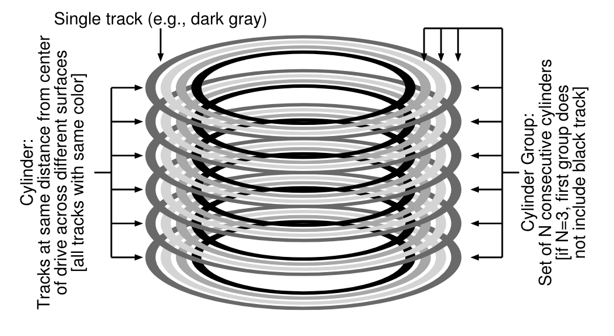
  - Modern drives don't export enough information for the file system to truly understand whether a particular cylinder is in use
  - Modern file systems organize the drive into block groups, each of which is just a consecutive portion of the disk's address space
  - By placing two files within the same group, FFS can ensure that accessing one after the other will not result in long seeks across the disk
  - Cylinder group includes all structures you might expect in a file system
    - S | ib | db | Inodes | Data
    - **S**: Super block
      - Kept for reliability reasons
      - Needed to mount the file system
      - By keeping multiple copies, if one becomes corrupt, you can still mount and access the file system by using a working replica
    - **ib**: Inode bitmap
      - Tracks whether the inodes of the group are allocated
    - **db**: Data bitmap
      - Tracks whether the data blocks of the group are allocated
    - Most of each cylinder group is comprised of data blocks
- Policies: How to allocate files and directories
  - Keep related stuff together (in the same block group)
  - Directories
    - Find the cylinder group with a low number of allocated directories (to balance directories across groups) and a high number of free inodes (to subsequently be able to allocate a bunch of files) and put the directory data and inode in that group
  - Files
    - Makes sure (in the general case) to allocate the data blocks of a file in the same group as its inode (prevents long seeks between inode and data)
    - Places all files that are in the same directory in the cylinder group of the directory they're in
  - Files in a directory are often accessed together (namespace-based locality)
- Measuring file locality
  - A study
- The large-file exception
  - Without a different rule, a large file would entirely fill the block group it's first placed within (and maybe others)
    - Undesirable behavior as it prevents subsequent related files from being placed within this block group and may hurt file-access locality
  - After some number of blocks are allocated into the first block group, FFS places the next large chunk of the file (e.g., those pointer to by the first indirect block) in another block group (perhaps chosen for its low utilization)
  - If the chunk size is large enough, the file system will spend most of its time transferring data from disk and just a (relatively) little time seeking between chunks of the block
  - **Amortization**: Reducing an overhead by doing more work per overhead paid
  - The trend in disk drives is that transfer rate improves fairly rapidly, as disk manufacturers are good at cramming more bits into the same surface, but the mechanical aspects of drives related to seeks (disk arm speed and the rate of rotation) improve rather slowly
    - Over time, mechanical costs become relatively more expensive
    - To amortize said costs, you have to transfer more data between seeks
- A few other things about FFS
  - **Sub-blocks**: 512-byte little blocks that the file system could allocate to files
    - Created to address small files and the internal fragmentation they could cause
    - Small file could occupy two sub-blocks and not waste an entire 4KB block
    - As the file grows, the file system will continue allocating 512-byte blocks to it until it acquires a full 4KB of data
    - At that point, FFS will find a 4KB block, copy the sub-blocks into it, and free the sub-blocks for future use
    - Inefficient process
      - FFS avoids this behavior by modifying the `libc` library
      - The library would buffer writes and then issue them in 4KB chunks to the file system
  - Disk layout optimized for performance
    - Problem arose in FFS when a file was placed on consecutive sectors of the disk (sequential reads)
    - FFS would first issue a read to block 0; by the time the read was complete, and FFS issued a read to block 1, it was too late: block 1 had rotated under the head and now the read to block 1 would incur a full rotation
    - **Solution**: Skip over every other block so FFS has enough time to request the next block before it went past the disk head
    - **Parameterization**: Figure out for a particular disk how many blocks it should skip in doing layout to avoid the extra rotations
    - Modern disks internally read the entire track in and buffer it in an internal disk cache (track buffer)
      - On subsequent reads to the track, the disk will just return the desired data from its cache
  - Long file names
  - Symbolic links
  - Rename operation that worked atomically

## Lecture 15: File Systems - Naming and Reliability

- Naming in file systems
  - Each file needs some kind of handle to allow us to refer to it
  - The OS likes simple numbers as names, but those aren't usable by people or programs
  - We need a better way to name our files
    - User friendly
    - Allowing for easy organization of large numbers of files
    - Readily realizable in file systems
- File names and binding
  - File systems know files by descriptor structures
  - We must provide more useful names for users
  - The file system must handle name-to-file mapping
    - Associating names with new files (binding)
    - Finding the underlying representation for a given name
    - Changing names associated with existing files
    - Allowing users to organize files using names
  - **Namespaces**: The total collection of all names known by some naming mechanism
    - Sometimes means all names that could be created by the mechanism
- Namespace structure
  - Flat namespaces
    - All names exist in a single level
  - Graph-based namespaces
    - Can be a strict hierarchical tree
    - Or a more general graph (usually directed)
- Some issues in namespace structure
  - How many files can have the same name?
    - **Flat namespaces**: One per file system
    - **Hierarchical namespaces**: One per directory
  - How many different names can one file have?
    - One "true name", but aliases are allowed
    - Arbitrarily many
    - What's different about "true names"?
  - Do different names have different characteristics?
    - Does deleting one name make others disappear too?
    - Do all names see the same access permissions?
- Hierarchical namespaces
  - Essentially a graphical organization
  - Typically organized using directories
    - A file containing references to other files
    - A non-leaf node in the graph
    - It can be used as a naming context
      - Each process has a current directory
      - File names are interpreted relative to that directory
  - Nested directories can form a tree
    - A file name describes a path through that tree
    - The directory tree expands from a "root" node
      - A name beginning from root is called "fully qualified"
    - May actually form a directed graph
      - If files are allowed to have multiple names
- A rooted directory tree
  - 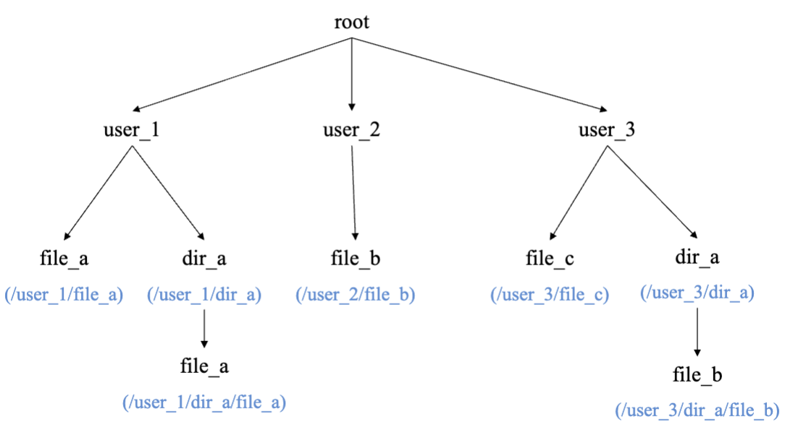
- Directories are files
  - Directories are a special type of file used by OS to map file names into the associated files
  - A directory contains multiple directory entries
    - Each directory entry describes one file and its names
  - User applications are allowed to read directories to get information about each file and to find out what files exist
  - Usually only the OS is allowed to write to them
    - Users can cause writes through special system calls
    - The file system depends on the integrity of directories
- Traversing the directory tree
  - Some entires in directories point to child directories
    - Describing a lower level in the hierarchy
  - To name a file at that level, name the parent directory and the child directory, then the file
    - With some kind of delimiter separating the file name components
  - Moving up the hierarchy is often useful
    - Directories usually have special entry for parent
    - Many file systems use the name .. for that
- File names vs. path names
  - In some name space systems, files have "true names"
    - Only one possible name for a file kept in a record somewhere
  - E.g., in DOS, a file is described by a directory entry
    - Local name is specified in that directory entry
    - Fully qualified name is the path to that directory entry
      - E.g., start from root, to user_3, to dir_a, to file_b
  - What if files had no intrinsic names of their own?
    - All names came from directory paths
- Example: Unix directories
  - A file system that allows multiple file names, so there's no single "true" file name, unlike DOS
  - File names separated by slashes (e.g., `/user_3/dir_a/file_b`)
  - The actual file descriptors are the inodes
    - Directory entries only point to inodes
    - Association of a name with an indoe is called a hard link
    - Multiple directory entries can point to the same inode
  - Contents of a Unix directory entry
    - Name (relative to this directory)
    - Pointer to the inode of the associated file
- Unix directories
  - **.** : Directory that points to the directory itself
  - Root directory, inode #1
    - Inode #1: file name .
    - Inode #1: file name ..
    - Inode #114: file name is user_3
  - Directory /user_3, inode #114
    - Inode #114: file name .
    - Inode #1: file name ..
- Multiple file names in Unix
  - How do links relate to files?
    - They're the names only
  - All other metadata is stored in the file inode
    - File owner sets file protection (e.g., read-only)
  - All links provide the same access to the file
    - Anyone with read access to file can create new link
    - But directories are protected files too
      - Not everyone has read or search access to every directory
  - All links are equal
    - There's nothing special about the first (or owner's) link
- Links and deallocation
  - Files exist under multiple names
  - The Unix solution says the file exists as long as at least one name exists
  - Implying we must keep and maintain a reference count of links in the file inode, not in a directory
- Unix hard link example
  - 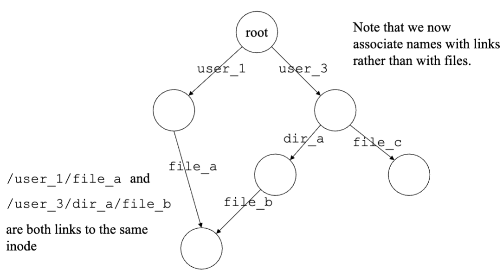
- Hard links, directories, and files
  - 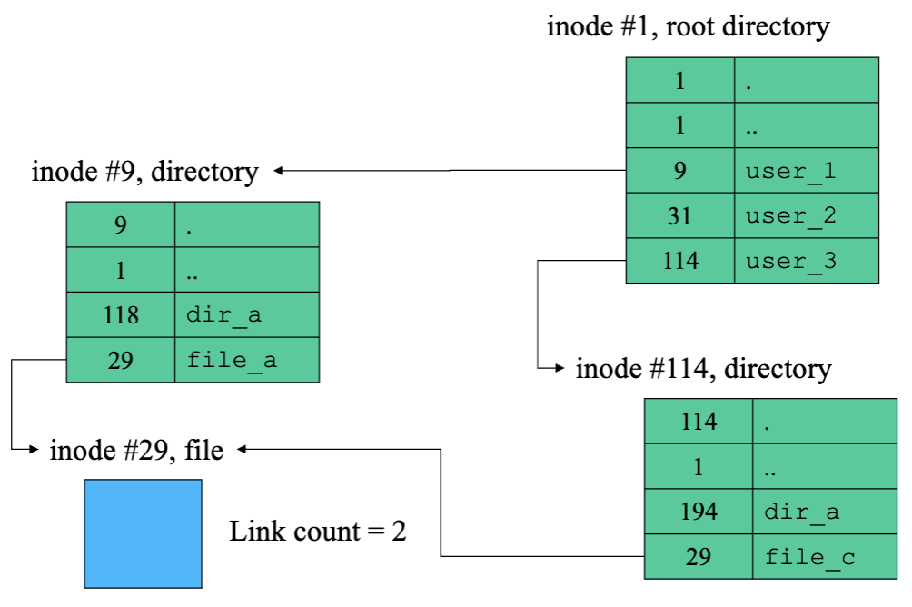
- Symbolic links
  - A different way of giving files multiple names
  - Symbolic links implemented as a special type of file
    - An indirect reference to some other file
    - Contents is a path name to another file
  - File system recognizes symbolic links
    - Automatically opens associated file instead
    - If file is inaccessible or nonexistent, the open fails
  - Symbolic link is not a reference to the inode
    - Symbolic links don't prevent deletion or update link count
    - Do not guarantee ability to follow the specified path
    - Internet URLs are similar to symbolic links
- Symbolic link example
  - 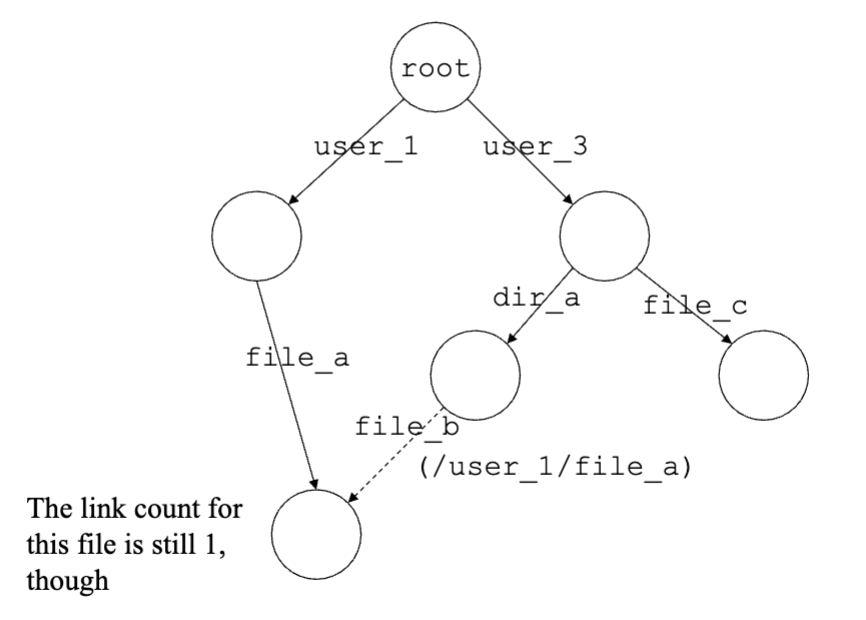
- Symbolic links, files, and directories
  - 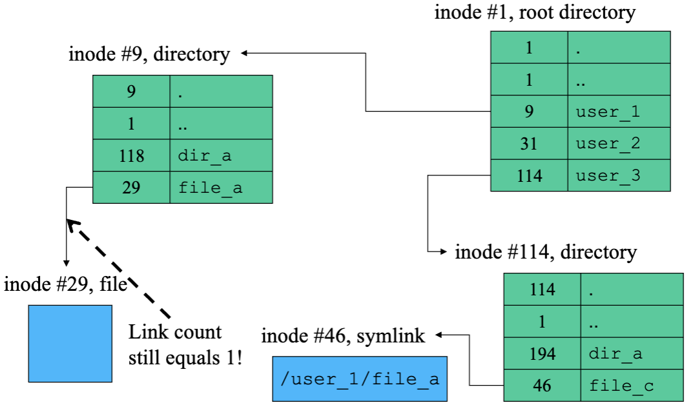
- File systems reliability
  - What can go wrong in a file system?
  - System crashes can result in incorrect file system state
  - Data loss due to HW failure or SW error
    - File data is no longer present or readable
    - Some/all of data has been accidentally altered
  - File system corruption
    - Lost free space
    - References to nonexistent files
    - Corrupted free-list multiply allocates space
    - File contents overwritten by something else
    - Corrupted directories make files unfindable
    - Corrupted inodes lose file info/pointers
- The core reliability problem
  - File system writes typically involve multiple operations
    - Not just writing a data block to disk/flash
    - But also writing one or more metadata blocks
    - The inode, the free list, maybe directory blocks
  - All must be committed to disk for the write to succeed
  - But each block write is a separate hardware operation
- Deferred writes - A worst case scenario
  - Process allocates a new block to file A
    - We get a new block (x) from the free list
    - We write out the updated inode for file A
    - We defer free-list write-back (happens all the time)
  - The system crashes and after it reboots
    - A new process wants a new block for file B
    - We get block x from the (stale) free list
  - Two different files now contain the same block
    - When file A is written, file B gets corrupted
    - When file B is written, file A gets corrupted
- Application expectations when writing
  - Applications make system calls to perform writes
  - When system call returns, the application and user expect the write to be "safe", meaning it will persist even if system crashes
  - We can block the writing application until really safe, but that might block application for quite a while
  - Crashes are rare
    - So persistence failure caused by them are also rare
    - Must we accept big performance penalties for occasional safety?
- Buffered writes
  - Don't wait for the write to actually be persisted
  - Keep track of it in RAM
  - Tell the application it's OK
  - At some later point, actually write to persistent memory
  - Up-sides:
    - Less application blocking
    - Deeper and optimizable write queues
  - Down-side:
    - What if there's a crash between lying and fixing the lie?
- Robustness - Ordered writes
  - Carefully ordered writes can reduce potential damage
  - Write out data before writing pointers to it
    - Unreferenced objects can be garbage collected
    - Pointers to incorrect info are more serious
  - Write out deallocations before allocations
    - Disassociate resources from old files ASAP
    - Free list can be corrected by garbage collection
    - Improperly shared data is more serious than missing data
- Practicality of ordered writes
  - Greatly reduced I/O performance
    - Eliminates accumulation of nearby operations
    - Eliminates consolidation of updates to same block
  - May not be possible
    - Modern devices may reorder queued requests
  - Doesn't actually solve the problem
    - Doesn't eliminate incomplete writes
    - It chooses minor problems over major ones
- Robustness - Audit and repair
  - Design file system structures for audi and repair
    - Redundant information in multiple distinct places
  - Audit file system for correctness and use redundant info to enable automatic repair
  - Used to be standard practice, no longer practical
    - Checking a 2TB FS at 100MB/s = 5.5 hours
    - Need more efficient partial write solutions
- Journaling
  - Create a circular buffer journaling device
    - Journal writes are always sequential
    - Journal writes can be batched
    - Journal is relatively small, may use NVRAM
  - Journal all intended file system updates
    - Inode updates, block write/alloc/free
  - Efficiently schedule actual file system updates
    - Write-back cache, batching, motion-scheduling
  - Journal completions when real writes happen
- A journaling example
  - 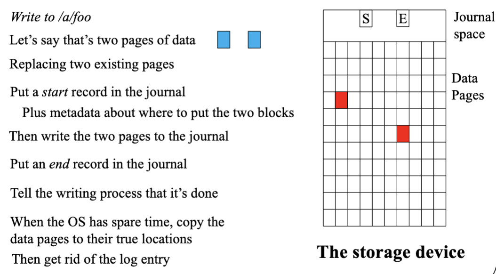
- Batched journal entries
  - Operation is safe after journal entry persisted
    - Caller must wait for this to happen
  - Small writes are still inefficient
  - Accumulate batch until full or max wait time
- Journal recovery
  - Journal is a small circular buffer
    - It can be recycled after old ops have completed
    - Timestamps distinguish new entries from old
  - After system restart
    - Review entire (relatively small) journal
    - Note which ops are known to have completed
    - Perform all writes not known to have completed
      - Data and destination are both in the journal
      - All of these write operations are idempotent
    - Truncate journal and resume normal operation
- Why does journaling work?
  - Journal writes are much faster than data writes since all journal writes are sequential
  - In normal operation, journal is write-only
    - File system never reads/processes the journal
  - Scanning the journal on restart is very fast
    - It's very small (compared to the file system)
    - It can read sequentially with huge efficient reads
    - All recovery processing is done in memory
  - Journal pages may contain information for multiple files performed by different processes and users
- Metadata only journaling
  - Why journal metadata?
    - It's small and random (very I/O inefficient)
    - It's integrity-critical (huge potential data loss)
  - Why not journal data?
    - It's often large and sequential (I/O efficient)
    - It would consume most of journal capacity bandwidth
    - It's less order sensitive (just precede metadata)
  - Safe metadata journaling
    - Allocate new space for the data, write it there
    - Then journal the metadata updates
- A metadata journaling example
  - This is more natural for flash
  - 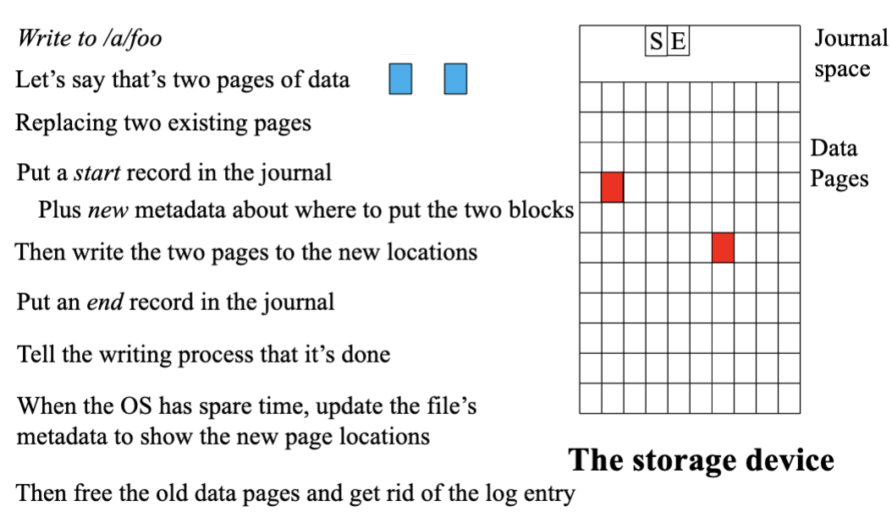
- Log structured file systems
  - The journal is the file system
    - All inodes and data updates written to the log
    - Updates are redirect-on-write
      - Don't overwrite the old data
      - Write it elsewhere and change the metadata (inode) pointer to it
    - An in-memory index caches inode locations
  - Becoming a dominant architecture
    - Flash file systems
    - Key/value stores
  - Issues
    - Recovery time (to reconstruct index/cache)
    - Log defragmentation and garbage collection
- Navigating a logging file system
  - Inodes point at data segments in the log
    - Sequential writes may be contiguous in log
    - Random updates can be spread all over the log
  - Updated inodes are added to end of the log
  - Index points to latest version of each inode
    - Index is periodically appended to the log
  - Recovery
    - Find and recover the latest index
    - Replay all log updates since then
- Redirect on write
  - Many modern file systems now do this
    - Once written, blocks and inodes are immutable (work very nicely for flash drives)
    - Add new info to the log and update the index
  - The old inodes and data remain in the log
    - If we have an old index, we can access them
    - Clones and snapshots are almost free
  - Price is management and garbage collection
    - We must inventory and manage old versions
    - We must eventually recycle old log entries
- A log structured file system example
  - 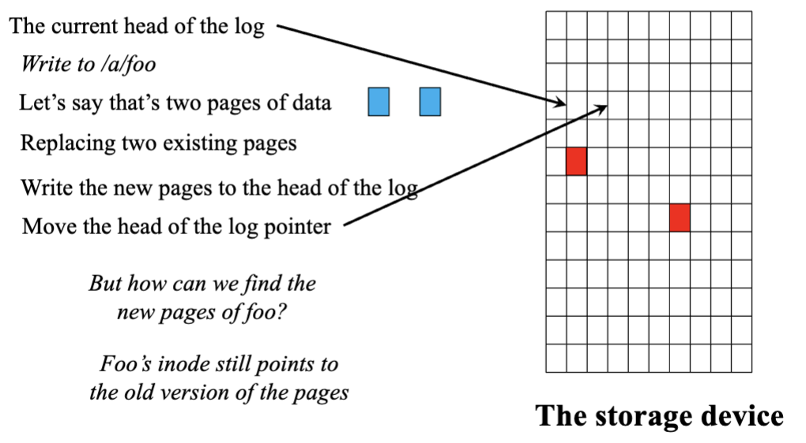
  - 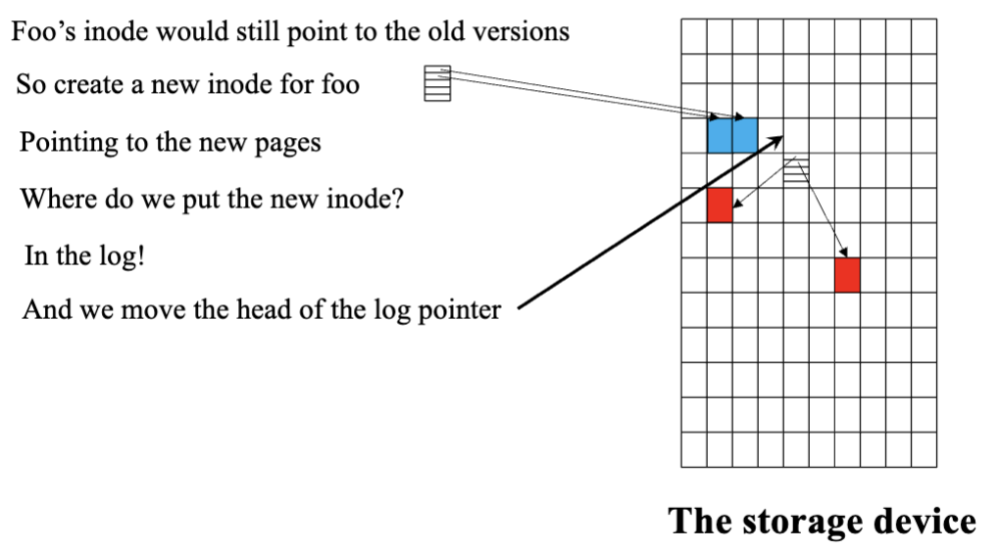
  - 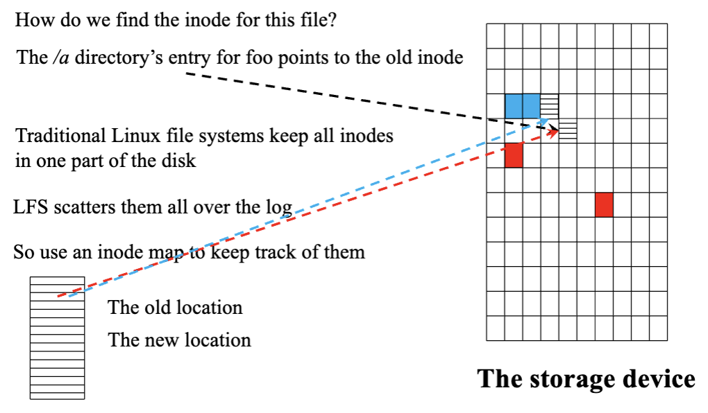
  - 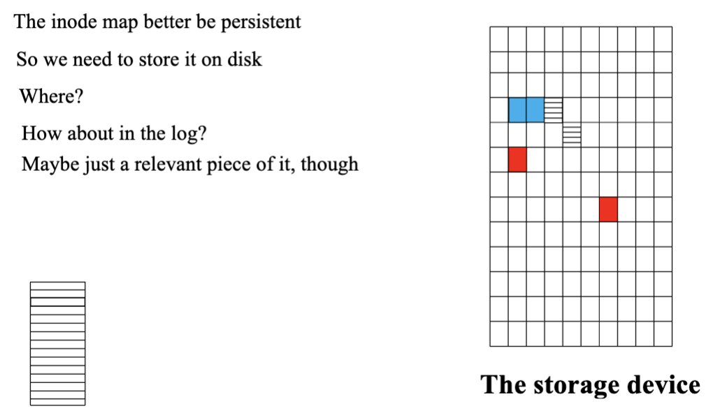
- Conclusion
  - We must have some solution to how to manage space on a persistent device
  - We must have some scheme for users to name their files and for the file system to match names to locations
  - Performance and reliability are critical for file systems
  - How the file system works under the covers matters a lot for those properties

## 42. [Crash Consistency: FSCK and Journaling](https://pages.cs.wisc.edu/~remzi/OSTEP/file-journaling.pdf)

- Introduction
  - File system data structures must persist
    - **Crash-consistency problem**: How to update persistent data structures despite the presence of a power loss or system crash
  - On-disk structure is left in an inconsistent state if A reaches the disk first and then crashes or loses power before B completes
  - fsck (file system checker)
  - **Journaling (write-ahead logging)**: Adds a little bit of overhead to each write but recovers more quickly from crashes or power losses
- A detailed example
  - Read OSTEP
  - Crash scenarios
    - Just the data block is written to disk
      - Data is on disk, no inode that points to it, no bitmap that even says the block is allocated
      - As if the write never occurred
      - Not a problem from the perspective of file-system crash consistency
    - Just the updated inode is written to disk
      - If we trust that pointer, we'll read garbage data from the disk
      - **File-system inconsistency**: On-disk bitmap saying data block hasn't been allocated, inode is saying it has
    - Just the updated bitmap is written to disk
      - More inconsistency: Bitmap indicates the block is allocated, no inode that points to it
      - Results in a space leak if left unresolved (block will never be used by the file system)
    - Everything but data is written to disk
      - File system metadata is completely consistent
      - Garbage in data block
    - Everything but bitmap is written to disk
      - Inconsistency between the inode and the old version of the bitmap
    - Everything but the inode is written to disk
      - Inconsistency between the inode and the data bitmap
  - Move the file system from one consistent state to another atomically
  - **Crash-consistency problem** / **consistent-update problem**: Can't do the above easily because the disk only commits one write at a time, and crashes or power loss may occur between these updates
- Solution #1: The file system checker
  - Let inconsistencies happen and then fix them later (when rebooting)
  - `fsck`: Unix tool that finds inconsistencies and repairs them
    - Only real goal is to make sure the file system metadata is internally consistent
    - Won't fix the case where the file system looks consistent but the inode points to garbage data
    - Run before the file system is mounted and made available (assumes no other file system activity is ongoing while it runs)
    - For process, read OSTEP
      - Superblock
      - Free blocks
      - Inode state
      - Inode links
      - Duplicates
      - Bad blocks
      - Directory checks
    - Too slow
- Solution #2: Journaling (or write-ahead logging)
  - Most popular solution
  - When updating the disk, before overwriting the structures in place, first write down a little note (somewhere else on the disk, in a well-known location) describing what you're about to do
  - If a crash takes places during the update (overwrite) of the structures you're updating, you can go back and look at the note and try again
    - Will know exactly what to fix and how to fix it
  - Adds a bit of work during updates to greatly reduce the amount of work required during recovery
  - Data journaling
    - **Physical logging**: Putting the exact physical contents of the update in the journal
    - **Logical logging**: Puts a more compact logical representation of the update in the journal
    - **Checkpoint**: Overwrite the old structures in the file system / bring it up to date with the pending update in the journal
    - Recovery
      - If the crash happens before the transaction is written safely to the log, the pending update is simply skipped
      - If the crash happens after the transaction has committed to the log but before the checkpoint is complete, the file system can recover the update as follow
        - When the system boots, the file system recovery process will scan the log and look for transactions that have committed to the disk
        - These transactions are replayed (in order) with the file system again attempting to write out the blocks in the transaction to their final on-disk locations (redo logging)
      - It's fine for a crash to happen at any point during checkpointing, even after some of the updates to the final locations of the blocks have completed
        - In the worst case, some of these updates are simply performed again during recovery
        - Because recovery is a rare operation (only taking place after an unexpected system crash), a few redundant writes are nothing to worry about
    - Batching log updates
      - Buffer all updates into a global transaction
      - Mark the in-memory inode bitmap, inodes of the files, directory data, and directory inode as dirty
      - Add them to the list of blocks that form the current transaction
      - When it's time to write these blocks to disk, this single global transaction is committed containing all of the updates above
      - Avoid excessive write traffic to disk
    - Making the log finite
      - Problems when the log becomes full
        - The larger the log, the longer recovery will take, as the recovery process must replay all the transactions within the log in order to cover
          - Simpler, less critical problem
        - When the log is full (or nearly full), no further transactions can be committed to the disk, thus making the file system less than useful
          - More of an issue
      - **Circular log**: Journaling file systems treat the log as a circular data structure, reusing it over and over
      - Once a transaction has been checkpointed, the file system should free the space it was occupying within the journal, allowing the log space to be reused
        - Mark the oldest and newest non-checkpointed transactions in the log in a journal superblock (all other space is free)
    - Metadata journaling
      - Recovery is now fast, normal operation of the file system is slower than we might desire
      - For each write to disk, we're also writing to the journal first (doubling write traffic)
      - **Ordered journaling** / **metadata journaling**: Nearly the same except that user data is not written to the journal
      - Process
        - **Data write**: Write data to final location; wait for completion (wait is optional)
        - **Journal metadata write**: Write the begin block and metadata to the log; wait for writes to complete
        - **Journal commit**: Write the transaction commit block to the log; wait for the write to complete; the transaction (including data) is now committed
        - **Checkpoint metadata**: Write the contents of the metadata update to their final locations within the file system
        - **Free**: Later, mark the transaction free in journal superblock
      - By forcing the data write first, a file system can guarantee that a pointer will never point to garbage
      - **Crash consistency rule**: Write the pointed-to object before the object that points to it
    - Tricky case: Block reuse
      - If a crash occurs and all of the information is still in the log, the replay overwrites the user data of current file with old directory contents
      - Solutions
        - Never reuse blocks until the delete of said blocks is checkpointed out of the journal
        - Add a new type of record to the journal, known as a revoke record
          - When replaying the journal, the system first scans for such revoke records
          - Any revoked data is never replayed
    - Process
      - **Journal write**: Write the transaction, including a transaction-begin block, all pending data and metadata updates, and a transaction-end block, to the log; wait for these writes to complete
      - **Journal commit**: Write the transaction commit block to the log; wait for write to complete; transaction is said to be committed
      - **Checkpoint**: Write the pending metadata and data updates to their final locations in the file system
      - **Free**: Some time later, mark the transaction free in the journal by updating the journal superblock
  - Forcing writes to disk
    - Old days, just issue the write of A to the disk, wait for the disk to interrupt the OS when the write is complete, then issue the write of B
    - **Immediate reporting**: Write buffering enabled
      - Disk will inform the OS the write is complete when it simply has been placed in the disk's memory cache and hasn't reached the disk yet
      - If the OS then issues a subsequent write, it is not guaranteed to reach the disk after previous writes; thus ordering between writes is not preserved
        - **Solution**: Disable write buffering
        - Another solution: Issue explicit write barriers
          - When this barrier completes, it guarantees that all writes issued before the barrier will reach disk before any writes issued after the barrier
- Solution #3: Other approaches
  - **Soft Updates**: Carefully orders all writes to the file system to ensure that the on-disk structures are never left in an inconsistent state
  - **Copy-On-Write (COW)**: Never overwrites files or directories in place
    - Places new updates to previously unused locations on disk
    - After a number of updates are completed, COW file systems fip the root structure of the file system to include pointers to the newly updated structures
  - **Backpointer-Based Consistency (BBC)**: No ordering is enforced between writes
    - To achieve consistency, an additional back pointer is added to every block in the system
  - **Optimistic crash consistency**: Issues as many writes to disk as possible by using a generalized form of the transaction checksum and includes a few other techniques to detect inconsistencies should they arise
  - To truly function well, a slightly different disk interface is required

## 43. [Log-structured File Systems](https://pages.cs.wisc.edu/~remzi/OSTEP/file-lfs.pdf)

- Introduction
  - Motivation
    - System memories are growing
    - There is a large gap between random I/O performance and sequential I/O performance
    - Existing file systems perform poorly on many common workloads
    - File systems are not RAID-aware
      - RAID-4 and RAID-5 have the small-write problem where a logical write to a single block causes 4 physical I/Os to take place
  - An ideal file system would focus on write performance and try to make use of the sequential bandwidth of the disk
  - Perform well on common workloads that write out data and update on-disk metadata structures frequently
  - Work well on RAIDs and single disks
  - Process
    - When writing to disk, LFS first buffers all updates (including metadata) in an in-memory segment
    - When the segment is full, it's written to disk in one long, sequential transfer to an unused part of the disk
    - Never overwrites existing data, always writes segments to free locations
- Writing to disk sequentially
  - Write data block
  - Write inode of the file to disk and have it point to the data block
  - D | I (points to D)
- Writing sequentially and effectively
  - In-between the first and second writes, the disk rotates
    - When you issue the second write, it'll wait for most of a rotation before being committed
  - Must issue a large number of contiguous writes or one large write to the drive to achieve good write performance
  - **Write buffering**: Before writing to the disk, LFS keeps track of updates in memory, and when it's received a sufficient number of updates, it writes them to disk all at once
  - **Segment**: Large chunk of updates LFS writes at one time
  - When writing to disk, LFS buffers updates in an in-memory segment, then writes the segment to the disk all at once
    - As long as the segment is large enough, the writes will be efficient
- How much to buffer?
  - Depends on how high the positioning overhead is in comparison to the transfer rate
  - D = (F / (1 - F)) _ R_peak _ T_position
    - Writing out D MB
    - F: Effective bandwidth of F% of peak
- Problem: Finding inodes
  - FFS splits up the inode table into chunks and places a group of inodes within each cylinder group
    - One must know how big each chunk of inodes is and the start addresses of each
  - In LFS, inodes are scattered all throughout the disk and we never overwrite -> latest version of an inode (the one we want) keeps moving
- Solution through indirection: The inode map
  - Designers of LFS introduced a level of indirection between inode numbers and the inodes through inode map (imap)
    - Downside of indirection: Extra overhead
  - **imap**: Takes an inode number as input and produces the disk address of the most recent version of the inode
    - Often implemented as an array with 4 bytes (a disk pointer) per entry
    - Needs to be kept persistent
  - LFS places chunks of the inode map right next to where it's writing all of the other new information
    - D | inode (points to D) | imap (points to inode)
- Completing the solution: The checkpoint region
  - **Checkpoint region (CR)**: Contains pointers to (i.e., addresses of) the latest pieces of the inode map
    - Only updated periodically -> performance isn't ill-affected
    - At the beginning of the disk, address 0
- Reading a file from disk: A recap
  - Checkpoint region points to latest pieces of the inode map
  - Inode map pieces each contain addresses of the inodes
  - Inodes point to files (and directories)
  - In the common case, LFS performs the same number of I/Os as an atypical file system when reading a file from disk
  - The entire imap is cached and thus the extra work LFS does during a read is to look up the inode's address in the imap
- What about directories?
  - Directory is just a collection of (name, inode number) mappings
  - D_k | I[k] | D_dir | I[dir] | imap
  - Inode map contains information for the location of directory file dir and newly-created file f
  - When accessing file foo (with inode number k), look first in the inode map (usually cached in memory) to find the location of the inode of directory dir
  - Read the directory inode, which gives you the location of the directory data, which gives you the name-to-inode-number mapping of (foo, k)
  - Consult the inode map again to find the location of inode number k and read the desired data block
  - Inode map solves the recursive update problem
- A new problem: Garbage collection
  - Old versions of file structures are garbage
  - **Versioning file system**: Keep older versions around and allow users to restore old file versions / keeps track of different versions of a file
  - LFS only keeps the latest live version of a file
  - LFS must periodically find old dead versions of file data, inodes, etc, and clean them (form of garbage collection)
  - LFS cleaner works on a segment-by-segment basis, clearing up large chunks of space for subsequent writing
  - Process
    - LFS cleaner periodically reads in a number of old (partially-used) segments, determines which blocks are live within these segments, and then writes out a new set of segments with just the live blocks within them, freeing up the old ones for writing
    - Expect cleaner to read in M existing segments, compact their contents into N new segments (N < M), and then write N segments to disk in new locations
    - Old M segments are freed and can be used by the file system for subsequent writes
- Determining block liveness
  - LFS adds a little extra information to each segment that describes each block
  - **Segment summary block**: Structure at the head of the segment that includes, for each data block D:
    - Inode number (which file it belongs to)
    - Offset (which block of the file this is)
  - Check if the block of data at address A is still referenced by its file
    - If the inode points to disk address A, block D is live
    - If the inode points to anywhere else, D is not in use (dead)
  - Shortcuts
    - When a file is truncated or deleted, LFS increases its version number and records the new version number in the imap
    - Compare the on-disk version number with a version number in the imap
- A policy question: Which blocks to clean, and when?
  - When to clean
    - Periodically
    - During idle time
    - When you have to because the disk is full
  - Which blocks to clean
    - Segregate hot and cold segments
      - **Hot**: Contents are being frequently over-written
        - Wait a long time before cleaning it
        - More and more blocks are getting overwritten (in new segments) and thus being free for use
        - Clean later
      - **Cold**: Few dead blocks but the rest of its contents are relatively stable
        - Clean sooner
- Crash recovery and the log
  - LFS organizes writes in a log, i.e., the checkpoint region points to a head and tail segment, and each segment points to the next segment to be written
  - LFS also periodically updates the checkpoint region
  - Crashes happen either during
    - Write to a segment
      - **Roll forward**: Start with the last checkpoint region, find the end of the log (which is included in the CR), and then use that to read through the next segments and see if there are any valid updates within it
      - If there are, LFS updates the file system accordingly and recovers much of the data and metadata written since the last checkpoint
    - Write to the checkpoint region
      - To ensure that the CR update happens atomically, LFS keeps two CRs, one at either end of the disk, and writes to them alternately
      - First writes out a header (with timestamp), then the body of the CR, then finally one last block (also with a timestamp)
      - LFS detects crashes during a CR update by seeing an inconsistent pair of timestamps
      - LFS will always choose to use the most recent CR that has consistent timestamps
- Summary
  - **Shadow paging** / **copy-on-write**: Write to an unused portion of the disk and later reclaim that old space through cleaning

## 44. [Flash-based SSDs](https://pages.cs.wisc.edu/~remzi/OSTEP/file-ssd.pdf)

- Introduction
  - **Solid-state storage**: No mechanical or moving parts, built out of transistors
  - **Solid-state storage device (SSD)**: Retains information despite power loss
  - **NAND-based flash**: To write a given chunk of it (flash page), you first have to erase a bigger chunk (flash block), which can be quite expensive
    - Writing too often to a page will cause it to wear out
- Storing a single bit
  - Flash chips are designed to store one or more bits in a single transistor
  - The level of charge trapped within the transistor is mapped to a binary value
  - In a single-level cell (SLC) flash, only a single bit is stored within a transistor (i.e., 1 or 0)
  - With a multi-level cell (MLF) flash, two bits are encoded into different levels of charge, e.g., 00, 01, 10, and 11 are represented by low, somewhat low, somewhat high, and high levels
  - Triple-level cell (TLC) flash encodes 3 bits per cell
  - SLC chips achieve higher performance and are more expensive
- From bits to banks/planes
  - Flash chips are organized into banks or planes which consist of a large number of cells
  - A bank is accessed in two different sized units: blocks (aka erase blocks), which are typically of size 128 KB or 256 KB, and pages, which are a few KB in size (e.g., 4KB)
  - Within each bank, there are a large number of blocks
  - Within each block, there are a large number of pages
- Basic flash operations
  - **Read**: Read a page from the flash
    - Specify the read command and page number to the device
    - Quite fast regardless of location on the device or location of the previous request
    - **Random access device**: Able to access any location uniformly quickly
  - Erase (a block)
    - Done before writing to a page within a flash
    - Destroys the contents of the block by setting each bit to 1
    - Quite expensive
  - Program (a page)
    - Change some of the 1's within a page to 0's
    - WRite the desired contents of a page to the flash
    - Less expensive than erasing a block, but more costly than reading a page
  - One way to think about flash chips is that each page has a state associated with it
    - Pages start in an INVALID state
    - By erasing the block that a page resides within, you set the state of the page (and all pages within that block) to ERASED, which resets the content of each page in the block but also makes them programmable
    - When you program a page, its state changes to VALID, meaning its contents have been set and can be read
    - Reads do not affect these states
  - Before overwriting any page within a block, you must first move any data you care about to another location (e.g., memory, or elsewhere on the flash)
  - Frequent repetitions of this program / erase cycle can lead to the biggest reliability problem flash chips have: Wear out
- Flash performance and reliability
  - Read latencies are quite good
  - Program latency is higher and more variable, but higher as you pack more bits into each cell
  - To get good write performance, you'll have to make use of multiple flash chips in parallel
  - Erases are quite expensive
  - Mechanical disks can fail for a wide variety of reasons
    - **Head crash**: Drive head makes contact with the recording surface
  - Flash chips are pure silicon and have fewer reliability issues to worry about
    - Primary concern is wear out: When a flash block is erased and programmed, it slowly accrues a little bit of extra charge
      - Over time, as that extra charge builds up, it becomes increasingly difficult to differentiate between a 0 and a 1
    - **Disturbance**: When accessing a particular page within a flash, it's possible that some bits get flipped in neighboring pages
      - **Read disturbs** / **program disturbs**: Bit flips, called what it is depending on if the page is being read or programmed
- From raw flash to flash-based SSDs
  - The standard storage interface is a simple block-based one, where blocks (sectors) of size 512 bytes (or larger) can be read or written, given a block address
  - The task of the flash-based SSD is to provide that standard block interface atop the raw flash chips inside it
  - SSD consists of:
    - Some number of flash chips (for persistent storage)
    - Some amount of volatile (i.e., non-persistent) memory (e.g., SRAM)
      - Useful for caching and buffering of data and mapping tables
    - Control logic to orchestrate device operations
      - Satisfy reads and writes, turning them into internal flash operations as need be
      - **Flash translation layer (FTL)**: Takes read and write requests on logical blocks (that comprise the device interface) and turns them into low-level read, erase, and program commands on the underlying physical blocks and physical pages (that comprise the actual flash device)
        - Goals
          - Excellent performance
            - Can be realized through utilizing multiple flash chips in parallel
          - High reliability
            - **Wear leveling**: Spreading writes across the blocks of the flash as evenly as possible, ensuring that all of the blocks of the device wear out at roughly the same time
            - Minimize program disturbance by programming pages within an erased block in order, from low page to high page
          - **Reduce write amplification**: Total write traffic (in bytes) issued to the flash chips by the FTL divided by the total write traffic (in bytes) issued by the client to the SSD
- FTL organization: A bad approach
  - Simplest organization of an FTL is direct mapped
  - Read to logical page N is mapped directly to a read of physical page N
  - Write to logical page N
    - FTL reads in the entire block that page N is contained within
    - Erase the block
    - Programs the old pages and the new one
  - Performance problem come on each write: Device has to read in the entire block, erase it, and then program is (costly x3)
    - Severe write amplification (proportional to the number of pages in a block)
    - Terrible write performance
  - Reliability problem: Rapid wear out
  - Gives too much control over wear out to the client workload
- A log-structured FTL
  - Upon a write to logical block N, the device appends the write to the next free spot in the currently-being-written-to block (logging)
  - To allow for subsequent reads of block N, the device keeps a mapping table (in its memory, and persistent, in some form, on the device)
    - Stores the physical address of each logical block in the system
  - **Logical block address**: Used by the client of the SSD (e.g., a file system) to remember where information is located
  - Device must transform block writes into erase and program operations supported by the raw hardware, and somehow record for each logical block address which physical page of the SSD stores its data
  - SSD must transform a read issued to logical block 100 into a read of physical page 0
  - When the FTL writes logical block 100 to physical page 0, it records this fact in an in-memory mapping table
    - Record some mapping information with each page in an out-of-band (OOB) area
    - When the device loses power and is restarted, it reconstructs its mapping table by scanning the OOB areas and reconstructing the mapping table in memory
    - Scanning a large SSD to find all encessary mapping information is slow
    - Higher-end devices use more complex logging and checkpointing techniques to speed up recovery
  - Subsequent reads use the table to translate the logical block address presented by the client into the physical page number required to read the data
  - Problems
    - Overwrites of logical blocks lead to garbage
    - Device has to periodically perform garbage collection
    - Excessive garbage collection drives up write amplification and lowers performance
    - High cost of in-memory mapping tables
      - Larger the device, the more memory it needs
- Garbage collection
  - Process of finding garbage blocks / dead blocks and reclaiming them for future use
  - Process
    - Find a block that contains one or more garbage pages
    - Read in the live (non-garbage) pages from that block
    - Write out those live pages to the log
    - Reclaim the entire block for use in writing (erase)
  - Determine whether each page is live or dead
    - Store at some location within each block information about which logical blocks are stored within each page
    - Device can use the mapping table to determine whether each page within the block holds live data or not
  - a1 | a2 | b1 | b2 | c1 | c2 (a1 and a2 are garbage)
  - x | x | x | x | c1 | c2 | b1 | b2 (garbage taken out, x means nothing)
  - Can be expensive, requiring reading and rewriting of live data
  - Ideal candidate for reclamation is a block that consists of only dead pages
  - To reduce GC costs, some SSDs overprovision the device
    - By adding extra flash capacity, cleaning can be delayed and pushed to the background, perhaps done at a time when the device is less busy
    - Adding more capacity increases internal bandwidth, which can be used for cleaning and thus not harm perceived bandwidth to the client
  - A new storage API known as trim
    - **Cache flush**: Ensures that writes have actually been persisted
    - **Trim**: Takes an address (and possibly a length) and informs the device that the block(s) specified by the address (and length) have been deleted
    - The device no longer has to track any information about the given address range
    - For a standard hard drive, isn't particularly useful, because the drive has a static mapping of block addresses to specific platter, track, and sector(s)
    - Highly useful for log-structured SSD
      - SSD can remove this information from teh FTL and later reclaim the physical space during garbage collection
- Mapping table size
  - Block-based mapping
    - Only keep a pointer per block of the device instead of per page, reducing the amount of mapping information by a factor of Size_block / Size_page
    - Akin to having bigger page sizes in a virtual memory system
    - Does not work very well for performance reasons
      - Small write
        - FTL must read a large amount of live data from the old block and copy it into a new one (along with the data from the small block)
        - Increases write amplification greatly and decreases performance
    - Read
      - Extract the chunk number from the logical block address presented by the client by taking the topmost bits out of the address
      - Look up the chunk number to physical-page mapping in the table
      - Compute the address of the desired flash page by adding the offset from the logical address to the physical address of the block
  - Hybrid mapping
    - FTL keeps a few blocks erased and directs all writes to them (log blocks)
    - Because the FTL wants to be able to write any page to any location within the log block without all the copying required by a pure block-based mapping, it keeps per-page mappings for these log blocks
    - Two types of mapping table in its memory
      - **Log table**: Small set of per-page mappings
        - When looking for a particular logical block
      - **Data table**: Larger set of per-block mappings
        - If the logical block's location is not found in the log table
    - Key is to keep the number of log blocks small
      - FTL has to periodically examine log blocks (which have a pointer per page) and switch them into blocks that can be pointed ot by only a single block pointer
    - Switch is accomplished by one of three main techniques, based on the contents of the block
      - **Switch merge**: Occurs when blocks have been written exactly in the same manner as before
        - New log block becomes the storage location for blocks and is pointed to by a single block pointer
        - Old block is erased and used as a log block
        - All the per-page pointers required replaced by a single block pointer
        - Best case for a hybrid FTL
      - **Partial merge**: Occurs when blocks have been written not exactly the same manner as before (maybe half same)
        - FTL has to perform extra I/O to achieve its goals (compared to switch merge)
        - Increases write amplification
      - **Full merge**: Requires even more work
        - FTL must pull together pages from many other blocks to perform cleaning
        - Ex: Logical blocks 0, 4, 8, 12 are written to log block
        - Frequent full merges can seriously harm performance
  - Page mapping plus caching
    - Simplest way to reduce the memory load of page-mapped FTLs is to cache only the active parts of the FTL in memory
      - If a given workload only accesses a small set of pages, the translations of those pages will be stored in the in-memory FTL, and performance will be excellent without high memory cost
      - If memory cannot contain the working set of necessary translations, each access will minimally require an extra flash read to first bring in the missing mapping before being able to access the data itself
      - To make room for the new mapping, the FTL might have to evict an old mapping, and if that mapping is dirty (i.e., not yet written to the flash persistently), an extra write will also be incurred
      - In many cases the workload will display locality and this caching approach will reduce memory overheads and keep performance high
- Wear leveling
  - Background activity
  - Because multiple erase/program cycles will wear out a flash block, the FTL should try its best to spread that work across all the blocks of the device evenly
  - All blocks will wear out at roughly the same time, instead of a few popular blocks quickly becoming unusable
  - Sometimes a block will be filled with long-lived data that doesn't get overwritten
    - Garbage collection will never reclaim the block and thus it doesn't receive its fair share of the write load
    - FTL must periodically read all the live data out of such blocks and rewrite it elsewhere, making the block available for writing again
  - Increases write amplification of the SSD and decreases performance as extra I/O is required to ensure that all blocks wear at roughly the same rate
- SSD performance and cost
  - Performance
    - Biggest difference in performance when compared to disk drives is realized when performing random reads and writes: SSDs do much better
    - In terms of sequential performance, much less of a difference
      - SSds still better, but hard drive is still a good choice if sequential performance is all you need
    - SSD random read performance not as good as SSD random write performance
      - Log-structured design -> good random write performance
  - Cost
    - SSD: 60 cents/GB vs hard drive 5 cents/GB

## 45. [Data Integrity and Protection](https://pages.cs.wisc.edu/~remzi/OSTEP/file-integrity.pdf)

- Disk failure modes
  - **Fail-stop**: Either the entire disk is working, or it fails completely, and the detection of such a failure is straightforward
  - Two types of single-block failures are common:
    - Latent sector errors (LSEs)
      - Arise when a disk sector (or group of sectors) has been damaged in some way
      - Ex: If the disk head touches the surface for some reason (head crash), it may damage the surface, making the bits unreadable
      - Cosmic rays can also flip bits
      - In-disk error correcting codes (ECC) are used by the drive to determine whether the on-disk bits in a block are good, and in some cases, to fix them
        - If they're not good and the drive doesn't have enough information to fix the error, the disk will return an error when a request is issued to read them
      - Costly drives with more than one LSE are as likely to develop additional errors as cheaper drives
      - For most drives, the annual error rate increases in year two
      - The number of LSEs increase with disk size
      - Most disks with LSEs have less than 50
      - Disks with LSEs are more likely to develop additional LSEs
      - There exists a significant amount of spatial and temporal locality
      - Disk scrubbing is useful (most LSEs were found this way)
    - Block corruption
      - Disk block can become corrupt in a way not detectable by the disk itself
        - Ex: Buggy disk firmware may write a block to the wrong location
        - Disk ECC indicates the block contents are fine, but from the client's perspective the wrong block is returned when subsequently accessed
        - Block may get corrupted when it's transferred from the host to the disk across a faulty bus -> resulting corrupt data is stored by the disk
      - **Silent fault**: Disk gives no indication of the problem when returning the faulty data
      - Chances of corruption varies greatly across different drive models within the same drive class
      - Age effects are different across models
      - Workload and disk size have little impact on corruption
      - Most disks with corruption only have a few corruptions
      - Corruption is not independent within a disk or across disks in RAID
      - There exists spatial locality and some temporal locality
      - There's a weak correlation with LSEs
    - **Fail-partial disk failure model**: Disks can still fail in their entirety, but disks can also seemingly be working and have one or more blocks become inaccessible (i.e., LSEs) or hold the wrong contents (i.e., corruption)
    - When accessing a seemingly-working disk, once in a while it may either return an error when trying to read or write a given block (non-silent partial fault) or simply return the wrong data (silent partial fault)
- Handling latent sector errors
  - Easily detected
  - When a storage system tries to access a block and the disk returns an error, the storage system should use whatever redundancy mechanism it has to return the correct data
  - When an entire disk fails, the RAID tries to reconstruct the disk by reading through all of the other disks in the parity group and recomputing the missing values
  - If an LSE is encountered on any one of the other disks during reconstruction, the reconstruction cannot successfully complete
  - Some systems add an extra degree of redundancy, the extra parity helps to reconstruct the missing block
- Detecting corruption: The checksum
  - Detection of corruption is a key problem
  - **Checksum**: Result of a function that takes a chunk of data as input and computes a function over said data, producing a small summary of the contents of the data
  - System detects if the data has been corrupted or altered by storing the checksum with the data and then confirming upon later access that the data's current checksum matches the original storage value
  - Common checksum functions
    - Vary in strength and speed
    - The more protection you get, the costlier it is
    - Exclusive or (XOR)
      - Checksum is computed by XOR'ing each chunk of the data block being checksummed, producing a single value that represents the XOR of the entire block
      - If two bits in the same position within each checksummed unit change, the checksum will not detect the corruption
    - Addition
      - Fast
      - Perform 2's complement addition over each chunk of the data, ignoring overflow
      - Can detect many changes in data but is not good if the data is shifted
    - Fletcher checksum
      - Check bytes s1 and s2
      - Block D with bytes d1 ... dn
      - s1 = (s1 + d_i) mod 255 (computed over all di)
      - s2 = (s2 + s1) mod 255 (over all d_i)
      - Almost as strong as CRC, detecting all single-bit, double-bit errors, and many burst errors
    - Cyclic redundancy check (CRC)
      - Treat data block D as if it's a large binary number and divide it by an agreed upon value (k)
      - Remainder of the division is CRC
  - No perfect checksum
    - **Collision**: Two data blocks with non-identical contents will have identical checksums
  - Checksum layout
    - Basic approach
      - Stores a checksum with each disk sector (or block)
      - C[D0] | D0 | C[D1] | D1 | C[D2] | D2
        - Might not work for disks that write in sector-sized chunks or multiples thereof
      - C[D0] | C[D1] | C[D2] | D0 | D1 | D2
        - Works on all disks, less efficient
- Using checksums
  - When reading a block D, the client (i.e., file system or storage controller) reads its checksum from disk C_s(D) (stored checksum)
  - Client then computes the checksum over the retrieved block D, which is C_c(D) (computed checksum)
  - Client compares the stored and computed checksums
    - If equal, data has likely not been corrupted and can be safely returned to the user
    - If they don't match, the data has changed since the time it was stored -> corruption
      - Redundant copy
        - Use it
      - No redundant copy
        - Return an error
- A new problem: Misdirected writes
  - Arises in disk and RAID controllers which write the data to disk correctly but in the wrong location
  - In a single-disk system, this means that the disk wrote block D_x not to address x but to address y (corrupting D_y)
  - In a multi-disk system, controller may write D_i,x not to address x of disk i but to some other disk j
  - Add a little more information to each checksum (physical identifier (physical ID))
  - Stored information now contains the checksum and both the disk and sector numbers of the block
  - Fair amount of redundancy on disk: For each block, the disk number is repeated within each block, and the offset of the block is also kept next to the block itself
  - Redundancy is the key to error detection (in this case) and recovery (in others)
- One last problem: Lost writes
  - Occurs when the device informs the upper layer that a write has completed but it never persisted
  - What remains is the old contents of the block rather than the updated new contents
  - **Write verify** / **read-after-write**: Immediately read back the data after a write to ensure the data reached the disk surface
    - Quite slow
    - Doubles the number of I/Os needed to complete a write
  - Add a checksum elsewhere in the system to detect lost writes
  - **Zettabyte File System (ZFS)**: Includes a checksum in each file system inode and indirect block for every block included within a file
    - Even if the write to a data block itself is lost, the checksum within the inode will not match the old data
    - Only if the writes to both the inode and the data are lost simultaneously will such a scheme fail
- Scrubbing
  - Some amount of checking occurs when data is accessed by applications, but most data is rarely accessed
  - Unchecked data is problematic for a reliable storage system as bit rot could eventually affect all copies of a particular piece of data
  - **Disk scrubbing**: Periodically read through every block of the system and check whether checksums are still valid
    - Typical systems schedule scans on a nightly or weekly basis
- Overheads of checksumming
  - Space
    - On the disk (or other storage medium) itself
      - Each stored checksum takes up room on the disk, which can no longer be used for user data
    - Memory of the system
      - When accessing data, there must now be room in memory for the checksums and data itself
      - Only observable if checksums are kept in memory
    - Small
  - Time
    - Quite noticeable
    - CPU must compute the checksum over each block, both when the data is stored (determine value of stored checksum) and accessed (compute and compare checksums)
    - **Reduce CPU overhead**: Combine data copying and checksumming into one streamlined activity
      - Because the copy is needed anyhow (e.g., to copy the data from the kernel page cache into a user buffer), combined copying/checksumming can be quite effective
  - Checksumming can induce extra I/O overheads, particularly when checksums are stored distinctly from the data (requiring extra I/Os to access them), and for any extra I/O needed for background scrubbing
    - Former can be reduced by design
    - Latter can be tuned to limit impact (control when scrubbing takes place)
