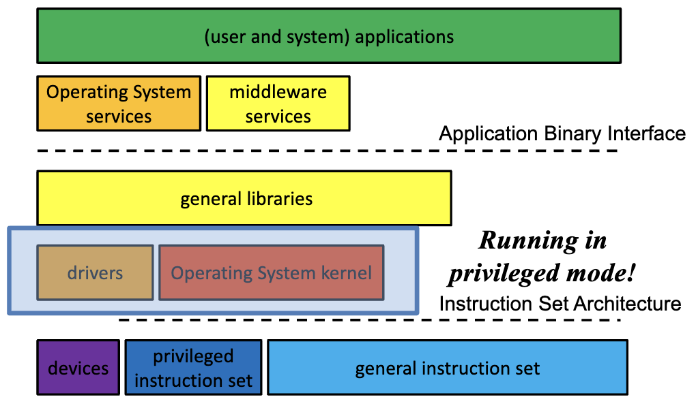
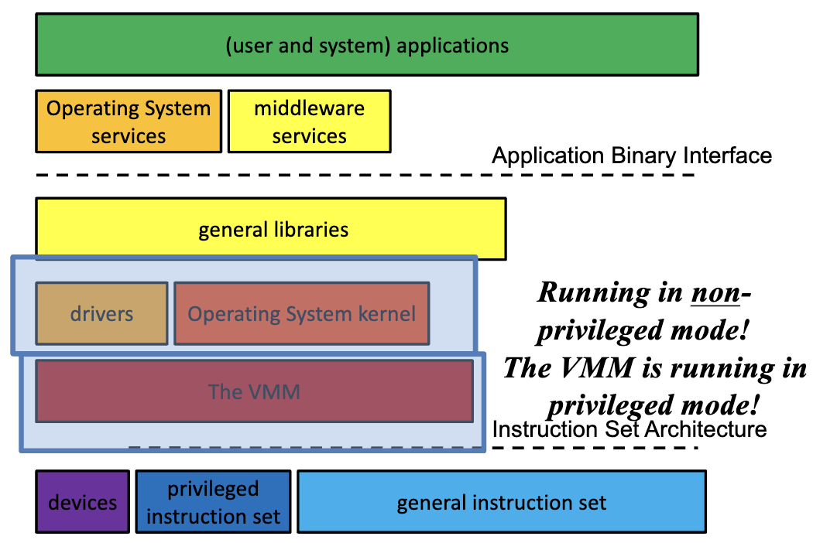
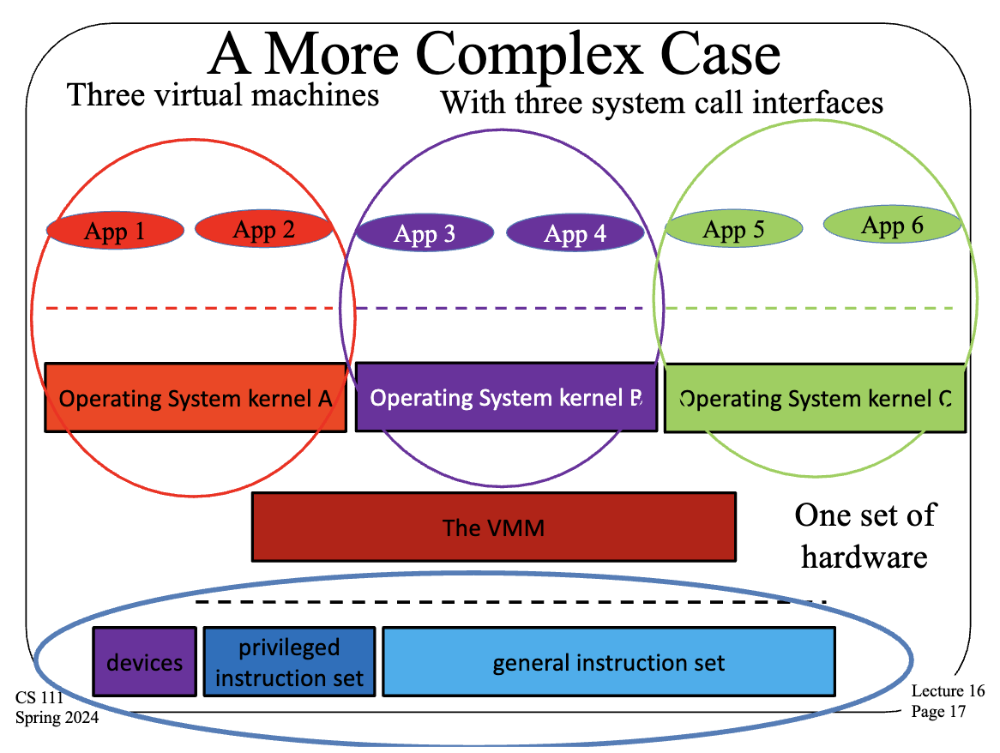
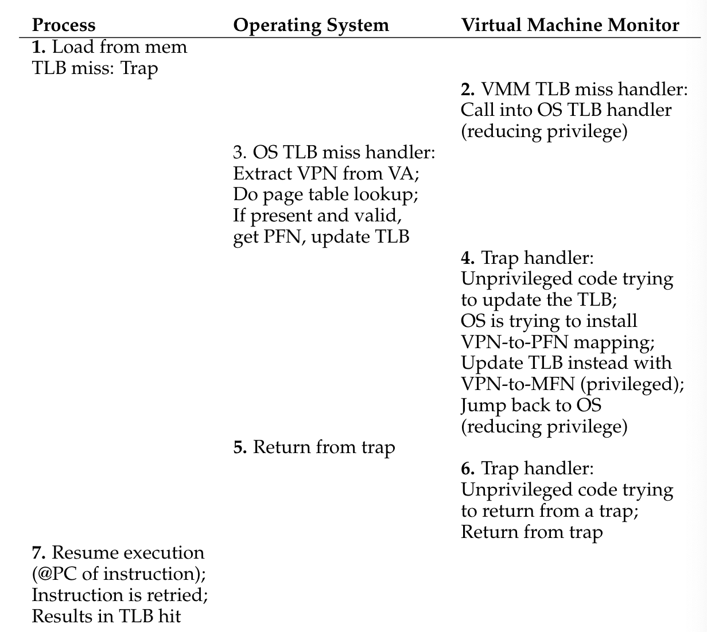

# Week 9 Notes

## Lecture 16: Virtual Machines

- What is a virtual machine?
  - A virtual machine is a software illusion meant to appear to be a real machine
- What does that really mean?
  - We have an actual computer
  - We do something in software to make it look like we have multiple computers
    - Or that it's a different kind of computer
    - Making use of the actual computer to do so
  - The virtual machine must appear to apps and users to be a real machine
- Graphically
  - We implement a virtual server on the real hardware with a set of virtual components
  - We have a real server computer with a real CPU, RAM, and peripherals
- How?
  - Use the real hardware the implement the virtual hardware
    - Instructions for the virtual CPU run on the real CPU
    - Real RAM stores the data for virtual RAM
    - A real disk stores data for the virtual disk
    - Etc
- Why do we want virtual machines?
  - Fault isolation
    - Operating systems must never crash since they take everything down with them
    - But crashing a virtual machine's operating system need not take down the entire machine, just the virtual machine
    - So our correctness requirements can be relaxed
    - Similar advantages for faults that could damage devices
      - They damage the virtual device, not the physical
  - Better security
    - The OS is supposed to provide security for processes, but the OS also provides shared resources such as the file system and IPC channels
    - A virtual machine need not see the real shared resource
    - So processes in virtual machines are harder to reach and possibly damage
  - To use a different operating system
    - Let's say you're running Windows but you want to run a Linux executable
    - Windows has one system call interface, Linux has another
      - So system calls from your Linux executable won't work on Windows
    - But if you have a virtual machine running Linux on top of the real machine running Windows, now your application can run fine (assuming you get the virtualization right)
  - To provide better controlled sharing of the hardware / sharing a machine's resources
    - In principle, an OS can control how to share resources among processes, but actually guaranteeing a particular allocation of resources is hard
    - It's easier to guarantee an entire virtual machine gets a set allocation of resources
      - So the processes running in it will not steal resources from the other virtual machines
    - A very big deal for cloud computing
- How do we run virtual machines?
  - Easiest if the virtual and real machine use the same ISA
    - Tricky and slow otherwise
    - So the same ISA is the common case
  - Basically, rely on limited direct execution
    - Run as much VM activity directly on the CPU as possible
    - When necessary, trap from the VM
  - But trap to what?
- The hypervisor
  - Aka the Virtual Machine Monitor (VMM)
  - A controller that handles all virtual machines running on a real machine
  - When necessary, trap from the virtual machine to the VMM
  - It performs whatever magic is necessary and then returns to limited direct execution, much like a process's system call to an OS
- When is trapping to the VMM necessary?
  - Whenever the VM does something privileged
    - Kind of like trapping to the OS when a process wants to do something privileged
  - The initial system call instruction will trap to the VM
  - Which will typically forward it to the VM's OS
  - But subsequent privileged operations trap back to the VMM
- The old architecture
  - 
- Architecture with a VMM
  - 
- A more complex case
  - Three virtual machines with three system call interfaces and one set of hardware
  - 
- How do system calls work now?
  - Using a privileged instruction
  - App 1 makes a system call, which OS A can't perform, so it's sent to the VMM instead
  - VMM can't perform the system call correctly because the VMM doesn't understand OS A's internal state and the VMM may not even offer that syscall itself
  - But the VMM knows where A's trap table is located so it can invoke A's code to handle the syscall
  - If it's a syscall, it may need to use privileged instructions to do its work, but OS A can't use privileged instructions
  - OS A traps when it tries to use a privileged instruction and the VMM catches the trap and does the instruction for A
- What's the point of that?
  - If the VMM is going to do the instruction, why not just run A with privilege so it can do its own instructions?
  - The VMM might decide not to do the instruction
    - If, for example, it tries to access another VM's memory
  - Or the VMM might block VM A and run VM B for a while instead
  - The key point: The VMM controls what happens
    - Even though the OS in the VM thinks it's in control
- A potential issue
  - If A is running in non-privileged mode, how can we enforce this interface?
  - How can we prevent App 1 from messing with A's internal data?
    - E.g., stop App 1 from killing App 2?
- The core of the problem
  - OS A thinks it's in control
  - OS A believes it's providing segregated virtual memories to App 1 and App 2
  - The key technology for doing so is managing page tables and CPU registers pointing to them
  - But OS A has no control over these registers, the VMM does
  - But the VMM knows nothing of the page tables OS A controls
- Virtualizing the memory
  - Add RAM to each circle and the bottom row
- How to virtualize memory
  - The virtual OS thinks it has physical memory addresses
    - It provides virtual memory addresses to its processes
    - Handling the virtual-to-physical translations
  - The VMM has machine addresses
    - Which it translates to physical addresses within a single VM
    - Still using the same paging hardware
- For example
  - App 1 issues virtual address X, causing a TLB miss and a trap
  - VMM catches the trap and invokes OS A since only OS A understands App 1's page table
  - OS A looks up virtual address X in App 1's page table and tries to install the physical page number for X in the TLB which causes another trap to the VMM
  - The VMM installs the right machine address for X in the TLB
  - We eventually unwind to run App 1
- Looked at another way
  - Some page frame actually contains page X
  - The VMM knows which page frame since it controls all page frames
  - But the VMM doesn't know about App 1's address space, OS A knows that
  - So the VMM must consult OS A to perform the translation
  - **VMM**: "Based on where you think it is, I know where it really is"
    - VMM has a different page table
- Some implications
  - TLB misses are much more expensive
    - Since we'll be moving back and forth from privileged mode to unprivileged
    - Paying overhead costs each time and we'll run more systems code
  - We'll need extra paging data structures in the VMM
    - More overhead
  - Virtual machines are thus likely to suffer performance penalties
- Making VMs perform better
  - Adding special hardware
    - Some CPUs have features to make issues of virtualizing the CPU and memory cheaper
  - Paravirtualization
    - The basic VM approach assumes the guest OSes in VMs don't know about virtualization
    - If you make some changes to those OSes, they can help make virtualization cheaper
- Virtual machines and cloud computing
  - Cloud computing is about sharing hardware among multiple customers
  - The cloud provider sells/rents computing services to customers
    - Handling all the difficult issues for them so they can just run their applications
  - Cloud providers need lots of customers to make money, which implies they need lots of hardware
- The cloud environment
  - A warehouse full of vast numbers of machines (typically tens of thousands) packed tightly into racks
  - Connected by high speed internal networks and connected to the Internet, to allow customers remote access
  - The expectation is that the environment will run applications for many separate customers at a time, many of which might require multiple computers to run properly
  - With strong guarantees of isolation between customers
- But why VMs in the cloud?
  - The cloud provider makes the most money by making the most efficient use of the hardware
    - More customers on the same amount of hardware = more profit
  - Often, a customer doesn't need the full power of a machine
    - You make more money by using part of that machine for another customer
  - But you need strong isolation like that provided by virtual machines
- So...
  - You run everyone in a virtual machine
  - Some customers have many virtual machines to handle their big jobs
  - Some customers' virtual machines share physical machines with other customers' VMs
  - Customers' work loads fluctuate
  - You want the most efficient packing of VMs onto physical machines possible to maximize profits
- How to efficiently place VMs
  - There are many physical nodes and many more VMs
  - Which do we put where?
  - Often reduces to a bin packing algorithm which tends to be NP-hard
    - Where n may depend on the number of servers and/or VMs considered
    - The more factors considered, the harder to solve
  - So estimation techniques are used
- VMs aren't just for cloud computing
  - They allow experimentation not easily performed on real hardware
  - They allow basic servers to safely divide their resources
  - They allow greater flexibility in the software your computer can run
- Conclusion
  - Virtual machines are a critical technology for modern computing
  - Virtual machines are implemented on real machines
  - The key issue is providing each VM the illusion of complete control
  - While also providing good performance
  - VMs are of special importance in cloud computing

## A. [A Dialogue on Virtual Machine Monitors](https://pages.cs.wisc.edu/~remzi/OSTEP/dialogue-vmm.pdf)

- Virtual machine monitors aka hypervisors
- Add another layer of virtualization into systems beneath the OS

## B. [Virtual Machine Monitors](https://pages.cs.wisc.edu/~remzi/OSTEP/vmm-intro.pdf)

- Introduction
  - Virtual machine monitor (VMM) / hypervisor
  - Monitor sits between one or more operating systems and the hardware and gives the illusion to each running OS that it controls the machine
  - Monitor is actually in control of the hardware and must multiplex running OSes across the physical resources of the machine
  - Serves as an OS for OS
  - OS must still think it's interacting with the physical hardware
  - Major goal is transparency
- Motivation: Why VMMs?
  - **Server consolidation**: Virtualization enables an administrator to consolidate multiple OSes onto fewer hardware platforms and lower costs and ease administration
  - Improvement in functionality
  - Testing and debugging (different platforms)
- Virtualizing the CPU
  - To run a virtual machine (e.g., an OS and its applications) on top of a virtual machine monitor, the basic technique that's used is limited direct execution
  - When we wish to "boot" a new OS on top of the VMM, we jump to the address of the first instruction and let the OS begin running
  - Assume we're running on a single processor and that we wish to multiplex between two virtual machines (two OSes and their respective applications)
    - VMM must perform a machine switch between running virtual machines
    - VMM must save the entire machine state of one OS (including registers, PC, and any privileged hardware state), restore the machine state of the to-be-run VM, and then jump to the PC of the to-be-run VM and complete the switch
    - To-be-run VM's PC may be within the OS itself (i.e., the system was executing a system call) or it may be within a process that's running on that OS (i.e., a user-mode application)
  - Issues when a running application or OS tries to perform some kind of privileged operation
  - In a virtualized environment, the OS cannot be allowed to perform privileged instructions because then it controls the machine rather than the VMM beneath it
  - VMM must intercept attempts to perform privileged operations and retain control of the machine
  - On a virtualized platform
    - When an application running on an OS wishes to perform a system call, it executes a trap instruction with the arguments carefully placed on the stack (or in registers)
    - VMM who has installed a trap handler will first get executed in kernel mode
    - VMM doesn't know the details of each OS that's running and doesn't know what each call should do, but knows where the OS's trap handler is
    - VMM jumps to the OS's trap handler and lets the OS handle the system call as it should
    - When OS is finished, it executes some kind of privileged instruction to return from the trap, which bounces into the VM, which performs a real return-from-trap, returns control to the user, and puts the machine back in user mode
    - Because of extra jumping around, might slow down system calls and hurt performance
  - OS runs in supervisor mode
    - If no supervisor mode, OS runs in user mode and uses memory protection (page tables and TLBs) to protect OS data structures
    - When switching into the OS, the monitor would have to make the memory of the OS data structures available to the OS via page-table protections
    - When switching back to the running application, the ability to read and write the kernel would have to be removed
- Virtualizing memory
  - Extra layer of virtualization makes "physical" memory a virtualization on top of what the VMM refers to as machine memory, which is the real physical memory of the system
  - Each OS maps virtual-to-physical addresses via its per-process page tables
  - VMM maps the resulting physical mappings to underlying machine addresses via its per-OS page tables
  - V operating systems running and V VMM page tables
  - On top of each running operating system OS, there would be a number of processes P_i running and hence P-i (per-process) page tables within OS
  - TLB miss with VMM
    - 
    - VMM TLB miss handler runs
    - Jumps into the OS TLB miss handler
    - OS TLB miss handler runs, does a page table lookup for the VPN in question, and tries to install the VPN-to-PFN mapping in the TLB
    - Causes another trap into the VMM
    - VMM installs its desired VPN-to-MFN mapping
    - System gets back to user-level code, which retries the instruction, and results in a TLB hit
    - Bit more expensive than in a non-virtualized system
    - To reduce the cost, VMM-level "software TLB"
      - VMM records every virtual-to-physical mapping that it sees the OS try to install
      - On a TLB miss, the VMM first consults its software TLB to see if it has seen this virtual-to-physical mapping before and what the VMM's desired virtual-to-machine mapping should be
      - If the VMM finds it, it installs the virtual-to-machine mapping directly into the hardware TLB
  - Hypervisors and hardware-managed TLBs
    - Hardware walks the page table on each TLB miss and updates the TLB as need be
    - VMM doesn't have a chance to run on each TLB miss to sneak its translation into the system
    - VMM must closely monitor changes the OS makes to each page table and keeps a shadow page table that maps the virtual addresses of each process to the VMM's desired machine pages
    - VMM installs a process's shadow page table whenever the OS tries to install the process's OS-level page table
  - VMM must track the physical-to-machine mappings for each virtual machine it's running
    - These per-machine page tables need to be consulted in the VMM TLB miss handler to determine which machine page a particular "physical" page maps to
  - **Paravirtualization**: Running a modified OS to run on a VMM
    - A properly-designed paravirtualized system, with just the right OS changes, can be made to be nearly as efficient a system without a VMM
- The information gap
  - VMM often doesn't know too much about what the OS is doing or wanting
  - Can lead to various inefficiencies
  - OS might go into an idle loop when it has nothing else to run, just spinning and waiting for the next interrupt to occur
    - Useful for VMM to know that one OS is idle so it can give more CPU time to the OS doing useful work
  - **Demand zeroing of pages**: Most OS zero a physical frame before mapping it into a process's address space for security
    - If the OS gave one process a page that another had been using without zeroing it, an information leak across processes could occur
    - VMM must zero pages that it gives to each OS -> many times a page will be zeroed twice (once by VMM and once by OS)
    - **Solution**: Changed OS to not zero pages that it knew had been zeroed by the underlying VMM
  - One solution is for the VMM to use inference (form of implicit information)
    - Ex: VMM can detect idle loop by noticing that the OS switched to low-power mode
  - Another solution is to change the OS (paravirtualized systems)
    - More explicit, harder to deploy, quite effective
- Summary
  - With the OS virtualization, a number of new abstractions and nice interfaces are provided
  - With VMM-level virtualization, the abstraction is identical to the hardware (and thus not very nice)
  - VMMs are not particularly meant to make the hardware easier to use

## Lecture 17: Operating System Security

- Introduction
  - Operating systems provide the lowest layer of software visible to users
  - Operating systems are close to the hardware and often have complete hardware access
  - If the operating system isn't protected, the machine isn't protected
  - Flaws in the OS generally compromise all security at higher levels
- Why is OS security so important?
  - The OS controls access to application memory
  - The OS controls scheduling of the processor
  - The OS ensures that users receive the resources they ask for
  - If the OS isn't doing these things securely, practically anything can go wrong
  - So almost all other security systems must assume a secure OS at the bottom
- Some important definitions
  - Security
    - Is a policy (e.g., "no unauthorized user may access this file")
  - Protection
    - Is a mechanism (e.g., "the system checks user identity against access permissions")
    - Protection mechanisms implement security policies
  - Vulnerabilities
    - A weakness that can allow an attacker to cause problems
    - Not all vulnerabilities can cause all problems
    - Most vulnerabilities are never exploited
  - Exploits
    - An actual incident of taking advantage of a vulnerability
    - Allowing attacker to do something bad on some particular machine
    - Also refers to the code or methodology used to take advantage of a vulnerability
  - Trust
    - Extremely important security concept
    - You do certain things for those you trust and you don't do them for those you don't
    - Trust and the operating system
      - You pretty much have to trust your operating system
      - It controls all the hardware, including the memory
      - It controls how your processes are handled
      - It controls all the I/O devices
      - If your OS is out to get you, you're gotten, which implies compromising an OS is a big deal
  - Authentication and authorization
    - In many security situations, we need to know who wants to do something
      - We allow trusted parties to do it
      - We don't allow others to do it
    - That means we need to know who's asking
      - Determining that is authentication
    - Then we need to check if that party should be allowed to do it
      - Determining that is authorization
      - Authorization usually requires authentication
- Authentication
  - Security policies tend to allow some parties to do something, but not others
  - Which implies we need to know who's doing the asking
  - For OS purposes, that's a determination made by a computer
- Real world authentication
  - Identification by **recognition**: I see your face and know who you are
  - Identification by **credentials**: You show me your driver's license
  - Identification by **knowledge**: You tell me something only you know
  - Identification by **location**: You're behind the counter at the DMV
- Authentication with a computer
  - Not as smart as a human, steps to prove identity must be well defined
  - Can't do certain things as well (e.g., face recognition)
  - But lightning fast on computations and less prone to simple errors
    - Mathematical methods are acceptable
  - Often must authenticate non-human entities like processes or machines
- Identities in operating systems
  - We usually rely primarily on a user ID
    - Which uniquely identifies some user on a particular computer
    - Processes run on his behalf, so they inherit his ID
      - E.g., a forked process has the same user associated as the parent did
  - Implies a model where any process belonging to a user has all his privileges
    - Which has its drawbacks
    - But that's what we use (mostly)
- Bootstrapping OS authentication
  - Processes inherit their user IDs from their parent process
  - But somewhere along the line we have to create a process belonging to a new user, typically on login to a system
  - We can't just inherit that identity
- Passwords
  - Authenticate the user by what he knows
    - A secret word he supplies to the system on login
  - System must be able to check that the password was correct either by storing it or storing a hash of it (much better option)
  - If correct, tie user ID to a new command shell or window management process
- Problems with passwords
  - They have to be unguessable yet easy for people to remember
  - If networks connect remote devices to computers, susceptible to password sniffers
    - Programs which read data from the network, extracting passwords when they see them
  - Unless quite long, brute force attacks often work on them
  - Widely regarded as an outdated technology, but extremely widely used
- Proper use of passwords
  - Sufficiently long
  - Contain non-alphabetic characters
  - Unguessable
  - Changed often
  - Never written down
  - Never be shared
  - Hard to achieve all this simultaneously
- Challenge/response systems
  - Authentication by what questions you can answer correctly
    - Again, by what you know
  - The system asks the user to provide some information
  - If it's provided correctly, the user is authenticated
  - Safest if it's a different question every time
    - Not very practical for humans
- Hardware-based challenge/response
  - The challenge is sent to a hardware device belonging to the appropriate user
    - Authentication based on what you have
  - Sometimes mere possession of device is enough
    - E.g., text challenges sent to a smart phone to be typed into a web request
  - Sometimes the device performs a secret function on the challenge
    - E.g., smart cards
- Problems with challenge/response
  - If based on what you know, usually too few unique and secret challenge/response pairs
    - Often the response can be found by attackers
  - If based on what you have, fails if you don't have it, and whoever does have it might pose as you
  - Some forms susceptible to network sniffing
    - Much like password sniffing
    - Smart card versions usually not susceptible
- Biometric authentication
  - Authentication based on what you are
  - Measure some physical attribute of the user
    - Things like fingerprints, voice patterns, retinal patterns, etc
  - Convert it into a binary representation
  - Check the representation against a stored value for that attribute
  - If it's a close match, authenticate the user
- Problems with biometric authentication
  - Requires very special hardware, with some exceptions
  - Many physical characteristics vary too much for practical use
  - Generally not helpful for authenticating programs or roles
  - Requires special care when done across a network
- Errors in biometric authentication
  - False positives
    - You identified Bill Smith as Peter Reiher
    - Probably because your biometric system was too generous in making matches
    - Bill Smith can pretend to be me
  - False negatives
    - You didn't identify Peter Reiher as Peter Reiher
    - Probably because your biometric system was too picky in making matches
    - I can't log in to my own account
- Biometrics and remote authentication
  - The biometric reading is just a bit pattern
  - If attacker can obtain a copy, he can send the pattern over the network without actually performing a biometric reading
  - Requires high confidence in security of path between biometric reader and checking device
    - Usually OK when both are on the same machine
    - Problematic when the Internet is between them
- Multi-factor authentication
  - Rely on two separate authentication methods
    - E.g., a password and a text message to your cell phone
  - If well done, each method compensates for some of the other's drawbacks
    - If poorly done, not so much
  - The current preferred approach in authentication
- Access control in operating systems
  - The OS can control which processes access which resources
  - Giving it the chance to enforce security policies
  - The mechanisms used to enforce policies on who can access what are called access control
  - Fundamental to OS security
- Access control lists (ACLs)
  - For each protected object, maintain a single list
    - Managed by the OS, to prevent improper alteration
  - Each list entry specifies who can access the object and the allowable modes of access
  - When something requests access to an object, check the access control list
  - Pros
    - Easy to figure out who can access a resource
    - Easy to revoke or change access permissions
  - Cons
    - Hard to figure out what a subject can access
    - Changing access rights requires getting to the object
- An example use of ACLs: The Unix file system
  - An ACL-based method for protecting files developed in the 1970s
  - Still in very wide use today
  - Per-file ACLs (files are the objects)
  - Three subjects on list for each file
    - Owner, group, other
  - And three modes
    - Read, write, execute
    - Sometimes these have special meanings
- Capabilities
  - Each entity keeps a set of data items that specify his allowable accesses
  - Essentially, a set of tickets
  - To access an object, present the proper capability
  - Possession of the capability for an object implies that access is allowed
  - Pros
    - Easy to determine what objects a subject can access
    - Potentially faster than ACLs (in some circumstances)
    - Easy model for transfer of privileges
  - Cons
    - Hard to determine who can access an object
    - Requires extra mechanism to allow revocation
    - In network environment, need cryptographic methods to prevent forgery
- Properties of capabilities
  - Capabilities are essentially a data structure
    - Ultimately, just a collection of bits
  - Merely possessing the capability grants access
    - So they must not be forgeable
    - To ensure unforgeability for a collection of bits:
      - Don't let the user/process have them
      - Store them in the operating system
- OS use of access control
  - Operating systems often use both ACLs and capabilities, sometimes for the same resource
  - E.g., Unix/Linux uses ACLs for file opens
  - That creates a file descriptor with a particular set of access rights (e.g., read only)
  - The descriptor is essentially a capability
- Enforcing access in an OS
  - Protected resources must be inaccessible
    - Hardware protection must be used to ensure this
    - So only the OS can make them accessible to a process
  - To get access, issue a request (system call) to OS
    - OS consults access control policy data
  - Access may be granted directly
    - Resource manager maps resource into process
  - Access may be granted indirectly
    - Resource manager returns a "capability" to process
- Cryptography
  - Much of computer security is about keeping secrets
  - One method of doing so is to make it hard for others to read the secrets
  - While (usually) making it simple for authorized parties to read them
  - That's what cryptography is all about
    - Transforming bit patterns in controlled ways to obtain security advantages
- Cryptography terminology
  - Typically described in terms of sending a message, though it's used for many other purposes
  - **S**: Sender
  - **R**: Receiver
  - **Encryption**: Process of making message unreadable/unalterable by anyone but R
  - **Decryption**: Process of making the encrypted message readable by R
  - **Cryptosystem**: A system performing these transformations
  - **Cipher**: Rules for transformation
- Plaintext and ciphertext
  - **Plaintext**: Original form of the message (P)
    - Ex: Transfer $100 to my savings account
  - **Ciphertext**: Encrypted form of the message (C)
    - Ex: Sqzmredq #099 sn lx rzuhmfr zbbntms
- Cryptographic keys
  - Most cryptographic algorithms uses a key (K) to perform encryption and decryption
  - The key is a secret
  - Without the key, decryption is hard
  - With the key, decryption is easy
  - Reduces the secrecy problem from your (long) message to the (short) key
    - But there's still a secret
- More terminology
  - **E()**: Encryption algorithm
  - C = E(K, P)
  - **D()**: Decryption algorithm
    - Also has a key
  - **Cryptosystem**: Combination of the two algorithms
- Symmetric cryptosystems
  - C = E(K, P)
  - P = D(K, C)
  - P = D(K, E(K, P))
  - E() and D() are not necessarily the same operations
  - Advantages
    - Encryption and authentication performed in a single operation
    - Well-known (and trusted) ones perform much faster than asymmetric key systems
    - No centralized authority required, though key servers help a lot
  - Disadvantages
    - Hard to separate encryption from authentication
      - Complicates some signature uses
    - Non-repudiation hard without servers
    - Key distribution can be a problem
- Some popular symmetric ciphers
  - The Data Encryption Standard (DES)
    - The old US encryption standard
    - Still somewhat used, for legacy reasons
    - Weak by modern standards
  - The Advanced Encryption Standard (AES)
    - The current US encryption standard
    - Probably the most widely used cipher
  - Blowfish
- Symmetric ciphers and brute force attacks
  - **Brute force**: Try every possible key until one works
  - The cost of brute force attacks depends on key length
    - For N possible keys, attack must try N/2 keys, on average, before finding the right one
  - DES uses 56 bit keys
    - Too short for modern brute force attacks
  - AES uses 128 or 256 bit keys
    - Long enough
- Asymmetric cryptosystems
  - Often called public key cryptography (PK)
  - Encryption and decryption use different keys
    - C = E(K_E, P)
    - P = D(K_D, C)
    - P = D(K_D, E(K_E, P))
  - Often works the other way too
    - C' = E(K_D, P)
    - P = D(K_E, C')
    - P = D(K_D, E(K_E, P))
- Using public key cryptography
  - Keys are created in pairs
  - One key is kept secret by the owner
  - The other is made public to the world (hence the name)
  - If you want to send an encrypted message to someone, encrypt with his public key
    - Only he has the private key to decrypt
- Authentication with public keys
  - If I want to "sign" a message, encrypt it with my private key
  - Only I know private key, so no one else could create that message
  - Everyone knows my public key, so everyone can check my claim directly
  - Much better than with symmetric crypto
    - The receiver could not have created the message
    - Only the sender could have
- Issues with PK key distribution
  - Security of public key cryptography depends on using the right public key
  - If I'm fooled into using wrong one, that key's owner reads my message or I authenticate incorrectly
  - Need high assurance that a given key belongs to a particular person
    - Either a key distribution infrastructure
    - Or use of certificates
  - Both are problematic, at high scale and in the real world
- The nature of PK algorithms
  - Usually based on some problem in mathematics, like factoring extremely large numbers
  - Security less dependent on brute force
  - More on the complexity of the underlying problem
  - Also implies choosing key pairs is complex and expensive
- Example public key ciphers
  - RSA
    - The most popular public key algorithm
    - used on pretty much everyone's computer nowadays
  - Elliptic curve cryptography
    - An alternative to RSA
    - Tends to have better performance
    - Not as widely used or studied
    - But still generally available
- Security of PK systems
  - Based on solving the underlying problem (e.g., for RSA, factoring large numbers)
  - In 2009, a 768 bit RSA key was successfully factored
  - Research on integration factorization suggests keys up to 2048 bits may be insecure
    - In 2013, Google went from 1024 to 2048 bit keys
  - Size will keep increasing
  - The longer the key, teh more expensive the encryption and decryption
- Combined use of symmetric and asymmetric cryptography
  - Very common to use both in a single session
  - Asymmetric cryptography essentially used to "bootstrap" symmetric crypto
  - Use RSA (or another PK algorithm) to authenticate and establish a session key
  - Use DES or AES with session key for the rest of the transmission
- For example
  - Alice wants to talk to Bob
  - Alice knows: K_EA, K_DB, K_DA
  - Bob knows: K_EB, K_DA, K_DB
  - Alice wants to share K_S only with Bob
  - Bob wants to be sure it's Alice's key
  - Only Bob can decrypt it
  - Only Alice could have created it
  - Process
    - Alice encrypts K_S with Bob's public key
      - C = E(K_S, K_DB)
    - Encrypt it a second time with Alice's private key
      - M = E(C, K_EA)
    - Sends M to Bob
    - Decrypt it with Alice's public key
      - C = D(M, K_DA)
    - Decrypt it again with Bob's private key
      - K_S = D(C, K_EB)
  - There are actually potential security problems with this method
- Conclusion
  - Security is an immense problem in modern computing systems
  - Since OSes are at the software base of computers, their security is critical
  - Authentication tells OS who's asking to do something
  - Authorization using access control determines whether the OS should do that thing
  - Cryptography is a critical tool for OS security

## 52. A Dialogue on Security

- When one is discussing security, lies will always be a part of the discussion
- Don't want:
  - Stolen peach
  - Swapped out peach
  - Slapping hand away every time you reach for your peach
  - Love letter leak
  - Reset game's saved state to the beginning
  - Not allowed to log into the computer
- Peach = resources
- When we talk about security, we're talking about genuine, human adversaries who are trying to make things go wrong for you

## 53. [Introduction to Operating System Security](https://pages.cs.wisc.edu/~remzi/OSTEP/security-intro.pdf)

- Introduction
  - If the software you're running on top of is insecure, what's above it is also going to be insecure
  - All of our software relies on proper behavior of the underlying hardware: the processor, memory, and peripheral devices
    - Operating system has ultimate control of all these hardware resources
- What are we protecting?
  - Everything
  - OS can:
    - Examine or alter any process's memory
    - Read, write, delete, or corrupt any file on any writeable persistent storage medium, including hard disks and flash drives
    - Change the scheduling or even halt execution of any process
    - Send any message to anywhere, including altered versions of those a process wished to send
    - Enable or disable any peripheral device
    - Give any process access to any other process's resources
    - Arbitrarily take away any resource a process controls
    - Respond to any system call with a maximally harmful lie
  - What parts of the hardware does the OS not control?
    - **Trusted Platform Module (TPM)**: Intended to protect the boot process of the operating system
    - **Security enclave**: Meant to allow only safe use of this data, even by the most powerful, trusted code in the system (operating system)
      - Used to support operations in a cloud computing environment, where multiple operating systems might be running under virtual machines sharing the same physical hardware
  - Processes are at the mercy of the operating system
  - Nearly impossible for a process to protect any part of itself from a malicious operating system
- Security goals and policies
  - Like a high degree of assurance that we get what we want
  - **Confidentiality**: If some piece of information is supposed to be hidden from others, don't allow them to find out
  - **Integrity**: If some piece of information or component of a system is supposed to be in a particular state, don't allow an adversary to change it
    - **Authenticity**: Important to be sure that information has not change and that it was created by a particular party and not by an adversary
  - **Availability**: If some information or service is supposed to be available for your own or others' use, make sure an attacker cannot prevent its use
  - Want controlled sharing in our systems
  - **Non-repudiation**: Want to be sure that when someone told us something, they cannot later deny that they didn't do so
    - Hold people accountable for malicious actions
  - What we want in security mechanisms for operating systems is flexibility in describing our detailed security goals
  - Convert vague understandings of security goals into highly specific security policies
  - An operating system will have the mechanisms necessary to implement a desired security policy with a high degree of assurance in its proper application, but only if someone tells the operating system precisely what that policy is
    - With some important exceptions (like maintaining a process's address space private unless specifically directed otherwise), the operating system merely supplies general mechanisms that can implement many specific policies
  - Security vs. fault tolerance
    - If we perfectly virtualized everything and allowed no interactions between anything, we very likely would've solved most problems of malice
    - Virtualization mechanisms work well when no one tries to subvert them, but may not be perfect against all possible forms of misbehavior
    - We don't really want to totally isolate processes from each other
      - Processes share some OS resources by default (such as file systems) and can optionally choose to share others
      - Intentional relaxations of virtualization aren't problematic when used properly, but the possibilities of legitimate sharing they open are also potential channels for malicious attacks
    - OS doesn't always have complete control of the hardware
- Designing secure systems
  - **Economy of mechanism**: Keep your system as small and simple as possible
  - **Fail-safe defaults**: Default to security, not insecurity
  - **Complete mediation**: You should check if an action to be performed meets security policies every single time the action is taken
    - Often ignored in many systems in favor of lower overhead or usability
  - **Open design**: Assume your adversary knows every detail of your design; if the system can achieve its security goals anyway, you're in good shape
  - **Separation of privilege**: Require separate parties or credentials to perform critical actions (Ex: two-factor authentication)
  - **Least privilege**: Give a user or a process the minimum privileges required to perform the actions you wish to allow
  - **Least common mechanism**: For different users or processes, use separate data structures or mechanisms to handle them
  - **Acceptability**: If your users won't use it, your system is worthless
- The basics of OS security
  - Some security goals are built in to the operating system model, while others are controlled by the owners or users of the system
  - Built-in goals are those that are extremely common or must be ensured to make the more specific goals achievable
    - Most relate to controlling process access to pieces of the hardware
    - Others relate to services that the operating system offers, such as file systems, memory management, and interprocess communications
  - A lot of system security is related to process handling
  - TL;DR OS has security measures in every step it takes
    - Hardware support prevents a process from naming a physical memory address that's not mapped into its virtual memory space
    - System calls allow the OS to check if the requested service should be allowed under the system's security policy (also applies to access to peripheral devices)
    - OS can use access control mechanisms to device if the identified process is authorized to perform the requested action
  - Be careful of the weakest link
    - Least protected part of your system, the one that's easiest to attack, the one you can't hide away or augment with some external security system
    - Human users

## 54. [Authentication](https://pages.cs.wisc.edu/~remzi/OSTEP/security-authentication.pdf)

- Introduction
  - Context is king
  - The most important element of that context is who's doing the asking
  - **Principal**: The party asking for something; security-meaningful entities that can request access to resources, such as human users, groups of users, or complex software systems
  - **Agent**: The process or other active computing entity performing the request on behalf of a principal
  - **Object of the access request**: Some particular resource
  - **Credential**: Any form of data created and managed by the operating system that keeps track of access decisions for future reference
  - Most operating systems have a notion of a user identity, where the user is typically some human being
  - Another common identity is a group of users
  - Another form of identity is the program that the process is running
  - Once a principal has been authenticated, systems will almost always rely on that authentication decision for at least the lifetime of the process
- Attaching identities to processes
  - Processes are usually created by other processes
  - One simple way to attach an identity to a new process is to copy the identity of the process that created it
  - We can create a primal process when our operating system boots, perhaps assigning it some special system identity not assigned to any human user
  - **Multi-user system**: Assign identities to processes based on which human user they belong to
  - When a user first starts interacting with a system, the operating system can start a process up for that user
    - Since the operating system can fiddle with its own data structures, like the process control block, it can set the new process's ownership to the user who just joined the system
    - Operating system determines the user's identity when the user logged in
- How to authenticate users?
  - If the person is not an authorized user of the system at all, we should reject this attempt to sneak in
  - If they're an authorized user, we need to determine which one?
  - Authenticating the identity of human beings has worked in one of three ways, by:
    - What you know
    - What you have
    - What you are
- Authentication by what you know
  - Most commonly performed by using passwords
  - A password is a secret known only to the party to be authenticated
  - Effectiveness depends on:
    - Other people don't know the party's password
    - No one else can guess it
    - The party in question must know and remember it
  - System itself needs to know the password, might be another possible vulnerability -> jk, system does not need to know
    - System only checks if the user knows the password, not what the password actually is
    - Store a hash of the password, not the password itself
    - By their nature, you can't reverse hashing algorithms
  - **Cryptographic hashes**: Special class of hashing algorithms that make it infeasible to use the hash to figure out what the password is, other than by actually passing a guess at the password through the hashing algorithm
    - Hard to design
    - **US standard**: SHA-3
  - **Dictionary attack**: When attackers try lists of names and words before trying random strings of characters when guessing passwords
    - A good dictionary attack can figure out 90% of the passwords for a typical site
  - **Password vault**: An encrypted file (by a password) kept on your computer that stores passwords
  - Before hashing a new password and storing it in your password file, generate a big random number (say 32 or 64 bits) and concatenate it to the password
    - Hash the result and store that
    - You also need to store the random number, since when the user tries to log in and provide the correct password, you'll need to take what the user provided, concatenate the stored random number, and run that through the hashing algorithm
    - **Salt**: Random number
    - Typically store the salt in the password file right next to the hashed password
    - Attacker can no longer create one translation of passwords in the dictionary to their hashes
    - Need one translation for every possible salt, since the password files that were stolen are likely to have a different salt for every password
    - If the salt is 32 bits, that's 2^32 different translations for each word in the dictionary
- Authentication by what you have
  - ID card, ticket
  - If we have something that plugs into one of the ports on a computer, such as a hardware token that uses USB, then with suitable software support, the operating system can tell whether the user trying to log in has the proper device or not
  - **Dongle**: Security token
  - Make use of the person's capabilities to transfer information from whatever it is they have to the system where the authentication is required
    - Ex: Some smart tokens display a number/character string on a tiny built-in screen, human user types the information read off that screen into the computer's keyboard
  - Weak point: What if you don't have it?
    - You don't have the magic item you need to authenticate yourself to the operating system
    - Someone else has your magic item and can possibly pretend to be you
  - There's a significant gap between what academics tell you is safe and what happens in the real world
    - Part of this gap is because the real world needs to deal with real issues, like user convenience
    - Part of it is because security academics have a tendency to denigrate anything where they can think of a way to subvert it, even if that way is not itself particularly practical
    - Ex: Authenticating a user to a system by sending a text message to the user's cell phone, where the user then types a message into the computer
    - In theory is weak because can lose phone, attacker can misdirect text message
    - But in practice, people usually have their phone with them and take care not to lose it, and if they do lose it, they notice that quickly and take quick action to fix their problem
    - Redirecting text messages is possible but far from trivial
  - A mechanism that causes security purists to avert their gazes in horror in actual use provides quite reasonable security
    - Ex: Redirecting text messages sent to cell phones
  - Linux login procedures
    - Special login process running under a privileged system identity displays a prompt asking for the user to type in their identity in the form of a username
    - Type username and hit return
    - Name is echoed to the terminal
    - Type password, which is not echoed
    - Login process looks up the name the user provided in the password file
      - If it's not found, login process rejects the login attempt
      - If it's found, the login process determines the:
        - Internal user identifier
        - Group that the user belongs to
        - Initial command shell that should be provided to this user once login is complete
        - Home directory the shell should be started in
    - Login process finds the salt and the salted, hashed version of the correct password for the user
    - Login process combines the salt for the user's password and the password provided by the user and performs the hash on the combination
    - Compare the result to the stored version
      - If they don't match, login process rejects the login attempt
      - If they match, fork a process
        - Set the user and group of the forked process to the values determined earlier
        - Change directory to the user's home directory and exec the shell process associated with this user
    - Login can fail either because the username is not present in the system or because the password doesn't match the username
    - Not providing useful information to non-authenticated users is generally a good security idea (e.g., not saying which condition failed)
- Authentication by what you are
  - Physical human characteristics, behavioral human characteristics
  - This approach is very attractive to many people, especially to those who have never tried to make it work
  - Computer program measures a human characteristic and determines if it belongs to a particular person
  - Difficulties
    - Lookalike
    - Wearing a mask
    - Holding up a photo
    - Dim lightning
    - Full face not shown
    - Look has changed
  - Computer programs don't recognize faces the way people do, they convert it to zeros and ones and process it using some algorithm
    - Cannot do a comparison based on bit-for-bit equivalence
    - Need to extract higher-level features from the photos and compare those
  - If the feature match is close enough, we authenticate
  - **False negative**: Incorrectly decided not to authenticate; fail to match the real user's picture to the stored version
  - **False positive**: Incorrectly decided to authenticate; authenticate a user who's not who they claim to be
  - As false positive rate goes down, false negative rate goes up, and vice versa
  - **Sensitivity**: How close the match must be
  - **Crossover error rate**: Common metric for describing the accuracy of a biometric
    - Represents an equal tradeoff between the two kinds of errors
    - Won't always try to hit the crossover error rate, you might care about one kind of error more than another
  - Many of the techniques for measuring require special hardware not likely to be present on most machines
    - A few biometric techniques (such as measuring typing patterns) require relatively common hardware that's likely to be present on many machines, but there aren't many such techniques
    - Even if a special hardware device is available, the convenience of using them for this purpose can be limiting
  - Think about whether there's any physical gap between where the biometric quantity is measured and where it's checked
    - Checking biometric readings provided by an untrusted machine across the network is hazardous
    - When the hardware is on the other side of the world on a machine you have no control over, there's a lot more opportunity to slip in a spurious bit pattern that didn't come from the device
    - Be careful with biometric authentication information provided to you remotely
- Authenticating non-humans
  - Many circumstances in which no human user is associated with a process that's running
    - Ex: Web server, embedded devices (smart light bulb)
    - Operating system can set up a user called `webserver` or `lightbulb` on the system and attach the identity of the "user" to the processes that are associated with running the web server or turning the light bulb on and off
  - How do you make sure that only real web server processes are tagged with that identity?
    - Use passwords
      - Used when it's needed, when you want to create a process belonging to the web server but don't already have one in existence
      - Most common authentication method used to determine if a process can be assigned to one of these non-human users
    - Skip the go-between (login) and provide some mechanism whereby the privileged user is permitted to create processes that belongs to some other user such as `webserver`
    - Provide a mechanism that allows a process to change its ownership so the web server processes would start off under some other user's identity (such as the system administrator's) and change their ownership to `webserver`
    - Allow a temporary change of process identity, while still remembering the original identity
  - Sometimes no authentication of the non-human user is required at all
    - Instead, certain other users (like trusted system administrators) are given the right to assign new identities to the processes they create, without providing any further authentication information than their own
    - In Linux and other Unix systems: sudo command
      - `sudo -u webserver apache2`: apache2 program should be started under the identity of `webserver`, rather than under the identity of whoever ran the sudo command
      - Might require the user running the command to provide their own authentication credentials but wouldn't require authentication information associated with `webserver`
- Other ways to authenticate
  - Location
  - Behavior
    - Sometimes we only care if they're good people, not who they are
  - Group membership
    - Ex: Group of system administrators
    - A child process will usually have the same group-related privileges as its parent
    - Provides a second path by which a user can obtain access to a resource, which has its benefits and dangers

## 55. [Access Control](https://pages.cs.wisc.edu/~remzi/OSTEP/security-access.pdf)

- Introduction
  - **Access control**: Figure out if the request fits within our security policy / Determine which system resources or services can be accessed by which parties in which ways under which circumstances
    - If it does, perform the operation
    - If not, make sure it isn't done
- Important aspects of the access control problem
  - System will run some kind of algorithm to make this decision
  - At the high level, access control is usually spoken of in terms of subjects, objects, and access
    - **Subject**: The entity that wants to perform the access, perhaps a user or a process
    - **Object**: The thing the subject wants to access, perhaps a file or a device
    - **Access**: Some particular mode of dealing with the object, such as reading it or writing it
  - **Authorization**: The process of determining if a particular subject is allowed to perform a particular form of access on a particular object
  - **Reference monitor**: The code that implements this algorithm
    - Implement both correctly and efficiently
  - Give subjects objects that belong only to them
    - Ex: Process accessing its own virtual memory
  - Two ways
    - **Access control list system**: Hire a bouncer with a list of people to admit
      - Access control list (ACL) is the list
      - Check is made after trapping to the operating system but before the access is actually permitted, with an early exit and error code returned if the access control check fails
    - **Capability-based system**: Give keys to allowed guests
      - Capabilities are the keys
- Using ACLs for access control
  - One ACL for each room in the club
  - Each file has its own access control list, resulting in simpler, shorter lists and quicker access control checks
  - Process
    - `open()` call traps to the operating system
    - OS consults the running process's PCB to determine who owns the process -> user X owns the process
    - Get access control list for `/tmp/foo` (stored with or near the rest of the metadata for this file) from persistent storage
      - Somewhere on the flash drive or disk
    - If X is on the list, determine if the ACL entry for X allows the type of access being request
    - If X is not on the list, no access
  - A lot of files should be available in some mode (perhaps read or execute to all users)
    - But we don't want to reserve enough space in every ACL for every possible user to be listed, since most users wouldn't appear in most ACLs
  - Nine bits for each file's ACL, partition the entries on the access control list into:
    - Owner of the file (identity is already stored in the inode)
    - Members of a particular group or users (group ID was stored in the inode)
    - Everybody else
    - Solved the problem of the amount of storage eaten up by ACLs and the cost of accessing and checking them
    - ACL is embedded in the inode -> no extra seeks and reads to obtain it
    - Instead of a search of an arbitrary sized list, a little simple logic on a few bits would provide the answer to the access control question
  - Pros
    - Easy to figure out who's allowed to access a resource
    - Easy to change the set of subjects who can access an object
    - Since the ACL is typically kept either with or near the file itself, if you can get to the file, you can get to all relevant access control information
      - Good performance implications
  - Cons
    - Require you to solve having to store the access control information somewhere near the file and dealing with potentially expensive searches of long lists
      - Solutions limit what ACLs can do
    - If you want to figure out the entire set of resources some principal (a process or a user) is permitted to access, you'll need to check every single ACL in the system, since that principal might be on any fo them
    - In a distributed environment, you need to have a common view of identity across all the machines for ACLs to be effective
      - Is the user `remzi` on `cs.ucla.edu` refer to the same principal as user `remzi` on `cs.wisconsin.edu`?
      - If not, you may allow a remote user to access something they shouldn't
      - But trying to maintain a consistent namespace of users across multiple different domains is challenging
    - Process inherits the identity of its parent process, also inheriting all of the privileges of that principal
      - Hard to give the process just a subset of the parent's privileges
      - Either you need to create a new principal with those limited privileges, change a bunch of access control lists, and set the new process's identity to that new principal, or you need some extension to your access control model that doesn't behave quite the way access control lists ordinarily do
- Using capabilities for access control
  - Process
    - Either your application would provide a capability permitting your process to open the file in question as a parameter, or the operating system would find the capability for you
    - Operating system checks that the capability does or does not allow you to perform a read/write open on file `/tmp/foo`
    - If it does, the OS opens it for you
    - If not, back comes an error to your process
  - Capabilities are bunches of bits, data
    - Likely to be fairly long and fairly complex
    - It's possible for anyone to create any capability they want
    - Once someone has a working capability, they can make as many copies of it as they want, and can potentially store them anywhere they want, including on an entirely different machine
      - **Revocation**: We can't take access permission away once granted since the process might have copies of the capability stored elsewhere
      - Perhaps the process can grant access to another process merely by using IPC to transfer a copy of the capability to that other process
  - Operating system controls and maintains capabilities, storing them somewhere in its protected memory space
  - Processes can perform various operations on capabilities, but only with the mediation of the operating system
  - If we want to rely on capabilities for access control, the operating system will need to maintain its own protected capability list for each process
    - Slap a pointer to the capability list (stored in kernel memory) into the process's PCB
  - In a general system, keeping an on-line capability list of everything some principal is permitted to access would incur high overheads
    - Generally, if one is using capabilities, the system persistently stores the capabilities somewhere safe and imports them as needed
    - So a capability list attached to a process is not necessarily very long, but there is an issue of deciding which capabilities of the immense set users have at their discretion to give to each process they run
  - Capabilities can be cryptographically protected instead
    - Cannot be guessed in a practical way and can be left in the user's hands
    - Make most sense in a distributed system
  - Pros
    - Easy to determine which system resources a given principal can access
    - Easy to revoke access if the OS has exclusive access to the capability (much more difficult if it does not)
    - If you have the capability readily available in memory, it can be quite cheap to check it, particularly since the capability can itself contain a pointer to the data or software associated with the resource it protects
    - Offer a good way to create processes with limited privileges
  - Cons
    - Expensive to determine the entire set of principals who can access a resource
      - Must check all principals' capability lists
    - Simple methods for making capability lists short and manageable have not been as well developed as the Unix method of providing short ACLs
    - System must be able to create, store, and retrieve capabilities in a way that overcomes the forgery problem, which can be challenging
  - User-visible access control mechanisms tends to use access control lists, not capabilities, for a number of reasons
  - Under the covers operating systems make extensive use of capabilities
  - Combine use of ACL and capabilities
    - Use ACL
    - If the call was successful, as long as the process keeps the file open, the ACL is not examined on subsequent reads and writes
    - Create a data structure that amounts to a capability indicating that the process has read and write privileges for that file and attach it to the PCB
    - On each read or write operation, the OS can consult this data structure to determine if reading and writing are allowed without having to find the file's access control list
    - If the file is closed, this capability-like structure is deleted form the PCB and the process can no longer access the file without performing another call that goes back to the ACL
    - Similar techniques can be used to control access to hardware devices and IPC channels, especially since Unix-like systems treat these resources as if they were files
- Mandatory and discretionary access control
  - Whoever owns the resource decides what the access control on a computer resource should be
    - User's file -> user
    - System resource -> system administrator or owner of the computer
    - Wrong for some systems and security policies, in particular, the parties who care most about information security sometimes want tighter controls than that
      - Ex: Military
  - Principal has the power to set the access controls for information created by and belonging to other users, and those users can't override his decisions
  - **Discretionary access control**: Whether almost anyone or almost no one is given access to a resource is at the discretion of the owning user
  - **Mandatory access control**: At least some elements of the access control decisions in such systems are mandated by an authority, who can override the desires of the owner of the information
    - Can also include discretionary elements, which allow further restriction (but not loosening) of mandatory controls
    - Many people will never work with a system running mandatory access controls
    - Operating system is involved in enforcing them
- Practicalities of access control mechanisms
  - Most systems expose either a simple or more powerful access control list mechanism to their users, and most of them use discretionary access control
  - The system allows each user to establish a default access permission that is used for every file they create
  - Android access control model
    - Application developers define accesses required by their app and specifies ways in which other apps can communicate with the new app
    - **Permission label**: Data structure used to encode this access information (what it can access and what it provides to others)
      - Set at app design time and encoded into a particular Android system at the moment the app is installed on that machine
      - Like capabilities
      - An app's set of permission labels is set statically at install time
      - Form of mandatory access control
  - A theoretically changeable or tunable setting will, in practice, be used unaltered by almost everyone almost always
  - Organizing access control on the basis of roles and then assigning particular users to the roles they are allowed to perform makes implementation of many security policies easier
    - Particularly valuable if certain users are permitted to switch roles depending on the task they're currently performing, since then one need not worry about setting or changing the individual's access permissions on the fly, but simply switch their role from one to another
    - Hold the role's permission only as long as they maintain that role
    - Once they exit the particular role, they lose the privileges of the role they exit
  - Role-Based Access Control (RBAC)
    - Common use in many organizations, particularly large ones
    - Like Discord roles lol except you can only have one role at a time
    - Ties in with principle of least privilege
    - More powerful than mere group access permissions
    - Allow a particular user to take on multiple disjoint roles
    - **Type enforcement**: Associates detailed access rules to particular objects using a security context for that object
  - **Privilege escalation**: Allows careful extension of privileges, typically by allowing a particular program to run with a set of privileges beyond those of the user who invokes them
    - Unix/Linux `setuid`: Allows a program to run with privileges associated with a different user, generally a user who has privileges not normally available to the user who runs the program
    - Privileges are only granted during the run of that program and are lost when the program exits
    - Perform a limited set of operations using those privileges, ensuring that privileges cannot be abused
    - Linux `sudo`: Allows some designated user to run certain programs under another identity
      - Requires a new authentication step, as with other RBAC systems
    - Attackers who have gained any kind of a foothold on a system will look around for ways to escalate their privileges (first order of business upon successful compromise of a system)
    - Paramount goal of an attacker is to use privilege escalation to become the root user
  - RBAC systems typically support finer granularity and more careful tracking of role assignment than `setuid` and `sudo` operations allow
    - Might be part of the operating system, some form of add-on to the system, or a programming environment
  - Often, if you're using RBAC, you also run some degree of mandatory access control
- Summary
  - Security failures due to faulty access control mechanisms are rare
  - Security failures due to poorly designed policies implemented by those mechanisms are not

## 56. [Protecting Information With Cryptography](https://pages.cs.wisc.edu/~remzi/OSTEP/security-crypto.pdf)

- Introduction
  - Operating system has no real control over what happens on other machines, nor what happens if one of its pieces of hardware is accessed via some mechanism outside the operating system's control
  - Prepare the resource for trouble in advance
  - If an opponent cannot understand the data in the form it's obtained, it can't be altered in a controllable way
  - **Cryptography**: A set of techniques to convert data from one form to another, in controlled ways with expected outcomes
  - Must be able to reverse the transformation, must be hard for the opponent to do
  - Computationally expensive
  - Poorly chosen uses that are badly implemented may even hurt
- Cryptography
  - Take a piece of data and use an algorithm (cipher), usually augmented with a second piece of information (key), to convert the data into a different form
  - We want to be able to run another algorithm, again augmented with a second piece of information, to convert the data back to its original form
  - C = E(P, K)
    - Start with data P (plaintext, message we want to send), key K, and encryption algorithm E()
    - We end up with C (cipher-text, protected version of the message that we send out), the altered form of P
  - P = D(C, K)
    - Decryption algorithm D()
  - For the encryption process to be useful, it must be deterministic
  - In many cases, E() and D() are actually the same algorithm
  - It should be very hard to figure out P from C without knowing K
  - We usually can't keep E() and D() secret
    - Extremely hard to design good ciphers
  - If the cipher has weaknesses, then an opponent can extract P even without K
  - The cryptography's benefit relies entirely on the secrecy of the key
  - Maintaining key secrecy in practical systems for real uses of cryptography isn't easy
  - Can perform a hashing function on the plaintext and include the hash with the message or encrypted file
    - If the plaintext we get out doesn't produce the same hash, we'll have a strong indication that something is amiss
    - Helps us protect the integrity of our data
  - **Cryptography for authentication**: If someone hands you a piece of data that's been encrypted with a key K known only to you and one other person, and you weren't the one who created it, if it decrypts properly using key K, you know the other person must have created it
  - **Symmetric cryptography**: The same key is used to encrypt and decrypt the data
- Public key cryptography
  - Two different keys, one to encrypt and one to decrypt
  - C = E(P, K_encrypt)
  - P = D(C, K_decrypt)
  - Can tell everyone their decryption key K_decrypt (public key), but keep encryption key K_encrypt secret (private key)
  - Avoids the issue of securely distributing a secret key
  - Works the other way around, you can use the decryption key K_decrypt to encrypt, and use the encryption key K_encrypt to decrypt
    - No longer allows authentication
    - Only the owner of the key can decrypt messages
  - Allows authentication if you encrypt with the private key and secret communication if you encrypt with the public key
    - If you want both, you'll need two different key pairs
    - Encrypt message with your private key, then encrypt with other person's public key
    - Requires both parties to know each other's public keys, but someone can intercept and provide a different key
  - Much more computationally expensive than using a single shared key
- Cryptographic hashes
  - Hash data and encrypt the hash, instead of encrypting the entire thing
  - Can't use just any hash function since they may have hash collisions (two different bit patterns hash to the same thing)
  - Properties
    - It is computationally infeasible to find two inputs that will produce the same hash value
    - Any change to an input will result in an unpredictable change to the resulting hash value
    - It is computationally infeasible to infer any properties of the input based only on the hash value
  - If we only care about data integrity rather than secrecy, we can take the cryptographic hash of a piece of data, encrypt only that hash, and send both the encrypted hash and the unencrypted data to our partner
    - If you decrypt the hash and repeat the hashing operation on the data, you can see mismatches and detect tempering
  - S = H(P)
    - Hashing algorithm H()
    - Expect S to be shorter than P (perhaps by a lot)
    - Implies there will be collisions, situations in which two different plaintexts P and P' both hash to S
  - Other uses
    - Store salted hashed passwords
    - Determine if a stored file has been altered
    - **Proof of work**: Force a process to perform a certain amount of work before submitting a request
      - Submitter is required to submit a request that hashes to a certain value using some specified cryptographic hash which requires them to try a lot of request formats before finding one that hashes to the required value
      - Submitting a proper request will require a predictable amount of work
      - Spam prevention and blockchains
  - Recommend SHA-3
  - Do not allow reversal of the cryptography and do not require the use of keys
- Cracking cryptography
  - If you use a modern standard, with a few unimportant exceptions, there are no known ways to read data encrypted with these algorithms without obtaining the key
  - To break into it, exploit software flaws in your system, obtain your keys, or exploit some other flaw in your management of cryptography
  - Software flaws in how you create and use your keys are a common problem
  - In distributed environments, flaws in the methods used to share keys are also a common weakness that can be exploited
  - Guess the key
    - Doesn't actually crack the cryptography
  - **Brute force attack**: Guess each possible key and try it
  - Key selection is a big deal
    - Ex: If a software flaw causes your system to select one of thirty-two possible AES keys instead of one out of 2^128
  - Best way to select keys is randomly
    - If you use any deterministic method to select your key, your opponent's problem of finding out your key has just been converted into a problem of figuring out your method
    - Perfect forward secrecy
    - **Gathering entropy**: The best source for operating system purposes is to examine hardware processes that are believed to be random in nature, like low order bits of the times required for pieces of hardware to perform operations, and convert the results into random numbers
  - PK systems use much longer keys, 2K or 4K bits
    - You can't select keys for this type of cryptosystem at random
    - Only a relatively few pairs of public and private keys are possible
    - Relationship between public and private keys is mathematical and intended to be mathematically hard to derive, so knowing the public key shouldn't make it easy to learn the private key
    - With the public key in hand, one can use the mathematical properties of the system to derive the private key eventually (big keys = eventually = long time)
- Cryptography and operating systems
  - If you have encrypted information on the computer and you have the necessary key to decrypt it on the same computer, the operating system on that machine can decrypt the data, whether that was the intended effect or not
  - If you don't trust your operating system, it can copy and reuse the secret key whenever it wants
  - If you trust your operating system, you don't need to hide your data from it, so cryptography isn't necessary
  - If you're sure your operating system is trustworthy right now but are concerned it might not be later, you can encrypt something now and make sure the key is not stored on the machine
    - If you're wrong about the current security of the operating machine or if you ever decrypt the data on the machine after the OS goes rogue, cryptography will not protect you
  - Not all compromises of an operating system are permanent
    - Many are, but some only give an attacker temporary access to system resources, or access to only a few particular resources
    - In such cases, if the encrypted data is not stored in plaintext and the decryption key is not available at the time or in the place the attacker can access, encrypting that data may still provide benefit
    - Tricky issue is that you can't know ahead of time whether successful attacks on your system will only occur at particular times, for particular durations, or on particular elements of the system
    - If you take this approach, you want to minimize all your exposure: Decrypt infrequently, dispose of plaintext data quickly and carefully, and don't keep a plaintext version of the key in the system except when performing the cryptographic operations
    - Minimization can be difficult to achieve
  - Uses
    - One-way: Encrypt, but never decrypt
      - Securely store passwords in encrypted form
    - In a distributed environment, if we encrypt data on one machine and then send it across the network, all the intermediate components won't be part of our machine, and thus won't have access to the key
      - Data will be protected in transit
      - Partner will need the key
    - **At-rest data encryption**: Data stored on hardware is encrypted, key isn't on hardware
- At-rest data encryption
  - Encrypted data needs to be decrypted if we want to use the data
  - **Homomorphic cryptography**: Allows you to perform operations on the encrypted form of the data without decrypting it
  - If the purpose is only to preserve a safe copy of the data rather than use it, decryption is unnecessary, but that's not the common case
  - Data can be encrypted in different ways using different ciphers at different granularities (records, data blocks, individual files, entire file systems) by different system components (applications, libraries, file systems, device drivers)
  - **Full disk encryption**: The entire contents (or almost) of the storage device are encrypted
    - Used on many kinds of persistent storage media, not just hard disk drives
    - Usually provided either in hardware (built into the storage device) or by system software (a device driver or some element of a file system)
    - Ex: Windows BitLocker and Apple's File-Vault
    - Process
      - At boot time either the decryption key or information usable to obtain that key (passphrase) is requested from the user
      - If the right information is provided, the key(s) necessary to perform the decryption become available (either to the hardware or the operating system)
      - As data is placed on the device, it's encrypted
      - As data moves off the device, it's decrypted
      - The data remains decrypted as long as it's stored anywhere in the machine's memory, including in shared buffers or user address space
      - When new data is to be sent to the device, it's first encrypted
      - The data is never placed on the storage device in decrypted form
      - After the initial request to obtain the decryption key is performed, encryption and decryption are totally transparent to users and applications
        - They never see the data in encrypted form and are not asked for the key again until the machine reboots
    - Cryptography is computationally expensive, especially if performed in software
      - Reports of the amount of overhead vary, but a few percent extra latency for disk-heavy operations is common
    - For hardware-based full disk encryption, the rated speed of the disk drive will be achieved, which may or may not be slower than a similar model not using full disk encryption
    - It does not protect against
      - Users trying to access data they shouldn't be allowed to see
      - Flaws in applications that divulge data
        - Ex: Buffer overflows or SQL injections
      - Dishonest privileged users on the system
        - Ex: System administrator
      - Security flaws in the OS itself
    - If the data on the device is encrypted via full disk encryption, the new machine will usually be unable to obtain the encryption key
      - It can access the raw blocks, but they're encrypted
      - Useful if the hardware is stolen and moved to another machine
        - Mobile devices, disk drives
  - Other forms
    - Require that some software ensures that the unencrypted form of the data is no longer stored anywhere, including caches, and that the cryptographic key is not available to those who might try to illicitly access the data
    - Circumstances where such protection is of value:
      - Archiving data that might need to be copied and must be preserved, but need not be used
      - Storing sensitive data in a cloud computing facility
      - User-level encryption performed through an application
  - Password vault / key ring
    - Key used to decrypt the passwords is obtained by asking the user for it when required, or asking for a passphrase used to derive the key
    - Remember the key after first entry for a significant period of time, only keeping it in RAM
    - When the user logs out, the system shuts down, or the application that handles the password vault (such as a web browser) exits, the key is forgotten
    - **Disadvantage**: Permitting an unattended terminal to be used by unauthorized parties to use someone else's access permissions
    - **Advantage**: Don't annoy users so much that they're abandoned in favor of systems offering no security whatsoever
- Cryptographic capabilities
  - Cryptography can be used to create unforgeable capabilities
  - Symmetric cryptography
    - Both the creator of the capability and the system checking it would need to share the same key
    - Most feasible when both of those entities are the same system
    - Why not just remember the user passed an access check?
      - Machine controlling the resource works with a vast number of users - keeping track of the access status for each of them would be costly and complex, particularly in a distributed environment where the system needs to worry about failures and delays
      - System wishes to give transferable rights to the access, as it might if the principal might move from machine to machine, it would be more feasible to allow the capability to move with the principal and be used from any location
    - Make sense when all of the machines creating and checking them are inherently trusted and key distribution is not problematic
  - Public key cryptography
    - Creator and resource controller need not be co-located
    - Trust relationships need not be as strong
    - Creator of the capability needs one key (typically the secret key) and the controller of the resource needs the other
    - If the content of the capability is not a secret itself, then a true public key can be used
    - As long as only the resource manager knows the private key, no one can forge capabilities
  - Allows the creator of the capability to prevent arbitrary copying and sharing of the capability, at least to a certain extent
    - Ex: Cryptographic capability used in a network context can be tied to a particular IP address, and would only be regarded as valid if the message carrying it came from that address
  - Encrypted capabilities must be long enough that it's computationally infeasible to find a valid capability by brute force enumeration or random guessing
- Summary
  - Cryptography can be helpful when:
    - Data is sent to another machine
    - Hardware used to store the data might be accessed without the intervention of the operating system
      - Data can be encrypted on the device (using either hardware or software) and decrypted as it's delivered to the operating system
  - Good principle is to store keys in as few places as possible, for as short a duration as possible, available to as few parties as possible
